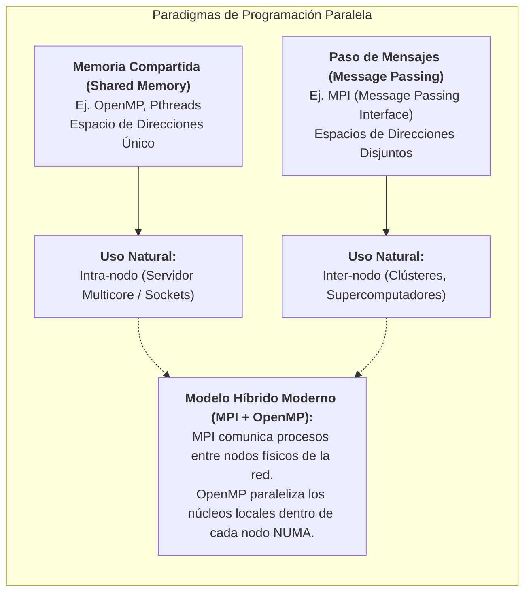
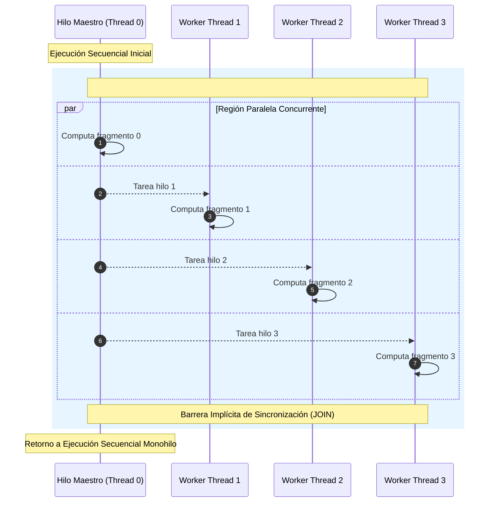
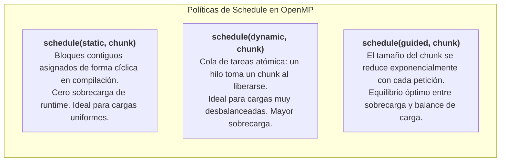
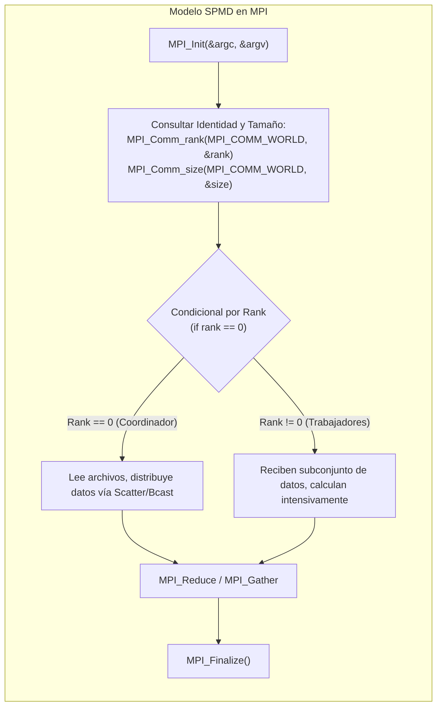
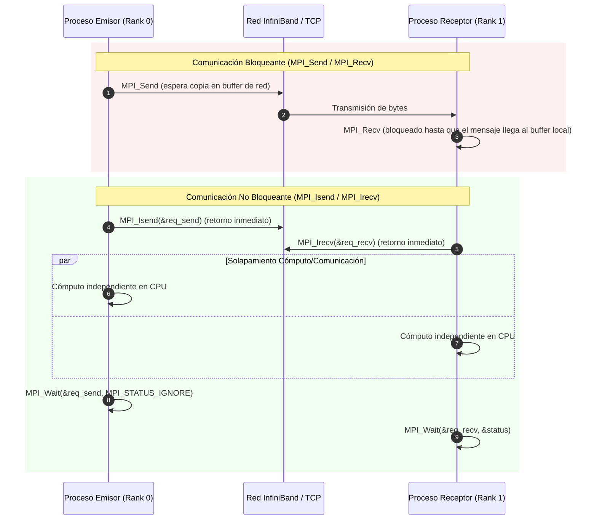
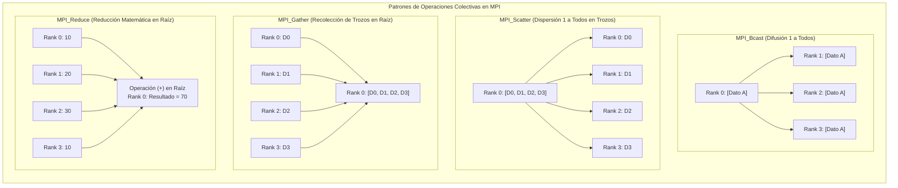

# Programación Paralela con OpenMP y MPI

**Cátedra:** Multiprocesamiento y Arquitecturas Alternativas (ICCD432)  
**Facultad:** Ingeniería de Sistemas / Computación — Escuela Politécnica Nacional (EPN)  
**Nivel:** Pregrado Avanzado  

---

> [!info] 💡 ¿Cómo entender esto desde cero? (Guía para novatos de pregrado)
> En el mundo de la computación de alto rendimiento (HPC), existen dos grandes formas de hacer que varios procesadores resuelvan un problema juntos:
> 
> 1. **La oficina abierta con pizarra compartida (OpenMP):** Todos los trabajadores (hilos) están en la misma sala y leen/escriben en una gran pizarra central (Memoria RAM Compartida). Es muy rápido mirar lo que escribió tu colega, pero si dos intentan escribir con la tiza en el mismo casillero a la vez, se borran el texto o pelean por el espacio (Condición de Carrera). OpenMP nos da reglas simples (`#pragma`) para organizar turnos en la pizarra.
> 2. **El servicio postal entre oficinas separadas (MPI):** Cada trabajador está encerrado en su propio edificio en una ciudad distinta (Nodos de un Clúster sin memoria compartida). Cada uno tiene su propio bloc de notas privado. Nadie puede ver el bloc de otro. Para colaborar, deben escribir una carta formal empaquetando datos y enviarla por correo (mensajes por la red InfiniBand/Ethernet). Es más disciplinado, inmune a corrupciones de memoria compartida, y puede escalar a miles de computadores en todo el mundo.

---

## 1. Comparativa Paradigmática: Memoria Compartida vs Paso de Mensajes

El diseño de software para sistemas de alto rendimiento se bifurca en dos filosofías arquitecturales:



### Cuadro Comparativo Riguroso

| Criterio | OpenMP (Memoria Compartida) | MPI (Paso de Mensajes) |
| :--- | :--- | :--- |
| **Modelo Arquitectural** | Multiprocesadores UMA / NUMA. | Clústeres de computadores, redes heterogéneas. |
| **Espacio de Direcciones** | **Único y global.** Todos los hilos pueden acceder a los mismos punteros de memoria física. | **Disjunto y privado.** Cada proceso tiene su propio espacio de memoria virtual aislado por el SO. |
| **Unidad de Ejecución** | Hilos ligeros (*Threads*) dentro del mismo proceso SO. | Procesos pesados e independientes (*Processes*) con su propio PID. |
| **Mecanismo de Comunicación** | Implícito: lectura y escritura directa de variables compartidas en DRAM/caché. | Explícito: llamadas de biblioteca para enviar (`Send`) y recibir (`Recv`) paquetes de bytes. |
| **Sincronización** | Primitivas de exclusión mutua (`critical`, `atomic`, `barrier`, cerrojos `omp_lock_t`). | Protocolos de rendezvous, recepciones bloqueantes, barreras colectivas de red. |
| **Escalabilidad Física** | Limitada al tamaño de la máquina física (decenas a cientos de núcleos en un solo servidor). | Virtualmente ilimitada (cientos de miles o millones de núcleos distribuidos en racks). |
| **Patologías y Errores Típicos** | **Condiciones de carrera (*Race Conditions*)** y **Falsa compartición (*False Sharing*)**. | **Interbloqueos (*Deadlocks*)**, desfases de buffers de red y desbalance de carga. |
| **Curva de Aprendizaje** | Progresiva: se pueden agregar directivas pragmáticas a código secuencial existente en C/C++/Fortran. | Pronunciada: requiere rediseñar el algoritmo desde cero bajo una mentalidad distribuida. |

---

## 2. OpenMP (Open Multi-Processing)

OpenMP es una API basada en directivas de compilador (`#pragma omp`), variables de entorno y funciones de biblioteca de soporte (*runtime*) para C, C++ y Fortran.

### 2.1 El Modelo de Ejecución Fork-Join

OpenMP se rige por el modelo clásico **Fork-Join**:



1. El programa inicia como un proceso secuencial estándar con un único hilo de ejecución: el **Hilo Maestro** (*Master Thread*, con `thread_num == 0`).
2. Al encontrar una directiva constructora `#pragma omp parallel`, el hilo maestro bifurca (**Fork**) un equipo de hilos trabajadores (*Team of Threads*).
3. Cada hilo del equipo ejecuta el bloque estructurado de código de forma concurrente en diferentes núcleos físicos del procesador.
4. Al finalizar el bloque de la región paralela, existe una **barrera implícita de sincronización**: ningún hilo avanza hasta que todos hayan culminado su labor. En este punto se produce la unión (**Join**), los hilos trabajadores se suspenden o regresan al pool de espera, y solo el Hilo 0 continúa la ejecución secuencial.

---

### 2.2 Directivas Principales de Paralelismo y Reparto de Trabajo

#### A. `#pragma omp parallel`
Crea el equipo de hilos. Si no se acompaña de una directiva de reparto de trabajo (*work-sharing*), **cada hilo ejecutará una réplica idéntica de todo el bloque de código**.

```c
#pragma omp parallel
{
    int tid = omp_get_thread_num();
    int total = omp_get_num_threads();
    printf("Hola desde el hilo %d de un total de %d\n", tid, total);
}
```

#### B. Reparto de Bucles: `#pragma omp for` (o combinado `#pragma omp parallel for`)
Reparte las iteraciones de un bucle `for` entre los hilos del equipo.
- **Requisito estricto:** El bucle debe tener **forma canónica**: los límites inferior y superior deben ser computables antes de entrar al bucle, y el incremento debe ser monótono (ej. `for (int i=0; i<N; i++)`). No se permiten bucles indeterministas `while` o `for` con condiciones de corte complejas como listas enlazadas.

#### C. Secciones Paralelas: `#pragma omp sections` y `#pragma omp section`
Permite paralelismo de tareas heterogéneas (*Task Parallelism*):

```c
#pragma omp parallel sections
{
    #pragma omp section
    {
        procesar_audio();
    }
    #pragma omp section
    {
        procesar_video();
    }
}
```

#### D. Unicidad: `#pragma omp single` y `#pragma omp master`
- `single`: El bloque es ejecutado por el primer hilo que llegue a él; los demás esperan en una barrera implícita al final (a menos que se añada `nowait`).
- `master`: Es ejecutado exclusivamente por el hilo 0; no incluye barrera de sincronización implícita.

---

### 2.3 Cláusulas de Alcance de Datos (*Data-Sharing Attribute Clauses*)

> [!important] La regla de oro en ingeniería de software: `default(none)`
> Por defecto en OpenMP, casi todas las variables declaradas fuera de la región paralela se comparten (`shared`). Esto provoca que novatos introduzcan condiciones de carrera silenciosas e indetectables.  
> **Práctica profesional obligatoria en la EPN:** Declarar siempre `default(none)`, lo que obliga al programador a categorizar explícitamente cada una de las variables utilizadas.

- **`shared(var1, var2)`:** Las variables existen en una única dirección de memoria compartida en la pila del hilo maestro o en el heap. Todos los hilos acceden a la misma dirección física.
- **`private(var)`:** Cada hilo crea una copia local no inicializada en su propia pila (*stack frame*). El valor previo a la región paralela queda inaccesible y, al terminar la región, la variable queda indefinida.
- **`firstprivate(var)`:** Similar a `private`, pero cada copia local es inicializada automáticamente con el valor que la variable poseía justo antes de ingresar a la región paralela.
- **`reduction(operador : variable)`:**  
  Resuelve el problema clásico de acumulación paralela (sumas, productos, mínimos, máximos).
  1. Cada hilo recibe una variable local privada inicializada al elemento neutro del operador (0 para suma, 1 para producto, $\infty$ para mínimo).
  2. Cada hilo acumula localmente durante el bucle sin necesidad de locks o bloqueos.
  3. En el Join final, el runtime combina atómicamente todos los resultados locales en la variable compartida global:
  
  $$\text{Resultado Global} = \bigoplus_{i=0}^{N-1} \text{acumulador\_local}_i$$

---

### 2.4 Políticas de Planificación de Bucles (*Loop Scheduling*)

La cláusula `schedule(tipo, [chunk])` determina cómo se mapean las iteraciones del bucle a los hilos físicos:



1. **`static, chunk`:**  
   Si hay 1000 iteraciones y 4 hilos con `schedule(static, 250)`, el hilo 0 toma [0-249], el hilo 1 [250-499], etc. Es determinista y tiene la menor sobrecarga de hardware.
2. **`dynamic, chunk`:**  
   Los hilos consumen trozos (*chunks*) desde una cola central en tiempo de ejecución. Si la iteración 5 toma 100 veces más tiempo que la iteración 6 (ej. renderizado de fractales de Mandelbrot o mallas adaptativas), ningún hilo se queda ocioso esperando a los rezagados.
3. **`guided, chunk`:**  
   Comienza despachando trozos gigantescos para minimizar el acceso a la cola de bloqueo; a medida que quedan menos iteraciones, los trozos se reducen progresivamente hasta un tamaño mínimo `chunk` para afinar el balance de carga.
4. **`runtime`:**  
   La política se define dinámicamente mediante la variable de entorno del sistema operativo `OMP_SCHEDULE="dynamic,16"`.

---

### 2.5 Primitivas de Sincronización y Exclusión Mutua

- **`#pragma omp critical [(nombre)]`:**  
  Garantiza que solo un hilo a la vez ejecute el bloque estructurado. Es un cerrojo (*mutex*) a nivel de software. Costoso en ciclos de CPU si la sección se ejecuta con alta frecuencia.
- **`#pragma omp atomic`:**  
  Instrucción de hardware directo (ej. `LOCK ADD` o `CMPXCHG` en x86-64). Restringida a operaciones aritméticas elementales (`x += expr`, `x++`). Es un orden de magnitud más rápida que una región `critical`.
- **`#pragma omp barrier`:**  
  Punto de sincronización estricto: ningún hilo puede superar la barrera hasta que todos los hilos del equipo hayan llegado a ella.
- **Cláusula `nowait`:**  
  Se adjunta a directivas de reparto (`#pragma omp for nowait`) para eliminar la barrera implícita de sincronización al final del bloque, permitiendo que hilos rápidos continúen con el siguiente cómputo si no existen dependencias de datos.

---

### 2.6 Código C Canónico Demostrativo: Aproximación Numérica de $\pi$

Cálculo formal de $\pi$ mediante integración numérica del método del punto medio sobre la función:

$$\int_0^1 \frac{4}{1 + x^2} \, dx = \left[ 4 \arctan(x) \right]_0^1 = 4 \left( \frac{\pi}{4} - 0 \right) = \pi$$

```c
#include <stdio.h>
#include <stdlib.h>
#include <omp.h>

#define NUM_PASOS 1000000000

int main(int argc, char *argv[]) {
    long i;
    double paso = 1.0 / (double)NUM_PASOS;
    double suma_global = 0.0;
    
    // Iniciar medición precisa de tiempo de reloj de pared
    double t_inicio = omp_get_wtime();

    // Región Paralela con disciplina de ingeniería: default(none)
    #pragma omp parallel default(none) \
                         shared(paso) \
                         reduction(+:suma_global) \
                         private(i)
    {
        // Reparto guiado con schedule(guided) para balance dinámico
        #pragma omp for schedule(guided, 10000)
        for (i = 0; i < NUM_PASOS; i++) {
            double x = (i + 0.5) * paso;
            suma_global += 4.0 / (1.0 + x * x);
        }
    } // Join y reducción implícita sin condiciones de carrera

    double pi = suma_global * paso;
    double t_fin = omp_get_wtime();

    printf("=====================================================\n");
    printf("   Cálculo de PI con OpenMP (EPN - ICCD432)          \n");
    printf("=====================================================\n");
    printf("Valor calculado de PI : %.14f\n", pi);
    printf("Número de hilos usados: %d\n", omp_get_max_threads());
    printf("Tiempo de cómputo     : %.6f segundos\n", t_fin - t_inicio);
    printf("=====================================================\n");

    return 0;
}
```

*Compilación y ejecución con GCC:*
```bash
gcc -O3 -fopenmp calculo_pi_openmp.c -o calculo_pi_openmp
export OMP_NUM_THREADS=8
./calculo_pi_openmp
```

---

## 3. MPI (Message Passing Interface)

MPI no es un compilador ni un lenguaje; es una **especificación estándar de biblioteca** para programación distribuida basada en el modelo **SPMD (Single Program, Multiple Data)**.

### 3.1 Entorno Fundamental de MPI

En SPMD, el programador compila un único archivo fuente. Cuando se lanza con `mpirun -np P ./programa`, el sistema operativo crea **$P$ procesos completamente independientes**, posiblemente distribuidos en múltiples servidores conectados por red.



#### Funciones de Ciclo de Vida:
- `int MPI_Init(int *argc, char ***argv);`: Inicializa la infraestructura de red MPI y los buffers internos. Debe ser invocada antes de cualquier otra llamada MPI.
- `int MPI_Finalize(void);`: Limpia las colas de mensajes y desconecta el proceso del clúster. Ninguna llamada MPI es válida después de esta función.
- **Comunicador `MPI_COMM_WORLD`:** Grupo predeterminado que agrupa a todos los procesos creados durante el lanzamiento del trabajo.
- `MPI_Comm_size(MPI_COMM_WORLD, &size);`: Retorna el número total de procesos ($P$) que integran el comunicador.
- `MPI_Comm_rank(MPI_COMM_WORLD, &rank);`: Retorna el identificador unívoco entero del proceso actual ($0 \le \text{rank} < P$).

---

### 3.2 Comunicaciones Punto a Punto

El intercambio fundamental de datos entre exactamente dos procesos (un emisor y un receptor).



#### A. Comunicaciones Bloqueantes
- `MPI_Send(const void *buf, int count, MPI_Datatype datatype, int dest, int tag, MPI_Comm comm);`
- `MPI_Recv(void *buf, int count, MPI_Datatype datatype, int source, int tag, MPI_Comm comm, MPI_Status *status);`

> [!danger] Peligro de Interbloqueo (*Deadlock*) en Envíos Bloqueantes
> Considera el siguiente código simétrico donde ambos procesos intentan enviarse datos mutuamente antes de recibir:
> ```c
> // EN RANK 0:
> MPI_Send(buf0, N, MPI_INT, 1, 0, MPI_COMM_WORLD);
> MPI_Recv(buf1, N, MPI_INT, 1, 0, MPI_COMM_WORLD, &st);
> 
> // EN RANK 1:
> MPI_Send(buf1, N, MPI_INT, 0, 0, MPI_COMM_WORLD);
> MPI_Recv(buf0, N, MPI_INT, 0, 0, MPI_COMM_WORLD, &st);
> ```
> Si el tamaño $N$ de los datos supera el buffer interno del protocolo Eager de la tarjeta de red, ambos procesos quedarán bloqueados indefinidamente en `MPI_Send` esperando que el otro emita un `MPI_Recv`. El programa se congela.

#### B. Comunicaciones No Bloqueantes y Solapamiento (*Overlapping*)
Para evitar deadlocks y ocultar la latencia de red propagando datos en segundo plano mientras la CPU realiza cálculos útiles:
- `MPI_Isend(..., &request);`: Inicia el envío y **retorna el control inmediatamente** a la CPU. El buffer de memoria no puede ser modificado hasta que la operación culmine.
- `MPI_Irecv(..., &request);`: Registra la intención de recepción y retorna inmediatamente.
- `MPI_Wait(&request, &status);`: Bloquea la CPU solo cuando es estrictamente indispensable asegurar que los datos ya fueron transferidos.
- `MPI_Test(&request, &flag, &status);`: Consulta no bloqueante para verificar si la transferencia concluyó.

---

### 3.3 Operaciones Colectivas

Involucran obligatoriamente a **todos los procesos pertenecientes al comunicador**. Están altamente optimizadas a nivel de topología física de red (árboles binomiales, algoritmos en anillo *ring*).



1. **`MPI_Bcast`:** El proceso raíz (*root*) envía una copia idéntica del mismo dato a todos los demás procesos.
2. **`MPI_Scatter`:** El proceso raíz toma un arreglo de tamaño $N \times P$, lo corta en $P$ trozos homogéneos y entrega el fragmento $i$ al proceso con rango $i$.
3. **`MPI_Gather`:** Operación inversa a `Scatter`. El proceso raíz recolecta los fragmentos individuales de cada proceso y los concatena ordenadamente en un arreglo global contiguo.
4. **`MPI_Allgather`:** Idéntico a `Gather`, pero todos los procesos reciben el arreglo concatenado global resultante (elimina la necesidad de hacer un `Bcast` posterior).
5. **`MPI_Reduce`:** Aplica una operación asociativa y conmutativa (ej. `MPI_SUM`, `MPI_PROD`, `MPI_MAX`, `MPI_MIN`) sobre los operandos de todos los procesos y almacena el escalar final únicamente en el proceso raíz.
6. **`MPI_Allreduce`:** Aplica la reducción matemática y distribuye automáticamente el escalar final resultante a todos los miembros del comunicador.

---

### 3.4 Código C Canónico Demostrativo: Producto Escalar Distribuido con Colectivas

Cálculo del producto punto de dos vectores de gran dimensión: $\vec{A} \cdot \vec{B} = \sum_{i=0}^{N-1} A_i \cdot B_i$ distribuido en un clúster utilizando `MPI_Scatter` y `MPI_Reduce`.

```c
#include <stdio.h>
#include <stdlib.h>
#include <mpi.h>

#define N_TOTAL 40000000 // 40 millones de elementos

int main(int argc, char *argv[]) {
    int rank, size;
    double *vec_A = NULL;
    double *vec_B = NULL;
    double *sub_A = NULL;
    double *sub_B = NULL;
    
    MPI_Init(&argc, &argv);
    MPI_Comm_rank(MPI_COMM_WORLD, &rank);
    MPI_Comm_size(MPI_COMM_WORLD, &size);

    // Asegurar que el tamaño total sea divisible equitativamente entre los procesos
    int elementos_por_proc = N_TOTAL / size;

    if (rank == 0) {
        printf("=====================================================\n");
        printf("  Producto Escalar Distribuido MPI (EPN - ICCD432)   \n");
        printf("=====================================================\n");
        printf("Número de procesos MPI : %d\n", size);
        printf("Elementos por proceso  : %d\n", elementos_por_proc);

        // Memoria asignada únicamente en el proceso Coordinador (Rank 0)
        vec_A = (double*)malloc(sizeof(double) * N_TOTAL);
        vec_B = (double*)malloc(sizeof(double) * N_TOTAL);

        for (int i = 0; i < N_TOTAL; i++) {
            vec_A[i] = 1.0; // Valores canónicos de prueba
            vec_B[i] = 2.0;
        }
    }

    // Cada nodo reserva memoria local únicamente para su subconjunto de trabajo
    sub_A = (double*)malloc(sizeof(double) * elementos_por_proc);
    sub_B = (double*)malloc(sizeof(double) * elementos_por_proc);

    // Barrera de sincronización previa al inicio de medición
    MPI_Barrier(MPI_COMM_WORLD);
    double t_inicio = MPI_Wtime();

    // 1. Dispersar trozos de los vectores globales desde Rank 0 a todos los ranks
    MPI_Scatter(vec_A, elementos_por_proc, MPI_DOUBLE,
                sub_A, elementos_por_proc, MPI_DOUBLE,
                0, MPI_COMM_WORLD);

    MPI_Scatter(vec_B, elementos_por_proc, MPI_DOUBLE,
                sub_B, elementos_por_proc, MPI_DOUBLE,
                0, MPI_COMM_WORLD);

    // 2. Cómputo local independiente en cada proceso (SPMD)
    double producto_local = 0.0;
    for (int i = 0; i < elementos_por_proc; i++) {
        producto_local += sub_A[i] * sub_B[i];
    }

    // 3. Reducción colectiva de todos los productos locales hacia Rank 0
    double producto_global = 0.0;
    MPI_Reduce(&producto_local, &producto_global, 1, MPI_DOUBLE,
               MPI_SUM, 0, MPI_COMM_WORLD);

    double t_fin = MPI_Wtime();

    if (rank == 0) {
        printf("Resultado Producto Punto: %.2f (Esperado: %.2f)\n", 
               producto_global, (double)(N_TOTAL * 2.0));
        printf("Tiempo total de cómputo : %.6f segundos\n", t_fin - t_inicio);
        printf("=====================================================\n");
        free(vec_A);
        free(vec_B);
    }

    free(sub_A);
    free(sub_B);

    MPI_Finalize();
    return 0;
}
```

*Compilación y ejecución con OpenMPI / MPICH:*
```bash
mpicc -O3 producto_escalar_mpi.c -o producto_escalar_mpi
mpirun -np 4 ./producto_escalar_mpi
```

---

## 4. Resumen Comparativo de Sintaxis y Patrones

| Dimensión | OpenMP (Memoria Compartida) | MPI (Memoria Distribuida) |
| :--- | :--- | :--- |
| **Inicialización** | Automática al encontrar `#pragma omp parallel`. | Explícita con `MPI_Init(&argc, &argv)`. |
| **Identificación** | `omp_get_thread_num()` ($0 \dots T-1$). | `MPI_Comm_rank(comm, &rank)` ($0 \dots P-1$). |
| **Comunicación Básica** | Asignación directa de punteros/variables `shared`. | `MPI_Send` y `MPI_Recv` (o no bloqueantes `MPI_Isend`). |
| **Sincronización Global** | `#pragma omp barrier`. | `MPI_Barrier(comm)`. |
| **Agregación Matemática** | Cláusula `reduction(+:var)`. | Colectiva `MPI_Reduce(...)` o `MPI_Allreduce(...)`. |
| **División de Carga** | `#pragma omp for schedule(...)`. | `MPI_Scatter` o indexación algebraica por rank. |
| **Finalización** | Join implícito al cerrar el bloque de directiva. | Obligatorio `MPI_Finalize()`. |

---

## 5. Preguntas de Autoevaluación (Nivel Examen EPN ICCD432)

1. **¿Qué sucede si en una región paralela de OpenMP se omite la directiva de reducción y 8 hilos ejecutan `total += arr[i]` sobre una variable compartida?**  
   *Respuesta esperada:* Se produce una condición de carrera (*data race*). Múltiples hilos intentarán leer, modificar y escribir el valor de `total` concurrentemente sin exclusión mutua; las escrituras se solaparán y el resultado final será erróneo e indeterminista.
2. **¿Cuál es la diferencia fundamental entre utilizar `MPI_Send` vs `MPI_Isend` junto con `MPI_Wait`?**  
   *Respuesta esperada:* `MPI_Send` es bloqueante: suspende el flujo del programa hasta que el buffer del emisor puede reutilizarse de forma segura. `MPI_Isend` es no bloqueante: retorna de inmediato, permitiendo a la CPU realizar cómputo útil en paralelo mientras la tarjeta de red (NIC) transmite los datos (*computation-communication overlapping*); `MPI_Wait` se invoca únicamente cuando el cálculo ya requiere que la transmisión esté culminada.
3. **En un supercomputador moderno con nodos de 64 núcleos, ¿por qué es común utilizar un enfoque híbrido MPI + OpenMP en lugar de solo MPI puro?**  
   *Respuesta esperada:* Si se usa solo MPI puro (64 procesos MPI por nodo), se desperdicia memoria RAM duplicando estructuras de datos en cada proceso y saturando el subsistema de comunicación local; el enfoque híbrido ejecuta 1 o 2 procesos MPI por nodo (o por zócalo NUMA) y delega a OpenMP la creación de hilos ligeros que comparten eficientemente la memoria RAM local sin sobrecarga de empaquetado de mensajes.
