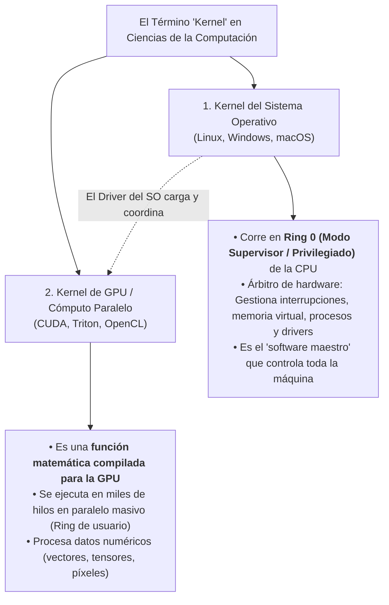
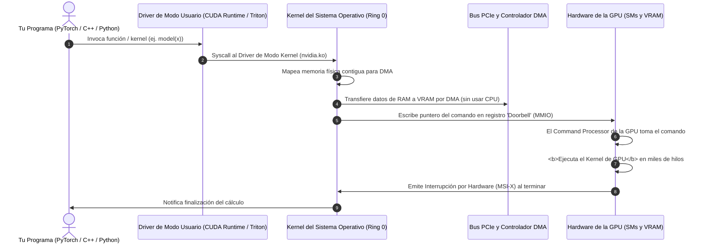
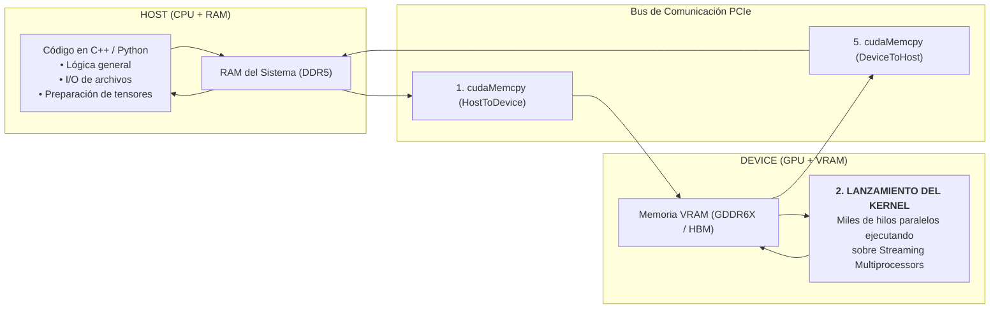
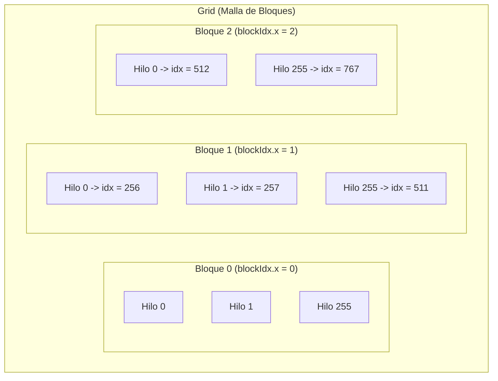
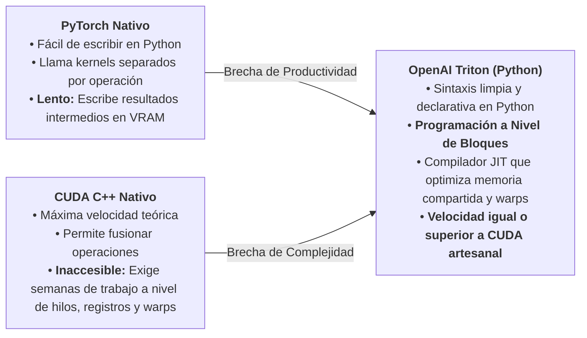
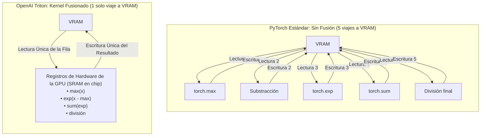

# Programación de GPU con CUDA y OpenAI Triton (Desde Cero)

Para un estudiante de ingeniería en computación, adentrarse en la aceleración por hardware exige dominar dos mundos complementarios: el **modelo clásico de bajo nivel en C/C++ con NVIDIA CUDA**, y el **paradigma moderno a nivel de bloques impulsado por OpenAI Triton en Python**, estándar industrial en el entrenamiento e inferencia de modelos de Inteligencia Artificial contemporáneos.

Esta nota está diseñada **desde cero**, aclarando conceptos fundamentales que suelen generar confusión (como la doble acepción del término **Kernel** en la informática), detallando la física del silicio, la interacción con el sistema operativo y proporcionando código canónico comentado paso a paso.

---

> [!info] 💡 ¿Cómo entender esto desde cero? (Guía para novatos de pregrado)
> Imagina una **gran fábrica de confección textil con 10.000 camisas por coser**:
> 
> - **El Gerente General en su oficina (La CPU / El Sistema Operativo):**
>   Es el administrador general. Controla el presupuesto, asigna las salas de trabajo y decide los horarios (**el Kernel del Sistema Operativo**). Es brillante tomando decisiones complejas, pero si tuviera que coser cada camisa a mano una por una, tardaría meses (**baja velocidad en tareas repetitivas masivas**).
> 
> - **El Galpón con 10.000 operarios de costura (La GPU):**
>   Es el procesador gráfico masivo. Cada operario es muy sencillo y solo sabe hacer una cosa: coser un botón o hacer una puntada.
> 
> - **¿Qué es entonces un "Kernel" de GPU?**
>   Es la **hoja de instrucciones exacta** que el gerente imprime y le entrega a los 10.000 operarios al mismo tiempo: *"Cada uno tome la camisa número `i`, cosa el botón y colóquela en la caja de salida"*. Todos ejecutan la misma receta matemática simultáneamente (**SIMT**).
> 
> - **¿Dónde entra CUDA vs. OpenAI Triton?**
>   - **En CUDA C++:** Eres el capataz militar que debe instruir a cada operario individualmente: *"Operario 347 del banco 2: toma la aguja con tu mano izquierda, cuidado con chocar el codo con el operario 348 (*bank conflicts*), pon el hilo en el registro R4..."*. Te da control absoluto, pero escribir un programa toma semanas y es facilísimo equivocarse.
>   - **En OpenAI Triton:** Eres un supervisor moderno que da órdenes **por mesas de trabajo completas (Bloques de 128 camisas)**: *"Mesa 4: procesen estas 128 camisas en lote"*. El compilador inteligente de Triton calcula automáticamente cómo sincronizar a los operarios, asignar los hilos y usar la memoria de la GPU sin errores.

---

## 1. Desmitificando el Concepto: ¿Qué es un "Kernel"?

Uno de los mayores tropiezos conceptuales en pregrado es que la palabra **Kernel** (que significa *núcleo* o *semilla* en inglés) se utiliza para dos conceptos totalmente distintos en la informática:



### 1.1 El Kernel del Sistema Operativo
- Es el programa raíz que arranca con la computadora y reside permanentemente en la memoria RAM en el nivel más protegido del procesador (**Ring 0 / Modo Kernel**).
- **Funciones:** Planifica qué procesos usan la CPU, gestiona la [[Sistemas Operativos/Gestion de Memoria y Memoria Virtual|Memoria Virtual]] traduciendo direcciones en la [[Arquitectura de computadores/Memoria Virtual, Paginacion y Arquitectura de la MMU|MMU]], controla el sistema de archivos y aloja los **controladores de dispositivos (*Device Drivers*)**.
- Las aplicaciones normales se ejecutan en **Modo Usuario (Ring 3)** sin privilegios; cuando un programa necesita tocar el hardware, le pide permiso al kernel mediante una **Llamada al Sistema (*Syscall*)**.

### 1.2 El Kernel de GPU
- Es simplemente una **función de software** (escrita en C++ o Python) que ha sido compilada al código de máquina nativo de la GPU (**SASS** / binario de NVIDIA o PTX).
- A diferencia de una función ordinaria de CPU (que es invocada por un solo hilo y procesa datos en un bucle secuencial `for`), **un kernel de GPU es invocado una sola vez pero se lanza simultáneamente en millones de hilos paralelos**.

### 1.3 El Puente: ¿Cómo interactúa el Sistema Operativo con la GPU?
¿Cómo viaja tu código desde Python o C++ hasta el silicio de la tarjeta gráfica?



1. Tu programa en espacio de usuario invoca la API de GPU (ej. CUDA Runtime o PyTorch).
2. El **Driver de Modo Kernel de NVIDIA (`nvidia.ko` en Linux)**, que corre en Ring 0, reserva memoria física e inicializa las tablas de acceso directo a memoria (**DMA**).
3. La CPU no copia los gigabytes de tensores byte a byte; el driver del sistema operativo le ordena al motor DMA que copie los datos directamente desde la RAM hacia la **VRAM** de la tarjeta gráfica a través del bus [[Arquitectura de computadores/Buses, Interconexion y Comunicacion de Entrada-Salida (DMA e Interrupciones)|PCIe]].
4. El driver escribe en un registro especial de la tarjeta madre llamado **Doorbell** (E/S Mapeada en Memoria - MMIO), indicándole al procesador de comandos de la GPU que la tarea está lista.
5. Los núcleos de la GPU ejecutan el **Kernel de GPU** de forma totalmente asíncrona.
6. Al finalizar, la GPU envía una **interrupción eléctrica por hardware (MSI-X)** al Kernel del Sistema Operativo para despertar a tu proceso.

---

## 2. El Modelo Mental de la Computación Heterogénea

Cualquier programa de aceleración por GPU opera bajo el paradigma **Host-Device**:

- **Host (Anfitrión):** La CPU convencional y la memoria principal del sistema (DDR4 / DDR5). La CPU controla el flujo lógico del programa, lee archivos de disco, interactúa con el usuario y la red.
- **Device (Dispositivo):** La GPU y su memoria de video dedicada de altísimo ancho de banda (**VRAM** GDDR6 / HBM3). La GPU actúa como un acelerador esclavo de cálculo matemático.



### El Ciclo Canónico de 5 Pasos en GPU:
1. **Asignación en Device:** Reservar espacio en la memoria VRAM (`cudaMalloc`).
2. **Transferencia Host $\to$ Device:** Copiar los arreglos de entrada desde la RAM hacia la VRAM (`cudaMemcpyHostToDevice`).
3. **Lanzamiento del Kernel:** Disparar la ejecución paralela en la GPU mediante la sintaxis de configuración `<<<grid, block>>>`.
4. **Sincronización:** Esperar a que la GPU termine de calcular (`cudaDeviceSynchronize`).
5. **Transferencia Device $\to$ Host y Liberación:** Copiar los resultados calculados desde la VRAM de regreso a la RAM (`cudaMemcpyDeviceToHost`) y liberar la memoria de video (`cudaFree`).

---

## 3. Programación en NVIDIA CUDA C/C++ (Paso a Paso)

En CUDA C++, el programador escribe el código que ejecutará **un solo hilo**, y utiliza palabras clave especiales para organizar la ejecución en una jerarquía tridimensional de tres niveles:

```
        Malla de Cómputo (Grid)
       ┌───────────────────────────────┐
       │  Bloque (0,0)   Bloque (1,0)  │
       │  ┌───────────┐  ┌───────────┐ │
       │  │ Hilos     │  │ Hilos     │ │
       │  └───────────┘  └───────────┘ │
       │  Bloque (0,1)   Bloque (1,1)  │
       │  ┌───────────┐  ┌───────────┐ │
       │  │ Hilos     │  │ Hilos     │ │
       │  └───────────┘  └───────────┘ │
       └───────────────────────────────┘
```

1. **Hilo (*Thread*):** La unidad básica de ejecución que corre en una ALU de la GPU.
2. **Bloque de Hilos (*Thread Block*):** Conjunto de hilos (hasta 1024) que se asignan al mismo *Streaming Multiprocessor* (SM), comparten memoria compartida ultrarrápida y pueden sincronizarse.
3. **Malla (*Grid*):** El conjunto total de bloques que ejecutan un mismo kernel.

### 3.1 Calificadores de Funciones en CUDA
- `__global__`: Declara una función que es un **Kernel de GPU**. Es invocada desde la CPU (Host) y se ejecuta en la GPU (Device). Debe retornar `void`.
- `__device__`: Declara una función auxiliar que es invocada desde la GPU y se ejecuta en la GPU.
- `__host__`: Función estándar de C++ que se compila para ejecutarse en la CPU.

### 3.2 La Fórmula Universal de Indexación de Hilos (1D)
Cada hilo necesita saber sobre qué elemento de los datos le corresponde trabajar. Para ello, el hardware de CUDA provee variables intrínsecas precargadas:

- `threadIdx.x`: Mi posición dentro de mi bloque local (ej. del 0 al 255).
- `blockIdx.x`: El número de mi bloque dentro de la cuadrícula general (ej. Bloque 3).
- `blockDim.x`: Cuántos hilos tiene cada bloque (ej. 256 hilos por bloque).
- `gridDim.x`: Cuántos bloques componen la cuadrícula.



$$\text{Índice Global Único } (i) = (\text{blockIdx.x} \times \text{blockDim.x}) + \text{threadIdx.x}$$

> [!tip] La Analogía de las Manzanas y los Cajones
> Si tienes cajas de 10 manzanas cada una:
> Para saber el número global de la manzana 4 dentro de la caja 3:
> Multiplicas $(3 \text{ cajas anteriores} \times 10 \text{ manzanas}) + 4 \text{ manzana actual} = \text{manzana número } 34$.
> ¡Esa es exactamente la fórmula de indexación de CUDA!

---

### 3.3 Código Canónico Completo en CUDA: Suma de Vectores (`vector_add.cu`)

Este programa realiza la suma elemental de dos vectores gigantes de $N = 10.000.000$ de números ($C[i] = A[i] + B[i]$):

```cpp
#include <iostream>
#include <cuda_runtime.h>

// -------------------------------------------------------------
// 1. EL KERNEL DE GPU
// -------------------------------------------------------------
__global__ void vectorAddKernel(const float* A, const float* B, float* C, int n) {
    // Cálculo del índice global único para este hilo
    int i = blockIdx.x * blockDim.x + threadIdx.x;

    // Blindaje contra accesos fuera de rango (Boundary Check)
    if (i < n) {
        C[i] = A[i] + B[i]; // Cada hilo calcula un solo elemento
    }
}

int main() {
    int n = 10000000; // 10 millones de elementos
    size_t bytes = n * sizeof(float);

    // 2. Asignación de memoria en el HOST (RAM)
    float *h_A = (float*)malloc(bytes);
    float *h_B = (float*)malloc(bytes);
    float *h_C = (float*)malloc(bytes);

    // Inicializar vectores con datos de prueba
    for (int i = 0; i < n; i++) {
        h_A[i] = 1.0f;
        h_B[i] = 2.0f;
    }

    // 3. Asignación de memoria en el DEVICE (VRAM de la GPU)
    float *d_A, *d_B, *d_C;
    cudaMalloc(&d_A, bytes);
    cudaMalloc(&d_B, bytes);
    cudaMalloc(&d_C, bytes);

    // 4. Copia de datos Host -> Device por el bus PCIe
    cudaMemcpy(d_A, h_A, bytes, cudaMemcpyHostToDevice);
    cudaMemcpy(d_B, h_B, bytes, cudaMemcpyHostToDevice);

    // 5. Configuración del lanzamiento (Execution Configuration)
    int threadsPerBlock = 256;
    // División redondeada hacia arriba para cubrir todos los elementos:
    int blocksPerGrid = (n + threadsPerBlock - 1) / threadsPerBlock;

    std::cout << "Lanzando " << blocksPerGrid << " bloques de " 
              << threadsPerBlock << " hilos (" << blocksPerGrid * threadsPerBlock 
              << " hilos en total)..." << std::endl;

    // 6. LANZAMIENTO DEL KERNEL (Sintaxis Chevron <<<...>>>)
    vectorAddKernel<<<blocksPerGrid, threadsPerBlock>>>(d_A, d_B, d_C, n);

    // Sincronizar CPU con GPU (esperar a que todos los hilos terminen)
    cudaDeviceSynchronize();

    // 7. Copia de resultados Device -> Host
    cudaMemcpy(h_C, d_C, bytes, cudaMemcpyDeviceToHost);

    // Verificación
    std::cout << "Verificación: C[0] = " << h_C[0] << " (Esperado: 3.0)" << std::endl;
    std::cout << "Verificación: C[n-1] = " << h_C[n-1] << " (Esperado: 3.0)" << std::endl;

    // 8. Liberación de memoria en GPU y CPU
    cudaFree(d_A);
    cudaFree(d_B);
    cudaFree(d_C);
    free(h_A);
    free(h_B);
    free(h_C);

    return 0;
}
```

---

## 4. OpenAI Triton: Programación Moderna de GPUs para Inteligencia Artificial

A pesar del colosal poder de CUDA C++, la industria moderna de Inteligencia Artificial se enfrentaba a un dilema crítico:



Creado por Philippe Tillet en OpenAI, **Triton** es un lenguaje y compilador basado en Python diseñado para escribir algoritmos de Deep Learning de ultra alto rendimiento (como FlashAttention, RoPE, RMSNorm y Softmax fusionado) sin sufrir la complejidad de bajo nivel de CUDA C++.

### 4.1 La Gran Revolución: Programación a Nivel de Bloques (*Block-Level*)
- En CUDA tradicional, programas pensando en **un hilo escalar** (`threadIdx.x`), y tú eres responsable de evitar colisiones en memoria compartida (*bank conflicts*), alinear punteros a 128 bytes para coalescencia y sincronizar warps manualmente.
- En **Triton**, el programador piensa y programa a nivel de **bloques completos de tensores de tamaño fijo (ej. 128, 256, 512 elementos)**.
- El compilador de Triton (**Triton JIT Compiler**) toma tu bloque en Python y automáticamente:
  1. Asigna y distribuye los registros de hardware de la GPU.
  2. Particiona el bloque entre los 32 hilos del Warp en silicio.
  3. Convierte las operaciones a instrucciones tensoriales nativas (**Tensor Cores**).
  4. Gestiona la memoria compartida (*Shared Memory*) eliminando automáticamente los conflictos de bancos.

---

### 4.2 Código Canónico Completo en OpenAI Triton: Suma de Vectores (`vector_add_triton.py`)

A continuación se presenta la implementación de suma de vectores en Triton, compatible directamente con tensores de PyTorch:

```python
import torch
import triton
import triton.language as tl

# -------------------------------------------------------------
# 1. EL KERNEL DE TRITON (Decorado con @triton.jit)
# -------------------------------------------------------------
@triton.jit
def vector_add_kernel(
    x_ptr,      # Puntero al primer vector en VRAM
    y_ptr,      # Puntero al segundo vector en VRAM
    output_ptr, # Puntero al vector de salida en VRAM
    n_elements, # Tamaño total del vector
    BLOCK_SIZE: tl.constexpr, # Tamaño del bloque (constante en compilación)
):
    # En Triton, cada instancia de ejecución se llama 'Program' (similar a un bloque de CUDA)
    pid = tl.program_id(axis=0) # ID del programa actual (ej. 0, 1, 2...)

    # Calculamos el rango de índices que le corresponde a este bloque completo
    # Por ejemplo, si BLOCK_SIZE = 4 y pid = 1, offsets = [4, 5, 6, 7]
    block_start = pid * BLOCK_SIZE
    offsets = block_start + tl.arange(0, BLOCK_SIZE)

    # Máscara de protección: los elementos fuera de n_elements no deben tocarse
    mask = offsets < n_elements

    # Carga de memoria en bloque con máscara (Masked Load)
    # Triton genera automáticamente transferencias coalescentes de 128 bytes
    x = tl.load(x_ptr + offsets, mask=mask)
    y = tl.load(y_ptr + offsets, mask=mask)

    # Operación vectorial pura
    output = x + y

    # Almacenamiento en bloque en VRAM (Masked Store)
    tl.store(output_ptr + offsets, output, mask=mask)


# -------------------------------------------------------------
# 2. FUNCIÓN ENVOLTORIO (WRAPPER) EN PYTORCH
# -------------------------------------------------------------
def vector_add(x: torch.Tensor, y: torch.Tensor):
    # Asegurar que los tensores estén contiguos y en GPU (CUDA)
    assert x.is_cuda and y.is_cuda and x.is_contiguous() and y.is_contiguous()
    n_elements = x.numel()
    
    # Reservar tensor de salida en VRAM mediante PyTorch
    output = torch.empty_like(x)

    # Tamaño del bloque optimizado (potencia de 2, típicamente 256 a 1024)
    BLOCK_SIZE = 1024
    
    # Cuadrícula de lanzamiento (Grid): cuántos programas de bloque necesitamos
    grid = lambda meta: (triton.cdiv(n_elements, meta['BLOCK_SIZE']),)

    # LANZAMIENTO DEL KERNEL DE TRITON
    vector_add_kernel[grid](
        x, y, output, n_elements, BLOCK_SIZE=BLOCK_SIZE
    )

    return output


# -------------------------------------------------------------
# 3. VERIFICACIÓN Y TEST DE RENDIMIENTO
# -------------------------------------------------------------
if __name__ == "__main__":
    torch.manual_seed(42)
    N = 10_000_000
    
    # Crear tensores en la GPU
    x = torch.randn(N, device='cuda', dtype=torch.float32)
    y = torch.randn(N, device='cuda', dtype=torch.float32)

    # Ejecutar con Triton
    z_triton = vector_add(x, y)

    # Ejecutar con PyTorch nativo
    z_torch = x + y

    # Comprobación de exactitud numérica
    error_maximo = torch.max(torch.abs(z_triton - z_torch)).item()
    print(f"Verificación exitosa. Error máximo absoluto: {error_maximo:.6e}")
```

---

## 5. El Gran Caso de Estudio en IA: Fusión de Kernels (*Kernel Fusion*)

¿Por qué los frameworks de Deep Learning escriben kernels personalizados en Triton o CUDA en lugar de usar operaciones encadenadas de PyTorch?

Consideremos el cálculo de la función **Softmax** sobre una fila de un tensor de activación en un Transformer:

$$\text{Softmax}(x_i) = \frac{e^{x_i - \max(x)}}{\sum_j e^{x_j - \max(x)}}$$

### El Problema de PyTorch Nativo (Inanición por Ancho de Banda de Memoria)
En PyTorch tradicional, Softmax se calcula llamando a funciones separadas:
1. `m = torch.max(x)` $\to$ **Lee $x$ de VRAM**, calcula, **escribe $m$ en VRAM**.
2. `diff = x - m` $\to$ **Lee $x$ y $m$ de VRAM**, calcula, **escribe $diff$ en VRAM**.
3. `exp_x = torch.exp(diff)` $\to$ **Lee $diff$ de VRAM**, calcula, **escribe $exp\_x$ en VRAM**.
4. `sum_exp = torch.sum(exp_x)` $\to$ **Lee $exp\_x$ de VRAM**, calcula, **escribe $sum\_exp$ en VRAM**.
5. `out = exp_x / sum_exp` $\to$ **Lee $exp\_x$ y $sum\_exp$ de VRAM**, calcula, **escribe $out$ en VRAM**.

> [!danger] El Cuello de Botella de los Múltiples Viajes a VRAM
> En PyTorch estándar, los datos viajan **5 veces de ida y vuelta a la VRAM**. Como vimos en Arquitectura del Computador, la VRAM tiene un ancho de banda finito. ¡El 90% del tiempo de ejecución se desperdicia esperando que los datos viajen por el bus de memoria, mientras las ALUs de la GPU están ociosas (*Memory-Bound*)!

### La Solución con Fused Softmax en Triton
Con un kernel fusionado en Triton:
1. Cada fila del tensor se lee **una sola vez desde la VRAM** y se mantiene directamente en los **registros ultrarrápidos de la GPU en chip**.
2. Todas las operaciones (máximo, resta, exponencial, suma y división) se resuelven en los registros locales en fracciones de nanosegundo.
3. El resultado final se escribe **una sola vez en la VRAM**.



**Resultado en la Práctica:** Un kernel de Fused Softmax o FlashAttention escrito en Triton acelera el rendimiento de la GPU entre **$3\times$ y $5\times$**, consumiendo una fracción del ancho de banda y permitiendo entrenar modelos de lenguaje a escalas multimillonarias.

---

## 6. Cuadro Comparativo: ¿Cuándo usar cada tecnología?

| Dimensión | PyTorch Estándar | OpenAI Triton | NVIDIA CUDA C++ |
| :--- | :--- | :--- | :--- |
| **Nivel de Abstracción** | Muy Alto (Llamadas a tensores en Python) | Medio-Alto (Python a nivel de bloques) | Bajo (C/C++ a nivel de hilos escalares) |
| **Curva de Aprendizaje** | Mínima (Horas) | Moderada (Días / Semanas) | Empinada (Meses) |
| **Control del Hardware** | Ninguno (Caja negra) | Alto (El compilador optimiza el silicio) | **Total y Absoluto** (Control manual de registros y SASS) |
| **Fusión de Operaciones** | Limitada (`torch.compile`) | **Nativa y Total** | **Nativa y Total** |
| **Facilidad de Depuración** | Muy Fácil (Stack traces estándar) | Buena (Depuración en Python / PyTorch) | Compleja (Requiere `cuda-gdb` y `compute-sanitizer`) |
| **Soporte de Hardware** | Multiplataforma | GPUs NVIDIA y AMD (vía ROCm) | Exclusivo de GPUs NVIDIA |
| **Caso de Uso Recomendado** | Prototipado rápido de redes neuronales | **Capas personalizadas de IA, FlashAttention, LLMs** | Motores gráficos, simuladores físicos, HPC de precisión extrema |

---

## Notas Relacionadas y Enlaces de Vault
- [[Arquitectura de GPU y Programacion Heterogenea con NVIDIA CUDA]] — Modelo SIMT, protocolos de hardware y programación en C++.
- [[Arquitectura de computadores/Arquitectura de GPU y Aceleradores Hardware en el Computador|Arquitectura de GPU en el Computador]] — Anatomía de silicio, Streaming Multiprocessors, Tensor Cores y RT Cores.
- [[Sistemas Operativos/Procesos, Hilos y Planificacion de CPU|Procesos, Hilos y Kernel del Sistema Operativo]] — Planificación de tareas y el rol del kernel en Ring 0.
- [[Arquitectura de computadores/Buses, Interconexion y Comunicacion de Entrada-Salida (DMA e Interrupciones)|Buses, PCIe y DMA]] — Transferencia de tensores por DMA y señalización de interrupciones MSI-X.
- [[Machine Learning data mining/Arquitectura Transformer y Mecanismo de Atencion|Arquitectura Transformer y Mecanismo de Atención]] — Mecanismos de atención donde se aplican los kernels fusionados de Triton.
