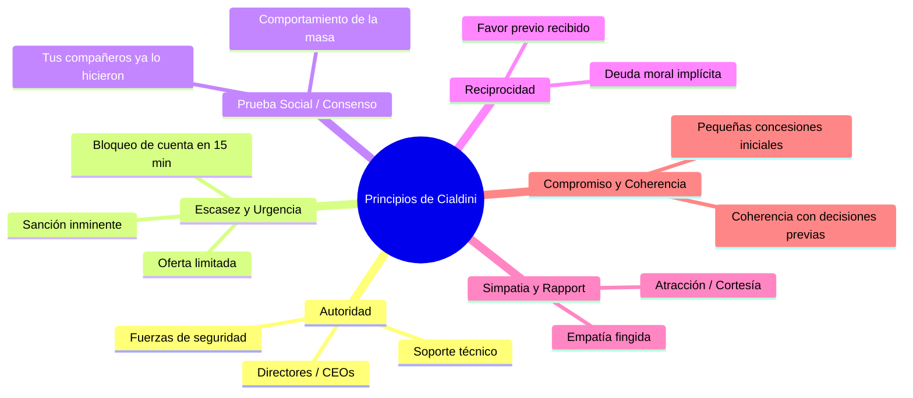
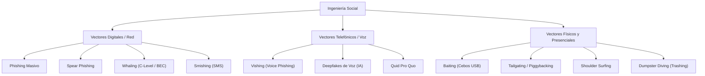
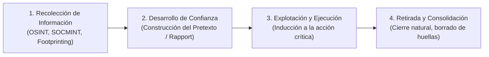
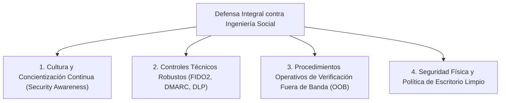

# Ingeniería Social en Ciberseguridad

> [!abstract] Definición Formal
> La **Ingeniería Social** es el conjunto de técnicas, métodos y manipulaciones psicológicas dirigidas a explotar las debilidades cognitivas, emocionales y de comportamiento de las personas, con el fin de inducirlas a ejecutar acciones inseguras (hacer clic en enlaces maliciosos, ejecutar código, entregar contraseñas o realizar transferencias no autorizadas) o revelar información confidencial, sorteando los controles tecnológicos perimetrales de seguridad.

En ciberseguridad se sostiene con frecuencia el aforismo de Kevin Mitnick: *"El eslabón más débil de la cadena de seguridad es el ser humano"*. Los sistemas informáticos más avanzados (firewalls de última generación, cifrado cuántico, EDRs) quedan neutralizados si un usuario legítimo entrega voluntariamente sus credenciales de acceso a un atacante.

---

## 1. Principios Psicológicos de la Influencia y Persuasión (Robert Cialdini)

Los atacantes de ingeniería social fundamentan sus pretextos en los seis principios universales de persuasión formulados por el psicólogo **Robert Cialdini**, aprovechando los atajos mentales (*heurísticas cognitivas*) de las víctimas:

1. **Autoridad**:
   - Tendencia innata a obedecer a figuras investidas de poder o conocimiento superior (ej. un atacante que se hace pasar por el CEO de la compañía, un auditor fiscal de la DIAN/Hacienda, un oficial de policía o el Administrador Global de TI).
2. **Escasez y Urgencia**:
   - Miedo a la pérdida inminente de un recurso o derecho (*Fear Of Missing Out - FOMO*). Los mensajes imponen límites de tiempo artificiales para impedir que la víctima piense de forma analítica: *"Su cuenta bancaria será suspendida irrevocablemente en 30 minutos si no confirma sus credenciales"*.
3. **Consenso o Prueba Social (*Social Proof*)**:
   - Tendencia a validar el comportamiento propio imitando lo que hace la mayoría: *"El 90% de los empleados de tu departamento ya completó la actualización obligatoria de software; solo faltas tú"*.
4. **Reciprocidad**:
   - Necesidad psicológica de devolver favores o gestos amables. El atacante presta una "ayuda" espontánea previa (ej. resuelve un problema técnico menor inventado) para luego solicitar una "concesión recíproca" (ej. *"¿Me prestas tu tarjeta de acceso mientras reviso la red?"*).
5. **Simpatía y *Rapport* (*Liking*)**:
   - Mayor disposición a complacer a personas que resultan agradables, empáticas, atractivas físicamente o que comparten gustos y opiniones. El atacante utiliza la **escucha activa**, valida las frustraciones de la víctima y genera confianza artificial.
6. **Compromiso y Coherencia**:
   - Deseo humano de mantener una imagen consistente con afirmaciones o compromisos previos. Se emplea la técnica de *"pie en la puerta"* (*Foot-in-the-Door*): inducir a la víctima a aceptar peticiones minúsculas e inofensivas para luego escalar hacia la entrega de datos críticos.

---

## 2. Taxonomía de Vectores y Técnicas de Ataque

### A. Ataques Basados en Correo y Mensajería Digital
- **Phishing Masivo**: Envío indiscriminado y automatizado de millones de correos fraudulentos genéricos simulando ser bancos, proveedores de correo o servicios postales.
- **Spear Phishing**: Ataque altamente selectivo y personalizado contra un individuo, departamento o empresa específica. Se alimenta de inteligencia recolectada previamente mediante [[OPEN SOURCE INTELLIGENCE|OSINT]] (LinkedIn, organigrama institucional, proyectos actuales).
- **Whaling (*Caza de Ballenas*)**: Variante de Spear Phishing dirigida exclusivamente a ejecutivos de la cúspide organizacional (CEO, CFO, miembros de junta directiva). Frecuentemente asociada a fraudes **BEC (*Business Email Compromise*)** para ordenar transferencias bancarias internacionales millonarias.
- **Smishing (SMS Phishing)**: Mensajes fraudulentos a través de redes celulares o mensajería instantánea (WhatsApp, Telegram) con enlaces maliciosos para captura de OTPs o malware bancario móvil.

### B. Ataques Telefónicos y de Voz
- **Vishing (*Voice Phishing*)**: Suplantación telefónica directa donde el atacante explota la presión en tiempo real y la inflexión vocal para obtener códigos de doble factor (2FA/OTP), claves bancarias o autorizaciones verbales.
- **Deepfakes de Voz con Inteligencia Artificial**: Clonación sintética de la voz del CEO o de familiares mediante modelos generativos de audio a partir de muestras de video de conferencias públicas, con el fin de autorizar operaciones financieras ilícitas.
- **Quid Pro Quo (*Algo a cambio de algo*)**: Oferta de un servicio o beneficio tangible a cambio de información. El atacante llama a extensiones corporativas haciéndose pasar por soporte técnico resolviendo una falla ficticia y solicita que desactiven el antivirus o entreguen sus contraseñas.

### C. Ataques en el Entorno Físico
- **Baiting (*Cebo*)**: Abandono estratégico de unidades de almacenamiento USB (o discos duros externos) infectadas con malware (ej. dispositivos HID Rubber Ducky o troyanos) en lugares de alta circulación de la organización (estacionamientos, cafeterías, baños) con etiquetas provocativas (*"Salarios Directivos 2026"*, *"Despidos Masivos Q3"*), esperando que un empleado curioso la conecte a un equipo corporativo.
- **Pretexting**: Creación de una identidad ficticia y un escenario elaborado y creíble (ej. actuar como un auditor externo del regulador, un mensajero de mensajería urgente o un técnico de aire acondicionado) para acceder a zonas restringidas o manipular a empleados.
- **Tailgating y Piggybacking**:
  - *Tailgating*: El atacante ingresa a un área física restringida caminando inmediatamente detrás de un empleado autorizado que abre la puerta con su tarjeta, aprovechando la cortesía social de "sostener la puerta".
  - *Piggybacking*: Similar al anterior, pero el atacante convence activamente al empleado legítimo de que le permita pasar con él (ej. llevando cajas pesadas y fingiendo haber olvidado la credencial).
- **Shoulder Surfing**: Observación directa y disimulada por encima del hombro (o mediante cámaras de vigilancia) para capturar combinaciones de acceso, contraseñas en teclados, códigos PIN en cajeros o patrones de desbloqueo de smartphones.
- **Dumpster Diving (*Trashing* / Búsqueda en Basura)**: Examen físico de los desechos no triturados de la organización en busca de documentos confidenciales (nóminas, contratos, manuales de configuración interna, facturas, credenciales escritas en pósits o discos descartados sin borrado seguro).

---

## 3. Fases de un Ataque de Ingeniería Social

Un ataque estructurado sigue rigurosamente cuatro fases secuenciales:

1. **Fase 1: Recolección de Información (*Information Gathering / Footprinting*)**:
   - El atacante mapea quiénes tienen la información o el acceso (asesorías externas, personal contable, proveedores de soporte, secretarias de presidencia, familiares).
   - Recolecta nombres, jerga corporativa interna, proveedores de software en uso e itinerarios mediante [[OPEN SOURCE INTELLIGENCE|OSINT]].
2. **Fase 2: Establecimiento de Confianza y Pretexto (*Relationship & Pretext Building*)**:
   - Creación de un escenario verosímil y adopción de un rol coherente.
   - Contacto inicial diseñado para no generar sospechas, empleando escucha activa y generando empatía y familiaridad.
3. **Fase 3: Ejecución del Ataque (*Exploitation*)**:
   - Activación de los disparadores psicológicos (urgencia, autoridad, miedo).
   - Solicitud de la acción crítica: descarga de un adjunto con macro, entrega de un código token, autorización de un cambio de cuenta bancaria de un proveedor.
4. **Fase 4: Retirada y Consolidación (*Exit / Departure*)**:
   - El atacante concluye la comunicación de forma natural y educada para que la víctima no se percate de que ha sido vulnerada (*"Muchas gracias por su colaboración, el sistema ya quedó corregido"*), retardando la notificación del incidente al equipo de seguridad de la información.

---

## 4. Medidas de Mitigación y Resiliencia Organizacional

La defensa frente a la ingeniería social no se resuelve exclusivamente con firewalls; exige controles organizacionales, técnicos y culturales:

### 1. Cultura y Concientización Continua (*Security Awareness Training*)
- Campañas periódicas de simulación de phishing, smishing y vishing no punitivas.
- Formación enfocada en la identificación de señales de alerta (*red flags*): remitentes sospechosos, tono de urgencia desmedido, enlaces no coincidentes con el dominio oficial.
- **Cultura Justa (*Just Culture*)**: Fomento de una cultura corporativa donde los empleados notifiquen de inmediato a seguridad si hicieron clic en un enlace sin temor a despidos o represalias, permitiendo una rápida contención por parte del SOC/CSIRT.

### 2. Controles Técnicos Preventivos
- **Autenticación Multifactorial Resistente al Phishing (FIDO2 / WebAuthn)**: Reemplazo de métodos vulnerables (SMS o tokens OTP tradicionales susceptibles a ataques *Adversary-in-the-Middle* como Evilginx) por llaves de seguridad físicas por hardware (ej. YubiKey) o Passkeys vinculadas criptográficamente al dominio legítimo.
- **Protocolos de Seguridad de Correo**: Implementación estricta de **SPF**, **DKIM** y políticas **DMARC** en modo de rechazo (`p=reject`) para impedir la suplantación de la identidad del dominio institucional.
- **Filtros de Correo y Sandboxing**: Análisis automatizado de adjuntos en entornos aislados y reescritura de enlaces en tiempo real.

### 3. Procedimientos de Verificación Fuera de Banda (*Out-of-Band Verification*)
- Política mandatoria de "doble canal": Ninguna instrucción financiera o cambio de cuenta bancaria de un proveedor recibida por correo electrónico puede ejecutarse sin una confirmación verbal independiente por un canal previamente verificado (teléfono directo ya registrado, nunca el que figure en la firma del correo dudoso).

### 4. Seguridad Física y Control de Instalaciones
- **Política de Escritorios y Pantallas Limpias (*Clean Desk / Clear Screen*)**: Bloqueo automático de pantallas tras 2 minutos de inactividad; resguardo obligatorio bajo llave de contratos, carpetas y libretas de contraseñas.
- **Destrucción Certificada de Documentos**: Uso obligatorio de trituradoras de papel de corte cruzado (nivel DIN P-4 o superior) antes de desechar papeles a la basura municipal.
- **Controles Anti-Tailgating**: Torniquetes de acceso individual de cuerpo entero, puertas exclusas (*mantraps*) y guardias de seguridad entrenados para exigir credenciales visibles a todos los visitantes.

---

## 5. Notas Relacionadas y Enlaces del Vault
- [[OPEN SOURCE INTELLIGENCE]] - Inteligencia de fuentes abiertas utilizada para perfilar objetivos.
- [[ataques a contraseñas]] - Métodos de cracking y vulneración de credenciales.
- [[Documentos/seguridad informatica/Triada CIA|Triada CIA]] - Compromiso de confidencialidad e integridad por el factor humano.
- [[fundamentos de seguridad]] - Principios esenciales de defensa en profundidad.
- [[seguridad informatica]] - Panorama general de la seguridad y protección de activos.
- [[sgsi]] - Controles de concienciación y gestión de personas (ISO 27001 Anexo A.6).
