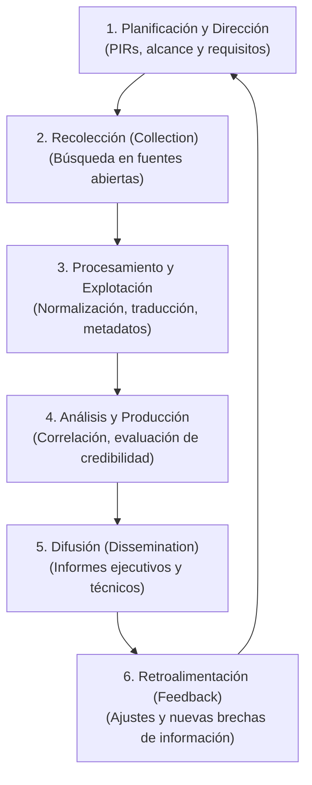
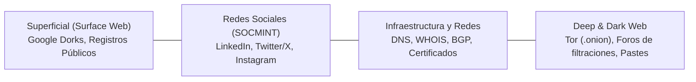
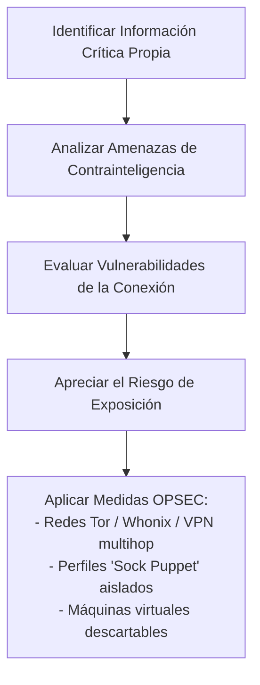

# Open Source Intelligence (OSINT) - Inteligencia de Fuentes Abiertas

> [!abstract] Definición Formal
> **OSINT (*Open Source Intelligence*)** es la disciplina de inteligencia y ciberseguridad que abarca la recolección sistemática, procesamiento, correlación y análisis de datos e información procedentes de **fuentes públicamente accesibles** (legales y abiertas) con el propósito de generar **inteligencia procesable y accionable** para la toma de decisiones estratégicas, la evaluación de riesgos o el reconocimiento en pruebas de intrusión (*pentesting*).

Distinción epistémica esencial en ingeniería:
- **Dato**: Fragmento crudo sin contexto (ej. una dirección IP o un número telefónico aislado).
- **Información**: Conjunto de datos estructurados dentro de un contexto (ej. un registro DNS asociando un dominio a esa IP).
- **Inteligencia**: Información analizada, validada, contextualizada y proyectada en el tiempo que permite anticipar amenazas o ejecutar acciones tácticas.

---

## 1. El Ciclo de Inteligencia (*Intelligence Cycle*)

Cualquier investigación OSINT formal sigue las **6 fases del ciclo clásico de inteligencia**:



1. **Planificación y Dirección (*Planning & Direction*)**: Definición de los **Requerimientos Prioritarios de Inteligencia (PIR - Priority Intelligence Requirements)**. Delimitación del objetivo, recursos disponibles, plazos y directrices de seguridad operativa ([[#6. Seguridad Operativa (OPSEC) y Marco Legal y Ético|OPSEC]]).
2. **Recolección (*Collection*)**: Obtención exhaustiva de datos crudos a través de motores de búsqueda, redes sociales, registros públicos, bases de datos gubernamentales, tráfico de red pasivo y repositorios de código.
3. **Procesamiento y Explotación (*Processing & Exploitation*)**: Conversión de datos heterogéneos y no estructurados en formatos estandarizados (extracción de texto de PDFs, decodificación de datos, estructuración en bases de datos relacionales o grafos).
4. **Análisis y Producción (*Analysis & Production*)**: Síntesis de la información, descarte de falsos positivos, evaluación de la fiabilidad de las fuentes (ej. sistema *Admiralty Code*) y generación de hipótesis deductivas/inductivas.
5. **Difusión (*Dissemination*)**: Comunicación clara, precisa y oportuna de los hallazgos a los líderes técnicos o decisores estratégicos en informes de ciberinteligencia.
6. **Retroalimentación (*Feedback*)**: Evaluación de la utilidad del informe, resolviendo si se cumplió el PIR o si se deben iniciar nuevas iteraciones de recolección.

---

## 2. Reconocimiento Pasivo vs. Reconocimiento Activo

En el contexto de la ciberseguridad ofensiva (*ethical hacking*) y defensiva (*threat hunting*), el reconocimiento se clasifica de acuerdo con la interacción con el objetivo:

| Criterio | Reconocimiento Pasivo (OSINT Puro) | Reconocimiento Activo |
| :--- | :--- | :--- |
| **Interacción con el Objetivo** | **Nula o indirecta**. Se consultan terceros (motores de búsqueda, servidores DNS públicos, cachés, registros mercantiles, Shodan). | **Directa**. Se envían paquetes TCP/IP, peticiones HTTP/S o sondas directamente a la infraestructura del objetivo. |
| **Detección por IDS/IPS/SIEM** | **Indetectable** por la víctima. El tráfico ocurre entre el analista y servidores públicos intermediarios. | **Detectable**. Genera alertas de conexión, escaneo de puertos o peticiones web anómalas en los logs de la víctima. |
| **Riesgo Legal / Exposición** | Mínimo (consulta de datos abiertos públicos). | Requiere autorización previa formal (ej. Acuerdo de Conducción / RoE en pentesting). |
| **Ejemplos Típicos** | Consultas WHOIS, Google Dorks, historial en Wayback Machine, búsqueda en Censys/Shodan. | Escaneo con Nmap, enumeración de directorios con Gobuster, banners grabbing directo. |

---

## 3. Fuentes y Capas de Información en OSINT



### A. Web Superficial y Técnicas Avanzadas de Búsqueda (Google Dorking)
Uso de operadores booleanos y directivas avanzadas de motores de búsqueda para localizar archivos sensibles expuestos involuntariamente:
- `site:objetivo.com filetype:pdf confidential`: Localiza documentos corporativos confidenciales en formato PDF.
- `site:objetivo.com filetype:env "DB_PASSWORD"`: Localiza archivos de configuración de variables de entorno con credenciales de bases de datos.
- `site:objetivo.com inurl:admin | inurl:login`: Descubre portales de autenticación y paneles administrativos.
- `intitle:"index of /" "backup.sql"`: Halla directorios web sin protección con listado de archivos (*directory browsing*) que contienen volcados SQL.

### B. Inteligencia en Redes Sociales (SOCMINT - Social Media Intelligence)
- Análisis de la estructura organizacional de una entidad a través de LinkedIn (organigramas, nombres de ingenieros de TI, software y tecnologías mencionadas en perfiles laborales).
- Recolección de patrones de comportamiento, ubicaciones y círculos de confianza, datos que alimentan campañas de [[Ingenieria social]].

### C. Infraestructura de Red y Registros Públicos
- **Registros WHOIS y RIRs (ARIN, LACNIC, RIPE, APNIC, AFRINIC)**: Identificación de rangos de red asignados (bloques CIDR), Sistemas Autónomos (ASN) y personal de contacto de red/abuso.
- **Registros DNS**:
  - `A` / `AAAA`: Mapeo de nombres a direcciones IPv4 e IPv6.
  - `MX`: Servidores de correo entrante (identifican si usan Google Workspace, Microsoft 365, etc.).
  - `TXT`: Registros de validación de seguridad de correo como SPF (`v=spf1 ...`), DKIM y DMARC (vitales para evaluar susceptibilidad a spoofing de correo).
  - `SOA` y `NS`: Servidores DNS autoritativos primarios.
- **Logs de Transparencia de Certificados (*Certificate Transparency Logs*)**:
  - Plataformas como `crt.sh` permiten descubrir todos los subdominios de una organización para los cuales se ha emitido un certificado SSL/TLS público, revelando entornos de desarrollo, staging y paneles ocultos.

### D. Deep Web y Dark Web
- Monitoreo de repositorios de texto anónimos (Pastebin, Ghostbin) y repositorios públicos de código (GitHub, GitLab) mediante herramientas de detección de secretos (*trufflehog*, *gitleaks*).
- Monitoreo en foros de cibercrimen y mercados clandestinos en la red Tor (.onion) en busca de credenciales corporativas filtradas en *data breaches* masivos (bases de datos de Stealer Logs como RedLine, Lumma Stealer).

---

## 4. Herramientas Esenciales, Comandos y Casos de Uso

### A. Reconocimiento de DNS y Subdominios
1. **`whois`**: Consulta de titularidad de dominios e IPs:
   ```bash
   whois ejemplo.com
   ```
2. **`dig` (Domain Information Groper)**:
   ```bash
   # Consulta exhaustiva de todos los registros DNS disponibles
   dig ejemplo.com ANY +noall +answer

   # Intento de transferencia de zona DNS (AXFR) frente a servidores mal configurados
   dig axfr @ns1.ejemplo.com ejemplo.com
   ```
3. **`nslookup`**:
   ```bash
   nslookup -type=mx ejemplo.com 8.8.8.8
   ```
4. **`theHarvester`**:
   Herramienta en Python para recolectar correos electrónicos, subdominios, hosts, nombres de empleados y puertos abiertos desde múltiples motores públicos (Google, Bing, LinkedIn, Censys):
   ```bash
   theHarvester -d objetivo.com -b google,bing,linkedin,censys -l 200
   ```
5. **`amass` (OWASP Amass)**:
   Herramienta de nivel empresarial para cartografiar la superficie de ataque externa mediante técnicas pasivas (OSINT) y correlación de grafos:
   ```bash
   amass enum -passive -d objetivo.com -src
   ```
6. **`sublist3r`**:
   Herramienta rápida de enumeración de subdominios a través de múltiples motores de búsqueda y plataformas de inteligencia de certificados:
   ```bash
   sublist3r -d objetivo.com -o subdominios_encontrados.txt
   ```

---

### B. Extracción y Análisis Forense de Metadatos
Los metadatos son "datos que describen otros datos". Al publicarse archivos institucionales (PDFs, Word, Excel, fotos) en sitios web, estos suelen retener información interna de alto valor para un atacante:
- **Metadatos Técnicos**: Modelo de cámara, coordenadas geográficas GPS (EXIF), dirección IP interna de impresoras, software del sistema operativo, versión del procesador de textos.
- **Metadatos No Técnicos**: Nombres de usuarios y autores legítimos, cuentas de correo de creadores, rutas internas de servidores y carpetas (`C:\Users\jdoe\Documents\...`), nombres de servidores de red.

#### Herramientas de Metadatos
1. **`exiftool`**: La herramienta de línea de comandos estándar de la industria forense:
   ```bash
   # Inspección completa de metadatos en un archivo PDF o imagen
   exiftool informe_financiero.pdf

   # Eliminación forense completa de todos los metadatos antes de publicar un archivo
   exiftool -all= documento_publico.docx
   ```
2. **FOCA (Fingerprinting Organizations with Collected Archives)**:
   - Desarrollada originalmente por ElevenPaths. Automatiza la descarga masiva de documentos públicos de un dominio web (.pdf, .doc, .docx, .xls, .ppt), extrae sus metadatos y correlaciona de forma automática:
     - Nombres de usuarios locales y de dominio (útil para ataques de fuerza bruta dirigidos a Active Directory).
     - Rutas de red compartidas y discos locales.
     - Versiones de software de ofimática y sistemas operativos utilizados por la organización víctima.

---

### C. Inteligencia Relacional y Análisis de Grafos
1. **Maltego**:
   - Plataforma líder de visualización de inteligencia que representa la información mediante grafos de nodos y aristas.
   - Opera mediante **Entidades** (personas, dominios, direcciones IP, correos) y **Transformadas** (scripts que consultan APIs de terceros como Shodan, VirusTotal, Whois, redes sociales) para expandir los enlaces y revelar relaciones ocultas entre infraestructura y personas.
2. **SpiderFoot**:
   - Automatización integral de recolección de ciberinteligencia. Ejecuta más de 200 módulos de inspección pasiva en paralelo sobre dominios, IPs, números de teléfono o nombres de personas, generando mapas relacionales.
3. **Recon-ng**:
   - Framework modular de reconocimiento en terminal con sintaxis análoga a Metasploit, estructurado con base de datos interna para consolidar entidades descubiertas.

---

### D. Motores de Búsqueda del Ciberespacio y Dispositivos Conectados
A diferencia de Google (que indexa texto en la capa de aplicación web), estos motores indexan directamente los **banners de servicio** en capas de transporte (TCP/UDP):
1. **Shodan**:
   - Escanea continuamente todo el espacio de direcciones IPv4 recolectando los banners de bienvenida de puertos abiertos (SSH, Telnet, HTTP, RDP, SCADA/ICS).
   - Filtros avanzados de búsqueda:
     - `net:198.51.100.0/24`: Escaneo de un bloque CIDR específico.
     - `org:"Nombre Organización" port:3389`: Búsqueda de servidores de escritorio remoto expuestos de una compañía.
     - `product:"Apache httpd" version:"2.4.49"`: Búsqueda de servidores web vulnerables a exploits específicos (ej. Path Traversal).
2. **Censys**:
   - Plataforma complementaria con gran profundidad en certificados TLS/SSL, mapeo de infraestructura cloud y servicios expuestos.

---

## 5. Doxing: Vectores, Riesgos y Contramedidas

> [!warning] Definición de Doxing
> El **Doxing** (o *Doxxing*, derivado de "documents/dox") es la práctica maliciosa consistente en rastrear, recopilar y divulgar públicamente información personal identificable (PII) o privada de un individuo u organización sin su consentimiento, frecuentemente con fines de extorsión, acoso, desprestigio público o ataques físicos.

### Vectores Habituales de Exposición
- Reutilización de nombres de usuario (*nicknames*) en múltiples plataformas digitales (foros, videojuegos, redes corporativas).
- Registros de dominio WHOIS que no tienen activada la protección de privacidad, exponiendo nombres reales, direcciones físicas y teléfonos personales.
- Huellas digitales en fotos públicas con metadatos EXIF de coordenadas GPS de domicilios o lugares de trabajo.
- Correlación de bases de datos filtradas (*data breaches*) donde figuran correos electrónicos y contraseñas vinculadas.

### Medidas Defensivas y de Privacidad
- Uso de servicios de enmascaramiento WHOIS y registros mediante entidades jurídicas.
- Auditoría periódica y desindexación de datos en *data brokers* (empresas de agregación de datos).
- Adopción de políticas estrictas de compartición en redes sociales y desactivación sistemática de geolocalización en aplicaciones fotográficas.
- Eliminación de cuentas obsoletas y desvinculación de plataformas desatendidas.

---

## 6. Seguridad Operativa (OPSEC) y Marco Legal y Ético

Un investigador o auditor de ciberseguridad que realiza labores de OSINT debe aplicar rigurosamente **OPSEC (*Operational Security*)**:



### Reglas Clave de OPSEC para el Analista
1. **Creación de 'Sock Puppets'**: Identidades digitales ficticias y completamente desvinculadas de la identidad real del analista (números virtuales desechables, cuentas de correo dedicadas, fotos sintéticas generadas por GAN/IA).
2. **Aislamiento del Entorno de Trabajo**: Utilización de máquinas virtuales especializadas (ej. *Trace Labs OSINT VM*, *Tsurugi Linux*) o sistemas operativos amnésicos (como *Tails* o *Whonix*) sobre hardware dedicado.
3. **No contaminar las conexiones**: Nunca acceder a cuentas personales reales desde el mismo navegador o sesión donde se realiza la investigación OSINT; evitar fugas de DNS (*DNS leaks*) y huellas de navegador (*browser fingerprinting*).

### Consideraciones Legales y Deontológicas
- **Principio de Legalidad**: Toda recolección debe limitarse a fuentes públicas legítimas. Burlar medidas de autenticación o explotar fallos de software no es OSINT pasivo, sino un delito informático tipificado (ej. Ley 1273 de 2009 en Colombia, *Computer Fraud and Abuse Act - CFAA* en EE.UU.).
- **Ética Profesional**: Toda información recolectada en pruebas de intrusión debe almacenarse cifrada y tratarse bajo acuerdos de confidencialidad estrictos (NDA).

---

## 7. Notas Relacionadas y Enlaces del Vault
- [[Ingenieria social]] - Explotación psicológica que se alimenta de la recolección OSINT.
- [[seguridad informatica]] - Principios generales de protección de la información.
- [[ataques a contraseñas]] - Técnicas de fuerza bruta, diccionarios y correlación de breaches.
- [[Documentos/seguridad informatica/Triada CIA|Triada CIA]] - Preservación de confidencialidad ante vectores de reconocimiento.
- [[sgsi]] - Gestión de incidentes y evaluación de exposición externa.
