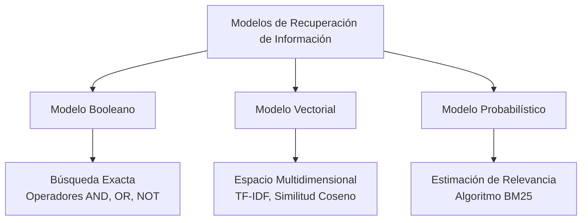

Los modelos de recuperación son las representaciones matemáticas de cómo un motor de búsqueda procesa los documentos y las consultas para determinar qué devolver al usuario.

## Modelo Booleano (Boolean Model)
Es el modelo de recuperación de información clásico basado en la teoría de conjuntos y el álgebra booleana. Las consultas se formulan mediante condiciones lógicas (AND, OR, NOT).
- Cada documento se considera un "conjunto" o "bolsa" de palabras.
- **Limitación principal:** Es binario. Un documento es "relevante" o "no relevante". No hay grises, ni permite un "ranking" o clasificación (ordenar del mejor resultado al peor).

> [!info] Explicación
> **Ejemplo de Booleano:** Si buscas `gato AND perro`, el sistema solo te devolverá los documentos que tengan exactamente ambas palabras. Si un documento tiene "gato" 50 veces pero no tiene "perro", será descartado por completo.

## Modelo Vectorial (Vector Space Model)
Es un modelo algebraico donde cada documento y la consulta del usuario se representan como vectores en un espacio multidimensional. 
- Cada término o palabra única en el vocabulario representa una "dimensión" diferente.
- La relevancia de un documento respecto a la consulta se calcula midiendo la distancia o el ángulo entre sus vectores (generalmente usando la métrica de **Similitud Coseno**).
- Utiliza la métrica [[matriz termino frecuencia|TF-IDF]] para darle más peso a las palabras raras e importantes.
- **Ventaja:** Permite ordenar los resultados mediante un [[ranking]], entregando primero los documentos más parecidos a la consulta (partial matching).

> [!info] Explicación
> **¿Qué es la Similitud Coseno?** Imagina una gráfica. Si la flecha (vector) de tu consulta apunta en la misma dirección que la flecha del documento 1, el ángulo entre ambas es casi cero (coseno cercano a 1), lo que significa que el documento 1 es un excelente resultado.

## Modelo Probabilístico
A diferencia del modelo vectorial que se basa en la similitud geométrica de palabras, el modelo probabilístico intenta calcular matemáticamente la *probabilidad* de que un documento en particular sea relevante para un usuario específico, dadas sus palabras clave.
- Usa principios como el *Probability Ranking Principle* (PRP).
- El sistema divide los documentos en dos conjuntos teóricos: relevantes y no relevantes.
- El algoritmo estrella de este modelo es **BM25**, que se considera el estándar de oro tradicional en muchos sistemas de búsqueda, perfeccionando la idea del TF-IDF con fórmulas no lineales para evitar que la repetición masiva de una palabra domine irremediablemente el puntaje.
- **Ventaja:** Matemáticamente riguroso y adaptativo con retroalimentación (relevance feedback).

> [!info] Explicación
> **BM25 vs Vectorial clásico:** En un modelo vectorial clásico (TF-IDF puro), si repites la palabra "zapato" 1000 veces, tu documento ganará a todos. BM25 (probabilístico) tiene "saturación de frecuencia": entiende que después de repetir "zapato" unas 5 veces, ya quedó clarísimo de qué trata el documento, y repetir la palabra 995 veces más casi no suma más puntaje.

## Notas relacionadas
- [[Índice invertido]]
- [[matriz termino frecuencia]]
- [[ranking]]
