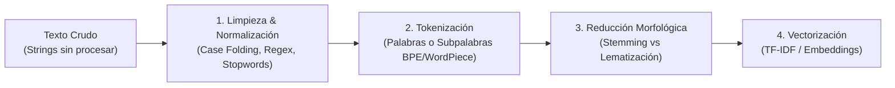
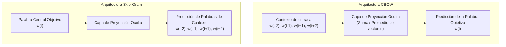
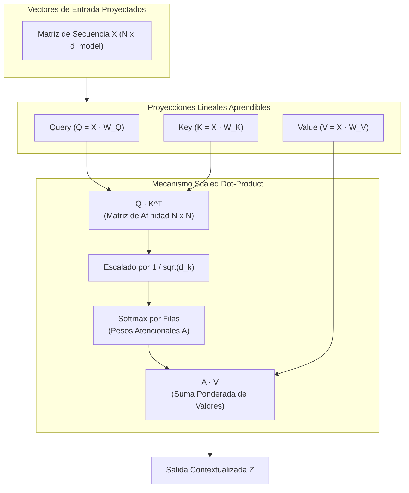
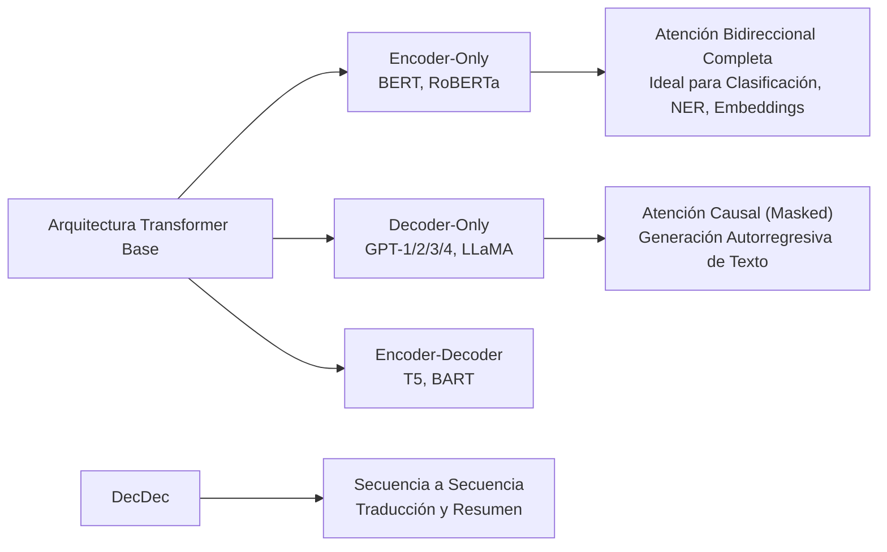

# Procesamiento de Lenguaje Natural (NLP): De Representaciones Discretas a Embeddings Contextuales

## Notas relacionadas
- [[matriz termino frecuencia]]
- [[web semantica|Web Semántica y Grafos de Conocimiento]]
- [[retrival augmented generation|Retrieval Augmented Generation (RAG)]]
- [[machine learning]]

---

## 1. El Pipeline de Preprocesamiento de Texto

El lenguaje humano natural es inherentemente no estructurado, ambiguo y de alta dimensionalidad. Antes de alimentar cualquier algoritmo de aprendizaje automático o red neuronal, el texto debe transformarse mediante una secuencia sistemática de etapas de preprocesamiento y normalización.



### 1.1 Limpieza y Normalización
1. **Normalización Unicode y Case Folding:** Conversión a minúsculas para unificar el vocabulario y normalización estándar (Unicode NFKD/NFC) para descomponer acentos y caracteres especiales diacríticos.
2. **Eliminación de Ruido:** Supresión de etiquetas HTML/XML, URLs, emojis y puntuación no sintáctica mediante expresiones regulares (`regex`).
3. **Filtrado de Palabras Vacías (*Stopwords*):** Eliminación de términos de altísima frecuencia pero bajo contenido semántico discriminativo (artículos como *el, la, los*, preposiciones como *de, en, con*, conjunciones).

### 1.2 Estrategias de Tokenización

La **tokenización** es el proceso de segmentar una cadena continua de texto en unidades mínimas operativas discretas denominadas **tokens**.

| Enfoque de Tokenización | Principio de Operación | Ventajas | Desventajas |
| :--- | :--- | :--- | :--- |
| **Por Palabras (*Word-level*)** | Segmenta por espacios en blanco y delimitadores léxicos. | Intuitivo y preserva la unidad semántica léxica básica. | Vocabularios gigantescos ($>10^6$ palabras) y fallo total ante palabras fuera de vocabulario (*Out-Of-Vocabulary* - OOV). |
| **Por Caracteres (*Char-level*)** | Cada letra o símbolo es un token individual. | Vocabulario diminuto (~100 tokens), cero problemas de OOV. | Secuencias excesivamente largas, pérdida de relaciones semánticas locales y mayor costo computacional. |
| **Por Subpalabras (*Subword-level*): BPE y WordPiece** | Segmenta morfemas y secuencias frecuentes de caracteres intermedios (ej. `"desafortunadamente"` $\to$ `["des-", "afortunada", "-mente"]`). | **Estándar moderno:** Vocabulario fijo óptimo (ej. 30k–50k tokens), maneja palabras desconocidas combinando subpalabras conocidas. | Requiere entrenamiento previo del tokenizador sobre el corpus. |

> [!info] Algoritmos Clave de Subpalabras
> * **BPE (Byte Pair Encoding - Sennrich et al., 2016):** Algoritmo *greedy* que inicia con un vocabulario de caracteres individuales y fusiona iterativamente los pares de símbolos más frecuentes en el corpus. Utilizado en GPT-2, GPT-3, GPT-4 y RoBERTa.
> * **WordPiece (Schuster & Nakajima, 2012):** Similar a BPE, pero la selección del par a fusionar no se basa solo en la frecuencia pura, sino en maximizar la verosimilitud (*likelihood*) de un modelo de lenguaje unigrama sobre los datos. Utilizado en BERT.

### 1.3 Reducción Morfológica: Stemming vs Lematización

Ambas técnicas buscan reducir las múltiples variantes flexivas o derivativas de una palabra a una forma común para consolidar el vocabulario.

```mermaid
flowchart TD
    subgraph Origen [Palabra de Entrada]
        W["'estudiando', 'estudié', 'estudiantes'"]
    end
    subgraph Stemming_Path [Algoritmo de Stemming (Porter / Snowball)]
        S1["Reglas Heurísticas de Truncamiento Sufijal"]
        S2["Raíz (Stem): 'estudi' (No necesariamente es palabra real)"]
    end
    subgraph Lemmatization_Path [Lematización Morfológica (WordNet / SpaCy)]
        L1["Análisis Léxico + Etiquetado Gramatical (POS Tagging)"]
        L2["Lema Canónico: 'estudiar' (Verbo) o 'estudiante' (Sustantivo)"]
    end
    Origen --> Stemming_Path
    Origen --> Lemmatization_Path
```

* **Stemming (Truncamiento Heurístico):** 
  Aplica reglas estáticas de eliminación de sufijos basadas en patrones de cadenas (ej. el clásico algoritmo de Porter o Snowball). 
  - *Ventaja:* Computacionalmente ultra veloz y no requiere diccionarios.
  - *Defectos:* Propenso al **Over-stemming** (unir erróneamente palabras con significados distintos, ej. *universal* y *universo* truncados a *univers*) y al **Under-stemming** (no relacionar palabras de la misma raíz, ej. *seducir* y *seducción*).
* **Lematización (Análisis Léxico y Morfológico):** 
  Utiliza un vocabulario formal y análisis morfológico completo para retornar la forma canónica de diccionario de una palabra (el **lema**). Requiere conocer la categoría gramatical (*Part-of-Speech* - POS) de la palabra en su contexto específico (por ejemplo, saber si "banco" actúa como sustantivo o forma verbal de bancar).

---

## 2. Modelos de Representación Vectorial Tradicionales (Discretos / Dispersos)

Para que un modelo matemático procese texto, los documentos deben proyectarse en un espacio vectorial multidimensional $\mathbb{R}^{|V|}$, donde $|V|$ es el tamaño total del vocabulario.

### 2.1 Bag of Words (BoW) y Matriz Término-Documento
En el modelo de **Bolsa de Palabras (BoW)**, un documento se representa como un vector donde cada posición corresponde a una palabra del vocabulario, conteniendo el número de apariciones de dicho término en el documento.

> [!warning] Limitaciones Críticas de BoW
> 1. **Pérdida absoluta del orden y la sintaxis:** `"El perro mordió al hombre"` y `"El hombre mordió al perro"` producen exactamente el mismo vector.
> 2. **Esparcimiento Extremo (*High Sparsity*):** Con vocabularios de $50,000$ términos, un documento típico de 100 palabras contiene más del $99.8\%$ de ceros.
> 3. **Ortogonalidad Semántica:** Cualquier par de sinónimos (ej. *automóvil* y *coche*) son vectores ortogonales ($\mathbf{u} \cdot \mathbf{v} = 0$), ignorando por completo la similitud de su significado.

### 2.2 TF-IDF (Term Frequency - Inverse Document Frequency)

Para solucionar el problema de que las palabras muy comunes dominen la frecuencia sin aportar discriminación temática, se introduce el factor **TF-IDF**.

#### 1. Frecuencia del Término ($\text{TF}$)
Mide la frecuencia local con la que el término $t$ aparece dentro de un documento particular $d$:
$$\text{TF}(t, d) = \frac{f_{t, d}}{\sum_{t' \in d} f_{t', d}}$$

#### 2. Frecuencia Inversa de Documento ($\text{IDF}$)
Penaliza las palabras que aparecen indistintamente en casi todos los documentos de la colección $D$, asignando mayor ponderación a términos raros y discriminativos:
$$\text{IDF}(t, D) = \ln \left( \frac{|D|}{|\{ d \in D : t \in d \}|} + 1 \right)$$
donde $|D|$ es el número total de documentos del corpus, y el denominador es el número de documentos que contienen la palabra $t$.

#### 3. Puntuación Ponderada TF-IDF y Similitud Coseno
$$\text{TF-IDF}(t, d, D) = \text{TF}(t, d) \times \text{IDF}(t, D)$$

La similitud temática entre dos documentos se computa mediante el **coseno del ángulo** entre sus vectores TF-IDF normalizados:
$$\text{Similitud Coseno}(\mathbf{d}_1, \mathbf{d}_2) = \frac{\mathbf{d}_1 \cdot \mathbf{d}_2}{\|\mathbf{d}_1\|_2 \|\mathbf{d}_2\|_2} = \frac{\sum_{i=1}^{|V|} w_{i, 1} w_{i, 2}}{\sqrt{\sum_{i=1}^{|V|} w_{i, 1}^2} \sqrt{\sum_{i=1}^{|V|} w_{i, 2}^2}}$$

---

## 3. Representaciones Densas: *Word Embeddings* Estáticos

Frente a la dispersión de BoW/TF-IDF, los **Word Embeddings** proyectan las palabras en un espacio vectorial continuo denso de baja dimensión $\mathbb{R}^d$ (típicamente $d \in [100, 300]$).

Se fundamentan en la **Hipótesis Distribucional** formulada por J.R. Firth (1957):
> *"You shall know a word by the company it keeps"* (Conocerás a una palabra por la compañía que frecuenta).

### 3.1 Word2Vec (Mikolov et al., Google, 2013)

Word2Vec implementa dos arquitecturas de redes neuronales superficiales de dos capas:



* **CBOW (Continuous Bag of Words):** Predice la palabra central $w_t$ a partir del conjunto de palabras de su ventana de contexto circundante. Es mucho más rápido de entrenar y funciona mejor para palabras frecuentes.
* **Skip-Gram:** Dado un término central $w_t$, intenta predecir las palabras de su contexto circundante. Funciona notablemente mejor en conjuntos de datos pequeños y captura con gran precisión representaciones de términos raros o infrecuentes.

#### Optimización de Entrenamiento: Skip-Gram con Muestreo Negativo (SGNS)
Dado que calcular el denominador de la función Softmax sobre todo el vocabulario $|V|$ en cada iteración es inviable ($O(|V|)$), Word2Vec reformula el problema como una regresión logística binaria mediante **Negative Sampling**:
$$\mathcal{L}_{\text{SGNS}} = \sum_{t=1}^T \sum_{-c \le j \le c, j \neq 0} \left[ \log \sigma(\mathbf{v}'^\top_{w_{t+j}} \mathbf{v}_{w_t}) + \sum_{k=1}^K \mathbb{E}_{w_{n,k} \sim P_n(w)} \left[ \log \sigma(-\mathbf{v}'^\top_{w_{n,k}} \mathbf{v}_{w_t}) \right] \right]$$
donde se extraen $K$ palabras negativas de forma aleatoria siguiendo una distribución unigrama modificada $P_n(w) \propto f(w)^{3/4}$.

#### Propiedades Geométricas y Analogías Vectoriales
Word2Vec induce una geometría semántica lineal en el espacio latente donde las relaciones conceptuales se corresponden con desplazamientos vectoriales constantes:
$$\vec{v}_{\text{rey}} - \vec{v}_{\text{hombre}} + \vec{v}_{\text{mujer}} \approx \vec{v}_{\text{reina}}$$
$$\vec{v}_{\text{Francia}} - \vec{v}_{\text{París}} + \vec{v}_{\text{Tokio}} \approx \vec{v}_{\text{Japón}}$$

### 3.2 GloVe y FastText

* **GloVe (Global Vectors - Pennington et al., Stanford, 2014):** Combina las ventajas globales de la factorización de matrices de co-ocurrencia con las ventajas locales del muestreo por ventanas de Word2Vec. Minimiza una función de costo por mínimos cuadrados ponderada sobre los logaritmos de co-ocurrencia global: $J = \sum_{i,j} f(X_{i,j}) (\mathbf{w}_i^\top \tilde{\mathbf{w}}_j + b_i + \tilde{b}_j - \log X_{i,j})^2$.
* **FastText (Bojanowski et al., Facebook AI, 2017):** Extiende Word2Vec tratando cada palabra como una bolsa de **n-gramas de caracteres** (ej. para *"donde"*, con $n=3$, genera `<do`, `don`, `ond`, `nde`, `de>`). El vector de una palabra es la suma de los vectores de sus n-gramas.
  - *Gran hito:* Resuelve de forma nativa el problema de palabras desconocidas u OOV, capturando sufijos y prefijos morfológicos con alta precisión.

---

## 4. La Revolución de los Transformers y Embeddings Contextuales

### 4.1 La Limitación Intrínseca de los Embeddings Estáticos

A pesar de su potencia, Word2Vec, GloVe y FastText sufren de una limitación arquitectónica insalvable: asignan **un único vector fijo y estático a cada palabra**, independientemente del contexto de la oración.

> [!important] El Problema de la Polisemia
> Considérense las oraciones:
> 1. *"Fui al **banco** a depositar mi salario en mi cuenta de ahorros."*
> 2. *"Nos sentamos a descansar en un **banco** de madera en el parque."*
> 
> En Word2Vec, el vector de la palabra *"banco"* es exactamente idéntico en ambos casos, forzando a la red a promediar burdamente significados inconexos en un único punto del espacio latente.

---

### 4.2 El Mecanismo de Auto-Atención (*Self-Attention*) de Vaswani et al. (2017)

El hito fundacional publicado en el paper *"Attention Is All You Need"* reemplazó la recurrencia secuencial de las RNNs y LSTMs por el cálculo en paralelo de correlaciones atencionales entre todos los pares de palabras de una secuencia.



#### Ecuación Fundamental de la Atención Escalada Punto-Producto (*Scaled Dot-Product Attention*)
$$\text{Attention}(Q, K, V) = \text{softmax}\left( \frac{Q K^\top}{\sqrt{d_k}} \right) V$$

Donde:
* **$Q$ (Queries / Consultas):** Qué información está buscando el token actual.
* **$K$ (Keys / Claves):** Qué información ofrece cada uno de los tokens de la secuencia.
* **$V$ (Values / Valores):** El contenido de información que se transmitirá si la clave coincide con la consulta.
* **Factor de Escalado $\frac{1}{\sqrt{d_k}}$:** Evita que el producto punto crezca excesivamente en dimensiones altas, lo que causaría que la función softmax colapse en regiones con gradientes infinitesimales (*vanishing gradients*).

#### Atención Multicabeza (*Multi-Head Attention*)
Permite que el modelo atienda conjuntamente a información en diferentes subespacios de representación en posiciones distintas:
$$\text{MultiHead}(Q, K, V) = \text{Concat}(\text{head}_1, \dots, \text{head}_h) W^O$$
$$\text{donde } \text{head}_i = \text{Attention}(Q W_i^Q, K W_i^K, V W_i^V)$$

---

### 4.3 Taxonomía de Modelos de Lenguaje Basados en Transformers

Los modelos contextuales generan **embeddings dinámicos**, donde la representación de *"banco"* en la oración financiera difiere radicalmente de su representación en la oración del parque:



1. **Modelos Solo-Encoder (BERT - Devlin et al., 2018):**
   - Emplea atención bidireccional profunda: cada token atiende a palabras anteriores y posteriores simultáneamente.
   - Preentrenado mediante **Masked Language Modeling (MLM)** (ocultar un 15% de tokens y predecir su valor) y **Next Sentence Prediction (NSP)**.
   - Produce los mejores embeddings de oraciones y fragmentos para búsqueda semántica, clasificación y tareas de extracción.
2. **Modelos Solo-Decoder (GPT - Radford et al., OpenAI):**
   - Utiliza una máscara causal (*causal masking*) que impide que el modelo mire tokens futuros ($j > i$).
   - Preentrenado de forma autorregresiva prediciendo el siguiente token condicional: $\max_\theta \sum_i \log P(w_i | w_{<i}; \theta)$.
   - Especializado en generación fluida y razonamiento en lenguaje natural.
3. **Modelos Encoder-Decoder (T5 - Raffel et al., 2020):**
   - Estructura seq2seq completa para transformar secuencias de entrada complejas en nuevas secuencias estructuradas.

---

## 5. Resumen Comparativo de Paradigmas de Representación

| Paradigma | Dimensionalidad | Densidad | Captura de Contexto | Captura de Orden | Manejo de Polisemia |
| :--- | :--- | :--- | :--- | :--- | :--- |
| **BoW / Matriz T-D** | Gigante ($|V| \sim 10^5$) | Dispersa ($>99\%$ ceros) | Nula | Nulo | No |
| **TF-IDF** | Gigante ($|V| \sim 10^5$) | Dispersa ($>99\%$ ceros) | Nula (solo frecuencia global) | Nulo | No |
| **Word2Vec (CBOW/SG)** | Baja ($d \in [100, 300]$) | Densa | Local (ventana estática de $c$ palabras) | Parcial / Implícito | No (un vector fijo por palabra) |
| **GloVe** | Baja ($d \in [100, 300]$) | Densa | Co-ocurrencia global | Débil | No (un vector fijo por palabra) |
| **FastText** | Baja ($d \in [100, 300]$) | Densa | Subpalabras (n-gramas de caracteres) | Morfológico | No (un vector fijo por palabra) |
| **Transformers (BERT/GPT)** | Media/Alta ($d \in [768, 4096]$) | Densa | **Global y Contextual Dinámica** | Total (mediante Positional Encodings) | **Sí (Vector diferente según cada contexto)** |
