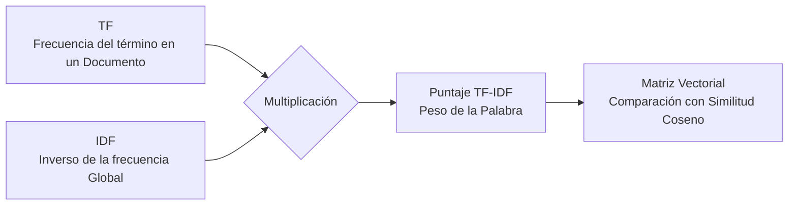

La **Matriz Término-Frecuencia** (y el peso **TF-IDF**) es el motor matemático principal detrás del modelo vectorial en la recuperación de información. Sirve para transformar documentos de texto en vectores numéricos, permitiendo que las computadoras comparen y califiquen (rankeen) su relevancia.

**Inverse Document Frequency (IDF) y Term Frequency (TF):**
Si un término aparece muchísimas veces en casi todos los documentos (como "el", "la", "de"), aporta muy poca información discriminatoria. 

Claude Shannon fue quien sentó las bases de esto al formular la teoría de la entropía de la información (el concepto del caos y la impredictibilidad, donde un evento más raro entrega mayor información).

- **TF (Term Frequency):** `tf(t, d)` = Es el número de veces que aparece el término `t` en un documento específico `d`.
- **IDF (Inverse Document Frequency):** `idf(t)` = `log(N / nt)`

Donde:
- `N`: Es el número total de documentos presentes en el corpus.
- `nt`: Es el número de documentos distintos en los que aparece al menos una vez el término `t`.

> [!info] Explicación
> **Por qué multiplicar TF x IDF:** Si la palabra "inteligencia" aparece 10 veces en un documento (TF alto), ese documento trata sobre inteligencia. Pero si "inteligencia" aparece en *todos* los documentos (IDF bajo), entonces no es útil para filtrar. Multiplicar TF por IDF asigna gran importancia a palabras que aparecen mucho en *tu* documento, pero poco en el resto de la biblioteca.

**Proceso de filtrado y reducción:**
- Antes de armar los vectores, se suelen eliminar las "stop words" (palabras vacías y comunes sin significado, como preposiciones o artículos).
- Se debe definir y crear el diccionario para saber exactamente cuántas y cuáles palabras se van a evaluar.
- Finalmente, se multiplican las matrices para obtener la representación `TF x IDF`.

Para comparar la relevancia entre documentos o entre una búsqueda (query) y un documento, se mide el ángulo entre sus vectores (similitud del coseno). El documento que tenga el menor ángulo respecto al vector de búsqueda es el que más se asemeja, y por ende, es el resultado más relevante. Los ángulos dependen estrictamente de las mismas coordenadas o dimensiones calculadas mediante TF-IDF.

> [!info] Explicación
> **Similitud Coseno:** Se prefiere medir el ángulo entre vectores en lugar de la distancia euclidiana porque la distancia castigaría a documentos muy largos frente a documentos cortos, incluso si ambos hablan exactamente del mismo tema. Si los vectores apuntan a la misma dirección (ángulo 0), el coseno es 1 (similitud total).

**Análisis de Componentes Principales (PCA):**
PCA es una técnica de análisis estadístico que se aplica sobre las columnas de la matriz TF-IDF con el propósito de reducir drásticamente la dimensionalidad del vocabulario. En este proceso, las columnas que tienen comportamientos o significados muy similares se suman o se agrupan en un solo componente "principal".
El IDF, por su parte, sigue siendo un vector.

## Pasos para la creación del modelo
1. Encontrar el vocabulario general (`n` términos).
2. Crear la matriz TF (`n` columnas de términos y `x` filas de documentos).
3. Calcular el vector IDF para cada uno de los `n` términos.
4. Generar la matriz consolidada resultante de multiplicar TF por IDF (ej. dimensiones de `n x 8`).
5. (Opcional) Aplicar PCA para reducir las dimensiones, logrando una matriz simplificada (por ejemplo, reducir a 2 columnas principales sobre las 8 filas originales).

Las comparaciones de similitud y cálculo de distancias se realizan procesando elemento por elemento del vector.
Para el índice de Jaccard, se cuentan las intersecciones lógicas (los "unos").
`Jaccard(query, doc) = | query intersección doc | / | query unión doc |`

## Notas relacionadas
- [[que es recuperacion de informacion]]
- [[ranking]]
- [[retrival augmented generation]]
