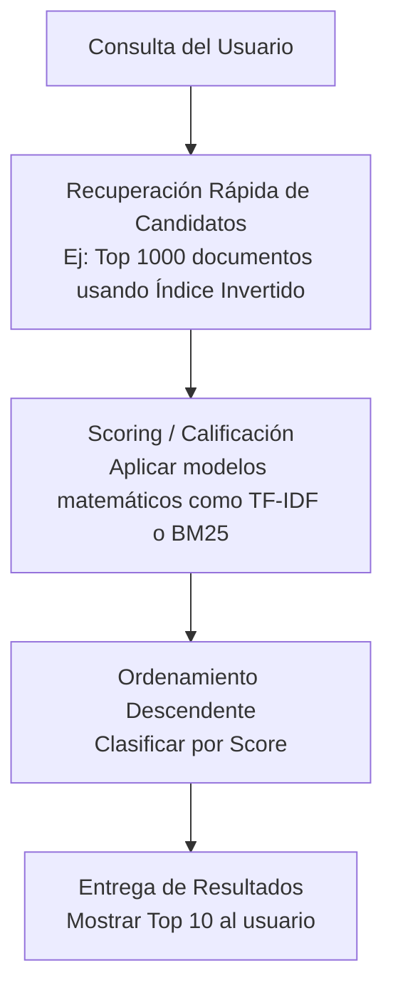

El **Ranking** (clasificación u ordenamiento) es el proceso mediante el cual un sistema de recuperación de información u ordenamiento califica y ordena los documentos recuperados de mayor a menor relevancia para presentárselos al usuario.

> [!info] Explicación
> **¿Por qué es necesario el Ranking?** Cuando buscas "celulares baratos" en Amazon, es probable que haya 50,000 productos que contengan ambas palabras. Si Amazon te mostrara los resultados desordenados (o en el orden en que fueron agregados a la base de datos), perderías horas buscando el mejor. El Ranking es la magia que pone los 10 mejores productos en la primera página.

## Proceso de Puntuación (Scoring)
Para lograr este ordenamiento, el sistema asigna una "puntuación de relevancia" (score) a cada documento. Los documentos con los puntajes más altos ocupan los primeros lugares del ranking (posición 1, 2, 3...). 

El cálculo de esta puntuación depende íntegramente del **Modelo de Recuperación** matemático que el sistema emplee por debajo.
- Si se usa el **Modelo Vectorial**, el score generalmente se determina calculando la *Similitud del Coseno* entre el vector de la consulta (query) y el vector del documento. Mientras el coseno se aproxime a 1 (menor ángulo), el score será más alto.
- Si se usa un **Modelo Probabilístico** (como BM25), el score es un cálculo estadístico de probabilidad de que el documento satisfaga las necesidades del usuario.

## Componentes adicionales del Ranking moderno
En motores de búsqueda reales (como Google) o sistemas de recomendación (como Netflix), el ranking va más allá del texto. Un buen score incluye factores ponderados extra, tales como:
1. **Calidad y Autoridad:** (PageRank) Si un sitio web tiene enlaces de la CNN o Wikipedia, tendrá un ranking base más alto.
2. **Contexto del Usuario:** La ubicación geográfica, idioma y el historial de navegación afectan el orden de los resultados de búsqueda.
3. **Señales de Comportamiento:** Si muchos usuarios hacen clic en el 3er resultado de una búsqueda en lugar del 1ro, el sistema actualiza su ranking moviendo el 3er resultado a la posición 1.

## Notas relacionadas
- [[que es recuperacion de informacion]]
- [[Modelos de recuperación]]
- [[matriz termino frecuencia]]
