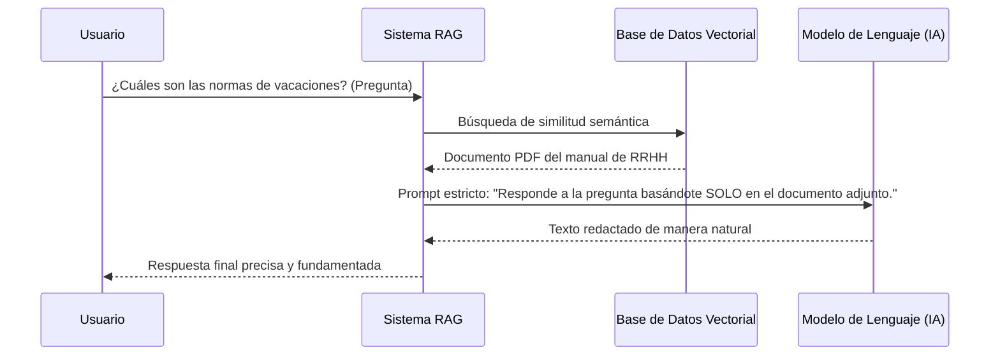

**Retrieval-Augmented Generation (RAG)**, que se traduce como "Generación Aumentada por Recuperación", es un paradigma y técnica de Inteligencia Artificial que potencia los Modelos de Lenguaje Grandes (LLMs, como ChatGPT o Claude) al acoplarlos con un sistema de recuperación de información tradicional o vectorial.

> [!info] Explicación
> **¿Qué problema resuelve RAG?** Los modelos de IA (LLMs) tienen conocimiento congelado en el tiempo (saben cosas solo hasta el año de su entrenamiento) y sufren de "alucinaciones" (inventan datos si no los saben). RAG soluciona esto obligando al modelo de IA a leer documentos externos y verídicos (como la base de datos de tu empresa) antes de redactar su respuesta.

## Beneficios
- El modelo se vuelve un "agente experto" en contextos sumamente especializados para los que no fue entrenado inicialmente (por ejemplo, documentos legales privados, expedientes médicos, wikis internas de una corporación).
- Se elimina significativamente la tasa de alucinaciones, garantizando que el modelo base sus respuestas en "fuentes de la verdad" inyectadas.
- Es computacionalmente mucho más barato que entrenar un modelo desde cero o hacer "fine-tuning".

## El flujo técnico
1. Todos tus documentos (PDFs, webs, textos) son procesados y convertidos en **Vectores o Embeddings** (listas largas de números decimales que representan su significado o intención semántica).
2. Estos vectores se almacenan masivamente en una Base de Datos Vectorial especial (como Pinecone, Milvus o Chroma).
3. Cuando el usuario hace una pregunta, esa pregunta también se convierte a vector y busca sus "vecinos matemáticos más cercanos" (Similitud Coseno) en la base de datos para recuperar los párrafos relevantes de los documentos originales.

## Notas relacionadas
- [[Modelos de recuperación]]
- [[que es recuperacion de informacion]]
- [[ranking]]
- [[machine learning]]
