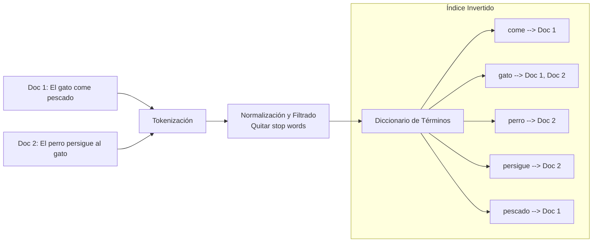

El **Índice Invertido** (Inverted Index) es la estructura de datos fundamental utilizada por los motores de búsqueda modernos (como Google, Elasticsearch o Lucene) para permitir recuperaciones de texto completo a altas velocidades.

> [!info] Explicación
> **¿Qué es y por qué se llama "invertido"?** Un libro normal tiene un índice al principio (Documento -> Palabras contenidas). Un índice invertido es como el glosario al final de un libro de texto: mapea palabras individuales a las páginas donde aparecen (Palabra -> Documentos que la contienen).

## Estructura del Índice Invertido

El índice consta de dos partes principales:
1. **El Diccionario (o Vocabulario):** Una lista ordenada de todos los términos (palabras) únicos que aparecen en toda la colección de documentos.
2. **Las Listas de Publicaciones (Postings Lists):** Por cada término en el diccionario, existe una lista que contiene los identificadores (IDs) de los documentos donde ese término aparece.

*Ejemplo simple:*
Documento 1: "El gato come pescado"
Documento 2: "El perro persigue al gato"

## Proceso de Construcción
1. **Recolección:** Obtener y leer los documentos.
2. **Tokenización:** Dividir el texto en palabras sueltas o *tokens*.
3. **Normalización y Filtrado:** Convertir a minúsculas, eliminar signos de puntuación, eliminar *stop words*, y aplicar lematización o *stemming* (reducir "gatos" a la raíz "gat").
4. **Indexación:** Ordenar todos los términos alfabéticamente y crear la estructura de diccionario enlazado a sus respectivas *postings lists*.

## Proceso de Búsqueda
Cuando un usuario ingresa una consulta (query) como "gato perro":
1. El sistema busca "gato" en el diccionario y recupera su lista: `[Doc 1, Doc 2]`.
2. El sistema busca "perro" en el diccionario y recupera su lista: `[Doc 2]`.
3. Si la búsqueda usa un operador lógico `AND` (ambas palabras deben estar), el motor intersecta ambas listas. La intersección de `[Doc 1, Doc 2]` y `[Doc 2]` es simplemente `[Doc 2]`. El documento 2 es devuelto en un tiempo rapidísimo de `O(1)` o `O(log N)`.

> [!info] Explicación
> **Postings aumentados:** En sistemas avanzados, la *postings list* no solo guarda el ID del documento, sino también la posición exacta de la palabra en el texto. Esto permite buscar frases exactas (como `"perro persigue"`), calculando que la palabra "persigue" esté exactamente un espacio después de "perro".

## Notas relacionadas
- [[que es recuperacion de informacion]]
- [[matriz termino frecuencia]]
- [[Modelos de recuperación]]
