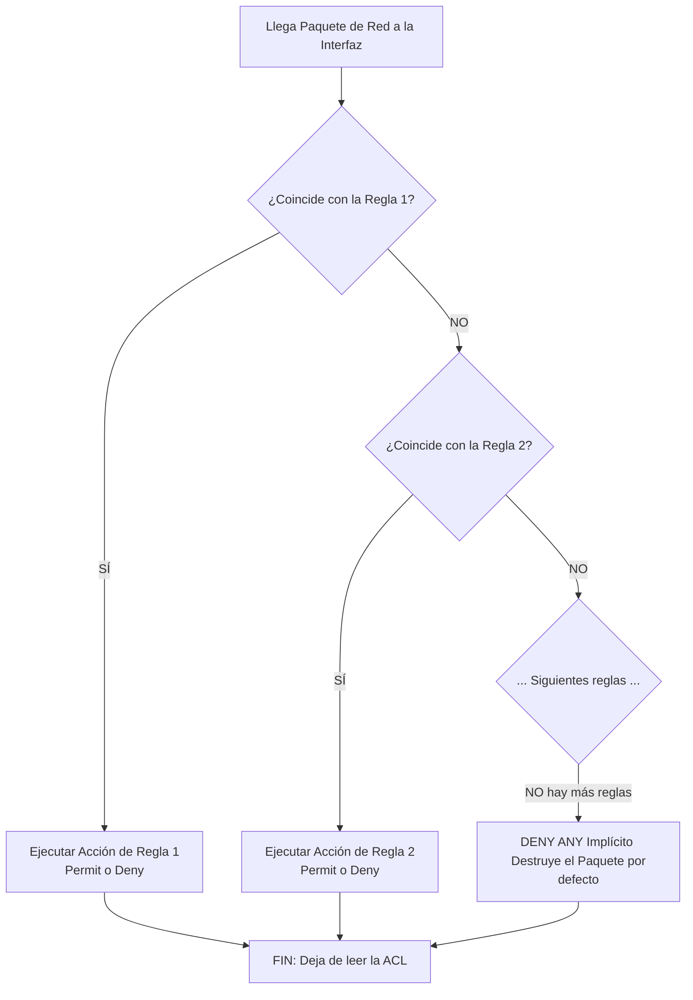

Las **Listas de Control de Acceso (ACL, Access Control Lists)** son un poderoso y riguroso conjunto secuencial de instrucciones de software configuradas en los routers o switches multicapa. Operan como estrictos filtros lógicos y cortafuegos de hardware para inspeccionar de cerca los paquetes que viajan por las redes. 

Su función primaria es evaluar todo el tráfico que intenta atravesar una interfaz (ya sea de entrada o de salida) y decidir, ejecutando reglas de software, si los paquetes deben ser permitidos (permit) para continuar su viaje o deben ser destruidos y denegados (deny) según criterios precisos preestablecidos por el administrador.

> [!info] Explicación: ¿Qué es realmente una ACL?
> Piensa en una ACL como un exigente guardia de seguridad apostado en la puerta de entrada de un edificio corporativo. Este guardia tiene una tabla escrita (la ACL) con reglas específicas: "Dejar pasar a los técnicos de la mañana, no dejar entrar a la secretaria, y arrestar a los vendedores de la competencia". 
> Cuando un paquete de red (un empleado) llega al router, el procesador revisa la tabla leyendo línea por línea desde arriba hacia abajo. En el preciso milisegundo en que el paquete coincide con la descripción de una regla, el router aplica inmediatamente la acción de la lista (permitir o destruir) y deja de leer el resto.

## Categorías de ACL en Redes IPv4 Cisco

Existen dos tipos principales de reglas a la hora de programar el bloqueo en Cisco IOS:

### 1. ACL Estándar (Standard ACL)
Son las listas más primitivas, rápidas de procesar, pero de bloqueos torpes. Únicamente son capaces de examinar y filtrar el tráfico basándose puramente en la **dirección IP de origen** de quien envía el paquete. Las ACL estándar son ciegas al destino final del paquete y al tipo de aplicación que se está usando (les da igual si es un correo, una petición web o un Ping).
- **Rango numérico de identificación para Cisco:** Listas del 1 al 99 y del 1300 al 1999.
- **Regla de oro de la topología:** Debido a su naturaleza contundente (bloquean que un origen hable con todo el mundo detrás del router), deben instalarse lo más **cerca posible del destino final**, para no cortarle por accidente el acceso al usuario hacia otras partes útiles de la red en el medio del camino.

**Ejemplo de configuración simple:** (Bloquear que el host 192.168.10.50 ingrese, permitiendo a todos los demás)
```cisco
Router(config)# access-list 10 deny host 192.168.10.50
Router(config)# access-list 10 permit any
```

### 2. ACL Extendida (Extended ACL)
Son la herramienta de precisión microscópica para la administración de redes. Tienen un grado de granularidad absoluto. Las extendidas leen la trama completa en profundidad y pueden filtrar basándose simultáneamente en:
- Dirección IP y Subred exacta de origen.
- Dirección IP y Subred exacta de destino.
- Tipo de Protocolo de Capa 4 (Evalúan y separan TCP, UDP, ICMP o OSPF).
- Puertos exactos de la aplicación de origen y destino (pueden bloquear tráfico al puerto 80 para la web http, y permitir el tráfico al puerto 22 de SSH en el mismo cable).

- **Rango numérico de identificación:** Listas del 100 al 199 y del 2000 al 2699.
- **Regla de oro de la topología:** Al ser tan milimétricamente precisas en su objetivo final, siempre deben colocarse lo más **cerca posible de la fuente del origen**. Esto previene que el paquete viaje inútilmente consumiendo ancho de banda por los cables de media ciudad, si de todas formas el último router lo iba a incinerar en su destino.

**Ejemplo de configuración quirúrgica:** (Bloquear que la PC del estudiante 192.168.1.15 alcance el servidor web de notas de la IP 10.0.0.50 en el puerto 80, y luego permitir cualquier otro tráfico hacia cualquier otro lugar).
```cisco
Router(config)# access-list 100 deny tcp host 192.168.1.15 host 10.0.0.50 eq 80
Router(config)# access-list 100 permit ip any any
```

## Reglas Críticas Inviolables de Operación

Si no dominas estas tres leyes, tus ACL colapsarán tu propia red:



1. **Orden Secuencial de Arriba hacia Abajo (Top-Down):** El router lee y procesa las instrucciones en estricto orden matemático desde la primera ingresada hasta la última. A la primera coincidencia total que encuentre en un parámetro, aplica la acción ordenadamente, y **deja de leer e ignora instantáneamente el resto de reglas** para ese paquete. Por esta regla, las condiciones microscópicas y específicas (ej. bloquear a un usuario específico) deben configurarse al inicio de la lista de acceso, y las instrucciones vagas y amplias (ej. permitir a toda la subred de ese usuario) deben escribirse al final; si no, la instrucción amplia que se lea primero invalidará el bloqueo que venga debajo.
2. **El "Deny Any" Implícito del final:** Al final de TODA lista de acceso del mundo de Cisco existe una línea programada por defecto, invisible para el usuario, que indica un "Denegar todo lo demás". Si el paquete es escaneado por todas tus reglas listadas y mágicamente no encaja con ninguna de ellas, el router considerará al paquete como no autorizado y lo incinerará. Por la presencia de esta bomba de tiempo invisible, la abrumadora mayoría de los administradores terminan cada creación de ACL insertando como instrucción de cierre visible el comando maestro `permit ip any any`.
3. **Muerte sin aplicación (Interfaces In/Out):** Codificar y crear una lista con 500 reglas ACL impecables no significa en absoluto que el router vaya a usarla para inspeccionar el tráfico. Las listas son meros objetos flotando en memoria RAM. Para que la ACL realmente opere en la vida real, debe ser "anclada" o acoplada permanentemente a un puerto de interfaz del router, y se le debe declarar explícitamente en qué sentido del flujo debe el procesador interceptar los datos: ya sea los paquetes entrando del cable al router (`in`), o escupiendo los paquetes del router hacia el cable (`out`).

```cisco
Router(config)# interface GigabitEthernet0/0
Router(config-if)# ip access-group 100 in
```

## Notas relacionadas
- [[Enrutamiento]]
- [[NAT y PAT]]
- [[Port Security]]
