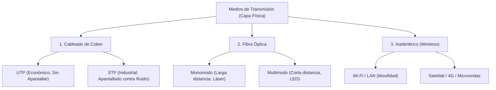

Toda infraestructura de interconexión de red y medios de transmisión físicos pertenecen estrictamente a la **Capa 1 (Capa Física)** del [[Modelo OSI]]. Son los conductos y mecanismos tangibles a través de los cuales fluyen los bits de información cruda en forma de pulsos eléctricos, potentes haces de luz o espectros de ondas de radio.

## 1. Cables de Cobre (Pulsos Eléctricos)

El cobre sigue siendo el medio más utilizado, difundido y económico para las conexiones hacia los dispositivos finales en redes locales de oficinas e industrias (LAN) debido a su bajo costo general, gran flexibilidad física de instalación en ductos y simplicidad.

### Par Trenzado No Apantallado (UTP - Unshielded Twisted Pair)
Es el cable estándar de facto para redes locales Ethernet empresariales. El cable físico contiene en su interior 8 minúsculos hilos de cobre envueltos en plástico aislante diferenciado por colores. Estos 8 hilos se agrupan en 4 pares trenzados entre sí.
- **¿Por qué se trenzan físicamente?** El entrelazado de los cobres, basado en principios físicos, ayuda a cancelar activamente la destructiva interferencia electromagnética externa (EMI) y a mitigar la diafonía (Crosstalk), que no es más que el "ruido o interferencia fantasma" que genera un par de cables vecino enviando señales al mismo tiempo dentro del mismo plástico.
- **Conector estándar de terminal:** RJ-45.
- **Categorías y capacidades de cableado:**
  - **Categoría 5e (Cat 5e):** Soporta anchos de banda operativos hasta 1 Gbps (Gigabit).
  - **Categoría 6 / 6A (Cat 6a):** Sus pares están trenzados de forma mucho más ajustada y el cable posee plásticos separadores rígidos en forma de cruz central, aislándolos aún más. Son capaces de sostener velocidades de 10 Gbps a distancias de 100 metros.

### Par Trenzado Apantallado (STP - Shielded Twisted Pair)
Comparte la estructura del UTP convencional, pero el proceso de manufactura incorpora una densa malla metálica envolvente e incluso papel de aluminio extra alrededor de cada par de hilos. Todo este recubrimiento lo hace infinitamente más resistente al intenso ruido eléctrico. Es indispensable para conectar maquinaria en fábricas o entornos industriales hostiles llenos de poderosos motores eléctricos, transformadores o tubos fluorescentes que destrozarían una señal de cobre estándar. Debido a la malla de protección, es notablemente más costoso y rígido de maniobrar.

## 2. Fibra Óptica (Haces de Luz)

Los cables de fibra óptica logran transmitir bits utilizando ráfagas estroboscópicas rapidísimas de luz a través de hilos minúsculos fabricados en fibras de vidrio de alta pureza o plástico refinado (flexibles pero frágiles, rondando el grosor real de un cabello humano). Como la luz viaja contenida, la fibra óptica es mágicamente **inmune** a cualquier interferencia electromagnética (EMI) y no padece los severos problemas de disipación o atenuación de las señales eléctricas en largas distancias de cobre.

Existen dos arquitecturas predominantes de instalación:

1. **Fibra Monomodo (Single-Mode Fiber - SMF):**
   - El núcleo central de transmisión del vidrio es increíblemente delgado (alrededor de unos exactos 9 micrómetros de diámetro).
   - Utiliza hardware avanzado de tecnología de **diodos Láser** puros para disparar un solo haz concentrado de luz inyectado directamente en el centro físico de la fibra, en línea virtualmente recta.
   - **Propósito:** Enlaces pesados de capacidad astronómica y larguísima distancia (cientos o miles de kilómetros), utilizados masivamente para cruces de cables submarinos, troncales de países e ISPs (Redes WAN metropolitanas).

2. **Fibra Multimodo (Multi-Mode Fiber - MMF):**
   - Posee un núcleo de transmisión bastante más grueso (de 50 a 62.5 micrómetros).
   - Debido a esto, se usan **emisores LED** convencionales o VCSEL económicos, inyectando ráfagas de luz bajo distintos ángulos. La luz se esparce e interactúa "rebotando" repetidamente en las paredes del conducto formando una multitud de caminos irregulares (llamados modos) al mismo tiempo, lo cual acorta el trayecto útil del rayo.
   - **Propósito:** Conexiones de alta velocidad pero de corta distancia métrica (hasta un tope de unos 550 metros en promedio). Es indiscutiblemente la opción predilecta en diseño de redes para conectar switches "Backbone" entre un piso a otro de un enorme edificio corporativo, o para armar conexiones traseras de alta densidad de racks en centros de datos o granjas de servidores.

> [!info] Explicación: Cobre vs Fibra
> El cableado de cobre es como comunicarse hablando fuerte entre oficinas separadas por paredes delgadas: es barato, no requiere aparatos especiales y todo el mundo lo entiende. Pero si alguien cerca comienza a usar un taladro ruidoso (interferencia eléctrica severa de motores cercanos), dejarán de escucharse bien; sumado a que a largas distancias simplemente tu voz no llegará de ninguna manera.
> La transmisión de fibra óptica es idéntica a comunicarse por ventanas a kilómetros de distancia usando destellos rítmicos de potentes linternas láser de largo alcance durante la oscuridad de la noche: no importa en lo más mínimo cuánto ruido ensordecedor exista a tu alrededor, tu señal de luz jamás se distorsionará en el aire por el sonido. Esta peculiaridad permite una propagación muchísimo más veloz logrando llegar decenas de kilómetros sin degradar la precisión o integridad ni de un solo bit transmitido.

## 3. Medios Inalámbricos (Wireless y Radiofrecuencia)

Estos medios transmiten las señales que portan la data de los sistemas finales modulándola y radiándola de forma aérea, manipulando inteligentemente diversas frecuencias del espectro electromagnético natural de la tierra (como ondas milimétricas de radio local y transmisiones de microondas geoposicionadas).

- **La gran Ventaja Operativa:** Otorga la máxima comodidad y movilidad irrestricta a los portadores de los dispositivos finales de usuario (como computadoras portátiles, smartphones corporativos e instrumentación de recolección de datos portátiles industriales en terreno).
- **Las grandes Desventajas Arquitectónicas:** Al ser el aire de un edificio u oficina un "medio compartido e incontrolable por defecto", está abrumadoramente expuesto a altísimas susceptibilidades de caídas debido a interferencias de electrodomésticos comunes, sufre una alta tasa de colisiones inevitables del protocolo y se enfrenta a fuertes debilidades físicas de atenuación geométrica causadas al atravesar el blindaje estructural de paredes de acero y concreto del edificio. Adicionalmente, enfrenta los retos de encriptación de seguridad informática más difíciles de la industria, ya que cualquier equipo con una antena captadora en las proximidades del estacionamiento de la empresa interceptará los paquetes crudos radiados de la compañía que viajen libremente.
- **Protocolos y Estándares de la Industria:** Wi-Fi Local Doméstico (normativa de arquitectura IEEE 802.11), Redes de área personal Bluetooth (normativa IEEE 802.15), Interconexiones de área extendida urbana WiMAX (IEEE 802.16), y el acceso móvil global generalizado y masivo de portadoras celulares (3G/4G LTE/5G).

## Notas relacionadas
- [[Modelo OSI]]
- [[Modelo TCP-IP]]
- [[Configuración del Switch Consola, Acceso remoto.]]
