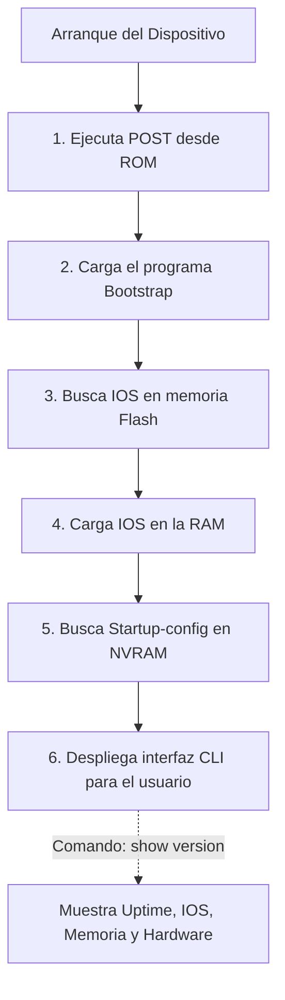

Los comandos de verificación y diagnóstico en el modo privilegiado (EXEC) son la herramienta fundamental diaria para administrar, monitorear y solucionar problemas de operación tanto en un **Switch** como en un **Router** gobernado por el sistema operativo Cisco IOS.

Para obtener un resumen exhaustivo y detallado sobre el estado base del sistema y el hardware del equipo, se utiliza el clásico comando general:

```cisco
Switch# show version
```

Al ejecutar este comando, la consola desplegará múltiples bloques de datos vitales del dispositivo, tales como:
- **Versión del sistema operativo (Cisco IOS):** Identifica la compilación y versión exacta de software instalada (crucial para auditorías de vulnerabilidades).
- **Tiempo de actividad (Uptime):** Muestra el contador de cuánto tiempo ininterrumpido ha estado encendido y operando el dispositivo sin sufrir un reinicio o apagón.
- **Inventario de hardware y densidad de puertos:** Indica la cantidad exacta, tecnología y tipos de puertos físicos (interfaces Ethernet, Gigabit, Seriales) de los que dispone internamente la placa base del equipo.
- **Archivo de imagen del IOS:** Muestra la ruta y el nombre del archivo `.bin` del sistema operativo que el cargador de arranque cargó desde la memoria Flash hacia la RAM. *(Nota: Este es un dato que a menudo es evaluado en certificaciones oficiales de Cisco).*
- **Registro de configuración (Configuration Register):** Un valor hexadecimal (comúnmente `0x2102`) que le indica al equipo cómo debe arrancar y si debe ignorar o cargar el archivo de configuración de inicio (Startup-config).

> [!info] Explicación: ¿Qué es Cisco IOS?
> **Cisco IOS (Internetwork Operating System)** es el sistema operativo universal utilizado en la inmensa mayoría de routers y switches empresariales de Cisco. A diferencia de Windows o Linux, que tienen interfaces gráficas con ratón y ventanas amigables, IOS tradicionalmente carece de gráficos y se administra exclusivamente a través de una austera Interfaz de Línea de Comandos (CLI).
> Los ingenieros ingresan secuencias exactas de texto para tener un control granular absoluto sobre el comportamiento del procesador de red. El comando `show version` es el equivalente exacto a abrir las "Propiedades del Sistema" o "Acerca de" en una PC moderna.

## Consideraciones de Rendimiento de Hardware

El comando también revela la capacidad base del hardware. Si el equipo reporta que cuenta con puertos de arquitectura *Full-Duplex* a una velocidad nominal de 1000 Mbps (Gigabit), el rendimiento teórico de transmisión bruta bidireccional por puerto alcanzaría los 2000 Mbps, dado que permite enviar 1 Gbps y recibir 1 Gbps matemáticamente al mismo instante sin colisiones físicas. 

Sin embargo, hay que tener claro que las especificaciones teóricas de hardware no son absolutas: factores de red como la latencia del cable, el ruido, la congestión de procesamiento de CPU y el tamaño de los paquetes influyen drásticamente reduciendo el rendimiento real de la transferencia de datos.


*(Diagrama: Proceso de arranque estándar del IOS donde se cargan los componentes que luego el comando `show version` audita).*

## Notas relacionadas
- [[Configuración del Switch Consola, Acceso remoto.]]
- [[Enrutamiento]]
- [[VLAN]]
- [[Port Security]]
