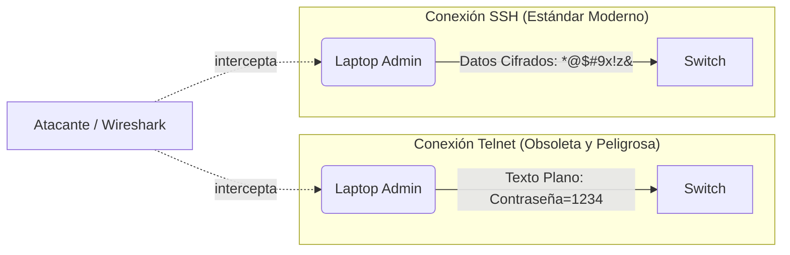

Es un pilar fundamental de la administración de redes dominar cómo acceder físicamente y por red a los diferentes modos de operación de un switch, así como los métodos obligatorios para asegurar los puertos administrativos contra intrusiones.

Como medida perimetral básica, para proteger el acceso de comandos críticos en el modo privilegiado (EXEC privilegiado), siempre se debe configurar una contraseña encriptada usando el algoritmo MD5 o superior mediante el comando:
```cisco
Switch(config)# enable secret MiPasswordSuperSeguro
```

## Acceso local directo: Puerto de Consola
Este tipo de conexión se realiza de forma presencial. Involucra un dispositivo terminal (una laptop) conectado físicamente con un cable hacia la placa posterior del equipo de red.

- **Acceso fuera de banda (Out-of-band management):** Este concepto hace referencia a un tipo de acceso a través de un canal electrónico dedicado *exclusivamente* a la administración del sistema operativo. El medio de consola no se mezcla con el tráfico de datos regular de los usuarios (no enruta IPs, no procesa correos de la oficina).
- Este acceso se realiza utilizando un tradicional **cable de consola (Roll-Over cable)**, que suele ser de color celeste plano y posee cables internos cruzados específicamente.
- La conexión física se establece desde un puerto Serial RS-232 en la laptop (actualmente solucionado con adaptadores USB-a-Serial) conectándose al **Puerto RJ45 etiquetado como "Console"** en el chasis del switch o router.
- **Es el puerto obligatorio para el primer uso:** Como los equipos de fábrica o reseteados carecen de direcciones IP enrutables en sus interfaces de red, el puerto de consola es la única manera humana de programarlos por primera vez. También es la vía de emergencia garantizada cuando un administrador comete un error grave por red y pierde el acceso remoto al equipo.

> [!info] Explicación: Puerto de Consola vs Puertos Ethernet
> Los 24 o 48 puertos Ethernet del frente de tu switch se encargan de enrutar el pesado tráfico de YouTube, videollamadas y bases de datos de la empresa. El puerto posterior de consola, por el contrario, es una "puerta trasera" de bajo voltaje reservada para los ingenieros. Incluso si la red entera está saturada al 100% por un ataque masivo de red, el puerto de consola seguirá funcionando con fluidez porque tiene un chip de hardware dedicado para escribir comandos.

## Acceso Remoto al Switch mediante Red (VTY)
Para configurar el acceso remoto (a través del cable de red desde la comodidad de una oficina), el dispositivo debe estar preparado para procesar protocolos de capa superior:

- En un switch de Capa 2 (estándar), los ingenieros no pueden configurar una dirección IP directamente a un puerto físico (ej. FastEthernet 0/1).
- Para solucionar esto, la dirección IP administrativa se asigna a una **Interfaz Virtual del Switch (SVI)** lógica, que funciona internamente como la tarjeta de red de la CPU del switch.
- Esta SVI debe asociarse a una VLAN. Tradicionalmente se asociaba a la VLAN 1 nativa, pero las buenas prácticas de seguridad exigen crear una VLAN dedicada (ej. VLAN 99) exclusivamente para administración de equipos.

### Configuración de los servicios de red base:
1. **Activar los servicios TCP/IP:** Se le asigna la IP a la interfaz SVI virtual y se procede a encenderla.
2. **Configurar las Líneas VTY:**
   - Las líneas VTY (Virtual Teletype) son conductos lógicos o "sesiones" del software utilizadas para gestionar todas las conexiones entrantes remotas.
   - Cisco IOS típicamente provee de 16 líneas VTY simultáneas (numeradas de la 0 a la 15), permitiendo que hasta 16 ingenieros entren al equipo por red al mismo tiempo.

**Comandos iniciales para preparar el acceso SVI:**
```cisco
Switch(config)# interface vlan 99
Switch(config-if)# ip address 192.168.99.10 255.255.255.0
Switch(config-if)# no shutdown
```

## Protocolo Telnet vs Secure Shell (SSH)

La conexión hacia las líneas VTY se puede realizar utilizando dos protocolos diametralmente opuestos en cuanto a seguridad.



> [!info] Explicación: El Problema Fatal de Telnet
> Telnet es un protocolo arqueológico de los años 60. Su problema fatal en la actualidad es que transmite todo el tráfico que tecleas en **texto claro y legible**. Si un atacante usa software para escanear y capturar el tráfico que pasa por el cable Ethernet de la empresa, podrá ver con total claridad tu nombre de usuario y tu contraseña maestra pasando por la pantalla. SSH soluciona esto usando criptografía pesada: el atacante solo verá ruido sin sentido ("basura matemática").

### Configuración recomendada de SSH:
Por políticas de seguridad, **Telnet debe estar siempre bloqueado** y **Secure Shell (SSH)** debe ser la norma única de conexión remota.

Para habilitar SSH, el switch necesita identificadores unívocos para generar las llaves matemáticas, por lo tanto requiere configurar un nombre de dominio y una base de datos local de usuarios:

```cisco
Switch(config)# hostname SW-CORE
Switch(config)# ip domain-name miempresa.com

// Genera el motor criptográfico RSA (Se exige mínimo 1024 bits para evitar hackeos)
Switch(config)# crypto key generate rsa

// Obligatorio usar SSH versión 2, la v1 tiene vulnerabilidades conocidas
Switch(config)# ip ssh version 2            

// Crea la cuenta del administrador que accederá
Switch(config)# username admin secret adminPassword123

// Asegura los puertos VTY para que SOLO admitan SSH y pidan las cuentas locales
Switch(config)# line vty 0 15 
Switch(config-line)# transport input ssh    
Switch(config-line)# login local            
Switch(config-line)# exit
```

Para conectarse desde cualquier terminal de Windows, macOS o Linux, el administrador ejecutará:
```bash
ssh -l admin 192.168.99.10
```

## Acceso heredado: Puerto Auxiliar (AUX)
- Es un puerto obsoleto idéntico al de consola, pero internamente configurado para soportar conexiones de red externas a través de viejos módems telefónicos (tecnología dial-up sobre líneas telefónicas análogas de cobre). 
- Históricamente, si el enlace de Internet principal del switch caía, los ingenieros hacían una llamada telefónica convencional al módem conectado al puerto AUX para reprogramar el equipo desde otra ciudad. Hoy en día, salvo nichos críticos, no se utiliza.

## Notas relacionadas
- [[Comandos para examinar el IOS]]
- [[VLAN]]
- [[STP (Protocolo de árbol de extensión)]]
- [[EthernetChannel]]
- [[Port Security]]
