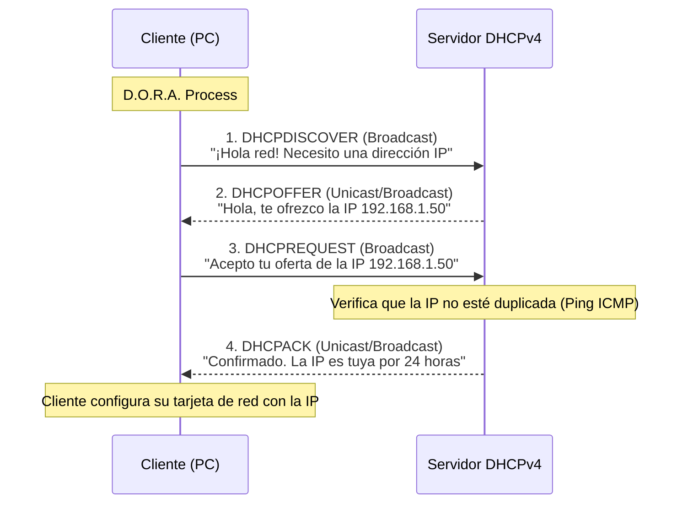

El servicio DHCP tiene una estructura de tipo cliente/servidor.
Se necesita un servidor dedicado configurado para administrar las direcciones en redes grandes y medianas; en redes más pequeñas, este servicio se puede configurar directamente para que se ejecute en el router local de la compañía.
En los routers empresariales, ya vienen incluidos los mecanismos necesarios para la asignación y gestión de direcciones IPv4.

El proceso central de este protocolo se conoce como "arrendamiento" (o concesión o lease). Es el mecanismo mediante el cual el cliente solicita una configuración de red y el servidor le asigna una dirección IP de forma temporal. Esta dirección se arrienda por un período de tiempo definido que puede ir desde unas pocas horas (ej. 24 horas) hasta varias semanas, dependiendo completamente de la configuración establecida por el administrador.
El servidor proporciona las direcciones IP, sacándolas de un rango previamente definido conocido como "pool" (grupo) de direcciones disponibles.

> [!info] Explicación: ¿Qué es DHCP?
> **DHCP (Dynamic Host Configuration Protocol)** es un protocolo que automatiza la tediosa configuración de red de los dispositivos de los usuarios. En lugar de que un administrador asigne manualmente, una por una, una dirección IP, máscara de subred, puerta de enlace y servidor DNS a cada computadora (lo cual sería logísticamente imposible en una gran empresa o universidad), el servidor DHCP lo hace automáticamente en el momento en que el dispositivo se conecta físicamente a la red o al Wi-Fi.

## Proceso de Arrendamiento: El flujo D.O.R.A
El proceso mediante el cual un cliente obtiene una nueva concesión de dirección IP consta de 4 mensajes fundamentales: Discover, Offer, Request y Acknowledgment.



### **Paso 1. Detección DHCP (DHCPDISCOVER)**
El cliente, que aún no tiene configuración, envía una solicitud de descubrimiento en formato de difusión a toda su red local para localizar cualquier servidor DHCP disponible.
- MAC de Origen: La MAC del cliente.
- MAC de Destino: FF:FF:FF:FF:FF:FF (Broadcast Capa 2).
- IP de Origen: 0.0.0.0 (Aún no tiene IP).
- IP de Destino: 255.255.255.255 (Broadcast Capa 3).

### **Paso 2. Oferta DHCP (DHCPOFFER)**
Cuando el servidor recibe el mensaje de detección, busca una dirección IP disponible en su pool, la reserva y envía una oferta formal al cliente.
- Contiene: Posible dirección IP asignada, máscara, router por defecto y tiempo de arrendamiento.

### **Paso 3. Solicitud de DHCP (DHCPREQUEST)**
El cliente responde con un mensaje, típicamente en formato de broadcast, comunicando explícitamente a todos los servidores DHCP de la red que ha aceptado la oferta específica del servidor elegido.
Este mensaje DHCPREQUEST sirve como notificación de aceptación vinculante para el servidor seleccionado, y actúa al mismo tiempo como un rechazo implícito a cualquier otro servidor de la red que pudiera haberle proporcionado una oferta simultánea.

### **Paso 4. Confirmación de DHCP (DHCPACK)**
El servidor verifica la consistencia de la información del arrendamiento (a menudo realizando un rápido ping ICMP en la red para asegurarse de que nadie más tenga asignada esa IP por error). Posteriormente, crea una nueva entrada en su tabla interna vinculando la IP a la MAC del cliente, y responde con el mensaje definitivo DHCPACK para finalizar exitosamente el proceso.

## Pasos para renovar un contrato de arrendamiento
Antes de que el tiempo de la concesión original expire, el cliente intentará renovarla automáticamente.
### **Solicitud de Renovación DHCP (DHCPREQUEST)**
Para renovar su concesión, el cliente envía un mensaje DHCPREQUEST de forma directa (Unicast) al servidor DHCPv4 original que le ofreció la dirección. Si este servidor falla y el cliente no recibe confirmación en un tiempo prudencial, el cliente entrará en pánico y transmitirá un nuevo DHCPREQUEST en modo broadcast, de manera que cualquier otro servidor DHCPv4 de respaldo en la red pueda extender el arrendamiento para evitar la desconexión.

### **Confirmación de Renovación DHCP (DHCPACK)**
Al recibir la solicitud de renovación, el servidor actualiza el temporizador de la base de datos y devuelve un mensaje DHCPACK, permitiéndole al cliente mantener su dirección IP ininterrumpidamente.

*Nota de buenas prácticas:* Los dispositivos vitales de infraestructura (como routers, switches, impresoras y servidores de bases de datos) deben configurarse siempre con direcciones IP estáticas fijas. Estas direcciones fundamentales nunca deben depender de asignaciones dinámicas por DHCP.

## Configuración de DHCP en Routers Cisco
En primer lugar, se deben excluir proactivamente todas las direcciones IP que han sido asignadas de manera manual a servidores o puertas de enlace, para evitar que el DHCP las asigne accidentalmente y cree un conflicto de IPs duplicadas:
```cisco
ip dhcp excluded-address [ip_inicio] [ip_final_rango]
```

Luego, se crea el pool de direcciones DHCP asignándole un nombre descriptivo:
```cisco
ip dhcp pool [nombre_del_pool_LAN1]
```

Dentro de la configuración específica del pool, se establecen los parámetros principales que se entregarán a los clientes: la red, la puerta de enlace predeterminada y el servidor DNS:
```cisco
network [dirección_de_red] [máscara_de_subred]
default-router [ip_puerta_de_enlace]
dns-server [ip_servidor_dns]
```

Para definir la duración específica de la concesión (arrendamiento):
```cisco
lease {days [hours [minutes]] | infinite}
```

Para definir el nombre de dominio de la red local:
```cisco
domain-name [nombre_dominio.com]
```

**Comandos útiles para verificar y monitorear:**
```cisco
// Muestra la lista de todas las IPs asignadas actualmente y a qué dirección MAC pertenecen.
show ip dhcp binding 

// Muestra únicamente la sección de la configuración del router relacionada con DHCP.
show running-config | section dhcp 

// Muestra contadores y estadísticas de todos los mensajes DHCP enviados/recibidos.
show ip dhcp server statistics 
```

## DHCP Relay (Agente de retransmisión / IP Helper)
El mecanismo "DHCP Relay" (agente de retransmisión) se utiliza en redes corporativas jerárquicas donde no se coloca un servidor DHCP distinto en cada subred, sino que se utiliza un servidor centralizado en un centro de datos. 
El router más cercano a los clientes (el que sirve de Default Gateway) se configura para escuchar sus peticiones y retransmitirlas directamente al servidor remoto.

```cisco
interface GigabitEthernet0/1 (Interfaz LAN de los clientes)
ip helper-address [dirección_IP_del_servidor_DHCP_remoto]
```

> [!info] Explicación: ¿Por qué necesitamos DHCP Relay?
> Los mensajes iniciales del proceso DHCP (como el DHCPDISCOVER) se envían como tráfico broadcast de Capa 2 y Capa 3, ya que el cliente no sabe la IP de nadie. **Una de las reglas de oro de los routers es que jamás reenvían tráfico de broadcast a través de sus interfaces.** Por lo tanto, si el servidor DHCP central está en otra red distinta a la de los clientes, nunca recibirá la petición original.
> El comando `ip helper-address` instruye al router para que intercepte esos mensajes de broadcast UDP en el puerto 67, los empaquete en un mensaje unicast directo y los envíe a la dirección IP específica del servidor DHCP remoto en otra subred.

## Notas relacionadas
- [[VLAN]]
- [[Enrutamiento]]
- [[DHCP IPV6]]
- [[SLAAC (Stateless Address Autoconfiguration)]]
