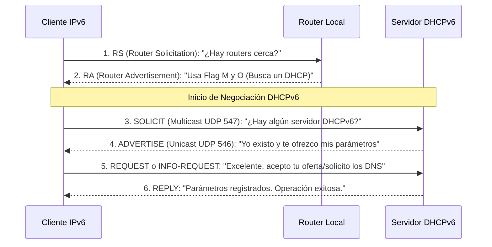

En el mundo del direccionamiento IPv6, existen dos tipos fundamentales de direcciones que deben configurarse y comprenderse a la perfección para habilitar servicios dinámicos como SLAAC o DHCPv6 en un router:
- **GUA (Global Unicast Address):** Enrutable públicamente en todo Internet (equivalente a la IP Pública). Se configura manualmente con el comando `ipv6 address 2001:db8::1/64`.
- **LLA (Link-Local Address):** Es estrictamente confinada al medio físico local y no cruza hacia otros routers. Generalmente autoconfigurada, pero se puede fijar estáticamente usando `ipv6 address fe80::1 link-local`. Fundamental, porque las máquinas cliente utilizarán esta dirección LLA del router como su verdadera Puerta de Enlace Predeterminada (Default Gateway).

## El Paradigma de Asignación de IPv6

El protocolo general fue rediseñado de raíz para simplificar, descentralizar y flexibilizar drásticamente la forma en que los sistemas operativos clientes adquieren su configuración completa de red.

Todos los métodos lógicos de configuración —tanto la autoconfiguración "stateless" (sin estado o registro central) como la asignación clásica "stateful" (con estado mediante un servidor que controla cada IP)— dependen inherentemente de un único elemento crítico: **Los mensajes de Anuncio de Router (Router Advertisement, RA)** enviados mediante ICMPv6. Estos mensajes fungen como "consejeros" que dictan e instruyen al host sobre qué estrategia precisa debe emplear para armar su configuración.

![[Pasted image 20230827223734.png]]

## Las 3 Banderas (Flags) Dictadoras del Mensaje RA
El router incluye pequeños switches de estado (Flags) de un bit dentro del paquete RA para controlar a la red:
- **A flag (Autoconfiguration):** Cuando este bit está en 1, indica y permite activamente al host receptor que utilice la técnica matemática de Autoconfiguración Sin Estado (SLAAC) para forjar su propia dirección GUA de IPv6.
- **O flag (Other Configuration):** Indica al host que su proceso no ha terminado. Le advierte que debe conectarse a un servidor secundario DHCPv6 "Stateless" para obtener parámetros periféricos de vital importancia que el router no envió (principalmente la dirección IP del servidor DNS de la compañía).
- **M flag (Managed Address):** Esta bandera cambia las reglas del juego. Cuando está en 1, prohíbe tácitamente al equipo usar su autonomía y le ordena comportarse como en IPv4: debe ubicar, consultar y someterse a un servidor DHCPv6 central "Stateful" para que este le arriende formalmente una IP y el resto de parámetros.

![[Pasted image 20230827224304.png]]

## Pasos Universales para habilitar SLAAC (El modo por defecto)
1. Asignar de forma estática una dirección GUA a la interfaz perimetral del router:
```cisco
interface GigabitEthernet 0/0
ipv6 address 2001:db8:acad:1::1/64
no shutdown
```
2. **El Comando Vital:** Habilitar globalmente el enrutamiento y procesamiento lógico de paquetes IPv6 en el hardware del router. Sin este comando, el router jamás generará mensajes RA:
```cisco
ipv6 unicast-routing
```
A partir de este momento, por defecto, el router comenzará a enviar RAs con el Flag A activado y los otros apagados, dejando a los PCs trabajar 100% bajo SLAAC Puro.

> [!info] Explicación: ¿Por qué le llaman "Sin Estado" (Stateless)?
> No significa que los dispositivos estén confundidos o apagados. "Stateless" en redes significa simplemente que **no existe una base de datos centralizada, tabla de Excel o disco duro (un Estado de memoria)** llevando el control individual de "a la computadora Juan le di la IP 11, y a Pedro la IP 12".
> En SLAAC, el router hace un anuncio de megáfono: "Muchachos, el código de área (prefijo) de nuestra red es `2001:db8:acad:1::/64`. Constrúyanse ustedes mismos la mitad que falta de su IP y no me avisen, porque matemáticamente es imposible que dos de ustedes coincidan por accidente". Esto descarga masivamente de trabajo al hardware central.

## Proceso de Intercambio Cliente-Servidor DHCPv6

Cuando el administrador de red de la empresa ha decidido (mediante el Flag O o el Flag M) involucrar a un servidor DHCPv6 (ya sea el propio router u otra máquina), el protocolo dicta un intercambio oficial de 4 mensajes. A diferencia del D.O.R.A de IPv4, aquí se bautiza con otros nombres, pero la naturaleza lógica es equivalente. 

*(Nota arquitectónica: En IPv6, los servidores DHCP escuchan las solicitudes entrantes en el puerto UDP 547, y los clientes en el 546).*



## Configuración: DHCPv6 Stateless (SLAAC + DHCP)
En este popular modelo híbrido, SLAAC genera la IP de forma mágica y sin esfuerzo, pero se configura el router para enviar un flag que le ordene a las PCs contactar al DHCP solo para obtener el servicio de resolución DNS (que SLAAC no siempre hace bien en versiones viejas).

Bajo la interfaz se ingresa el comando:
```cisco
ipv6 nd other-config-flag
```
Esto establece artificialmente el **Flag O = 1** en los mensajes RA salientes.
Al recibir esto, el equipo host asume de inmediato la autoconfiguración de su IP, e inicia un mensaje SOLICIT para buscar quién le proporciona el DNS corporativo.

## Configuración: DHCPv6 Stateful (El Control Total)
Si se desea un control férreo, de tipo gubernamental, empresarial o militar, en el que se deba llevar un log exacto de qué IP se asignó a qué tarjeta de red, se requiere DHCPv6 Stateful (equivalente al clásico servidor Windows de IPv4).

Para instruir a los hosts a abandonar por completo su independencia y someterse al control centralizado de un DHCPv6, se modifica la interfaz:
```cisco
// Enciende el Flag M = 1 (Obliga a solicitar la IP gestionada)
ipv6 nd managed-config-flag

// Opcional recomendado: Apaga explícitamente SLAAC (Flag A = 0)
ipv6 nd prefix default no-autoconfig
```

Posteriormente, el router o el servidor externo deben estar configurados de antemano con un Pool (grupo) oficial de direcciones reservadas:
```cisco
ipv6 dhcp pool MIPOPL-CORPORATIVO
address prefix 2001:db8:acad:1::/64
dns-server 2001:db8:acad:99::53
domain-name empresa.com
```

**Nota para los administradores de sistemas:** Para restablecer el router a su comportamiento nativo original de SLAAC puro en caso de error, simplemente niegue los comandos anteriores con `no ipv6 nd managed-config-flag` y `no ipv6 nd other-config-flag`.

## Notas relacionadas
- [[DCHPv4]]
- [[SLAAC (Stateless Address Autoconfiguration)]]
- [[VLAN]]
