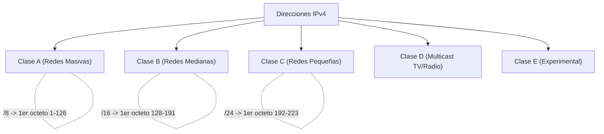

El **Direccionamiento IPv4 (Internet Protocol version 4)** es el sistema lógico estándar histórico y dominante en la actualidad (aunque en franco proceso de migración mundial) para identificar de manera unívoca y enrutar a los dispositivos conectados en redes locales y en el Internet global.

Una dirección IPv4 es una dirección de red conformada por una longitud estricta de **32 bits**, expresados por convención humana como 4 números decimales (llamados octetos, ya que cada uno representa 8 bits) separados por puntos. El valor de cada octeto puede variar desde 0 hasta 255. *(Ejemplo de formato: `192.168.1.15`)*.

> [!info] Explicación: Red vs Host
> Al igual que una dirección postal del mundo real tiene una parte fija para "La calle" y otra específica para "El número de la casa", una dirección IPv4 se divide matemáticamente en dos porciones lógicas:
> 1. **Porción de Red (Network):** Identifica el segmento geográfico/lógico de la red. Todos los equipos conectados en una misma red local o subred deben compartir esta porción exacta para poder hablar entre sí sin usar routers.
> 2. **Porción de Host:** Identifica al equipo individual y específico (PC, teléfono, impresora) dentro de esa subred.
> La encargada de trazar la línea matemática que separa e indica qué parte es red y qué parte es host es la **Máscara de Subred**.

## Tipos de Direcciones dentro de una Red IPv4
Dentro de cualquier segmento de subred IPv4 creado, existen 3 roles lógicos para las direcciones calculadas:
- **Dirección de Red:** Es siempre la primera dirección matemáticamente posible (todos los bits de la porción de host convertidos a `0`). Identifica a la red en su totalidad para las tablas de enrutamiento y jamás se le puede asignar a una tarjeta de red de un equipo.
- **Dirección de Host:** Son todas las direcciones numéricas intermedias disponibles. Se asignan libremente a computadoras, impresoras, servidores y las interfaces de los routers.
- **Dirección de Broadcast (Difusión):** Es siempre la última dirección matemáticamente posible (todos los bits de la porción de host convertidos a `1`). Un mensaje enviado a esta dirección IP lo recibirán e intentarán procesar todos los hosts activos de la subred al mismo tiempo.

## Clasificación Histórica por Clases (Classful Routing)
Antes de la invención del enrutamiento sin clase (CIDR) y VLSM para el ahorro de IPs, las direcciones estaban fijadas rígidamente por bloques llamados "Clases":

| Clase | Rango del 1er octeto | Máscara por defecto | Capacidad Original |
| ----- | ---------------------- | ------------------- | ------------------ |
| **A** | 1 - 126 | 255.0.0.0 (/8) | Creada para 128 mega-corporaciones (16.7 millones de hosts c/u). |
| **B** | 128 - 191 | 255.255.0.0 (/16) | Redes medianas a grandes (65,534 hosts c/u). |
| **C** | 192 - 223 | 255.255.255.0 (/24)| Pensada para redes locales y empresas pequeñas (254 hosts c/u). |
| **D** | 224 - 239 | N/A | Reservada para grupos Multicast (Protocolos, IPTV). |
| **E** | 240 - 255 | N/A | Uso estrictamente Experimental y gubernamental. |

*(Nota de Sistema: La dirección `127.0.0.0/8` completa está reservada para pruebas internas de la propia tarjeta de red, comúnmente llamada bucle invertido o localhost en tu propio equipo).*

## Direcciones Privadas vs Públicas
Para evitar el colapso y agotamiento temprano de los 4.300 millones de direcciones IPv4, los ingenieros establecieron el estándar RFC 1918, dividiendo legalmente las direcciones en dos grandes castas operativas:

**1. Direcciones Públicas (Ruteables):**
- Son direcciones escasas y de pago. Se solicitan y son asignadas temporalmente por los proveedores de Internet (ISP).
- Son ruteables de manera directa por todos los routers centrales del Internet.
- Deben ser globalmente únicas en el planeta Tierra; nadie más en el mundo puede tener tu IP pública al mismo tiempo.

**2. Direcciones Privadas (No Ruteables):**
- Son totalmente gratuitas y de libre asignación para redes internas.
- **NO** pueden cruzar, salir ni enrutarse por Internet. Los routers fronterizos de todos los ISP bloquean y descartan sistemáticamente los paquetes con origen o destino a IPs privadas.
- Puedes utilizar la misma dirección privada que usa tu vecino sin que se genere un conflicto, porque el tráfico siempre estará aislado y confinado físicamente dentro de tu hogar o empresa.
- **Rangos privados oficiales (RFC 1918):**
  - Segmentos 10: `10.0.0.0` a `10.255.255.255` (Clase A Privada)
  - Segmentos 172: `172.16.0.0` a `172.31.255.255` (Clase B Privada)
  - Segmentos 192: `192.168.0.0` a `192.168.255.255` (Clase C Privada)

Para que un equipo corporativo con dirección Privada pueda navegar por Internet o visualizar páginas web, el router de borde de la empresa debe aplicar obligatoriamente la tecnología **[[NAT y PAT]]** (Traducción de Direcciones de Red) para enmascarar la IP privada detrás de la única IP pública contratada.

## Direcciones Especiales Automáticas (APIPA / Link-Local)
Como mecanismo de salvamento, si una computadora está configurada para obtener una dirección IP automáticamente mediante DHCP, pero el servidor DHCP falla de la red, Windows y macOS se autoconfigurarán con una dirección especial en el rango **169.254.X.X**. Esto se conoce como APIPA (Automatic Private IP Addressing). Permite conectividad básica y transferencia de archivos en la red local inmediata (el mismo switch), pero impide por diseño el acceso a Internet.

## Notas relacionadas
- [[Subnetting]]
- [[Direccionamiento IPv6]]
- [[DCHPv4]]
- [[Protocolo ARP]]
