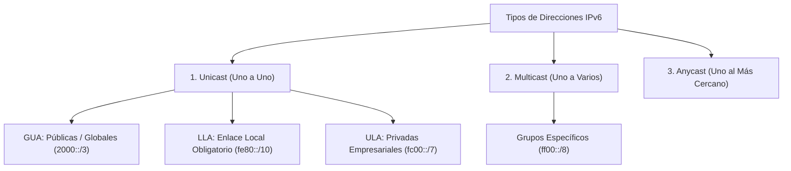

El **Direccionamiento IPv6 (Internet Protocol version 6)** es la tecnología sucesora oficial del histórico protocolo IPv4. Fue diseñado, desarrollado y estandarizado a finales de los años 90 (principalmente en el RFC 2460) como respuesta de ingeniería definitiva ante el inminente agotamiento del limitado espacio de direcciones de IPv4.

Mientras que IPv4 utiliza direcciones de 32 bits limitando al mundo a 4.3 mil millones de equipos interconectados, IPv6 utiliza una estructura lógica masiva de **128 bits**, proporcionando aproximadamente $3.4 \times 10^{38}$ direcciones únicas posibles (suficientes para asignarle una dirección IP a cada grano de arena o átomo en la superficie de la Tierra).

> [!info] Explicación: Formato y Simplificación
> Las direcciones IPv6 se representan visualmente utilizando 8 bloques conformados por 4 caracteres hexadecimales (números del 0 al 9 y letras de la A a la F), separados por el símbolo de dos puntos (`:`).
> Ejemplo base completo: `2001:0db8:0000:1111:0000:0000:0000:0200`
> Como son extremadamente tediosas de leer o configurar para un humano, **existen 2 reglas de simplificación oficiales avaladas por protocolo**:
> 1. **Omitir ceros a la izquierda:** En cualquier bloque individual, puedes eliminar los ceros iniciales (`0db8` -> `db8` / `0200` -> `200`). *Nota: Un bloque de puros ceros se comprime en un único `0`*.
> 2. **Doble dos puntos (::):** Si tienes un bloque completo de ceros `0000`, o una cadena larguísima de bloques consecutivos de puros ceros, puedes colapsarlos todos a la vez utilizando la notación `::`. **Regla estricta:** Solo puedes usar el `::` *una única vez* por cada dirección IPv6, de lo contrario el computador no sabrá cuántos ceros reconstruir en cada lado.
> Aplicando ambas reglas al ejemplo: `2001:db8:0:1111::200`

## Tipos Operativos de Direcciones IPv6

Un cambio radical de diseño de arquitectura respecto a IPv4 es que **en IPv6 no existe bajo ninguna circunstancia el concepto de "Broadcast"** (difusión invasiva para todos los equipos). Para evitar el ruido inútil en las redes, IPv6 confía extensamente y de forma nativa en mecanismos precisos de Multicast. Existen 3 categorías funcionales principales para la interconexión:

### 1. Unicast (Unidifusión)
Comunica un dispositivo emisor con un dispositivo de destino específico de forma directa e inequívoca (Relación 1 a 1). Debido a la abundancia de IPs, un solo puerto Ethernet puede (y a menudo debe) poseer múltiples IPs Unicast de diferente tipo a la vez:
- **Global Unicast Address (GUA):** Son el equivalente a las IPs públicas en el mundo IPv4. Son globalmente únicas, ruteables en toda la matriz mundial del Internet y normalmente asignadas por el proveedor ISP. Actualmente todas comienzan dentro del super-bloque `2000::/3`.
- **Link-Local Address (LLA):** Existen y se autoconfiguran en toda interfaz IPv6 de forma obligatoria. Se usan de forma exclusiva para comunicarse con equipos o descubrir vecinos dentro del mismo cable físico / segmento de switch (la LAN local). Jamás son enrutadas ni retransmitidas por los routers a otras redes. Siempre comienzan por el prefijo **`fe80::/10`**.
- **Unique Local Address (ULA):** Son funcionalmente el equivalente exacto a las direcciones IPs privadas de IPv4 (como la 192.168.x.x o 10.x.x.x). Sirven para rutear datos internamente dentro de una gran organización, pero los routers perimetrales las bloquearán si intentan salir hacia Internet. Comienzan por `fc00::/7` o su derivado `fd00::/8`.

### 2. Multicast (Multidifusión)
Permite a un host enviar un único paquete de datos a una dirección especial, de modo que el router o switch reenvíe ese paquete únicamente al "grupo" de ordenadores que decidieron suscribirse a dicha transmisión (Relación 1 a Varios).
Reemplaza eficientemente todos los casos de uso broadcast de IPv4. Todas las direcciones Multicast son fáciles de identificar porque comienzan estricta y visualmente con el bloque **`ff00::/8`**. 
Ejemplos importantes para protocolos y vecinos:
- `ff02::1` -> Dirigido a "Todos los Nodos y PCs IPv6" del enlace.
- `ff02::2` -> Dirigido a "Todos los Routers IPv6" del enlace.

### 3. Anycast (Redirección al más cercano)
A nivel de red, se puede configurar una misma dirección IP Anycast a múltiples servidores potentes distribuidos alrededor del globo (por ejemplo, servidores DNS base de Google). Cuando un teléfono móvil intenta contactar a esa dirección IP en particular, los routers centrales aplicarán sus protocolos para guiar la petición mágicamente al servidor que esté geográficamente más cercano o que ofrezca el camino más despejado (Relación 1 al Más Cercano). Esto reduce latencias drásticamente.

## Estrategias de Transición e Interconexión (IPv4 a IPv6)

Debido a la magnitud comercial del Internet, era imposible apagar globalmente IPv4 un viernes y encender Internet en IPv6 el lunes. Para solucionar esta transición lenta y dolorosa que lleva décadas, se implementaron tres enfoques arquitectónicos base:

1. **Dual Stack (Pila Dual Nativa):** Es el método primordial, ideal y deseado. Implica que las tarjetas de red de los usuarios, los sistemas operativos, el router Wi-Fi y la infraestructura del proveedor de servicios (ISP) ejecutan las pilas de los protocolos de software de IPv4 y de IPv6 de manera pura y simultánea sin entorpecer el uno al otro.
2. **Tunneling (Tunelización):** Un "camuflaje" de red temporal. El equipo toma un paquete IPv6 nativo de la empresa, lo envuelve y encapsula dentro de la carga útil de un paquete IPv4 tradicional, y lo envía por las redes de Internet heredadas antiguas de IPv4 hasta llegar a otra organización moderna donde es desempacado en formato IPv6.
3. **Translation (Traducción):** Es similar a los mecanismos de NAT tradicionales. Un equipo de router potente y especializado en el borde de la red (mecanismo conocido como NAT64) lee e interpreta un paquete IPv6 entrante, y modifica activamente toda su estructura para reescribirlo al idioma IPv4 (o viceversa) para que los equipos antiguos y modernos logren hablarse. No es un método perfecto y puede ralentizar procesos sensibles a la manipulación de cabeceras.

## Notas relacionadas
- [[Direccionamiento IPv4]]
- [[DHCP IPV6]]
- [[SLAAC (Stateless Address Autoconfiguration)]]
