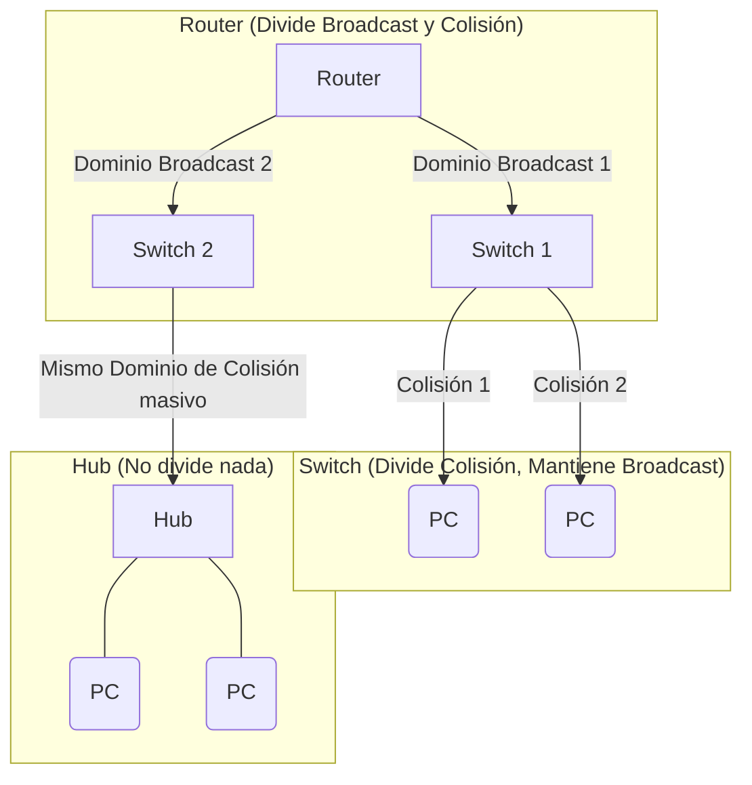

El comportamiento de los dominios en una red varía significativamente dependiendo de la capa del Modelo OSI en la que operan los dispositivos de interconexión:

- **Capa 3 (Router):** Un router separa todos los dominios por hardware. Cada conexión física (puerto) representa un dominio de colisión completamente independiente y también un dominio de broadcast (difusión) independiente. Los routers nunca reenvían tráfico de broadcast por defecto.
- **Capa 2 (Switch):** Un switch separa los dominios de colisión a nivel de puerto; por lo tanto, cada puerto representa un dominio de colisión independiente (lo que significa que las colisiones son virtualmente nulas en switches modernos en modo full-duplex). Sin embargo, todos sus puertos pertenecen a **un mismo y único dominio de broadcast** (a menos que se subdividan lógicamente utilizando VLANs).
- **Capa 1 (Hub):** Un hub (concentrador) es un dispositivo primitivo que simplemente repite señales eléctricas a ciegas. Todas sus conexiones pertenecen a **un único dominio de colisión masivo** y a un único dominio de broadcast.

![[Pasted image 20230911215213.png]]
*(Nota sobre la imagen: Las áreas en amarillo representan los dominios de broadcast y las áreas en negro representan los dominios de colisión).*

> [!info] Explicación: Colisiones vs Broadcast
> **Dominio de Colisión:** Es el segmento físico de la red donde, si dos dispositivos envían datos exactamente al mismo tiempo en un medio compartido, las señales eléctricas chocarán (colisionarán) y los paquetes se corromperán. Los switches y routers dividen inteligentemente los dominios de colisión, aislando el tráfico para que un dispositivo conectado al puerto 1 no choque con el dispositivo del puerto 2.
> **Dominio de Broadcast (Difusión):** Es el segmento lógico de la red donde, si un equipo envía un mensaje de "difusión" (destinado para todos), dicho mensaje llegará inevitablemente a todas las computadoras en esa misma área lógica. Solo un **Router** (físicamente) o una **VLAN** (lógicamente) pueden detener y dividir un dominio de broadcast, ya que los switches por defecto están diseñados para propagar estos mensajes ruidosos a todos sus puertos.

## Notas relacionadas
- [[VLAN]]
- [[STP (Protocolo de árbol de extensión)]]
- [[EthernetChannel]]
