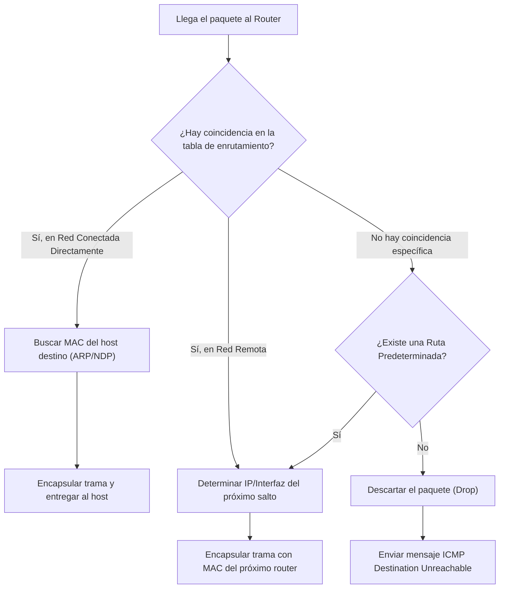

Las **funciones principales** de un router son determinar la mejor ruta para reenviar paquetes basándose en la información de su tabla de enrutamiento (routing table), y conmutar (reenviar) los paquetes hacia su destino final.

La interfaz que utiliza el router para reenviar el paquete (interfaz de salida) puede ser el destino final, o bien, una red conectada a un router vecino (el router del siguiente salto) que se utilizará para alcanzar la red remota de destino.

> [!info] Explicación
> A diferencia de un switch que toma decisiones en la Capa 2 usando direcciones MAC, un router toma decisiones en la Capa 3 observando la dirección IP de destino del paquete. Su misión principal es encontrar el mejor camino en su "mapa" (la tabla de enrutamiento) para acercar el paquete a su destino final de la forma más eficiente.

## Mejor ruta es igual a la coincidencia más larga (Longest Prefix Match)
El mecanismo principal que un router utiliza para elegir la mejor ruta dentro de la tabla de enrutamiento se conoce como "la coincidencia más larga" (Longest Match).

La coincidencia más larga es el proceso que compara la dirección IP de destino del paquete con las entradas (rutas) de la tabla de enrutamiento para encontrar la regla más específica. Para que exista una coincidencia válida, una cantidad mínima de los bits del extremo izquierdo de la dirección IP de destino debe coincidir exactamente con los bits de la ruta establecida en la tabla.

La máscara de subred (o longitud de prefijo) de la ruta indica la cantidad exacta de bits que deben coincidir obligatoriamente. 

> [!info] Explicación
> Piensa en la tabla de enrutamiento como un sistema de código postal. Si un paquete va dirigido a "País A, Ciudad B, Calle C", y tienes tres rutas en la tabla:
> 1. Enviar a País A (ruta general)
> 2. Enviar a País A, Ciudad B (ruta más específica)
> 3. Enviar a País A, Ciudad B, Calle C (ruta muy específica)
> 
> El router siempre preferirá la instrucción más detallada y precisa posible, lo cual se traduce en la coincidencia más larga de bits.

### Ejemplo de coincidencia más larga de direcciones IPv4
![[Pasted image 20230702184619.png]]
De las tres rutas, `172.16.0.0/26` tiene la longitud de prefijo más grande (/26 = 26 bits) y si los 26 bits de la dirección de destino coinciden, se elige esta entrada para reenviar el paquete. Esta es la coincidencia más larga.

### Ejemplo de coincidencia más larga de direcciones IPv6
![[Pasted image 20230702184650.png]]
En IPv6, la lógica es idéntica. Las dos primeras entradas de ruta pueden coincidir con la dirección de destino. La primera entrada tiene un prefijo de /40, y la segunda de /48. Dado que la de /48 tiene más bits coincidentes, se convierte en la coincidencia más larga y será la elegida. La tercera ruta (/64) podría ser más larga en longitud de prefijo, pero falla porque sus 64 bits no coinciden exactamente con la IP de destino del paquete.

## Creación de la tabla de enrutamiento
![[Pasted image 20230702193001.png]]
La tabla de enrutamiento se alimenta de varias fuentes diferentes:

### **Redes conectadas directamente**
Son las redes que están conectadas físicamente a las interfaces activas del router. Una red conectada directamente se agrega a la tabla automáticamente cuando se configura una interfaz con una dirección IP y máscara, y esta interfaz está activa (en estado up/up).

### **Redes remotas**
Son redes a las que el router no está conectado directamente. Se pueden aprender de dos maneras principales:
- **Rutas estáticas**: Son agregadas a la tabla de enrutamiento cuando un administrador de red configura manualmente la ruta.
- **Protocolos de enrutamiento dinámico**: Son agregadas a la tabla cuando los protocolos aprenden automáticamente sobre la red remota a través de intercambios de información con otros routers. Ejemplos de estos protocolos incluyen RIPv2, OSPF y EIGRP.

### **Ruta predeterminada (Default Route)**
Una ruta predeterminada especifica un router de "siguiente salto" que se utilizará como salvavidas cuando la tabla de enrutamiento no contenga ninguna otra ruta específica que coincida con la dirección IP de destino.
A menudo se le llama "puerta de enlace de último recurso" (Gateway of Last Resort).
- En IPv4 se escribe como `0.0.0.0/0`. 
- En IPv6 se escribe como `::/0`. 
La longitud de prefijo `/0` significa que se requiere que coincidan "0 bits". En otras palabras, cualquier destino imaginable coincidirá con ella por defecto si no hay una regla más específica.

## Proceso de decisión de reenvío de paquetes
![[Pasted image 20230702193719.png]]



Una vez que el router encuentra una coincidencia en la tabla, pueden ocurrir tres cosas:

### **1. Reenviar el paquete a un dispositivo en una red conectada directamente**
La IP de destino pertenece a un host en una red conectada físicamente al router. Para entregar el paquete por el medio local (como Ethernet), el router necesita encontrar la dirección MAC de destino correspondiente a la IP.
- **Para un paquete IPv4:** El router verifica su tabla ARP. Si no hay coincidencia, envía una solicitud ARP y espera la respuesta con la dirección MAC.
- **Para un paquete IPv6:** El router verifica su caché de vecinos (Neighbor Cache). Si no hay coincidencia, utiliza el protocolo Neighbor Discovery enviando un mensaje ICMPv6 Neighbor Solicitation (NS) para obtener la MAC.

### **2. Reenviar el paquete a un router de siguiente salto**
La IP de destino está en una red remota. El paquete debe ser reenviado a otro enrutador. La tabla de enrutamiento indicará la interfaz de salida y/o la dirección IP del router del próximo salto.

### **3. Descartar el paquete (No hay ruta)**
Si la IP no coincide con ningún prefijo en la tabla y el router no tiene configurada una ruta predeterminada, el router simplemente descartará (dropeará) el paquete y enviará un mensaje de error ICMP de "Red inalcanzable" (Destination Unreachable) al emisor original.

## Reenvío de paquetes (Encapsulamiento)
La función principal de conmutación de un router consiste en desencapsular las tramas recibidas y encapsular los paquetes en una nueva trama adecuada para el enlace de datos de salida.

> [!info] Explicación
> **Regla de oro del enrutamiento:** Las direcciones IP (origen y destino) casi NUNCA cambian a lo largo de todo el viaje de extremo a extremo de un paquete. Sin embargo, las direcciones MAC (origen y destino) cambian en CADA salto de un router a otro, ya que las MAC solo sirven para moverse en el enlace local de la Capa 2.

### **PC1 envía paquete a PC2**
PC1 desea enviar un paquete a PC2. Ya que PC2 se encuentra en otra subred, PC1 envía la trama dirigida a la dirección MAC de su puerta de enlace predeterminada (el Router R1).
![[Pasted image 20230702205733.png]]

### **R1 reenvía el paquete a R2**
R1 recibe la trama, elimina el encabezado Ethernet (Capa 2) y examina la dirección IP de destino. La tabla de enrutamiento de R1 indica que debe enviar el paquete a R2. Como el enlace es Ethernet, R1 resuelve la IP de R2 mediante ARP, y construye una nueva trama colocando como MAC de origen la de R1 y como MAC de destino la de R2.
![[Pasted image 20230702205917.png]]

### **R2 reenvía el paquete a R3**
R2 recibe el paquete y necesita enviarlo a R3. Si la interfaz de salida entre R2 y R3 fuera un enlace serial heredado (como PPP o HDLC), estos enlaces no usan direcciones MAC. En este caso, R2 encapsula el paquete en el formato serial correspondiente y lo envía a la dirección de difusión del enlace punto a punto.
![[Pasted image 20230702210052.png]]

### **R3 reenvía el paquete a PC2**
R3 recibe el paquete. Su tabla de enrutamiento indica que la IP de destino pertenece a una de sus redes locales que está directamente conectada. R3 utiliza ARP para buscar la MAC de la PC2, arma la trama final (con MAC de origen: R3 y MAC de destino: PC2) y entrega el paquete.
![[Pasted image 20230702210159.png]]

## Mecanismos de reenvío interno en Cisco

### **Conmutación de procesos (Process Switching)**
Es el mecanismo más antiguo. Cuando llega un paquete, este se envía a la CPU del router. La CPU realiza una búsqueda completa en la tabla de enrutamiento, descubre por qué interfaz debe salir y construye la nueva trama. Es un proceso muy lento porque la CPU se involucra en **cada paquete individualmente**.
![[Pasted image 20230702210328.png]]

### **Conmutación rápida (Fast Switching)**
El primer paquete de un nuevo flujo de datos se envía a la CPU (Process Switching), pero el resultado de esa búsqueda se almacena en una memoria caché de hardware. Todos los paquetes siguientes del mismo flujo utilizan esta caché rápida y son conmutados sin molestar a la CPU principal.
![[Pasted image 20230702210534.png]]

### **CEF (Cisco Express Forwarding)**
Es el mecanismo de reenvío predeterminado moderno. CEF no espera a que llegue un paquete para empezar a trabajar. Analiza toda la tabla de enrutamiento y la tabla ARP por adelantado y construye bases de datos de hardware altamente optimizadas: la tabla FIB (Forwarding Information Base) y la Tabla de Adyacencias. Gracias a esto, todos los paquetes se conmutan en el hardware casi a la velocidad del cable, sin intervención de la CPU.
![[Pasted image 20230702210709.png]]

> [!info] Analogía Explicativa
> - **Process Switching**: Haces cálculos matemáticos en un papel para resolver un problema complejo *cada vez* que te lo preguntan, incluso si es exactamente la misma pregunta cien veces seguidas.
> - **Fast Switching**: Haces los cálculos la primera vez y anotas el resultado en un post-it. Cuando te vuelven a hacer la misma pregunta, simplemente lees el post-it.
> - **CEF**: Antes de que nadie te pregunte nada, ya tienes preparado un libro de Excel (FIB) con las respuestas precalculadas para todas las preguntas posibles. Esto te hace ultra rápido.

## Estructura de la Tabla de Routing
Una tabla de enrutamiento contiene una lista detallada de rutas a redes conocidas, representadas mediante prefijos y máscaras. 

### Comandos
```cisco
ip route <ip de destino> <máscara> <ip siguiente salto o interfaz de salida>
```
Este comando define manualmente (ruta estática) el camino hacia un destino específico.

```cisco
show ip route
```
Este comando muestra el contenido completo de la tabla de enrutamiento del dispositivo.

### Códigos de la tabla:
- **L** (Local) - Identifica la dirección IP exacta que está asignada a la interfaz del propio router (/32).
- **C** (Connected) - Identifica una red entera que está conectada directamente.
- **S** (Static) - Identifica una ruta estática que fue configurada manualmente.
- **O** (OSPF) - Identifica una red que fue aprendida dinámicamente mediante el protocolo OSPF.
- **\*** (Candidata) - Se acompaña de otra letra para indicar que es la ruta predeterminada (por ejemplo, `S*`).

Para que aparezca una letra **C** en la tabla, la interfaz debe tener una dirección IP asignada, estar encendida (`no shutdown`) y tener una conexión física activa.
![[Pasted image 20230703000201.png]]

## Distancia Administrativa (AD)
La Distancia Administrativa representa la "confiabilidad" de la fuente de la ruta. Es un mecanismo de desempate interno. Si un router aprende sobre la *misma red exacta* a través de dos métodos diferentes (por ejemplo, mediante OSPF y mediante EIGRP), siempre preferirá la fuente con la AD más baja.

- Redes conectadas directamente: AD = 0
- Rutas estáticas: AD = 1
- EIGRP interno: AD = 90
- OSPF: AD = 110

Como EIGRP (90) tiene una AD menor que OSPF (110), el router instalará la ruta de EIGRP en la tabla de enrutamiento e ignorará la aprendida por OSPF.
![[Pasted image 20230702211904.png]]

## Rutas Estáticas
Se configuran de forma manual por el administrador de la red. Definen un camino fijo y no se actualizan automáticamente si la topología de la red cambia. 
- **Ventajas:** Proporcionan mejor seguridad (ya que no envían anuncios a la red) y tienen gran eficiencia de recursos (no gastan ciclos de CPU, memoria ni ancho de banda adicional).
- **Desventajas:** Son imposibles de escalar en redes grandes y requieren mantenimiento manual constante si falla algún enlace.

**Usos principales:**
- En redes pequeñas que no van a tener un gran crecimiento.
- Para establecer una ruta predeterminada hacia el proveedor de servicios (Internet).
- Para enrutar tráfico hacia "redes de conexión única" (Stub networks): redes que solo tienen una única salida al mundo exterior.

## Protocolos de Enrutamiento Dinámico
Son programas (como OSPF, EIGRP o BGP) que permiten a los routers compartir información sobre el estado de sus enlaces de manera autónoma.
- **Ventajas:** Permiten el descubrimiento automático de redes remotas y tienen la capacidad de cambiar de ruta automáticamente si un enlace se cae o falla.
- **Desventajas:** Consumen parte del ancho de banda, RAM y recursos del procesador del router.

> [!info] Explicación
> Al leer una entrada en la tabla: `O 172.16.2.0/24 [110/50] via 192.168.1.2`
> Los números entre corchetes son cruciales.
> - **110 (Distancia Administrativa)**: Define qué protocolo es mejor y más confiable.
> - **50 (Métrica)**: Es la calificación del costo del camino. Si OSPF conoce dos caminos hacia la red 172.16.2.0, elegirá siempre el que tenga la métrica más baja.

[[VLAN]]

## Notas relacionadas
- [[Inter-VLAN]]
- [[OSPFv2(Open Shortest Path First)]]
- [[Vector distancia]]
- [[estado de enlace]]
- [[NAT y PAT]]
- [[FHRP (Protocolos de redundancia de primer salto)]]
