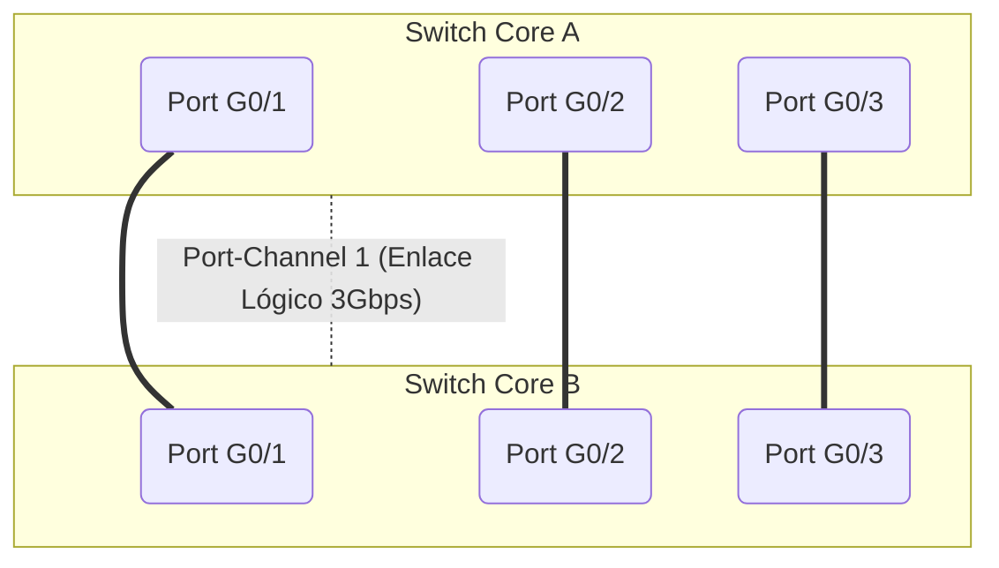

EtherChannel es una tecnología fundamental de agregación de enlaces desarrollada originalmente por Cisco. Permite combinar múltiples enlaces físicos FastEthernet, GigabitEthernet o 10-GigabitEthernet entre dos dispositivos de red para agruparlos en una única interfaz lógica (conocida como Port-Channel).

Esta tecnología proporciona tres ventajas masivas: **mayor ancho de banda, redundancia y balanceo de carga automático.** 
Para que EtherChannel funcione, todos los puertos físicos involucrados deben ser idénticos (misma velocidad y modo dúplex). Además, si operan como enlaces troncales, deben tener permitidas las mismas VLANs y usar el mismo tipo de encapsulamiento.

Proporciona tolerancia a fallos inmediata: si uno o más enlaces físicos individuales dentro del grupo se cortan o fallan, el tráfico se redistribuye dinámicamente y de forma transparente a través de los enlaces sanos restantes, evitando interrupciones en la red y evadiendo los largos tiempos de recálculo del protocolo STP.

> [!info] Explicación: ¿Qué es EtherChannel?
> **Concepto Clave:** Imagina que tienes una carretera de un solo carril conectando dos ciudades muy transitadas. Si hay mucho tráfico, se congestiona rápidamente. EtherChannel es el equivalente a construir 3 carriles adicionales y tratarlos a todos lógicamente como una sola "supercarretera" masiva. 
> **Beneficios principales:** 
> 1. **Ancho de banda agregado:** Si conectas y agrupas cuatro cables de 1 Gbps, el switch los tratará lógicamente como un único enlace gigante de 4 Gbps.
> 2. **Redundancia impecable:** Si alguien tropieza y desconecta uno de los cuatro cables físicos, el tráfico simplemente fluye por los tres restantes sin que la red se caiga y sin que los usuarios noten el fallo.

**Reglas de capacidad:**
- Se puede agrupar un máximo de 8 enlaces físicos activos dentro de un único Port-Channel.
- Normalmente, los switches soportan la creación de hasta 6 port-channels distintos simultáneamente.

El proceso de **balanceo de carga** en EtherChannel distribuye equitativamente las tramas de red entre los distintos enlaces físicos utilizando un algoritmo de hash (comúnmente basado en direcciones MAC de origen/destino o IPs). Esto asegura un uso eficiente de todos los cables en lugar de saturar uno solo.



## Protocolos de Negociación: PAgP y LACP
La formación de un EtherChannel se puede configurar de forma forzada y estática (modo ON) o utilizando protocolos de negociación dinámica, lo cual es la mejor práctica para prevenir errores humanos o bucles accidentales.

### **PAgP (Port Aggregation Protocol)**
PAgP es un protocolo **propietario de Cisco** que permite la creación y administración dinámica de los grupos de enlaces. Al utilizar PAgP, los dispositivos Cisco intercambian mensajes de control para negociar y verificar que los puertos sean compatibles antes de fusionarlos lógicamente.

> [!info] Explicación: Modos de PAgP
> **Origen:** Solo funciona si ambos extremos son equipos Cisco.
> **Modos de Operación:** 
> - **Desirable (Deseable):** El switch es proactivo e inicia la negociación enviando mensajes PAgP constantemente.
> - **Auto:** El switch es pasivo; espera pacientemente recibir un mensaje PAgP del vecino, pero no inicia la charla.
> **Regla de oro:** Para formar el canal, al menos un lado debe estar en modo *Desirable*. Si ambos se configuran en *Auto*, ninguno tomará la iniciativa y el canal nunca se formará. No se puede negociar PAgP si el otro extremo está en modo fijo (ON).

### **LACP (Link Aggregation Control Protocol)**
LACP es el **estándar abierto de la industria (IEEE 802.3ad)**. Funciona exactamente igual que PAgP en su propósito, permitiendo que los switches negocien agrupaciones mediante paquetes LACP. 

Debido a que es un protocolo estandarizado, LACP funciona a la perfección entre dispositivos de distintos fabricantes (por ejemplo, conectando un switch Cisco con un servidor HP, o un switch Juniper con un router Cisco). **Es ampliamente la opción más recomendada y utilizada a nivel mundial.**

> [!info] Explicación: Modos de LACP
> **Origen:** Estándar abierto IEEE 802.3ad.
> **Modos de Operación:**
> - **Active (Activo):** Equivalente a *Desirable*. Inicia activamente la negociación enviando paquetes LACP.
> - **Passive (Pasivo):** Equivalente a *Auto*. Escucha y responde, pero no inicia la negociación.
> Al igual que PAgP, requiere que al menos un lado esté configurado como *Active*.

## Comandos de Verificación y Configuración

**Muestra un resumen en una sola línea del estado de todos los port-channels configurados:**
```cisco
show etherchannel summary
```
*(Es el comando más útil para troubleshooting rápido. Muestra si los puertos están empaquetados exitosamente con la letra 'P', o independientes/suspendidos con 'I'/'S').*

**Creación y asignación física del grupo (En los puertos físicos):**
```cisco
interface range GigabitEthernet 0/1 - 2
// Crea el canal. Modos LACP: active/passive. Modos PAgP: desirable/auto. Modo fijo: on
channel-group 1 mode active 
```

**Configuración lógica (Sobre la interfaz Port-Channel recién creada):**
```cisco
interface port-channel 1
switchport mode trunk
switchport trunk allowed vlan 10,20,30
```
*(Nota: Una vez agrupados los puertos, todas las configuraciones de VLANs o STP deben realizarse sobre la interfaz lógica `port-channel`, nunca directamente sobre los puertos físicos individuales).*

## Problemas Comunes (Troubleshooting)

La principal causa de falla al formar un EtherChannel son las inconsistencias en la configuración de los puertos físicos involucrados.

> [!info] Explicación: Reglas de Configuración Críticas
> Para que EtherChannel funcione y la negociación sea exitosa, **todos los puertos físicos involucrados deben ser matemáticamente idénticos** en ambos switches:
> - Misma velocidad (Speed) y modo dúplex (Full Duplex).
> - Mismo modo administrativo de Switchport (todos deben ser obligatoriamente de Acceso, o todos Troncales).
> - Si son troncales, deben tener la misma VLAN Nativa y la misma lista exacta de VLANs permitidas.
> 
> Si configuras, por ejemplo, el G0/1 a 100Mbps y el G0/2 a 1000Mbps e intentas unirlos, el EtherChannel lo detectará, detendrá el proceso y pondrá la interfaz en estado de error (err-disable) para proteger la red.

*Relacionado con:* 
- [[STP (Protocolo de árbol de extensión)]] 
- [[VLAN]]
