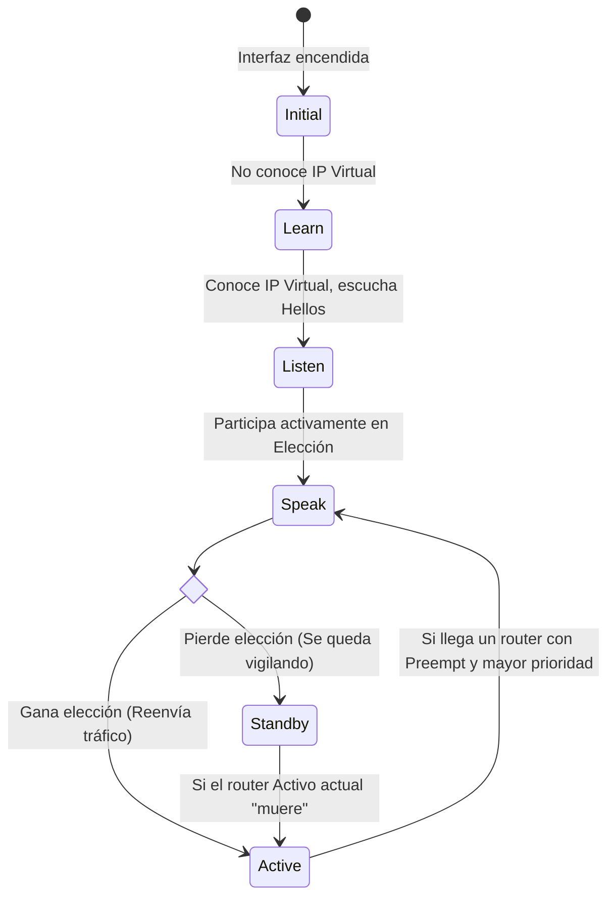

Cisco proporciona el protocolo robusto **HSRP (Hot Standby Router Protocol)** y su variante para IPv6 como mecanismo definitivo para evitar la catastrófica pérdida de acceso externo si falla el router que actúa como puerta de enlace predeterminada en una oficina.

Es un protocolo FHRP (Protocolo de Redundancia de Primer Salto) exclusivo y propietario de Cisco, diseñado a nivel de ingeniería para permitir la conmutación por error (failover) inmediata y completamente transparente para los usuarios finales.

HSRP se utiliza en un conjunto de routers físicos interconectados para elegir lógicamente un **dispositivo activo** y un **dispositivo de reserva (standby)**. 
Para compartir identidades frente a los clientes, HSRP genera una MAC asociada a la IP virtual elegida:
- En la Versión 1, la MAC virtual siempre tiene el formato: `0000.0c07.acXX` (donde XX es el número de grupo HSRP en formato hexadecimal).
- En la Versión 2, la MAC virtual es: `0000.0c9f.fXXX` (esta versión moderna permite configurar temporizadores ultrarrápidos medidos en milisegundos).

**Dentro del grupo configurado HSRP:** 
- <span style="background:#d3f8b6"> El dispositivo Activo </span> es aquel que asume en exclusiva la MAC virtual, la IP virtual, y se encarga de recibir, procesar y enrutar el 100% de los paquetes del segmento de red.
- <span style="background:#d2cbff">El dispositivo de Reserva (Standby) </span> es el vigilante. Su única tarea es monitorear incesantemente el estado de salud del router Activo. Si no recibe los mensajes de vida, asume el control de la IP y MAC virtual en cuestión de segundos.

> [!info] Explicación: ¿Qué es una IP Virtual?
> Para que HSRP funcione y engañe a los PCs, los dos routers comparten y configuran internamente una misma **Dirección IP y MAC Virtual** (ej. 192.168.1.1). Las computadoras de los oficinistas se configuran (o el DHCP se los dicta) para usar esta IP Virtual como su puerta de enlace. 
> Cuando las PCs envían tráfico a la 192.168.1.1, solo el Router Activo "responde" por ella. Si este router se quema, el Router de Reserva se adjudica esa misma IP Virtual. Como la IP de salida no cambió, las PCs ni siquiera notan que ahora están saliendo por un aparato diferente.

## Prioridad y el poder de la Apropiación (Preempt)
El rol de quién será el rey (Activo) y quién será el suplente (Reserva) se debate y determina mediante un rígido proceso de elección matemática.
Por defecto, si no se configura nada más, el router con la dirección IPv4 configurada en su interfaz que sea numéricamente más alta gana las elecciones.

***Prioridad HSRP (El Factor Decisivo)***
Para que el administrador controle realmente quién gana, se utiliza el valor de **Prioridad HSRP**. El router con la prioridad HSRP más alta siempre será declarado ganador y convertido en el Activo.
De manera predeterminada de fábrica, todos los routers Cisco tienen un valor de prioridad de **100**. Para alterar esto y forzar a que el router principal gane, se utiliza el siguiente comando de interfaz (el rango válido de configuración es de 0 a 255):
```cisco
standby [grupo] priority [valor_mayor_a_100]
```

***Apropiación (Preempt)***
Por las reglas básicas de estabilidad de HSRP, una vez que un router se convierte legítimamente en el router Activo, se aferrará al trono para siempre. Incluso si posteriormente un super-router con una prioridad mucho más alta se conecta a la red, el router Activo actual **no le cederá el puesto**.
Para corregir esto y forzar a que un router superior reclame su lugar cuando vuelve a la red (por ejemplo, después de haberse reiniciado), debe estar habilitada la poderosa función de "apropiación" (preempt):
```cisco
standby [grupo] preempt
```

La función *preempt* permite a un router irrumpir en la red y desatar de inmediato una nueva elección HSRP. Sin embargo, para dar un "golpe de estado", el router intruso debe tener una prioridad estrictamente mayor al router que está actualmente Activo.

![[Pasted image 20230822161220.png]]
**Ejemplo del proceso:** Se configuró el router principal R1 con prioridad 150 y función `preempt`. El router R2 se dejó por defecto (100). R1 es el Activo.
De pronto, un apagón apaga R1. R2, al dejar de recibir los paquetes Hello, se auto-declara el nuevo Router Activo. 
Quince minutos después, R1 se reinicia y vuelve a la vida. Al tener `preempt` configurado, R1 observa que R2 es el Activo y dice: "Mi prioridad es 150, la tuya es 100. Quítate". R1 recupera su trono de forma inmediata y R2 vuelve pacíficamente a la Reserva.

## Estados y Temporizadores de HSRP
Cuando se configura un puerto con los parámetros HSRP y se enciende, el dispositivo no salta a enrutar inmediatamente, sino que atraviesa una serie de estados lógicos seguros, dictados por el intercambio de mensajes de saludo (Hello packets).



Por defecto, los routers envían paquetes Hello a la dirección reservada de multidifusión cada **3 segundos** (v1: `224.0.0.2` / v2: `224.0.0.102`).
El temporizador crítico de espera (Hold Timer) es de **10 segundos**. Esto significa que si el Router de Reserva no escucha ningún Hello del Activo por 10 segundos continuos, lo declara muerto y toma el control.

## Comandos Esenciales de Configuración

**En el Router 1 (Principal y Deseado)**
```cisco
interface GigabitEthernet 0/1
standby 10 ip 192.168.1.1        // Define el grupo 10 y la IP Virtual Compartida
standby 10 priority 150          // Le aseguramos la victoria
standby 10 preempt               // Le permitimos recuperar el puesto si se reinicia
```

**En el Router 2 (De Reserva)**
```cisco
interface GigabitEthernet 0/1
standby 10 ip 192.168.1.1        // Debe coincidir el grupo y la IP
standby 10 preempt               // Buena práctica activarlo también aquí
```
*(Nota: R2 usará la prioridad por defecto de 100, garantizando que quede en Reserva)*

Para monitorear y verificar qué router es el Activo y cuál es el Standby:
```cisco
show standby brief
```

## Notas relacionadas
- [[FHRP (Protocolos de redundancia de primer salto)]]
- [[Enrutamiento]]
- [[VLAN]]
