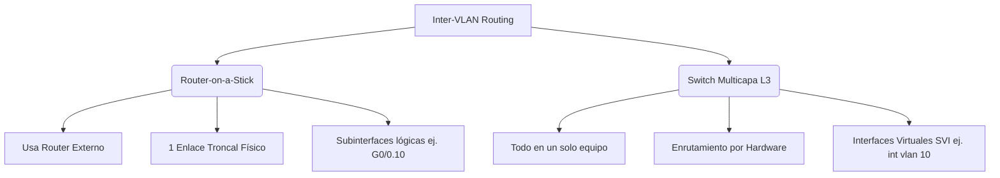

El Inter-VLAN routing (enrutamiento entre VLANs) es el proceso crítico de reenviar tráfico de red desde una VLAN hacia otra VLAN distinta.

> [!info] Explicación: Inter-VLAN Routing
> **Concepto:** Por defecto, los dispositivos ubicados en diferentes VLANs no pueden comunicarse entre sí bajo ninguna circunstancia, incluso si están conectados exactamente al mismo switch físico. Esto ocurre porque pertenecen a dominios de difusión (subredes) totalmente separados. El **Inter-VLAN Routing** es la solución tecnológica que permite cruzar de una VLAN a otra. 
> **¿Por qué es importante?** Permite que los distintos departamentos de una empresa mantengan el aislamiento y seguridad en la Capa 2 (Switching), mientras que un dispositivo de Capa 3 (Router o Switch Multicapa) inspecciona, enruta y permite la comunicación necesaria entre ellos a nivel de direcciones IP.

A lo largo de la historia de las redes, se han desarrollado tres opciones para el Inter-VLAN routing:
- **Inter-VLAN Routing heredado:** Una solución antigua y poco escalable (un cable físico por cada VLAN).
- **Router-on-a-stick:** Una solución aceptable, económica y muy común para redes pequeñas y medianas.
- **Switch de capa 3 con interfaces virtuales (SVIs):** La solución moderna, rápida y altamente escalable, estándar en organizaciones medianas y grandes.



## Inter-VLAN Routing heredado
Este método primitivo se basaba en el uso de un router tradicional con múltiples interfaces físicas de red. Cada interfaz del router se conectaba con un cable individual a un puerto de acceso del switch, asignado a una VLAN diferente.
Aunque funciona perfectamente, tiene limitaciones de escalabilidad insalvables: los routers tienen una cantidad muy limitada de interfaces físicas, y requerir un puerto físico dedicado para cada nueva VLAN que se crea agota rápidamente los puertos y aumenta los costos operativos.

## Router-on-a-Stick Inter-VLAN Routing
Esta solución supera los problemas del diseño heredado al requerir **una única interfaz Ethernet física** en el router para enrutar el tráfico entre múltiples VLAN.

Para lograr esto, la única interfaz física del router se divide en múltiples **subinterfaces** lógicas basadas en software. Cada subinterfaz se asocia a una VLAN específica mediante el etiquetado 802.1Q y se configura con su propia dirección IP (actuando como el Default Gateway de esa VLAN). En el lado del switch, el puerto conectado al router debe configurarse estrictamente como un enlace **Troncal (Trunk)**.

> [!info] Explicación: Router-on-a-Stick
> **¿Cómo funciona?** En lugar de tender 5 cables físicos distintos para 5 VLANs hacia el router, se utiliza un único cable de alta capacidad configurado como "Troncal". En el router, esta única interfaz física (ej. `GigabitEthernet0/0`) se divide lógicamente en varios "carriles virtuales" o subinterfaces (ej. `GigabitEthernet0/0.10` para VLAN 10, `0/0.20` para VLAN 20). 
> **Ejemplo:** Es como tener una autopista principal indivisa, donde mediante software se pintan carriles virtuales exclusivos para que cada departamento pueda transitar sin mezclarse, hasta llegar al "peaje" (router) donde se enrutan a su destino final.

## Inter-VLAN Routing en un Switch de Capa 3
Las redes empresariales modernas a gran escala utilizan switches multicapa (Capa 3) y sus Interfaces Virtuales de Switch (SVI).
Una SVI es una interfaz virtual configurada internamente en el software del switch multicapa. Se crea una SVI (con su respectiva dirección IP) por cada VLAN existente, y esta actúa directamente como la puerta de enlace predeterminada para los equipos en esa VLAN.

**Ventajas masivas del Switch Capa 3:**
- Es **extremadamente veloz** en comparación con router-on-a-stick, porque el switching de Capa 2 y el routing de Capa 3 se realizan directamente en los chips de hardware especializados (ASICs) del switch.
- El tráfico no necesita salir del switch a través de un cuello de botella de un solo cable hacia un router externo, eliminando latencias.
- Permite mayor ancho de banda utilizando EtherChannels de Capa 2 o Capa 3 entre los propios switches.

La única desventaja práctica de esta solución es que los switches de Capa 3 son significativamente más costosos que los switches de Capa 2 tradicionales.

> [!info] Explicación: Switch de Capa 3 y SVI
> **Switch Multicapa (L3):** Es un equipo avanzado que además de conmutar tramas MAC como un switch normal (Capa 2), tiene un motor de enrutamiento capaz de procesar paquetes IP (Capa 3). Básicamente es un router y un switch fusionados en la misma caja metálica.
> **SVI (Switch Virtual Interface):** Cuando creas la `interface vlan 10` y le pones una IP, acabas de crear una SVI. Al ocurrir todo dentro de la misma placa de hardware, cuando un paquete necesita ir de la VLAN 10 a la 20, el switch lo enruta instantáneamente a velocidad de cable.

## Configuración: Escenario Router-on-a-Stick

### En el Switch (S1)
**Paso 1**. Crear las VLANs.
**Paso 2**. Asignar los puertos de los usuarios en modo de **acceso** a sus respectivas VLANs.
**Paso 3**. Configurar el puerto que conecta al router en modo **troncal** (`switchport mode trunk`).

### En el Router (R1)
Para crear subinterfaces, se ingresa a la interfaz lógica (agregando un punto y el número deseado, generalmente el mismo ID de la VLAN para mantener un orden lógico) y se configuran dos comandos obligatorios:
1. `encapsulation dot1Q [vlan_id]` - Le indica al router a qué etiqueta de VLAN debe responder esta subinterfaz.
2. `ip address [ip] [máscara]` - Asigna la dirección IP que será el Default Gateway de esa subred.

```cisco
// Ejemplo de configuración de Subinterfaz
R1(config)# interface GigabitEthernet0/0.10
R1(config-subif)# encapsulation dot1Q 10
R1(config-subif)# ip address 192.168.10.1 255.255.255.0
R1(config-subif)# exit
```
Finalmente, es crítico ingresar a la interfaz física principal (`interface g0/0`) y encenderla con `no shutdown`. Al encender la física, todas sus subinterfaces lógicas se encenderán simultáneamente.

## Configuración: Switch de Capa 3
Para proporcionar enrutamiento a velocidad de hardware, el switch de capa 3 debe tener habilitada la función de ruteo global y poseer una SVI por cada VLAN.

**Paso 1**. Crear las VLAN.
```cisco
D1(config)# vlan 10
D1(config-vlan)# name LAN10
D1(config-vlan)# vlan 20
D1(config-vlan)# name LAN20
```

**Paso 2**. Crear las interfaces virtuales (SVIs) correspondientes.
```cisco
D1(config)# interface vlan 10 
D1(config-if)# ip address 192.168.10.1 255.255.255.0
D1(config-if)# no shut

D1(config)# interface vlan 20
D1(config-if)# ip address 192.168.20.1 255.255.255.0
D1(config-if)# no shut
```

**Paso 3**. Asignar puertos de acceso a los equipos finales.
```cisco
D1(config)# interface GigabitEthernet1/0/6 
D1(config-if)# switchport mode access
D1(config-if)# switchport access vlan 10 
```

**Paso 4**. **CRÍTICO:** Habilitar el enrutamiento IP.
Por defecto, los switches de capa 3 operan únicamente como capa 2. Es obligatorio ejecutar el comando global `ip routing` para activar el motor de enrutamiento y permitir el tráfico inter-VLAN.
```cisco
D1(config)# ip routing 
```

## Problemas comunes de Inter-VLAN routing

Al solucionar problemas de conectividad inter-VLAN, el orden metódico es clave:
1. **Capa Física:** Comprobar si el cable está conectado al puerto correcto y hay luz en el enlace.
2. **VLAN faltantes:** Verificar que la VLAN haya sido efectivamente creada en la base de datos del switch (`show vlan brief`). Si se asigna un puerto a una VLAN inexistente, el tráfico no fluirá.
3. **Enlaces Troncales mal configurados:** Validar que el puerto entre el switch y el router esté operando como Trunk y que esté permitiendo el paso de las VLANs correspondientes (`show interfaces trunk`).
4. **Puertos de acceso erróneos:** Confirmar que la PC del usuario esté conectada a un puerto asignado a la VLAN correcta.
5. **Configuración del Router/Subinterfaces:** En diseños Router-on-a-Stick, los errores más comunes incluyen haber colocado el comando `encapsulation dot1Q` con un número de VLAN equivocado, o que las PCs tengan configurado un Default Gateway incorrecto. El comando `show ip interface brief` es ideal para validar las subinterfaces.

*Relacionado con:*  
- [[Enrutamiento]]
- [[VLAN]]
