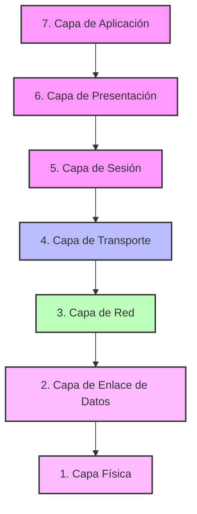
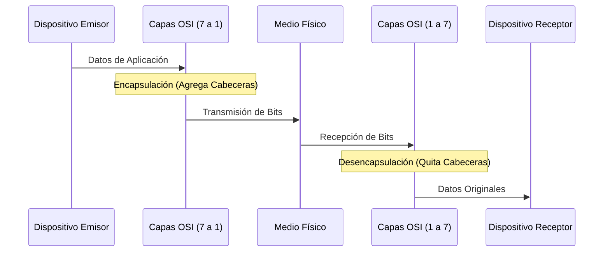

El **Modelo OSI (Open Systems Interconnection)** es un marco de referencia conceptual creado por la ISO en 1984. Define un estándar que rige la forma en que los diferentes componentes de software y hardware involucrados en una comunicación de red deben dividir su labor y cómo deben interactuar entre sí. 

Consta de 7 capas distintas, donde cada capa tiene responsabilidades específicas y se comunica únicamente con la capa inmediatamente superior o inferior.

> [!info] Explicación: ¿Por qué existe el Modelo OSI?
> Antes de este modelo, cada fabricante (como IBM, DEC, Apple) creaba sus propios estándares de red cerrados, lo que significaba que una computadora de IBM no podía comunicarse con una de Apple. El Modelo OSI se creó como un "lenguaje universal" y modular. Al separar la red en "capas", si alguien inventa un nuevo tipo de cable (Capa 1), no necesita reinventar los navegadores web (Capa 7), porque las capas intermedias mantienen la compatibilidad.

## Las 7 Capas del Modelo OSI

### 7. Capa de Aplicación
Es la capa más cercana al usuario final. Proporciona la interfaz entre las aplicaciones de red (como el navegador web o el cliente de correo) y la red misma.
- **Función:** Proporcionar servicios de red a las aplicaciones de software.
- **Protocolos comunes:** HTTP, HTTPS, FTP, SMTP, DNS, DHCP.
- **PDU (Unidad de Datos del Protocolo):** Datos.

### 6. Capa de Presentación
Se encarga de traducir, cifrar y comprimir los datos. Asegura que la información enviada por la capa de aplicación de un sistema pueda ser leída e interpretada por la capa de aplicación de otro.
- **Función:** Formato, cifrado y compresión de los datos.
- **Formatos comunes:** JPEG, ASCII, TLS/SSL.
- **PDU:** Datos.

### 5. Capa de Sesión
Establece, administra y finaliza las conexiones (sesiones) entre las aplicaciones locales y remotas.
- **Función:** Control de diálogos y sincronización.
- **Protocolos comunes:** NetBIOS, RPC.
- **PDU:** Datos.

### 4. Capa de Transporte
Se encarga de la entrega de los mensajes de extremo a extremo (host a host) a través de la red. Divide los datos en segmentos y los reensambla en el destino.
- **Función:** Confiabilidad, control de flujo y multiplexación mediante puertos.
- **Protocolos principales:** [[Protocolo TCP vs UDP|TCP y UDP]].
- **PDU:** Segmento (en TCP) o Datagrama (en UDP).

### 3. Capa de Red
Proporciona la conectividad y la selección de la mejor ruta (enrutamiento) entre dos sistemas host que pueden estar ubicados en redes geográficamente distintas.
- **Función:** Enrutamiento (routing) y direccionamiento lógico.
- **Dispositivo clave:** Router.
- **Protocolos:** IPv4, IPv6, ICMP, OSPF, BGP.
- **PDU:** Paquete.

### 2. Capa de Enlace de Datos
Proporciona un tránsito de datos confiable a través de un enlace físico directo. Organiza los bits en tramas y detecta o corrige errores a nivel de la capa física. Se divide en dos subcapas: MAC (Media Access Control) y LLC (Logical Link Control).
- **Función:** Direccionamiento físico (MAC), control de acceso al medio y control de errores.
- **Dispositivo clave:** Switch.
- **Tecnologías:** Ethernet, Wi-Fi (802.11), PPP.
- **PDU:** Trama (Frame).

### 1. Capa Física
Define las especificaciones eléctricas, mecánicas, de procedimiento y funcionales para activar, mantener y desactivar el enlace físico entre sistemas.
- **Función:** Transmisión de bits a través de medios de comunicación.
- **Dispositivo clave:** Hub, cables, tarjetas de red (NIC).
- **Medios:** Cobre (UTP), Fibra Óptica, Radiofrecuencia.
- **PDU:** Bit.

## El Proceso de Encapsulación

Cuando un usuario envía un correo electrónico, los datos comienzan en la Capa 7 y descienden hasta la Capa 1. En cada capa descendente, el protocolo correspondiente añade una "cabecera" (header) con información de control. Este proceso se llama **encapsulación**.
Al llegar al destino, el equipo receptor recibe los bits, asciende por las capas y va eliminando las cabeceras. Este proceso inverso se denomina **desencapsulación**.

## Notas relacionadas
- [[Modelo TCP-IP]]
- [[Enrutamiento]]
- [[Dominios de Colisiones y broadcast]]
