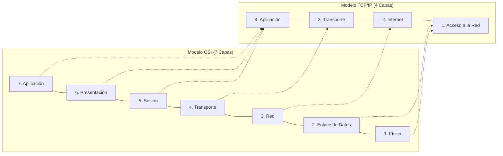
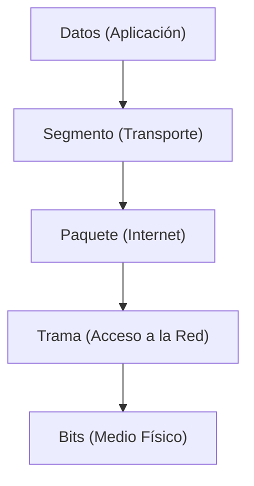

El **Modelo TCP/IP (Transmission Control Protocol / Internet Protocol)** es el modelo histórico y real sobre el cual está construida la Internet moderna. A diferencia del [[Modelo OSI]], que es un modelo conceptual y de referencia, el TCP/IP es un modelo práctico. Fue creado por el Departamento de Defensa de los Estados Unidos (DoD) con el objetivo de garantizar una red robusta capaz de sobrevivir a fallos en sus nodos.

Mientras que el Modelo OSI se divide en 7 capas, el modelo TCP/IP original define **4 capas**. Sin embargo, las versiones académicas modernas a menudo lo representan con 5 capas, separando el nivel inferior en Enlace de Datos y Física.

> [!info] Explicación: OSI vs TCP/IP
> Ambos modelos tienen el mismo propósito: explicar cómo viajan los datos desde una computadora a otra a través de una red. El Modelo OSI es muy detallado y se usa principalmente para la enseñanza y para la solución sistemática de problemas teóricos. Por su parte, el TCP/IP es más directo y agrupa varias tareas conjuntas; es la arquitectura que realmente utilizan nuestros sistemas operativos (Windows, Mac, Linux) a diario para navegar por Internet.

## Las 4 Capas del Modelo TCP/IP

### 4. Capa de Aplicación
Agrupa las capas 5 (Sesión), 6 (Presentación) y 7 (Aplicación) del modelo OSI. Se encarga de la representación de los datos, la codificación y el control de diálogos, proporcionando servicios de red directos a los programas del usuario final.
- **Protocolos comunes:** HTTP/HTTPS (Web), SMTP/POP3/IMAP (Correo), FTP (Transferencia de archivos), DNS (Resolución de nombres).

### 3. Capa de Transporte
Equivale exactamente a la Capa 4 de OSI. Proporciona una conexión lógica entre los hosts de origen y destino, definiendo el nivel de servicio y el estado de la conexión.
- **Protocolos principales:** [[Protocolo TCP vs UDP|TCP y UDP]].

### 2. Capa de Internet (Red)
Equivale a la Capa 3 del modelo OSI. Su único propósito es tomar los paquetes desde el origen y asegurarse de que lleguen al destino final, de forma independiente a la ruta física que tomen.
- **Función principal:** Enrutamiento (routing) y direccionamiento IP.
- **Protocolos clave:** IPv4, IPv6, [[Protocolo ICMP|ICMP]] (ping), IPsec.

### 1. Capa de Acceso a la Red
Combina las capas 1 (Física) y 2 (Enlace de Datos) del modelo OSI. Controla los dispositivos de hardware y los medios físicos que componen la red local.
- **Función:** Transmitir físicamente los datos (en forma de bits) a través del medio físico y controlar las direcciones de hardware (MAC).
- **Tecnologías:** Ethernet (IEEE 802.3), Wi-Fi (IEEE 802.11), PPP.

*(Nota: En la literatura académica moderna, la capa de Acceso a la Red a menudo se divide en "Capa de Enlace de Datos" y "Capa Física", creando un modelo TCP/IP híbrido de 5 capas).*

## Proceso de Encapsulación en TCP/IP

A medida que los datos descienden por las capas del modelo TCP/IP, cada protocolo añade su propia información de control en forma de cabecera.

- **Aplicación:** Crea los *Datos* originales del usuario.
- **Transporte:** Añade la cabecera TCP o UDP (puertos de origen y destino), convirtiendo los datos en un *Segmento*.
- **Internet:** Añade la cabecera IP (direcciones IP de origen y destino), convirtiendo el segmento en un *Paquete*.
- **Acceso a la Red:** Añade la cabecera MAC y encapsula el paquete para enviarlo por el medio físico como una *Trama* (Frame), la cual viaja finalmente como pulsos eléctricos o luz en forma de *Bits*.

## Notas relacionadas
- [[Modelo OSI]]
- [[Protocolo TCP vs UDP]]
- [[Enrutamiento]]
