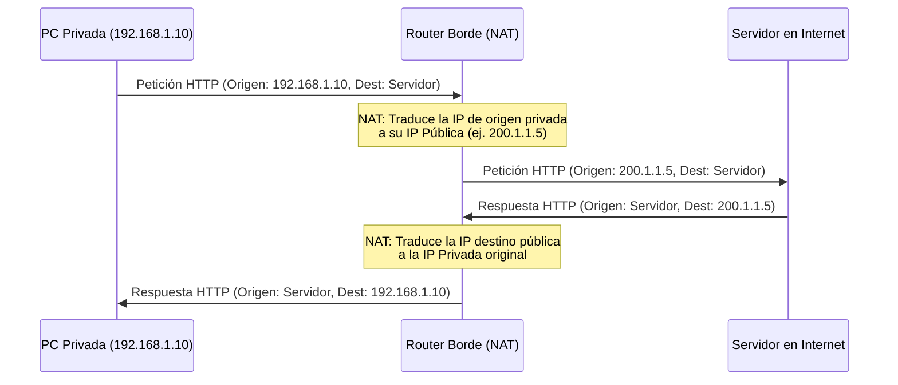
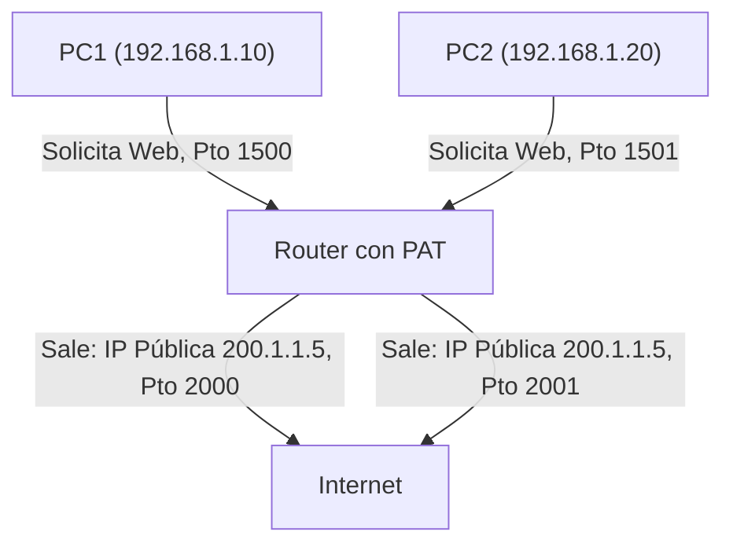

Las direcciones IP privadas son de uso gratuito y local, mientras que las direcciones IP públicas tienen un costo asociado y deben registrarse, ya que son las que permiten el enrutamiento directo de paquetes a través de la Internet global.

Para obtener una dirección IP pública legítima, se sigue una cadena jerárquica de asignación:
1. **ISP (Proveedor de Servicios de Internet):** El usuario final o la empresa solicita la dirección IP a su proveedor local.
2. **RIR (Registros Regionales de Internet, como LACNIC para América Latina):** El ISP obtiene grandes bloques de direcciones IP de estos registros regionales.
3. **IANA (Autoridad de Asignación de Números de Internet):** Es la entidad global central que administra el espacio total de direcciones IP y delega bloques a los diferentes RIR del mundo.

**Rango de direcciones IP públicas por clases (Modelo Histórico):**

| Clase | Rango de IPs |
| ----- | ------------------------------- |
| A | 0.0.0.0 hasta 127.255.255.255 |
| B | 128.0.0.0 hasta 191.255.255.255 |
| C | 192.0.0.0 hasta 223.255.255.255 |

**Rango reservado para direcciones IP privadas (Según el RFC 1918):**

| Clase | Rango de IPs Privadas |
|:-----:|:------------------------------:|
| A | 10.0.0.0 - 10.255.255.255 |
| B | 172.16.0.0 - 172.31.255.255 |
| C | 192.168.0.0 - 192.168.255.255 |

## Red Stub (Red de conexión única)
Una red *stub* es aquella que tiene una única conexión de salida física hacia la infraestructura del ISP. Todo el tráfico que sale o entra de esta red local debe pasar obligatoriamente por un único router de borde.

## NAT (Network Address Translation)
NAT es una tecnología utilizada para traducir direcciones IP privadas ubicadas en una red local a una o más direcciones IP públicas directamente en el router de borde (el dispositivo que conecta a Internet). 

> [!info] Explicación: ¿Qué es NAT y por qué lo usamos?
> Las direcciones IPv4 públicas se agotaron hace tiempo. Si cada teléfono celular, computadora y televisor inteligente de tu casa necesitara una IP pública única, no habría suficientes en todo el mundo. 
> **NAT** permite que todos tus dispositivos utilicen direcciones privadas (por ejemplo, 192.168.1.x) a nivel interno. Cuando estos dispositivos necesitan acceder a Internet, el router oculta sus IPs privadas y "traduce" sus mensajes para que salgan a la red global con una única IP pública. 

El propósito principal de implementar NAT es **conservar el espacio de direcciones IPv4 públicas**. Esto se logra permitiendo que las organizaciones utilicen redes privadas de forma interna, traduciendo el tráfico a direcciones públicas únicamente cuando los paquetes necesitan cruzar hacia Internet.
![[Pasted image 20230816085427.png]]
> *Términos clave: Local = Red privada interna, Global = Red pública (Internet)*



### Configuración básica
Para que el protocolo NAT funcione correctamente, el administrador debe definir qué interfaces físicas del router pertenecen a la red interna y cuáles a la red externa:
```cisco
interface GigabitEthernet0/0  // (Interfaz conectada a la red LAN local)
ip nat inside 

interface GigabitEthernet0/1  // (Interfaz conectada hacia el ISP)
ip nat outside
```
La tabla de estado de NAT del router se llenará dinámicamente cuando los equipos de la red "inside" realicen peticiones hacia la red "outside". El proceso de NAT casi siempre es iniciado desde la red interna hacia la externa, aunque existen excepciones para exponer servicios internos de forma intencional.

```cisco
show ip nat translations
```
Este comando permite visualizar las traducciones activas almacenadas actualmente en la tabla NAT de la memoria del router.

### NAT Estática
Consiste en asignar una dirección IP pública específica y fija a un dispositivo particular en la red interna. Esta asignación es estrictamente uno a uno y de carácter permanente.
Se utiliza habitualmente para exponer servidores internos (como servidores web corporativos o cámaras de seguridad) para que puedan ser administrados o accedidos de forma remota y constante desde Internet.
```cisco
ip nat inside source static [IP_Local_Privada] [IP_Global_Pública_del_ISP]
```

### NAT Dinámica
Consiste en asignar temporalmente direcciones IP públicas provenientes de un grupo (pool) reservado a medida que los dispositivos internos realizan peticiones hacia Internet.
Para que funcione bien, se requiere que el pool configurado tenga suficientes direcciones públicas para manejar todas las peticiones simultáneas; si el pool se agota por completo, los nuevos dispositivos internos no podrán acceder a Internet hasta que otra conexión finalice y libere su IP pública.
![[Pasted image 20230821233813.png]]

**Pasos de configuración:**
0. Definir las direcciones de las interfaces (`ip nat inside` / `ip nat outside`).
1. Crear el POOL (grupo) de direcciones públicas disponibles brindadas por el ISP.
2. Crear Listas de Control de Acceso (ACL) utilizando *wildcards* para identificar qué rangos de IPs privadas tienen el permiso de ser traducidas.
3. Enlazar lógicamente la regla ACL con el pool público creado.

```cisco
// Paso 1
ip nat pool [nombre_del_pool] [ip_inicio] [ip_final] netmask [máscara_de_red]

// Paso 2
access-list [número_acl] permit [ip_red_permitida] [wildcard]

// Paso 3
ip nat inside source list [número_acl] pool [nombre_del_pool]
```

#### Sumarización de redes
Para optimizar las tablas de ruteo y las ACLs, se pueden sumarizar redes (combinarlas en una sola regla matemática) siempre que sean contiguas y coincidan en sus bits más significativos.
Ejemplo práctico:
Las redes `192.168.10.0` y `192.168.11.0` se pueden agrupar bajo una regla más amplia como `192.168.10.0/23` (con la wildcard correspondiente `0.0.1.255`).

#### **Lista de acceso extendida** 
```cisco
ip access-list extended [nombre_acl]
permit ip [dirección_de_red] [wildcard] any
```

## Wildcard (Máscara comodín)
La máscara *wildcard* posee la misma estructura binaria de 32 bits que una máscara de subred convencional, pero con un propósito lógico inverso.
En la lógica de una máscara wildcard:
- El bit **0** significa "Debe haber una coincidencia exacta" en ese bit específico.
- El bit **1** significa "No importa la coincidencia" (actúa simplemente como comodín).

Sirve para indicar al router qué partes de una dirección IP son verdaderamente relevantes al aplicar una regla, permitiendo definir rangos numéricos muy específicos y flexibles. Se utilizan extensamente en las Listas de Control de Acceso (ACL) y en protocolos de enrutamiento dinámico como OSPF.
Ejemplo:
- Máscara de red tradicional: `255.255.255.0`
- Wildcard equivalente: `0.0.0.255`

## PAT (Port Address Translation / NAT con Sobrecarga)
PAT es una extensión y mejora técnica de NAT que permite traducir no solo las direcciones IP (Capa 3), sino también los números de puerto de origen (Capa 4). 

> [!info] Explicación: ¿Qué es PAT?
> A PAT también se le conoce frecuentemente en Cisco como "NAT Overload" (NAT con sobrecarga). 
> Imagina que tienes 100 computadoras en una oficina pero **solo cuentas con 1 IP pública**. La única forma en que todas las computadoras puedan navegar por Internet de forma concurrente es asignándole un número de "puerto de origen" diferente a cada conexión. El router anota en su tabla: "La computadora con IP privada 192.168.1.5 utilizó el puerto temporal 2000" y gracias a esto logra devolver correctamente la respuesta proveniente de Internet a la computadora adecuada sin que los datos se mezclen.

En un escenario de PAT, múltiples dispositivos internos comparten la **misma** dirección IP pública de forma totalmente simultánea, pero sus flujos de tráfico individuales se diferencian y ordenan mediante números de puerto (TCP o UDP) únicos asignados dinámicamente por el router. 
La asignación de puertos suele seguir ciertos grupos lógicos estándar (como 0-511, 512-1023 o 1024-65535) dependiendo del espacio de memoria y disponibilidad del dispositivo de red.



**Configuración de PAT (Sobrecarga):**
```cisco
ip nat inside source list [número_acl] interface [interfaz_de_salida] overload
```
Para supervisar y ver las traducciones en tiempo real (Nota: solo debe utilizarse en entornos de laboratorio, ya que puede sobrecargar la CPU del router):
```cisco
debug ip nat 
```

## Notas relacionadas
- [[Enrutamiento]]
- [[VLAN]]
- [[Http introduccion]]
