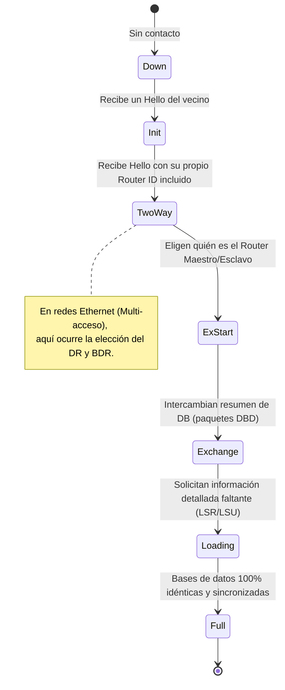

OSPF (Open Shortest Path First) es un protocolo de enrutamiento dinámico de estado de enlace (Link-State) estándar de la industria. Surgió en los años 90 como una alternativa robusta, rápida y excepcionalmente eficiente a los protocolos antiguos de vector de distancia, como RIP.

Es un protocolo de enrutamiento sin clase (classless) que utiliza el concepto jerárquico de "Áreas" para garantizar la escalabilidad en redes de tamaño corporativo o masivo. Este diseño permite dividir el enorme dominio de enrutamiento en secciones aisladas, lo cual ayuda a controlar las actualizaciones de rutas, reducir el impacto de fallas y minimizar el uso de memoria en los routers.

Al igual que otros protocolos de enrutamiento moderno, OSPF utiliza mensajes específicos para descubrir proactivamente a sus vecinos físicos, compartir información de redes de forma segura y mantener una base de datos topológica completamente sincronizada en toda el área.

## Bases de Datos de OSPF

Para funcionar correctamente, cada router OSPF mantiene internamente tres estructuras de bases de datos distintas, las cuales se actualizan continuamente:

| Base de Datos (Estructura) | Nombre Común | Descripción |
| ----------------------- | ------------------ | ---------------------------------------------------------------------------------------------------------------------------------------------------------------------------------------------------------------------------------------------------- |
| **Base de Datos de Adyacencia** | Tabla de vecinos | - Es la lista de todos los routers vecinos directos con los que el router ha establecido comunicación bidireccional exitosa (adyacencia).<br>- Es única para cada router en la red.<br>- Se puede verificar con el comando `show ip ospf neighbor`. |
| **Estado de Enlace (LSDB)** | Tabla de topología | - Muestra información increíblemente detallada sobre todos los demás routers y enlaces de la red.<br>- Representa un "mapa" geográfico completo de la topología.<br>- Todos los routers dentro de una misma área poseen una LSDB matemáticamente idéntica.<br>- Se verifica con el comando `show ip ospf database`. |
| **Datos de Reenvío** | Tabla de enrutamiento | - Es el resultado final: la lista de las mejores rutas calculadas tras ejecutar el algoritmo sobre la LSDB.<br>- Cada router tiene una tabla única, que le indica por qué interfaz exacta debe enviar los paquetes de datos de los usuarios.<br>- Se verifica con el comando `show ip route`. |

> [!info] Explicación: ¿Cómo elige OSPF la mejor ruta?
> OSPF utiliza el afamado algoritmo matemático de Dijkstra, conocido en redes como **SPF (Shortest Path First - Primero la Ruta más Corta)**. 
> **¿En qué métrica se basa?** Se basa exclusivamente en el **Costo Acumulado**. En OSPF, el costo está determinado directamente por el ancho de banda del enlace (a mayor velocidad o ancho de banda del cable, menor es el costo). El router ejecuta el algoritmo SPF poniéndose a sí mismo como la "raíz" del árbol de rutas, y suma los costos de todos los saltos en cada camino posible. El camino que ofrezca el menor costo final acumulado será el declarado ganador e instalado en la tabla de enrutamiento del dispositivo.

## Funcionamiento de las Adyacencias en OSPF

Los routers OSPF pasan por varios estados estrictos para alcanzar la convergencia y lograr la sincronización total de sus bases de datos. El flujo general de conexión entre dos routers vecinos es el siguiente:



1. **Establecimiento de adyacencias:** Intercambian mensajes *Hello* en intervalos de 10 segundos por la red (multicast a `224.0.0.5`) para descubrir vecinos.
2. **Intercambio de resúmenes:** Tras reconocerse y confirmar la bidireccionalidad, intercambian una "tabla de contenidos" de sus respectivas bases de datos (paquetes DBD).
3. **Solicitud de detalles faltantes:** Si un router descubre que el vecino tiene redes más recientes, entra en estado *Loading* para solicitar activamente los detalles que le faltan y los integra en su Base de Datos de Estado de Enlace (LSDB).
4. **Ejecución del algoritmo SPF y elección:** Finalmente (estado *Full*), calculan matemáticamente todas las rutas y añaden las mejores a la tabla de enrutamiento. 

## Tipos de Paquetes en OSPF
El protocolo utiliza 5 tipos de mensajes distintos para llevar a cabo la comunicación:
1. **Paquete Hello (Saludo):** Establece y mantiene las adyacencias con los vecinos.
2. **Paquete DBD (Database Description):** Describe un resumen ligero del contenido de la base de datos (LSDB) local.
3. **Paquete LSR (Link-State Request):** El router solicita a un vecino información detallada de partes específicas de la topología que no posee o tiene desactualizadas.
4. **Paquete LSU (Link-State Update):** El vecino responde enviando la actualización topológica completa. Este paquete actúa como un gran sobre que transporta adentro mensajes específicos llamados **LSA (Anuncios de Estado de Enlace)**.
5. **Paquete LSAck (Link-State Acknowledgment):** Un recibo de confirmación que acusa formalmente la recepción exitosa de un paquete LSU o DBD, brindando confiabilidad al protocolo.

## DR (Router Designado) y BDR (Router de Respaldo)
Las redes multiacceso (como un cable Ethernet en el que hay varios routers conectados al mismo switch) pueden generar graves problemas para OSPF si no se controlan: el establecimiento caótico de adyacencias cruzadas y tormentas de actualización en caso de una falla en un enlace (saturación de LSAs).

Para solucionar esto, en estas redes Ethernet se lleva a cabo una elección automática donde un router asume el rol de **DR (Router Designado)** y otro el de **BDR (Router Designado de Respaldo)**. 

> [!info] Explicación: El rol del DR en OSPF
> Piensa en el DR como el "Presidente" o portavoz oficial de ese segmento de red, y el BDR como el Vicepresidente. En lugar de que todos los routers hablen entre sí simultáneamente (lo cual crearía caos), todos los routers comunes reportan sus actualizaciones de estado de enlace **exclusivamente al DR y al BDR** enviándolas a una dirección especial de multidifusión (`224.0.0.6`).
> Luego, el DR asume la responsabilidad de retransmitir y oficializar esa actualización hacia los demás routers de la red (utilizando la dirección estándar `224.0.0.5`). Esto reduce drásticamente el tráfico cruzado y los requerimientos de procesamiento en la red.
> Los routers que no logran ser DR ni BDR se clasifican bajo el estado de **DROTHERs**. *(Aclaración: El DR solo gestiona las actualizaciones de control topológico OSPF; el tráfico de datos regular de los usuarios viaja de router a router de forma directa, ignorando al DR).*

## Arquitectura Multiárea

**OSPF de Área Única:** En redes pequeñas, todos los routers se sitúan en un solo dominio. Por regla general de diseño, esta única área siempre debe designarse e identificarse como el **Área 0** (conocida formalmente como el *Backbone* o eje central).

**OSPF Multiárea:** A medida que la red de una corporación crece masivamente, la LSDB de cada router se vuelve gigante, volviendo los cálculos SPF lentos e ineficientes. En estos escenarios se divide lógicamente a los routers en áreas jerárquicas (Área 1, Área 51, etc.).
- **Regla inquebrantable:** Toda área secundaria siempre debe conectarse de forma directa (física o lógica) al Área 0 de Backbone.
- Los routers especiales que tienen interfaces conectadas tanto al Área 0 como a otras áreas periféricas se denominan **ABR (Area Border Routers - Routers Fronterizos de Área)**.

**Ventajas de la estructura Multiárea:**
- **Tablas de enrutamiento drásticamente más eficientes:** Las enormes subredes de un área pueden resumirse matemáticamente (sumarizarse) a través del ABR antes de anunciarse a otras áreas.
- **Reducción severa de la sobrecarga de CPU:** Las actualizaciones y cálculos de rutas ocurren localmente dentro de los límites del área, protegiendo los recursos de hardware.
- **Aislamiento de fallas (Localización del Impacto):** Si un cable se corta en el Área 1, esto solo provocará recalculos SPF exhaustivos dentro de los routers del Área 1. Los routers del Área 0 y el Área 2 simplemente recibirán una actualización ligera del ABR, sin sufrir el impacto total de la caída de los enlaces.

## OSPFv3 para IPv6
OSPFv3 es la actualización moderna del protocolo, reescrita específicamente para el intercambio e integración con redes **IPv6**.
A nivel operativo, la matemática base (algoritmo Dijkstra, roles DR/BDR, áreas, funcionamiento de LSDB) se mantiene intacta en relación a OSPFv2. No obstante, utiliza el esquema de transporte propio de IPv6, y en plataformas Cisco, el proceso y la configuración de OSPFv2 y OSPFv3 operan independientemente el uno del otro en la memoria del dispositivo.

## Configuración Básica en Cisco

```cisco
// 1. Ingresar al modo de configuración de OSPF (10 es el ID del proceso a nivel local)
Router(config)# router ospf 10 

// 2. Configurar manualmente y forzar el Router ID (formato IPv4 obligatorio)
Router(config-router)# router-id 1.1.1.1 

// 3. Declarar explícitamente las redes o interfaces que participarán usando la máscara Wildcard e indicar el ID de Área
Router(config-router)# network 192.168.1.0 0.0.0.255 area 0 
```

*Nota: Una buena práctica de ingeniería es forzar y configurar manualmente siempre el Router ID para garantizar estabilidad operativa, dado que de no hacerlo, el dispositivo tomará la dirección IP más alta que tenga configurada activa como su identificador, lo que puede causar confusiones a futuro.*

## Notas relacionadas
- [[Enrutamiento]]
- [[estado de enlace]]
- [[Vector distancia]]
