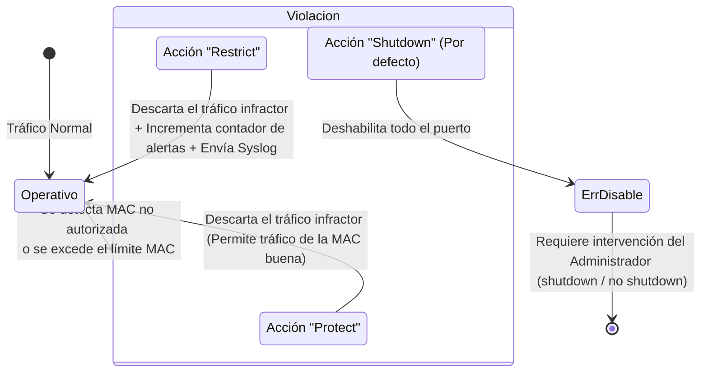

Como medida fundamental de mitigación de seguridad física y lógica en cualquier red corporativa, **todos los puertos del switch que no estén siendo utilizados deben estar administrativamente deshabilitados (apagados).**

```cisco
interface range FastEthernet 0/2 - 24
shutdown
```

Para habilitar la función avanzada de seguridad de puerto (**Port Security**) en una interfaz específica, dicha interfaz debe estar configurada explícitamente en modo de acceso estático (no puede operar en modo dinámico de negociación DTP ni como enlace troncal).

```cisco
interface FastEthernet 0/1
switchport mode access
switchport port-security
```

> [!info] Explicación: ¿Qué es Port Security?
> **Port Security (Seguridad de Puerto)** es una robusta función nativa de los switches Cisco que permite limitar, vigilar y controlar qué dispositivos específicos (identificados unívocamente por su dirección MAC) tienen permiso para inyectar tráfico de red a través de un puerto. 
> **¿Por qué es vital?** Previene de manera efectiva que un usuario malintencionado o descuidado desconecte un equipo legítimo (ej. la impresora de la oficina o el PC corporativo) y conecte su propia computadora portátil a la red. También previene ataques cibernéticos devastadores como el "MAC Flooding" (inundación de tablas MAC), cuyo objetivo es colapsar la memoria del switch.

## Reglas y Comportamiento de Port Security
- **Incompatibilidad Troncal:** Port Security no se puede habilitar en puertos configurados como enlaces troncales (Trunk) ni en puertos que formen parte de una agrupación EtherChannel. Diseñado estrictamente para bordes de red (Access Ports).
- **Capa 2 exclusiva:** A los puertos físicos de Capa 2 de un switch no se les asigna dirección IP. La validación se hace puramente observando las tramas MAC.
- **Aprendizaje inicial restringido:** Por defecto, al activar el comando básico `switchport port-security`, el switch solo aprende y permite **una única dirección MAC** activa en ese puerto. Si se detecta más de un dispositivo (por ejemplo, si un empleado trae un mini-switch o un hub de su casa y conecta varios PCs), el switch bloqueará el tráfico de los dispositivos adicionales a menos que el administrador haya aumentado el límite máximo configurado.

## Violaciones de Seguridad y Acciones

Se produce una **violación de seguridad** en dos escenarios: 
1. Cuando un dispositivo con una dirección MAC no autorizada o desconocida intenta enviar datos.
2. Cuando la cantidad total de direcciones MAC distintas que intentan ingresar por el puerto excede el límite numérico configurado.



Por defecto, la acción ante una violación es **Shutdown**. El puerto se apaga lógicamente y pasa a estado `err-disable`, requiriendo que el administrador ingrese al equipo y ejecute un ciclo manual de apagado/encendido (`shutdown` seguido de `no shutdown`) para revivir el puerto tras solucionar la amenaza física.

## Comandos de Configuración y Verificación

Para verificar el estado actual, el número de violaciones y la configuración de Port Security en una interfaz:
```cisco
show port-security interface f0/1
```

Los parámetros operativos se pueden afinar utilizando los siguientes comandos bajo la interfaz de acceso:
```cisco
// Define el número máximo de dispositivos/MACs que pueden existir detrás del puerto simultáneamente.
switchport port-security maximum [número]

// Define la acción severa a tomar ante una violación detectada (protect, restrict, shutdown).
switchport port-security violation [acción]

// Permite escribir estática y manualmente una dirección MAC específica que tiene permiso.
switchport port-security mac-address [000A.1111.2222]

// Configura un temporizador para que el switch "olvide" las MAC aprendidas luego de cierto tiempo.
switchport port-security aging time [minutos]
```

### Aprendizaje Dinámico Persistente (Sticky)
En redes empresariales con miles de computadoras, ingresar la dirección MAC de cada equipo manualmente es una tarea inviable. Para solucionar esto se utiliza el aprendizaje **Sticky**:
```cisco
switchport port-security mac-address sticky
```
El comando `sticky` convierte al switch en un vigilante inteligente: el switch aprenderá de forma automática y dinámica la primera dirección MAC legítima que reciba tráfico (o las primeras, si se subió el máximo). Inmediatamente, "pegará" esa dirección MAC en el archivo de configuración activa (`running-config`) como si el administrador la hubiese tecleado a mano. Si la configuración se guarda (write memory), el equipo final quedará casado permanentemente con ese puerto de red, garantizando máxima seguridad sin esfuerzo administrativo masivo.

## Notas relacionadas
- [[VLAN]]
- [[Configuración del Switch Consola, Acceso remoto.]]
- [[Acceso]]
- [[seguridad informatica]]
