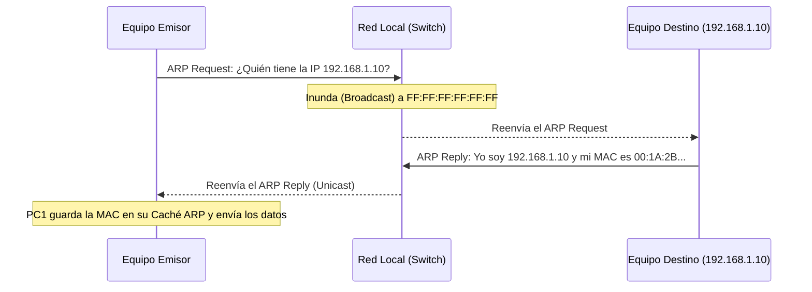

El protocolo **ARP (Address Resolution Protocol - Protocolo de Resolución de Direcciones)** es un protocolo de red esencial que se utiliza para vincular (asociar) una dirección IP conocida (Capa 3) con una dirección MAC desconocida (Capa 2).

> [!info] Explicación: ¿Por qué necesitamos ARP?
> Para que un paquete viaje por Internet, necesita una Dirección IP (como la dirección de tu casa). Pero cuando el paquete llega a la cuadra final (tu red local), los switches no entienden de direcciones IP; solo entienden de Direcciones MAC (como tu número de identificación personal o DNI físico). 
> **ARP es el traductor final:** Grita en la red "¡Oigan todos! ¿Quién tiene la dirección IP 192.168.1.10? ¡Por favor, proporcione su dirección MAC para poder entregarle este paquete!"

## ¿Cómo funciona el proceso ARP?

Cuando un dispositivo quiere enviar datos a otro dispositivo en su misma red local y conoce su IP, pero no su MAC, realiza los siguientes pasos:



1. **Solicitud ARP (ARP Request):**
   El dispositivo emisor genera un mensaje de solicitud ARP. Como no sabe a quién dirigirse exactamente en la Capa 2, envía este mensaje a la dirección de **Broadcast MAC** (`FF:FF:FF:FF:FF:FF`). Todos los switches que reciben el mensaje lo inundan por todos sus puertos para que llegue a todos los dispositivos de la red. 
   *Mensaje:* "¿Qué dirección MAC tiene asignada la IP 192.168.1.10?"

2. **Respuesta ARP (ARP Reply):**
   Todos los dispositivos de la red reciben el mensaje, pero solo aquel cuya IP coincida con `192.168.1.10` procesará la solicitud de forma activa.
   Este dispositivo de destino responde directamente (mediante Unicast) al emisor enviándole su dirección MAC.
   *Mensaje:* "Yo soy la IP 192.168.1.10 y mi MAC es 00:1A:2B:3C:4D:5E".

3. **Almacenamiento (Caché ARP):**
   El emisor recibe la MAC, la adjunta al paquete de datos original y lo transmite a la red. Para evitar repetir este proceso en el próximo segundo con nuevos paquetes dirigidos al mismo destino, el emisor guarda esta asociación (IP-MAC) en su memoria RAM. Este registro temporal se conoce como la **Tabla ARP o Caché ARP**.

## La Tabla ARP (ARP Cache)
La tabla ARP almacena las resoluciones IP-MAC recientes. Puedes verla en una computadora con Windows o Linux abriendo la consola y escribiendo el siguiente comando:
```cmd
arp -a
```
*Problema:* Las entradas en esta tabla caducan después de unos minutos. Este comportamiento evita que la red falle en caso de que se cambie una tarjeta de red física o se reasigne una dirección a través de DHCP.

## ARP Spoofing (Envenenamiento ARP)
Es un ataque de seguridad de red informático clásico. Dado que los dispositivos confían ciegamente en las respuestas ARP (incluso si no enviaron una solicitud previa), un atacante puede enviar mensajes "ARP Reply" falsos a la red para engañar a los equipos.

- **El engaño:** El atacante le dice a la computadora víctima: "Hola, yo soy el Router (Puerta de enlace), mi MAC es [MAC del Atacante]". Al mismo tiempo, le dice al Router: "Hola, yo soy la PC víctima, mi MAC es [MAC del Atacante]".
- **El resultado:** Todo el tráfico que viaja entre la víctima y el router pasará por la computadora del atacante. Esto le permite interceptar contraseñas y datos sin que nadie lo note, lo cual se conoce como un ataque **Man-In-The-Middle (MitM)**.
- **Mitigación:** En las redes empresariales configuradas con equipos Cisco, este tipo de ataques se mitiga usando una tecnología de seguridad llamada **DAI (Dynamic ARP Inspection)**.

## Notas relacionadas
- [[Dominios de Colisiones y broadcast]]
- [[Port Security]]
- [[Direccionamiento IPv4]]
