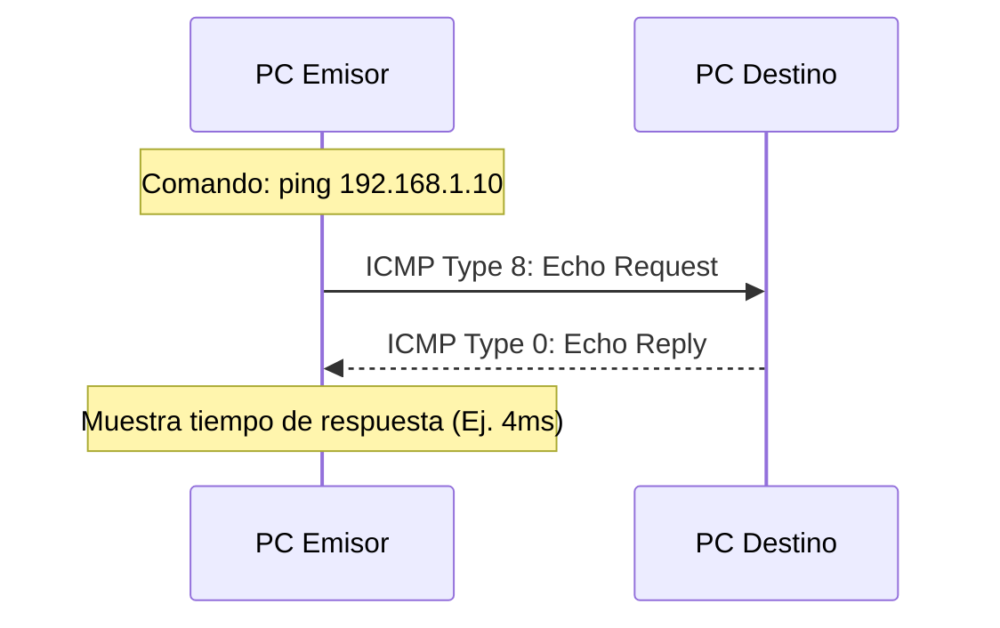

**ICMP (Internet Control Message Protocol - Protocolo de Mensajes de Control de Internet)** es un protocolo fundamental que opera en la Capa de Red (Capa 3 del Modelo OSI). A diferencia de TCP o UDP, ICMP no se utiliza para transportar datos de las aplicaciones de los usuarios finales (como correos electrónicos o páginas web), sino que es estrictamente el protocolo de diagnóstico y notificación de errores de la infraestructura de red.

> [!info] Explicación: ¿Qué hace exactamente ICMP?
> Imagina a los routers como oficinas de correo y a los paquetes IP como las cartas. ICMP actúa como el departamento de "atención al cliente". Si una calle está cortada, la dirección de destino no existe, o la carta caducó por estar dando vueltas perdidas mucho tiempo, el router usará un paquete ICMP para devolverte una notificación oficial y técnica diciendo: "Lo sentimos, el destinatario es inalcanzable por este motivo de red...".

## Funciones Principales y Herramientas

ICMP es el motor subyacente detrás de las dos herramientas de diagnóstico de red más famosas e indispensables:

### 1. Ping (Packet Internet Groper)
Se utiliza de forma primaria para comprobar la conectividad básica de extremo a extremo (saber si un equipo remoto está encendido y accesible a nivel de Capa 3).
- El emisor genera y envía un mensaje **ICMP Echo Request** (Petición de eco).
- El equipo de destino, al recibirlo, está obligado por las reglas del protocolo a procesarlo y devolver inmediatamente un mensaje **ICMP Echo Reply** (Respuesta de eco).
- Si el emisor recibe el Reply a tiempo, se confirma que hay conectividad bidireccional y se mide el tiempo de ida y vuelta (Latencia/Ping en milisegundos).

### 2. Traceroute / Tracert
Se utiliza para mapear y rastrear la ruta exacta (lista de saltos o routers) que toma un paquete desde el origen hasta el destino, ayudando a localizar dónde se corta la comunicación.
- Funciona manipulando matemáticamente el campo TTL (Time To Live / Tiempo de vida) del paquete IP y forzando estratégicamente mensajes de error ICMP.
- El origen envía el primer paquete con un TTL=1. Cuando el primer router lo recibe, decrece el TTL a 0. Al llegar a 0, el router descarta el paquete y devuelve al emisor un mensaje de error ICMP **Time Exceeded** (Tiempo excedido). Gracias a esto, el emisor lee la IP del remitente del error y descubre cuál es el router del Salto #1.
- Luego, repite el proceso enviando otro paquete con TTL=2 para descubrir el router del Salto #2, y así sucesivamente hasta llegar al destino final.

## Mensajes de Error ICMP Comunes

Cuando algún problema de enrutamiento o seguridad ocurre en la red, los routers o firewalls generan mensajes ICMP específicos para avisar al equipo emisor. Los más comunes son:

- **Destination Unreachable (Destino Inalcanzable - Tipo 3):** Ocurre cuando el router no tiene una ruta válida o conocida hacia la red de destino en su tabla de enrutamiento, o cuando una lista de control de acceso (ACL) de un firewall bloquea explícitamente el paquete.
- **Time Exceeded (Tiempo Excedido - Tipo 11):** Como se ilustra en Traceroute, ocurre cuando el contador TTL de un paquete IP llega a 0. Este mecanismo vital evita que paquetes de red perdidos debido a bucles de enrutamiento circulen infinitamente saturando los cables.
- **Redirect (Redireccionamiento - Tipo 5):** Un router de la red local le avisa al host emisor que existe un camino alternativo (otro router en la misma LAN) mucho mejor y más corto para llegar a su destino específico que el que está usando actualmente.

*(Nota Importante: En IPv6, el protocolo se actualizó, robusteció y se denomina **ICMPv6**. Además de heredar sus funciones clásicas de diagnóstico, incorporó de manera nativa características vitales como el Protocolo de Descubrimiento de Vecinos / NDP, que reemplaza funcionalmente al ARP de IPv4).*

## Notas relacionadas
- [[Modelo TCP-IP]]
- [[Enrutamiento]]
- [[Protocolo TCP vs UDP]]
