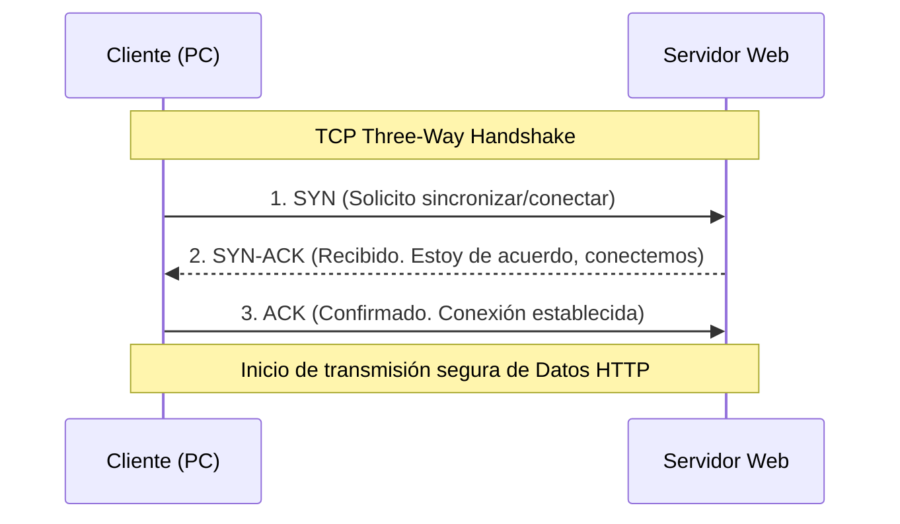

El Modelo OSI define en su Capa 4 (Capa de Transporte) los mecanismos lógicos necesarios para asegurar y gestionar la entrega de datos a través de la red de un host a otro. Los dos protocolos de transporte principales que sostienen casi la totalidad de las comunicaciones en las redes IP modernas son el **Transmission Control Protocol (TCP)** y el **User Datagram Protocol (UDP)**. 

Ambos sirven para enviar datos encapsulados hacia puertos de aplicaciones específicos, pero tienen enfoques arquitectónicos diametralmente opuestos sobre cómo tratar esa transmisión.

> [!info] Explicación: ¿Cuál es la diferencia básica?
> Piensa en **TCP** como una llamada telefónica formal: tú marcas, la otra persona contesta (establecen una conexión explícita), tú hablas y la persona te dice "te escucho" después de cada frase (confirmación de recepción). Si hay ruido en la línea y no escuchó algo, te pide que lo repitas. 
> Piensa en **UDP** como un locutor de radio de FM: él simplemente enciende el micrófono y transmite datos por el aire. No sabe quién lo está escuchando, no sabe si la señal llegó bien, ni le importa detenerse para averiguarlo. Es un proceso infinitamente más rápido porque no tiene que esperar confirmaciones lentas.

## TCP (Transmission Control Protocol)
TCP es un protocolo robusto **orientado a la conexión**, altamente confiable y que garantiza matemáticamente la entrega íntegra de los datos.

### Características Principales:
- **Confiable:** Verifica rigurosamente que todos los segmentos de datos lleguen a su destino. Si un paquete se pierde en internet, TCP se da cuenta y lo retransmite automáticamente.
- **Ordenado:** Enumera estrictamente los paquetes mediante números de secuencia, por lo que el destinatario puede reensamblar el archivo (como una foto) exactamente en el mismo orden original, incluso si los paquetes viajaron por internet y llegaron mezclados.
- **Control de Flujo (Sliding Window):** TCP se comunica con el receptor y ajusta dinámicamente la velocidad de envío de datos para evitar saturar al equipo remoto o a la propia red.
- **Sobrecarga (Overhead):** Debido a todos estos controles, metadatos y mecanismos de retransmisión, su cabecera es bastante pesada (20 bytes como mínimo) y su comunicación general es más lenta y genera más latencia.

### Three-Way Handshake (Acuerdo de tres vías)
La característica más icónica de TCP es que antes de enviar un solo byte de datos de aplicación, establece formalmente la conexión en 3 pasos precisos:

**Casos de uso típicos de TCP:** 
- Navegación web estándar (HTTP/HTTPS)
- Transferencia de archivos (FTP)
- Correo electrónico (SMTP/IMAP)
- Acceso remoto (SSH)
*En resumen: TCP es obligatorio para cualquier aplicación donde un byte perdido arruine irreversiblemente el archivo o la información.*

## UDP (User Datagram Protocol)
UDP es un protocolo ligero **no orientado a la conexión**, de velocidad cruda y diseñado bajo el principio de "mejor esfuerzo" (best-effort delivery).

### Características Principales:
- **No confiable:** UDP no lleva un seguimiento de qué paquetes llegaron y cuáles no. Si un paquete se pierde en el camino debido a la congestión de la red, se pierde para siempre; UDP no tiene mecanismos para retransmitirlo.
- **Sin conexión previa:** UDP no realiza el protocolo de enlace (Handshake). Simplemente empieza a disparar los paquetes (datagramas) hacia la IP y el puerto de destino sin avisar previamente.
- **Sin orden:** Si los paquetes viajan por rutas distintas en internet y llegan desordenados, UDP no los reordena; simplemente se los entrega a la aplicación en el orden de llegada, dejando que la aplicación lidie con el caos (si es que importa).
- **Rápido y liviano:** Su cabecera es extremadamente pequeña (solo 8 bytes) y no genera tráfico de red adicional con mensajes de confirmación de recibo. Esto lo hace insuperable para manejar flujos constantes de datos en tiempo real donde la latencia es inaceptable.

**Casos de uso típicos de UDP:** 
- Llamadas de Voz sobre IP (VoIP)
- Streaming de video en vivo (Twitch, YouTube Live, Zoom)
- Juegos en línea multijugador (FPS, MOBAs)
- Resoluciones de nombres de dominio (DNS)
*En resumen: UDP es ideal cuando la velocidad absoluta es mucho más importante que la perfección de los datos.*

## Resumen Comparativo

| Característica | TCP | UDP |
| -------------- | --- | --- |
| **Enfoque de Conexión** | Orientado a conexión formal | Sin conexión (Sin estado) |
| **Fiabilidad de Entrega** | Muy Alta (100% garantizada) | Baja (Entrega por mejor esfuerzo) |
| **Retransmisión por pérdida** | Sí, automática | No (se descarta para siempre) |
| **Velocidad y Latencia** | Más lento, mayor latencia | Extremadamente rápido, baja latencia |
| **Control de Orden** | Sí (Números de Secuencia) | No (Se entrega como llega) |
| **Peso de la Cabecera (Overhead)** | Pesada (20+ bytes) | Ligera (8 bytes) |

## Notas relacionadas
- [[Modelo OSI]]
- [[Modelo TCP-IP]]
- [[Protocolo ICMP]]
