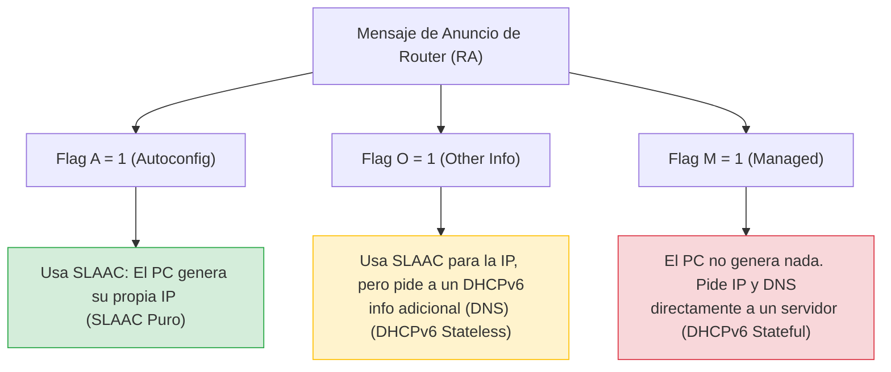

En el ecosistema de IPv6, el mecanismo para que un dispositivo final (como una computadora o teléfono) obtenga su dirección IP y parámetros de red es gestionado íntegramente por los vitales mensajes **RA (Router Advertisement / Anuncio de Router)** que el router emite periódicamente.

Dentro de este mensaje de Anuncio de Router se envían pequeñas "banderas lógicas" (Flags) que el router utiliza para indicarle y sugerirle a los dispositivos cliente exactamente qué método deben usar para autoconfigurarse. Las combinaciones posibles son el corazón del direccionamiento IPv6 moderno.



- **Flag A (Address Autoconfiguration):** Indica que el host tiene total permiso para utilizar la configuración automática de direcciones sin estado (SLAAC).
- **Flag M (Managed Address):** Indica que el host debe ignorar su autonomía y contactar obligatoriamente un servidor DHCPv6 stateful (con estado) para solicitar y rentar una dirección GUA IPv6 y otros parámetros.
- **Flag O (Other Configuration):** Indica que el host debe localizar un servidor DHCPv6 stateless (sin estado) únicamente para obtener información adicional auxiliar que no está en el mensaje RA, como la dirección del servidor DNS.

---

El método nativo estrella de IPv6 es el **SLAAC (Stateless Address Autoconfiguration)**. Esta brillante tecnología permite a los sistemas operativos anfitriones generar matemáticamente su propia dirección IPv6 de unidifusión global (GUA) funcional y única sin necesitar la ayuda, supervisión o intervención de un servidor DHCPv6.

SLAAC es un servicio clasificado estrictamente como "stateless" (sin estado). El término significa que en la red no hay ningún servidor central de control que mantenga una tabla de Excel o registro (estado) de qué direcciones IPv6 se están utilizando actualmente y a qué dirección MAC pertenecen. Es un sistema totalmente descentralizado.

Para agilizar el proceso sin esperar a que el router hable, un host que acaba de encenderse puede enviar de inmediato un mensaje de difusión **RS (Router Solicitation / Solicitud de Router)**. Esto despierta a los routers IPv6 obligándolos a contestar inmediatamente con un mensaje RA para que el host pueda empezar a autoconfigurarse.

> [!info] Explicación: ¿Por qué diablos inventar SLAAC en lugar de usar DHCP?
> SLAAC existe y funciona de maravilla porque el espacio de direcciones de IPv6 es absurdamente colosal. En una sola subred estándar IPv6 (un prefijo /64), hay disponibles 18 trillones de direcciones posibles. 
> Gracias a este tamaño, la probabilidad matemática de que dos computadoras diferentes generen aleatoriamente la misma parte final de su IP (o usen su MAC única para formarla) es prácticamente de cero absoluto. Esto permite quitarle al router/servidor el enorme trabajo computacional de rastrear y asignar IPs una por una, haciendo que el encendido de dispositivos en la red sea más descentralizado, autónomo, rápido y libre de cuellos de botella.

## Cómo Activar y Verificar SLAAC

![[Pasted image 20230705173240.png]]

#### **Requisitos vitales de direcciones IPv6**
Para que el router sirva como guía, sus interfaces deben estar configuradas correctamente. Como se destaca en diagramas topológicos, la interfaz R1 debe poseer:
- **Dirección Link-Local (LLA):** Como `fe80::1`. Es requerida vitalmente por todo dispositivo con IPv6 y confinada estrictamente a la LAN. **Las computadoras usan siempre la LLA del router como su verdadera Puerta de Enlace Predeterminada (Default Gateway)**, ya que es más estable.
- **GUA y prefijo:** Como `2001:db8:acad:1::1/64`. Esta es la porción pública de red que el router "regalará" en el mensaje RA a los hosts para que formen la suya.

#### Habilitación global del enrutamiento IPv6 (Comando crítico)
Por defecto, un router Cisco recién encendido no enviará jamás mensajes RA ni actuará como router de IPv6, aunque le configures IPs en las interfaces. Para revivir el motor de IPv6 y habilitar el envío del vital mensaje RA a los hosts, debes unir el router al grupo de multidifusión global mediante este comando de configuración global:
```cisco
ipv6 unicast-routing
```

#### Verificación del funcionamiento SLAAC
El grupo de todos los routers IPv6 responde universalmente a la dirección de multidifusión `ff02::2`. Se puede utilizar el valioso comando `show ipv6 interface` para verificar si un router está emitiendo RAs, los temporizadores y sus indicadores actuales.

## Método SLAAC Puro y Exclusivo (Sólo SLAAC)

El método basado de forma exclusiva y pura en SLAAC es el modo de operación habilitado automáticamente de fábrica en el instante en que ejecutas el comando `ipv6 unicast-routing`.

En este escenario perfecto:
- El router envía en el RA el **flag A = 1**, autorizando y sugiriendo al cliente que cree su propia dirección GUA combinando el prefijo (/64) que le acaba de dar, con un identificador único local.
- Los **flags O = 0** y **M = 0** permanecen apagados. Esto le ordena al cliente que no intente buscar servidores DHCPv6, y que confíe ciegamente en usar toda la información incluida en el mensaje RA de forma exclusiva. Esto incluye su nueva dirección enrutada, el tamaño de la máscara, el servidor DNS interno, el tamaño del paquete MTU y utilizar la Link-Local del emisor como su default gateway.

*Relacionado con:* [[DHCP IPV6]]
