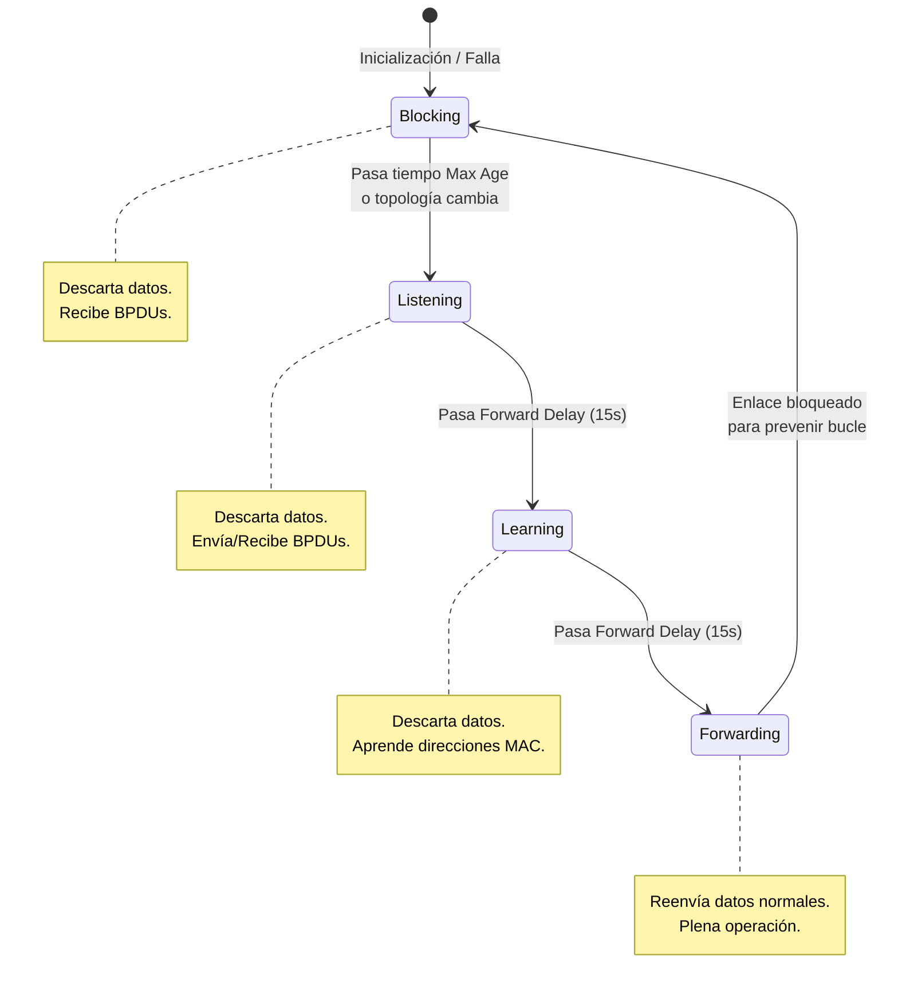

El Protocolo de Árbol de Expansión (STP, Spanning Tree Protocol) es un protocolo de red diseñado para la prevención de bucles en la Capa 2. Permite establecer redundancia física en los enlaces mientras crea una topología lógica sin bucles. El estándar original IEEE MAC Bridging para STP es el 802.1D. La prioridad predeterminada del puente (Bridge Priority) es 32768.

> [!info] Explicación
> A diferencia de la Capa 3 (enrutamiento), donde los paquetes IP tienen un campo "Tiempo de Vida" (TTL) que se decrementa para evitar que circulen eternamente, en la Capa 2 (conmutación) las tramas Ethernet no tienen este mecanismo de seguridad. Si existen rutas físicas redundantes entre los switches, las tramas de broadcast pueden dar vueltas infinitamente, colapsando rápidamente la red. STP resuelve este problema bloqueando lógicamente algunos enlaces redundantes para que solo exista una ruta activa a la vez, manteniendo el enlace secundario como respaldo en caso de que el enlace principal falle.

## Problemas con los vínculos de switch redundantes

La redundancia de hardware y cableado proporciona resiliencia en la red al eliminar la posibilidad de un solo punto de falla. Sin embargo, cuando existen múltiples rutas físicas entre dos dispositivos en una red Ethernet y no se implementa el árbol de expansión, se produce un bucle de Capa 2.

## Bucles de la Capa 2
Sin STP habilitado, se forman bucles de Capa 2 irreversibles. Esto provoca que las tramas de difusión (broadcast), multidifusión (multicast) y unidifusión (unicast) desconocidas se reenvíen sin fin entre los switches. Este efecto puede derribar por completo una red funcional en muy poco tiempo, a veces en cuestión de pocos segundos.

> [!info] Explicación
> Cuando un switch recibe una trama cuyo destino MAC no conoce en su tabla, o si se trata de una trama de difusión (como un mensaje ARP o DHCP), la reenvía por todos sus puertos excepto por el puerto por el que la recibió. Si hay un bucle físico cerrado, esa misma trama regresará al switch a través de otra interfaz, y el ciclo se repetirá infinitamente, multiplicando el tráfico con cada pasada.

## Tormenta de difusión (Broadcast Storm)
Una tormenta de difusión ocurre cuando hay un número anormalmente alto de transmisiones de broadcast que abruman la red durante un período específico. Las tormentas de difusión saturan los enlaces y consumen el 100% de la capacidad de procesamiento (CPU) de los switches y los dispositivos finales, deshabilitando la red.

Pueden ser causadas por problemas de hardware (como una tarjeta de red defectuosa) o, lo que es más común, por un bucle de Capa 2 no mitigado. Además, un dispositivo atrapado en un bucle de Capa 2 queda incomunicado porque la constante llegada de tramas desde diferentes puertos provoca inestabilidad en la tabla de direcciones MAC del switch (MAC table instability).

## El algoritmo de árbol de expansión (STA)
STP se basa en el algoritmo inventado por Radia Perlman en 1985. El algoritmo de árbol de expansión (STA) crea una topología estricta sin bucles al elegir un único puente raíz (Root Bridge) hacia el cual todos los demás switches determinan la ruta más eficiente de menor costo.

> [!info] Explicación
> Imagina el Root Bridge como el "centro de gravedad" o el Rey de la red. Todos los demás switches calcularán la mejor ruta posible para llegar a él. Si un switch detecta dos caminos físicos hacia el Rey, elegirá el camino más rápido (menor costo) y bloqueará lógicamente el otro camino para evitar crear un círculo infinito.

## Pasos para una topología sin bucles
Mediante STA, el protocolo STP establece la topología libre de bucles en cuatro pasos lógicos:
1. Elegir el puente raíz (Root Bridge).
2. Seleccionar los puertos raíz (Root Ports) en los demás switches.
3. Elegir los puertos designados (Designated Ports) en cada segmento.
4. Seleccionar los puertos alternativos y bloquearlos.

Para coordinarse, los switches intercambian **Unidades de Datos de Protocolo de Puente (BPDU)**, que son mensajes que contienen información sobre su propia identidad y el costo de sus conexiones. Cada BPDU incluye un **ID de Puente (BID)** que lo identifica de manera exclusiva. El BID consta del valor de prioridad del puente, un ID de sistema extendido (VLAN ID) y la dirección MAC del conmutador.

### **Prioridad de puente**
El valor de prioridad predeterminado para los switches Cisco es 32768. Puede configurarse entre 0 y 61440 en múltiplos de 4096. En STP, el valor menor siempre gana, por lo que una prioridad de 0 garantiza ser el puente raíz.

### **ID de sistema extendido**
Es un valor numérico agregado a la prioridad que identifica específicamente a qué VLAN pertenece esa BPDU. Esto permite que tecnologías como PVST+ (Per-VLAN STP) tengan diferentes Root Bridges para diferentes VLANs.

### **Dirección MAC**
Si dos switches empatan en su prioridad y en su ID de sistema extendido, el switch que posea la dirección MAC más baja (en valor hexadecimal) ganará el desempate.

## Fases de Elección

### 1. Elegir el puente raíz (Root Bridge)
El STA designa a un único switch como Root Bridge, el cual servirá como punto central de referencia. 
Al arrancar, todos los switches asumen que son el puente raíz y envían BPDUs declarándolo. Eventualmente, mediante la comparación constante de las BPDUs entrantes, todos descubren qué switch tiene realmente el BID más bajo y lo aceptan unánimemente como el puente raíz.

### 2. Elegir los puertos raíz (Root Ports)
Cada switch que **no** sea el Root Bridge (conocidos como Non-Root Switches) debe seleccionar obligatoriamente un solo Puerto Raíz. Este será el puerto que le proporcione el costo de ruta acumulado más bajo hacia el Root Bridge.

> [!info] Explicación
> Cada switch (excepto el Rey) debe tener **un único camino oficial** para enviar tráfico hacia el Rey. El puerto que conecta directamente a ese camino oficial se denomina Puerto Raíz (Root Port).

### 3. Seleccionar puertos designados (Designated Ports)
Cada segmento de red física (es decir, el cable que conecta dos dispositivos) debe tener un único puerto designado. Este puerto es el responsable de enviar y recibir el tráfico de datos en ese segmento hacia el Root Bridge.
- En el Root Bridge, todos sus puertos activos son siempre puertos designados (porque su costo es cero).
- Si un extremo del cable es un puerto raíz, el otro extremo siempre será el puerto designado.
- Si en un segmento ninguno de los puertos es raíz, gana el puerto del switch que tenga el menor costo acumulado hacia la raíz.

### 4. Seleccionar puertos alternativos (bloqueados)
Cualquier puerto que no sea elegido como Root Port o Designated Port asume el rol de Puerto Alternativo. Inmediatamente entra en estado de bloqueo (Blocking), interrumpiendo lógicamente el paso de las tramas de datos del usuario, rompiendo el bucle. Aunque bloquean datos, estos puertos continúan recibiendo y procesando BPDUs de control por si la topología sufre cambios y necesitan reactivarse.

## Estados de Puerto de STP (802.1D)

- **Blocking (Bloqueo):** El puerto solo escucha BPDUs. No aprende direcciones MAC ni reenvía datos.
- **Listening (Escucha):** Comienza el proceso de transición (dura 15s). Envía y recibe BPDUs. No aprende MACs ni reenvía datos.
- **Learning (Aprendizaje):** (Dura 15s). Continúa procesando BPDUs pero ahora comienza a agregar silenciosamente direcciones MAC a su tabla de conmutación. No reenvía datos.
- **Forwarding (Reenvío):** Estado operativo normal. Reenvía tramas de datos del usuario y continúa procesando BPDUs.

> [!info] Explicación
> STP clásico es lento porque depende de temporizadores estrictos. Cuando ocurre un cambio en la red, un puerto de respaldo puede tardar hasta 50 segundos (20s Max Age + 15s Escucha + 15s Aprendizaje) en abrirse para empezar a transmitir datos. Esto se hace intencionalmente lento para asegurar que la topología es estable antes de arriesgarse a crear un nuevo bucle fatal.

## PVST y PVST+ (Per-VLAN Spanning Tree)
STP puede configurarse para operar de forma independiente en múltiples VLANs. 
PVST+ permite elegir un puente raíz distinto para cada instancia de red lógica (una por VLAN).

> [!info] Explicación
> Si tuviéramos un solo árbol STP global, la mitad de los costosos enlaces de fibra óptica quedarían bloqueados y desperdiciados. Al ejecutar una instancia STP por cada VLAN, podemos hacer que el Enlace A esté bloqueado para la VLAN 10 pero activo para la VLAN 20, mientras que el Enlace B está activo para la VLAN 10 y bloqueado para la VLAN 20. Así logramos **balanceo de carga** y aprovechamos toda la infraestructura física.

## Rapid STP (RSTP - 802.1w)
RSTP aumenta drásticamente la velocidad de convergencia al eliminar los temporizadores fijos en favor de un mecanismo activo de propuesta/acuerdo entre switches vecinos. En caso de fallas, puede converger en milisegundos.
En RSTP, los estados Blocking y Listening se combinan en un único estado llamado **Discarding**. También define roles explícitos de puerto como Alternate (respaldo del Root Port) y Backup (respaldo del Designated Port en un hub).

## PortFast y BPDU Guard
Cuando un dispositivo final (como una PC) se conecta a un switch con STP clásico, debe esperar 30 segundos de transición (Escucha y Aprendizaje) antes de recibir red. Esto a menudo causa que los procesos de solicitud DHCP de las computadoras caduquen y fallen.

Para solucionar esto, los puertos de acceso donde se conectan usuarios finales se configuran con la función **PortFast**, que hace que el puerto salte inmediatamente al estado de Forwarding, omitiendo las esperas de STP.

Dado que una computadora no debería generar tramas BPDU, si un puerto configurado con PortFast recibe una, significa que alguien conectó indebidamente un switch a ese puerto, creando riesgo de bucle. Para proteger la red, se combina PortFast con la función de seguridad **BPDU Guard**, la cual desactiva inmediatamente la interfaz (estado err-disable) en cuanto detecta una BPDU maliciosa o accidental.

## Alternativas Modernas a STP
Aunque sigue siendo vital como salvavidas, las redes modernas eficientes confían en otras tecnologías para minimizar la dependencia de los bloqueos de STP:
- **EtherChannel (LACP):** Agrupa múltiples cables físicos en un único cable lógico de gran ancho de banda, de modo que STP no perciba un bucle.
- **Enrutamiento de Capa 3:** Empujar las interfaces enrutadas hasta la capa de distribución/acceso permite redundancia activa (ECMP) sin bloquear ningún puerto de manera permanente.

*Relacionado con:* [[EthernetChannel]]
