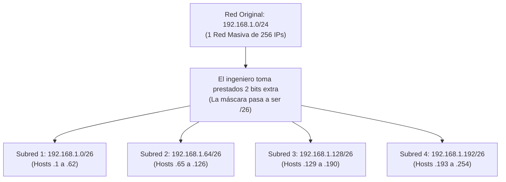

El **Subnetting** (proceso matemático de creación de subredes) es la técnica fundamental de diseño IP que consiste en dividir o fragmentar un bloque masivo y contiguo de direcciones de red física, en múltiples redes lógicas más pequeñas, eficientes y seguras, llamadas subredes.

> [!info] Explicación: ¿Por qué necesitamos hacer Subnetting?
> Imagina una universidad a la que le asignan la gran red `172.16.0.0/16`, la cual contiene 65,534 direcciones IP posibles de usar. Si los ingenieros conectan el ordenador de la cafetería, la PC del profesor, el equipo de finanzas de la universidad y el Wi-Fi de los estudiantes directamente en esa misma y única red gigantesca, sucederán dos desastres:
> 1. **Caos y Ruido:** Cada vez que una computadora pregunte a gritos por una impresora (tráfico broadcast), las otras 65,000 máquinas tendrán que procesar inútilmente ese grito de fondo, saturando los procesadores y colapsando el ancho de banda.
> 2. **Seguridad Nula:** Cualquier estudiante travieso podría escanear la red y acceder sin bloqueos a la base de datos de notas, ya que todos están en el mismo segmento de red plano (dominio de broadcast). 
> **El Subnetting** resuelve todo esto usando las matemáticas de la Máscara de Subred para "cortar un bloque sólido de queso en múltiples cubitos individuales", forzando a que las redes se aíslen las unas de las otras, lo cual permite usar routers y cortafuegos (firewalls) para controlar el paso.

## Conceptos Lógicos Clave

1. **Máscara de Subred (Subnet Mask):**
   Es la plantilla matemática estricta de 32 bits que procesa un router para poder encontrar la frontera invisible que separa la porción de "Red/Subred" y la porción de "Host" (equipo) de una dirección IP. En el procesamiento binario por computadora, los bits con valor "1" blindan e indican el identificador estricto de la red, mientras que los ceros "0" indican qué bits el administrador puede manipular para entregarlos a las computadoras.
   - *Ejemplo decimal:* `255.255.255.0` (En binario: 24 bits seguidos encendidos en 1, y 8 bits en 0).

2. **Notación CIDR (Classless Inter-Domain Routing):**
   Es la notación abreviada, rápida y moderna inventada para representar la máscara de subred. En lugar de forzar a los ingenieros a escribir y leer un engorroso `255.255.255.0`, se escribe simplemente `/24` al final de la IP (lo que significa directamente "esta máscara tiene 24 bits encendidos en 1").

3. **Direcciones Prohibidas por la Matemática (Red y Broadcast):**
   En cada subred que se fragmente en el planeta, se "sacrifican" obligatoriamente dos direcciones que el software tiene prohibido usar para ordenadores:
   - **Dirección de Red (La primera IP):** Es la primera dirección de la subred (cuando matemáticamente todos los bits de host son 0). No se puede asignar a ninguna computadora; es el "nombre del edificio" y sirve como el identificador general de esa red para las tablas de rutas de los routers globales.
   - **Dirección de Broadcast (La última IP):** Es la última dirección de la subred (cuando matemáticamente todos los bits de host son 1). Tampoco se asigna a computadoras; es una dirección de envío masivo. Un paquete enviado a esta dirección será clonado obligatoriamente por el switch para ser arrojado a todas las computadoras activas en la subred.

## Proceso de División de Redes (Método CLSM)

Para crear subredes más pequeñas, el ingeniero debe invadir la máscara de red original y "tomar prestados" bits que antes pertenecían a la porción de Host (los 0), y convertirlos forzosamente en bits de Red (convertirlos a 1).

**Las dos fórmulas matemáticas absolutas:**
- **Calcular cantidad de subredes posibles creadas:** $2^n$ *(Donde "n" es exactamente la cantidad de bits robados a los ceros y convertidos a unos).*
- **Calcular cantidad de hosts útiles disponibles por cada subred:** $2^h - 2$ *(Donde "h" es la cantidad de ceros que te sobraron intactos para jugar. La resta obligatoria de "-2" es para eliminar la IP de Red y la IP de Broadcast de la cuenta, ya que no puedes dárselas a una PC).*

## VLSM (Variable Length Subnet Masking)

El subnetting clásico base (CLSM, el que acabamos de ver en el gráfico anterior) tiene un defecto letal y derrochador: corta el "pastel de red" en rebanadas matemáticamente idénticas. Si haces 4 subredes, cada subred tendrá exactamente 62 direcciones posibles. 

Sin embargo, en la arquitectura del mundo real de una corporación, un bloque de un edificio podría necesitar 100 IPs, mientras que un minúsculo enlace serial punto-a-punto entre dos routers únicamente necesita 2 IPs operativas. Si a este enlace le asignas una subred clásica de 62 IPs, estarías desperdiciando trágicamente 60 IPs públicas o privadas irrecuperables.

**VLSM (Subnetting de Máscara de Longitud Variable)** es la evolución de diseño definitiva. Permite al ingeniero hacer "Subnetting sobre Subnetting". Toma una subred pequeña ya creada, la vuelve a romper aplicando nuevas máscaras más largas y exigentes (ej. subredes de `/30`), permitiendo fraccionar la subred original a medida de la necesidad asimétrica real de cada departamento de la compañía, logrando un ahorro de recursos del 100%.

## Notas relacionadas
- [[Direccionamiento IPv4]]
- [[Enrutamiento]]
- [[VLAN]]
