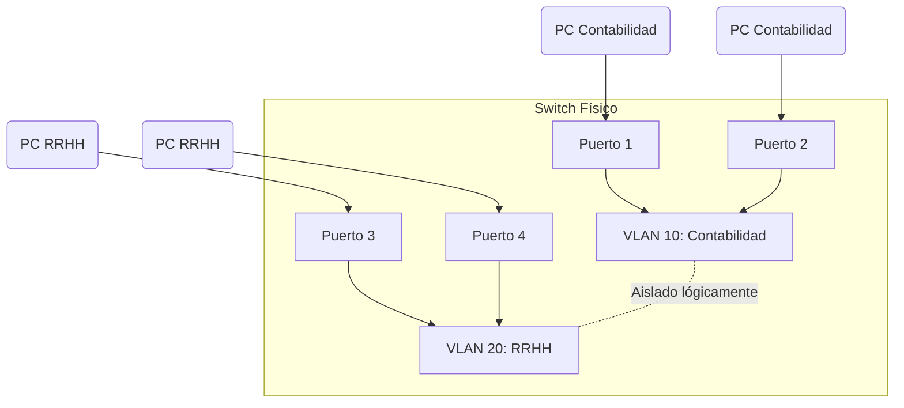

Dentro de una red conmutada, las VLAN proporcionan segmentación y flexibilidad organizativa fundamental. Un grupo de dispositivos asignados a una misma VLAN se comunican entre sí como si estuvieran conectados físicamente al mismo cable o switch, sin importar dónde se encuentren realmente ubicados en el edificio. Las VLAN se basan en conexiones lógicas, en lugar de conexiones físicas rígidas.

> [!info] Explicación: ¿Qué es una VLAN?
> Una **VLAN (Virtual Local Area Network)** o Red de Área Local Virtual, es una tecnología que permite crear múltiples redes lógicas independientes dentro de una misma infraestructura de red física. 
> **¿Para qué sirve?** Sirve para agrupar equipos según su departamento, función o nivel de seguridad (ej. Contabilidad, Recursos Humanos, Invitados), sin importar a qué puerto del switch estén conectados. 
> **Ejemplo simple:** En un edificio corporativo, en lugar de comprar switches y cables separados para cada departamento, usamos el mismo switch físico para todos. Mediante configuración lógica (VLANs), separamos el tráfico para que los equipos de Contabilidad no puedan ver a los de Recursos Humanos.

Las VLAN permiten que el administrador divida las redes en segmentos basándose en factores operativos (función, equipo del proyecto, aplicación) sin tener en cuenta la ubicación física del usuario. Cada VLAN se considera un dominio de difusión y una subred IP lógicamente diferente. Cualquier puerto físico de un switch puede configurarse para pertenecer a una VLAN específica.

Los paquetes de unidifusión (unicast), difusión (broadcast) y multidifusión (multicast) se reenvían **solamente** a los dispositivos que pertenecen a la misma VLAN donde se originaron los paquetes.

Al crear estos dominios lógicos, las VLAN mejoran el rendimiento general de la red dividiendo un gran dominio de difusión en varios dominios más pequeños.

> [!info] Explicación: Dominio de Difusión (Broadcast Domain)
> **Definición:** Es el área lógica en una red donde cualquier computadora conectada puede transmitir mensajes de broadcast directamente a todos los demás sin usar un router. 
> **Importancia:** Al reducir el tamaño de los dominios de difusión usando VLANs, se disminuye el "ruido" excesivo en la red, ya que los mensajes ruidosos (como las peticiones DHCP o ARP) solo inundan a los equipos que pertenecen a esa VLAN específica, en lugar de molestar a todo el edificio.

El estándar IEEE 802.1Q es el protocolo principal utilizado en las tarjetas de red (NIC) y switches para habilitar el etiquetado de VLANs.

## Tipos de VLAN

### **VLAN predeterminada**
La VLAN predeterminada de fábrica para todos los switches Cisco es la VLAN 1.
Datos vitales a recordar sobre la VLAN 1:
- Todos los puertos del switch se asignan a la VLAN 1 de manera predeterminada.
- De manera predeterminada, la VLAN nativa de los enlaces troncales es la VLAN 1.
- De manera predeterminada, la VLAN de administración (SVI) es la VLAN 1.
- No es posible eliminar, renombrar ni suspender la VLAN 1.

### **VLAN de datos**
Las VLAN de datos son VLAN configuradas específicamente para separar y transportar el tráfico generado por el usuario (como navegación web, correo electrónico y transferencia de archivos). Una red empresarial moderna suele tener docenas de VLAN de datos diferentes. Por buenas prácticas de diseño, nunca se debe mezclar el tráfico de voz o el tráfico de administración de red dentro de una VLAN de datos estándar.

### **VLAN nativa**
Cuando el tráfico de un usuario viaja desde un switch a otro a través de un enlace troncal (Trunk), este tráfico se "etiqueta" con un identificador (VLAN ID) para que el switch receptor sepa a qué VLAN pertenece.
Sin embargo, los switches también pueden necesitar enviar tráfico heredado o de control sin etiqueta. El enlace troncal 802.1Q coloca automáticamente todo el tráfico que llega "sin etiquetar" (untagged) en la VLAN nativa.

> [!info] Explicación: VLAN Nativa y Enlaces Troncales (Trunks)
> **Concepto:** Un enlace troncal es un cable configurado entre dos switches que transporta el tráfico de *múltiples* VLANs simultáneamente. Para no mezclar los datos, se inserta una "etiqueta" (Tag 802.1Q) en cada trama.
> **¿Por qué la VLAN Nativa?** Es una regla de excepción: cualquier tráfico que viaje por el cable troncal *sin* etiqueta se considera propiedad de la VLAN nativa. Por razones críticas de seguridad, la VLAN nativa siempre debe cambiarse de la VLAN 1 (por defecto) a una VLAN no utilizada (ej. VLAN 99).

### **VLAN de administración**
Una VLAN de administración es una VLAN aislada, configurada específicamente para transportar el tráfico de administración de la infraestructura de red, incluyendo protocolos como SSH, Telnet, HTTPS y SNMP para gestionar switches y routers.

### **VLAN de voz**
Se requiere una VLAN separada exclusivamente para admitir la tecnología de Voz sobre IP (VoIP). Para que el tráfico de voz fluya correctamente, necesita:
- Ancho de banda garantizado para asegurar la nitidez de la llamada.
- Prioridad alta de transmisión sobre los otros tipos de tráfico de la red (QoS).
- Capacidad para ser enrutado rápidamente en áreas congestionadas.
- Una demora (latencia) inferior a 150 ms en un solo sentido.
Para cumplir con estos estrictos requerimientos, la red debe configurarse separando la voz de los datos regulares.

> [!info] Explicación: ¿Por qué separar voz y datos?
> Los paquetes de voz (VoIP) son extremadamente sensibles al retraso (jitter). Si estás descargando un archivo pesado de varios gigabytes (datos) y al mismo tiempo realizando una llamada (voz) en la misma red no dividida, la llamada se entrecortará o sonará robótica. Separarlos mediante VLANs permite al switch darle "carril prioritario" a la voz.

## Ventajas de las VLAN
- **Seguridad mejorada:** Aislamiento del tráfico sensible.
- **Reducción de costos:** Menor necesidad de equipos físicos dedicados.
- **Mejor rendimiento:** Reducción de dominios de difusión.
- **Mitigación de tormentas de broadcast:** El ruido de red se contiene dentro de cada VLAN.

## Identificación de VLAN y Etiquetado (Tagging)

### **Detalles del campo VLAN Tag (802.1Q)**
Cuando se etiqueta una trama Ethernet para viajar por un enlace troncal, se inserta un campo adicional de 4 bytes que consta de los siguientes elementos:

- **Tipo (TPID)** - Un valor de 2 bytes que para Ethernet siempre se establece en `0x8100`, indicando que es una trama etiquetada.
- **Prioridad de usuario** - Un valor de 3 bits que permite implementar la Calidad de Servicio (QoS).
- **Identificador de Formato Canónico (CFI)** - Identificador de 1 bit para compatibilidad con redes heredadas Token Ring.
- **VLAN ID (VID)** - El componente más importante. Es un número de 12 bits que identifica a la VLAN, permitiendo crear hasta 4096 VLANs distintas.

> [!info] Explicación: Etiquetado 802.1Q
> Es el estándar oficial (y el único utilizado en redes modernas) que permite la inserción de una cabecera de 4 bytes en medio de la trama original de Ethernet. El switch añade la etiqueta al enviar la trama por el enlace troncal y el switch receptor la lee y la quita antes de entregarla al equipo final.

### VLAN nativas y comportamiento del etiquetado
El estándar IEEE 802.1Q requiere la designación de una VLAN nativa por cada enlace troncal. 

#### **Tramas etiquetadas en la VLAN nativa**
Por definición, el tráfico asociado a la VLAN nativa **no** debe etiquetarse. Si por algún error de configuración, un puerto de enlace troncal recibe una trama que sí trae una etiqueta explícita coincidente con la VLAN nativa configurada, el switch descartará la trama por seguridad.

#### **Tramas sin etiquetas en la VLAN nativa**
Cuando un puerto troncal recibe tramas regulares sin etiquetar (algo poco usual si la red solo tiene switches), envía automáticamente esas tramas hacia la VLAN nativa. Si no hay dispositivos legítimos asociados a esta VLAN (como recomienda el diseño seguro), la trama simplemente se descarta sin causar problemas.

*Relacionado con:* 
- [[Inter-VLAN]]
- [[DCHPv4]]
