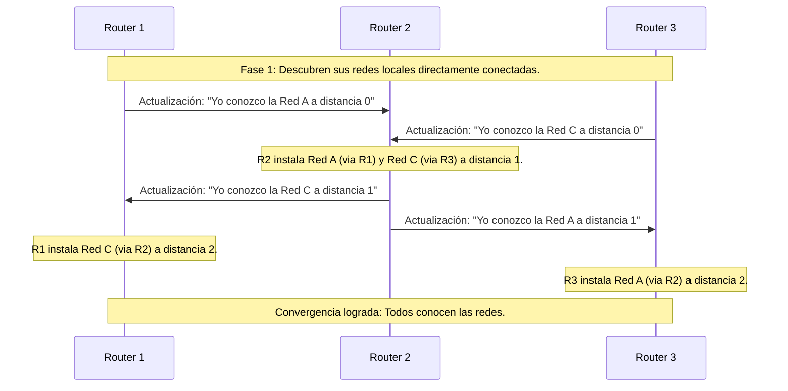

Los protocolos de enrutamiento de **vector distancia** (Distance Vector) fundamentan sus decisiones de determinación de ruta evaluando la dirección de salida (el **vector**) y la métrica de costo acumulado (la **distancia**) hacia una red de destino.

El uso de protocolos de enrutamiento de tipo propietario (exclusivos de un solo fabricante, como las versiones iniciales de IGRP) limitaba severamente la escalabilidad de la red, ya que no eran compatibles con dispositivos de otras marcas. Afortunadamente, protocolos como RIP o la versión abierta de EIGRP resolvieron en parte este problema.

En esta familia de protocolos, los routers comparten información de red enviando copias totales o parciales de sus propias tablas de enrutamiento a intervalos regulares hacia sus vecinos directos (aquellos routers que comparten un enlace físico y hablan el mismo protocolo).

> [!info] Explicación: Protocolo Vector Distancia
> **¿Qué es?** Es una familia básica de protocolos de enrutamiento (como RIP, RIPv2 o EIGRP). Imagina que estás manejando en una carretera larga y cada vez que pasas por un peaje, el cajero te dice "Para ir a la ciudad B, sigue por este camino hacia el norte (Vector) y llegarás después de cruzar 3 peajes más (Distancia)".
> **El problema ciego:** En estos protocolos, el router nunca tiene un mapa completo de toda la topología de la red. "Enrutan por rumor": simplemente confían ciegamente en lo que sus vecinos directos les dicen sobre las rutas lejanas disponibles.

## Características Principales
- **Tiempo de Convergencia:** Es el tiempo que tardan todos los routers de la red en pasarse los "rumores", compartir la información y alcanzar un estado de conocimiento constante en el que todos concuerdan plenamente sobre cuáles son las mejores rutas.
- **Escalabilidad:** Define qué tan masiva puede llegar a ser una red utilizando el protocolo sin que la sobrecarga de mensajes degrade el ancho de banda útil. RIP, por ejemplo, está limitado a un máximo de 15 saltos de distancia.
- **Protocolos con Clase (Classful):** Son protocolos obsoletos que **no** envían la máscara de subred en sus actualizaciones (ej. RIPv1, IGRP), imposibilitando el uso de subredes modernas de tamaño variable.
- **Protocolos sin Clase (Classless):** Protocolos modernos que sí incluyen explícitamente la máscara de subred en los mensajes de actualización, permitiendo la implementación técnica de VLSM (ej. RIPv2, EIGRP).

## Ventajas y Desventajas

| Ventajas | Desventajas |
| -------- | ----------- |
| Implementación y mantenimiento extremadamente simples en redes pequeñas. | Convergencia dolorosamente lenta: a menudo dependen de temporizadores para enviar actualizaciones periódicas en lugar de reaccionar de inmediato a los cambios. |
| Bajos requisitos de hardware: no requieren grandes cantidades de memoria RAM ni procesadores potentes, puesto que no ejecutan algoritmos matemáticos pesados para retener la topología global. | La convergencia lenta puede limitar significativamente el tamaño máximo de la red y causar graves "bucles de enrutamiento" si no se configuran mecanismos de mitigación (como el Split Horizon o el Route Poisoning). |

## Detección de Redes (Proceso de Rumores)

El proceso secuencial mediante el cual los routers de vector distancia aprenden sobre las redes lejanas consta de las siguientes fases:

1. **Descubrimiento inicial de la red local:**
   El router reconoce inicialmente las redes IP a las que sus propias interfaces de hardware están conectadas directamente (Distancia 0).
2. **Intercambio inicial de información:**
   Los routers comparten sus rutas locales conocidas hacia sus vecinos inmediatos.
3. **Intercambio continuo (Routing by Rumor):** 
   Mediante actualizaciones constantes, los routers obtienen información sobre redes remotas (básicamente, conocen y confían en los "vecinos de sus vecinos"), integrándolas a sus propias tablas de enrutamiento y sumándole +1 a la métrica de saltos original.

## Mantenimiento de Tablas y Mitigación de Bucles

Debido a su propensión a los bucles de enrutamiento, protocolos como RIP utilizan diversos temporizadores estrictos para mantener la precisión de la tabla:
- **Temporizador de actualización (Update Timer):** Por defecto, las actualizaciones con la tabla de enrutamiento completa se envían masivamente a los vecinos cada 30 segundos (esto genera mucho tráfico inútil).
- **Temporizador de invalidez (Invalid Timer):** Si no se recibe la actualización reafirmante de una ruta en un tiempo largo (ej. 180 seg), el router empieza a sospechar y marca la ruta como inválida.
- **Temporizador de espera (Hold-down Timer):** Impide que una ruta recientemente marcada como inválida sea reinstalada por accidente debido a un rumor viejo que llegue tarde, ayudando dramáticamente a evitar bucles.
- **Temporizador de eliminación (Flush/Purge Timer):** Una vez transcurrido este largo tiempo límite (ej. 240 seg) tras invalidarse una ruta, esta se borra de manera definitiva de la tabla de enrutamiento local.

## Notas relacionadas
- [[Enrutamiento]]
- [[OSPFv2(Open Shortest Path First)]]
- [[estado de enlace]]
