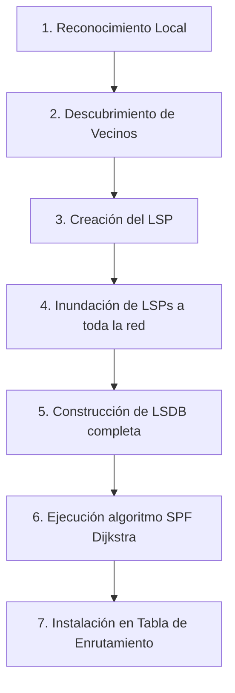

**Enlace (Link):** En el contexto de los protocolos de enrutamiento, se refiere a una interfaz de red específica en un router.
**Estado de enlace (Link-State):** Es la información detallada que posee un router sobre el estado operativo de sus enlaces, la cual incluye la dirección IP configurada, la máscara de subred, el costo del enlace y el tipo de red conectada. 

Los protocolos de estado de enlace (Link-State Routing Protocols) también se conocen comúnmente en la industria como protocolos **SPF** (Shortest Path First - El camino más corto primero), en honor al riguroso algoritmo matemático que utilizan para encontrar rutas eficientes a través del grafo de la red.

> [!info] Explicación: Protocolos de Estado de Enlace
> **¿Qué son?** Son protocolos de enrutamiento avanzados (como OSPF e IS-IS) donde cada router de la red crea internamente un "mapa" geográfico completo, matemático y detallado de toda la red, idéntico al de sus vecinos.
> **La regla de oro:** A diferencia de los protocolos de Vector Distancia tradicionales, en Estado de Enlace **la ruta más corta a un destino no es necesariamente la ruta que atraviesa la menor cantidad de routers (saltos)**, sino la ruta que ofrece el menor "costo" acumulado, dictado por el ancho de banda. Un camino de fibra óptica de 10 Gbps siempre será considerado mejor que un camino directo de cobre de 10 Mbps, incluso si el camino de fibra implica saltar por cinco routers adicionales.

## Proceso de Enrutamiento y Convergencia
La convergencia (el momento de equilibrio en el que todos los routers de la red han intercambiado la información, poseen el mapa completo y concuerdan en las rutas) ocurre mediante el siguiente proceso estandarizado:

1. **Reconocimiento local:** Cada router, al arrancar, identifica sus propias redes conectadas directamente y evalúa el estado físico de sus interfaces.
2. **Descubrimiento de vecinos:** Los routers envían constantemente pequeños paquetes de saludo (Hello packets) por todas sus interfaces activas para descubrir y establecer relaciones formales con otros routers directamente conectados.
3. **Creación del paquete LSP:** El router empaqueta toda la información de su estado en un Paquete de Estado de Enlace (LSP - Link-State Packet).
   - *Contenido del LSP:* Incluye información vital como el estado de sus enlaces directos (IP, máscara, costo) e información detallada sobre los vecinos que acaba de descubrir.
4. **Inundación de LSPs (Flooding):** El router envía copias de su LSP a todos sus vecinos descubiertos. Estos vecinos, a su vez, reenviarán una copia exacta a sus propios vecinos, asegurando que el LSP original inunde toda la red área hasta que cada router tenga una copia.
5. **Construcción de la base de datos y Cálculo:** Con todos los LSPs recibidos de todos los routers de la red, cada dispositivo construye una Base de Datos de Estado de Enlace (LSDB) masiva. Teniendo ahora un mapa topológico unificado, el router ejecuta el pesado algoritmo de Dijkstra (SPF) poniéndose a sí mismo en la raíz para calcular de forma independiente los caminos más rápidos hacia cada destino, llenando finalmente su tabla de enrutamiento IP.

## Cuadro Comparativo Link-State

| Ventajas | Desventajas |
| -------- | ----------- |
| Conocimiento topológico completo de toda la red, lo que previene por completo los bucles de enrutamiento. | Mayor consumo de memoria (RAM) para almacenar la LSDB y mayor esfuerzo de procesamiento (CPU) al ejecutar el algoritmo de Dijkstra. |
| Convergencia extremadamente rápida y confiable ante fallos físicos en la red. | Requiere un diseño de red jerárquico muy estricto (como el uso de Áreas en OSPF) para operar eficientemente en redes grandes. |
| Actualizaciones disparadas por eventos (solo se reenvían LSPs cuando hay un cambio real de topología), ahorrando ancho de banda. | La configuración, diseño y resolución de problemas (troubleshooting) son mucho más complejos en comparación con los protocolos simples de vector distancia. |

## Notas relacionadas
- [[OSPFv2(Open Shortest Path First)]]
- [[Enrutamiento]]
- [[Vector distancia]]
