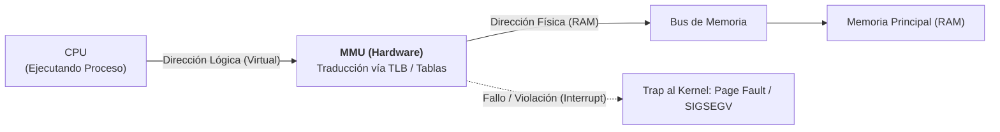
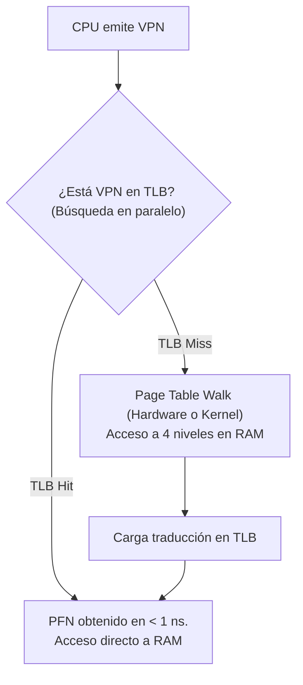
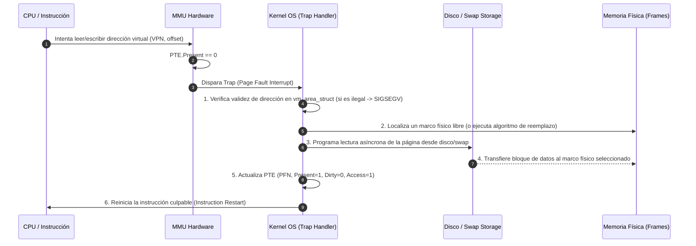
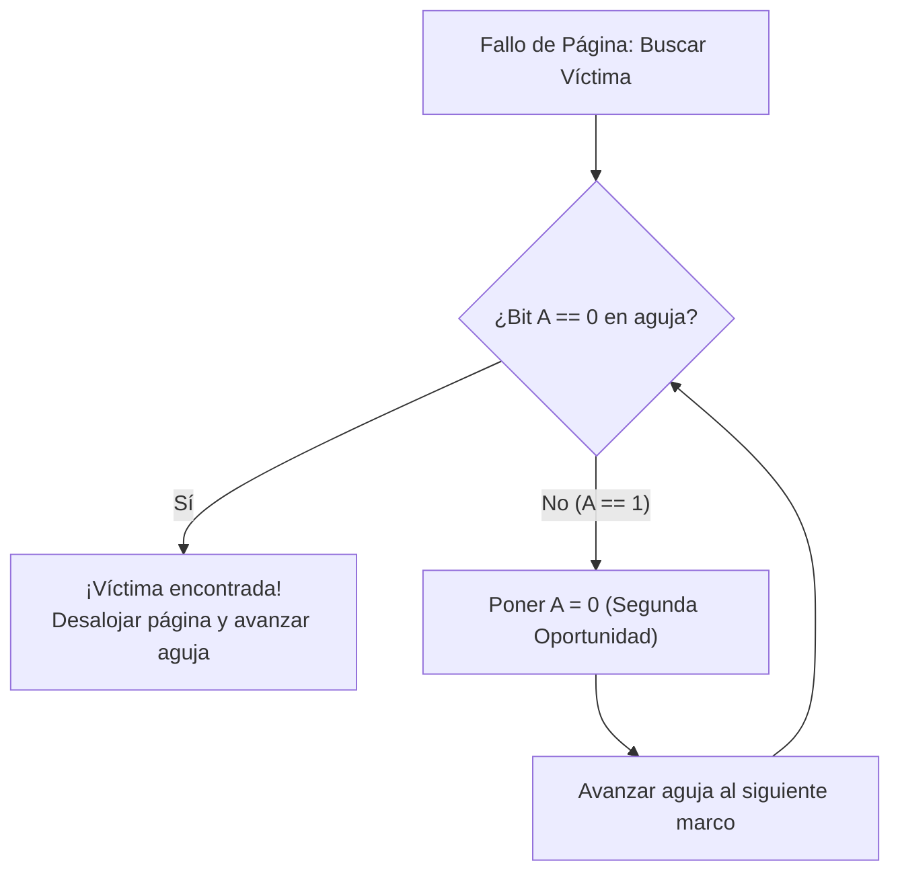

# Gestión de Memoria y Memoria Virtual

La memoria principal (RAM) es uno de los recursos físicos más críticos del computador. En los sistemas operativos multiprogramados modernos, el subsistema de gestión de memoria tiene la misión de proporcionar a cada proceso un espacio de memoria uniforme, seguro y protegido, abstrayendo las limitaciones de capacidad física del hardware mediante el concepto de **Memoria Virtual**.

> [!info] 💡 ¿Cómo entender esto desde cero? (Guía para novatos de pregrado)
> - **El milagro de la Memoria Virtual:** Imagina que compras una laptop modesta con 8 GB de memoria RAM. Pero abres Chrome (consume 4 GB), un IDE de programación (consume 3 GB), Spotify (1 GB) y además un juego que pide 6 GB. ¡Suman 14 GB! ¿Por qué tu computadora no colapsa?
> - **La gran mentira benévola del Sistema Operativo:** El SO le hace creer a CADA programa que tiene para él solo una memoria infinita y continua empezando desde la dirección 0.
> - **Paginación y Swap:** En realidad, la memoria se corta en pequeños bloques de 4 KB llamados **Páginas**. Los bloques que estás usando activamente en este segundo están en la memoria RAM rápida; los que dejaste olvidados en segundo plano hace media hora, el sistema operativo los guarda silenciosamente en tu disco duro (Swap / Paginación por demanda). Cuando vuelves a esa pestaña, ocurre un pequeño "Fallo de Página" (*Page Fault*) y el SO la regresa a la RAM en milisegundos sin que te des cuenta.

---

## 1. Jerarquía de Memoria y el Espacio de Direcciones

El hardware de almacenamiento computacional sigue un compromiso inevitable (*trade-off*) entre velocidad de acceso, costo por bit y capacidad de almacenamiento:

$$\text{Registros CPU } (< 1 \text{ ns}) \longrightarrow \text{Cachés L1/L2/L3 } (1 - 10 \text{ ns}) \longrightarrow \text{RAM } (\sim 50 - 100 \text{ ns}) \longrightarrow \text{NVMe SSD } (\sim 10 - 100 \ \mu\text{s}) \longrightarrow \text{HDD / Red } (\sim 5 - 10 \text{ ms})$$

### Direcciones Lógicas (Virtuales) vs Direcciones Físicas
- **Dirección Lógica (Virtual):** Dirección generada por la CPU durante la ejecución de las instrucciones de un programa en espacio de usuario. Cada proceso opera bajo la ilusión de poseer un espacio contiguo e ilimitado de memoria que comienza en la dirección `0x0`.
- **Dirección Física:** Dirección real mapeada en las líneas físicas del bus de direcciones de los módulos de memoria RAM.
- **Ventajas del Aislamiento:**
  1. **Protección Total:** Un proceso erróneo o malicioso no puede acceder ni corromper el espacio de direcciones de otro proceso ni del kernel.
  2. **Reubicación Dinámica:** Los programas pueden cargarse en cualquier posición de la RAM sin necesidad de recompilación.
  3. **Compartición de Memoria:** Múltiples procesos pueden compartir bibliotecas dinámicas compartidas (ej. `libc.so`) mapeando distintas direcciones virtuales al mismo marco físico.

---

## 2. La Unidad de Manejo de Memoria (MMU - Memory Management Unit)

La **MMU** es un dispositivo de hardware integrado dentro del procesador que intercepta en tiempo real cada dirección virtual emitida por la CPU y la traduce a una dirección física de memoria antes de colocarla en el bus del sistema.



Si la dirección virtual no está mapeada actualmente en la memoria física o los permisos de acceso son violados (ej. intento de escritura en segmento de código de sólo lectura), la MMU genera una interrupción de hardware hacia el sistema operativo: una **trampa de fallo de página (*Page Fault*)** o una excepción de segmentación (`SIGSEGV`).

---

## 3. Esquema de Paginación (Paging)

La paginación es el esquema de gestión de memoria virtual dominante en la computación moderna. Elimina por completo la necesidad de asignar memoria física de forma contigua, suprimiendo la **fragmentación externa**.

### División en Páginas y Marcos
- **Espacio Lógico:** Se divide en bloques contiguos de tamaño fijo denominados **Páginas (*Pages*)**.
- **Espacio Físico:** La memoria RAM se particiona en bloques del mismo tamaño exacto denominados **Marcos de Página (*Frames*)**. En arquitecturas estándar x86/x86_64, el tamaño canónico de página es de **4 KiB** ($4096 = 2^{12}$ bytes).

### Desglose de una Dirección Virtual
Una dirección lógica de $m$ bits generada por la CPU se descompone a nivel de hardware en dos componentes:

$$\text{Dirección Virtual} = \underbrace{[ \ p \ ]}_{m - n \text{ bits}} \ \underbrace{[ \ d \ ]}_{n \text{ bits}}$$

Donde:
- $p$ (**Número de Página Virtual - VPN**): Índice que identifica la entrada correspondiente en la Tabla de Páginas.
- $d$ (**Desplazamiento / Offset**): Posición exacta del byte dentro de la página ($0 \le d < 2^n$). Para páginas de 4 KiB, $n = 12$ bits.

```
       31                      12 11                 0
      +--------------------------+--------------------+
      |  Número de Página (p)    |  Desplazamiento(d) |
      +--------------------------+--------------------+
                   |                         |
                   v                         |
          [Tabla de Páginas]                 |
           Página p -> Marco f               |
                   |                         |
                   v                         v
      +--------------------------+--------------------+
      |   Número de Marco (f)    |  Desplazamiento(d) |
      +--------------------------+--------------------+
       31                      12 11                 0
                   Dirección Física Resultante
```

---

### Estructura de la Entrada de la Tabla de Páginas (PTE - Page Table Entry)

Cada entrada de la tabla de páginas contiene el número de marco físico correspondiente más una serie de bits de control gestionados conjuntamente por el hardware y el sistema operativo:

```
+-----+-----------------------+---+---+---+---+---+---+
| PFN | Reservado por el OS   | D | A | C | W | U | R |
+-----+-----------------------+---+---+---+---+---+---+
```
1. **PFN (Physical Frame Number):** Dirección base del marco físico en memoria RAM.
2. **Bit de Validez / Presencia (*Present/Absent Bit* - P):** Si es 1, la página reside actualmente en la memoria física; si es 0, la página se encuentra en almacenamiento secundario (swap/disco) o la dirección no es válida.
3. **Bit de Lectura / Escritura (*Read/Write Bit* - R):** Define permisos: 0 para sólo lectura (código), 1 para lectura y escritura (datos/heap/stack).
4. **Bit de Usuario / Supervisor (*User/Supervisor Bit* - U):** Si es 1, el código en modo usuario puede acceder a la página; si es 0, sólo el kernel en anillo 0 (*Ring 0*) tiene acceso.
5. **Bit de Suciedad (*Dirty / Modified Bit* - D):** Puesto a 1 por la MMU cuando se ejecuta cualquier instrucción de escritura sobre la página. Si la página es seleccionada para desalojo, este bit indica si debe escribirse en disco o puede descartarse limpiamente.
6. **Bit de Acceso / Referencia (*Accessed Bit* - A):** Puesto a 1 por el hardware cada vez que la página es leída o escrita. Esencial para los algoritmos de reemplazo como Segunda Oportunidad o Reloj.

---

### Arquitecturas Avanzadas de Tablas de Páginas

En una arquitectura de 32 bits con páginas de 4 KiB, hay $2^{20} \approx 10^6$ páginas; una tabla lineal ocuparía 4 MiB por proceso. Sin embargo, en arquitecturas de 64 bits ($2^{64}$ bytes), una tabla de páginas plana requeriría petabytes de RAM sólo para almacenar las entradas, lo cual es inviable.

#### 1. Tablas de Páginas Jerárquicas (Multinivel)
Dividen la tabla de páginas en múltiples niveles. En arquitecturas modernas x86_64 se utiliza un esquema de **4 niveles** (o 5 niveles con PML5):
- `CR3` $\to$ PML4 (Page Map Level 4) $\to$ PDPT (Page Directory Pointer Table) $\to$ PD (Page Directory) $\to$ PT (Page Table) $\to$ Marco Físico.
- *Ventaja Clave:* Las tablas intermedias correspondientes a regiones de memoria no asignadas no se instancian físicamente en RAM, ahorrando gigabytes de memoria.


#### 2. Tablas de Páginas Invertidas (*Inverted Page Tables*)
- En lugar de mantener una tabla por cada proceso, existe una **única tabla global** para todo el sistema, indexada por el número de marco físico de la RAM.
- Cada entrada almacena el par `(PID, VPN)`.
- *Ventaja:* El consumo de memoria es proporcional al tamaño de la RAM física, no al tamaño de los espacios virtuales.
- *Desventaja:* La búsqueda tradicional requiere un escaneo lineal costoso; se combina obligatoriamente con **tablas de dispersión (*Hash Tables*)**.

---

### Translation Lookaside Buffer (TLB)

Si cada acceso a memoria virtual requiriera consultar una tabla de 4 niveles, cada lectura o escritura tardaría $4 + 1 = 5$ accesos a la RAM, reduciendo el rendimiento del computador en un 80%.

Para solucionar este cuello de botella, los procesadores incorporan la **TLB**: una memoria asociativa direccionable por contenido (CAM) de ultra alta velocidad situada en el silicio de la CPU que almacena en caché las traducciones recientes de $\text{VPN} \to \text{PFN}$.



#### Cálculo Formal del Tiempo de Acceso Efectivo (EAT)
Sea $\alpha$ la tasa de aciertos de la TLB (*Hit Ratio*), $t_{tlb}$ el tiempo de consulta a la TLB, y $t_{mem}$ el tiempo de acceso a la memoria RAM principal.

En un sistema con una tabla de páginas simple (1 nivel, donde un miss requiere 2 accesos a RAM: uno para la tabla y otro para el dato):
$$\text{EAT} = \alpha \cdot (t_{tlb} + t_{mem}) + (1 - \alpha) \cdot (t_{tlb} + 2 \cdot t_{mem})$$

Para una tabla jerárquica de $k$ niveles:
$$\text{EAT} = \alpha \cdot (t_{tlb} + t_{mem}) + (1 - \alpha) \cdot (t_{tlb} + (k + 1) \cdot t_{mem})$$

> [!EXAMPLE] Ejemplo Numérico de EAT en Arquitectura x86_64 ($k=4$ niveles)
> Supongamos $t_{tlb} = 1\text{ ns}$, $t_{mem} = 50\text{ ns}$ y una tasa de acierto $\alpha = 98\%$:
> $$\text{EAT} = 0.98 \cdot (1 + 50) + (1 - 0.98) \cdot (1 + (4+1)\cdot 50)$$
> $$\text{EAT} = 0.98 \cdot (51) + 0.02 \cdot (251) = 49.98 + 5.02 = 55.0\text{ ns}$$
> Gracias al 98% de TLB Hit, la penalización de los 4 niveles de indirección se reduce a solo un 10% de overhead respecto a un acceso físico puro ($50\text{ ns}$).

---

## 4. Memoria Virtual por Paginación bajo Demanda (Demand Paging)

Bajo el esquema de **paginación bajo demanda**, las páginas de un programa no se cargan en la RAM al iniciar el proceso; en su lugar, se cargan únicamente cuando el procesador intenta acceder a ellas en tiempo de ejecución (filosofía *Lazy Loading*).

### La Rutina de Atención de Fallo de Página (Page Fault Handler)

Cuando la CPU intenta acceder a una dirección virtual cuya PTE tiene el bit de presencia en 0 ($P=0$), el hardware de la MMU aborta la instrucción y dispara un **Fallo de Página (Page Fault Interrupt)**.



#### Los 6 Pasos Canónicos:
1. **Trampa al Kernel:** La MMU verifica la entrada de la tabla de páginas y, al encontrar $P=0$, genera una trampa interna al sistema operativo.
2. **Comprobación de Legalidad:** El kernel consulta los descriptores de memoria del proceso (`task_struct->mm->mmap`). Si la dirección está fuera del espacio asignado o viola permisos (ej. escribir en código), el SO envía la señal `SIGSEGV` y termina el proceso.
3. **Búsqueda de Marco Físico:** El kernel busca un marco de página libre en la lista de páginas disponibles (*free list*). Si no hay marcos libres, se ejecuta un **algoritmo de reemplazo de páginas** para desalojar una página víctima (escribiéndola en swap si su bit $D=1$).
4. **Operación de Entrada/Salida:** El kernel programa una lectura de disco para transferir el contenido de la página requerida al marco físico asignado. Mientras la E/S se completa, el proceso se coloca en estado `Waiting/Blocked` y la CPU se cede a otro proceso listo.
5. **Actualización de Tablas:** Una vez finalizada la transferencia por DMA, el controlador de disco interrumpe al procesador. El kernel escribe el número de marco ($PFN$) en la PTE y conmuta el bit de validez a $P=1$.
6. **Reinicio de la Instrucción:** El planificador despierta al proceso (`Ready`). Cuando es despachado a la CPU, el procesador reinicia exactamente la instrucción que provocó el fallo de página, la cual ahora se ejecuta con éxito.

---

## 5. Algoritmos de Reemplazo de Páginas

Cuando se produce un fallo de página y la memoria RAM física está completamente llena, el sistema operativo debe decidir cuál de las páginas residentes debe ser desalojada para liberar su marco.

### 1. FIFO (First-In, First-Out) y la Anomalía de Bélády
El algoritmo desaloja la página que ha permanecido más tiempo en la memoria RAM (la más antigua).

> [!WARNING] La Anomalía de Bélády (László Bélády, 1969)
> Intuitivamente, conceder más marcos de memoria física a un proceso debería reducir (o al menos no aumentar) el número de fallos de página. Sin embargo, bajo el algoritmo FIFO, existen ciertas cadenas de referencia donde **aumentar el número de marcos incrementa el número total de fallos de página**.
> 
> *Ejemplo canónico:* Cadena de referencia: `1, 2, 3, 4, 1, 2, 5, 1, 2, 3, 4, 5`.
> - Con **3 marcos físicos:** Produce **9 fallos de página**.
> - Con **4 marcos físicos:** Produce **10 fallos de página**.
> 
> Esto ocurre porque FIFO no pertenece a la clase de algoritmos denominados **Algoritmos de Pila (*Stack Algorithms*)**, donde el conjunto de páginas residentes con $m$ marcos es siempre un subconjunto estricto del conjunto con $m+1$ marcos.

---

### 2. Algoritmo Óptimo de Bélády (OPT / MIN)
- **Principio:** Reemplaza aquella página que **no será utilizada durante el mayor periodo de tiempo futuro**.
- **Propiedad:** Garantiza la tasa mínima absoluta de fallos de página para cualquier cadena de referencia. Está libre de la anomalía de Bélády (es un algoritmo de pila).
- **Inviabilidad Práctica:** Requiere conocimiento perfecto del futuro, el cual no está disponible para un sistema operativo de propósito general. Se utiliza exclusivamente como **cota inferior teórica de referencia** (*benchmark*) en análisis de laboratorio.

---

### 3. LRU (Least Recently Used)
- **Principio:** Basado en el principio de localidad temporal: si una página fue utilizada recientemente, es muy probable que vuelva a ser consultada en el futuro próximo. Desaloja la página que **no ha sido utilizada durante el periodo de tiempo más prolongado en el pasado**.
- **Implementación Teórica:**
  1. *Contadores de Hardware:* La CPU añade un reloj de 64 bits a cada PTE en cada acceso. Al reemplazar, se escanea la tabla buscando el contador mínimo ($O(n)$).
  2. *Pila Doblemente Enlazada:* Cada referencia mueve el nodo de la página al tope de la pila; la base siempre contiene la víctima LRU ($O(1)$ para reemplazo, pero overhead masivo en cada acceso a memoria).
- **Costo:** Requiere soporte intensivo de hardware que resulta demasiado costoso para integrarse en accesos a memoria de nanosegundos.

---

### 4. Aproximaciones Prácticas de LRU

#### Algoritmo de Segunda Oportunidad (Reloj / Clock)
Es la aproximación más utilizada en sistemas de producción. Emplea el bit de acceso o referencia ($A$) provisto por la MMU.
1. Las páginas se organizan lógicamente en una lista circular con un puntero que actúa como la aguja de un reloj.
2. Cuando se requiere un marco víctima:
   - Si la página apuntada tiene $A = 0$, es seleccionada de inmediato como la víctima.
   - Si la página tiene $A = 1$, el kernel le da una "segunda oportunidad", pone su bit $A = 0$, avanza la aguja al siguiente marco y repite la inspección.



#### Algoritmo de Envejecimiento (Aging)
Mantiene un registro de desplazamiento de 8 bits por cada marco. En cada interrupción del temporizador de hardware:
1. El sistema desplaza el registro hacia la derecha una posición.
2. Copia el valor actual del bit de referencia $A$ en el bit más significativo (MSB) y resetea $A$ a 0.
3. La página con el menor valor entero en su registro de 8 bits es la menos referenciada recientemente.

---

## 6. Hiperpaginación (Thrashing)

La **hiperpaginación (*thrashing*)** es una patología catastrófica del sistema operativo donde los procesos pasan sustancialmente **más tiempo paginando (transfiriendo páginas hacia y desde el disco de swap) que ejecutando instrucciones útiles en la CPU**.


### Causa Raíz
Ocurre cuando la suma de los tamaños de los conjuntos de trabajo de todos los procesos activos en ejecución supera la cantidad total de memoria RAM física instalada:

$$\sum_{i=1}^{N} \text{WSS}_i > \text{Memoria Física Total}$$

---

### Solución 1: El Modelo del Conjunto de Trabajo (Working Set Model)
Propuesto por Peter Denning en 1968, se fundamenta en el **principio de localidad**: un proceso no accede a toda su memoria aleatoriamente, sino que concentra sus referencias en una ventana de páginas activa en cada fase.

- **Ventana del Conjunto de Trabajo ($\Delta$):** Parámetro temporal que define un número fijo de referencias a memoria recientes.
- **Conjunto de Trabajo ($WS_i(t)$):** Conjunto de todas las páginas distintas referenciadas por el proceso $P_i$ durante el intervalo $[t - \Delta, t]$.
- **Tamaño del Conjunto de Trabajo ($WSS_i(t) = |WS_i(t)|$):** Cantidad de marcos mínimos necesarios para que el proceso opere sin provocar ráfagas destructivas de fallos de página.

> [!IMPORTANT] Criterio de Admisión y Control de Thrashing
> Si $D = \sum WSS_i > \text{Total RAM}$, el sistema operativo debe **suspender (swap-out) un proceso completo**, desalojando todas sus páginas a disco y reduciendo el grado de multiprogramación hasta que $D \le \text{Total RAM}$.

### Solución 2: Control de Frecuencia de Fallos de Página (PFF - Page Fault Frequency)
Es un enfoque de retroalimentación directa que mide la tasa de fallos de página de cada proceso:
- Si la tasa de fallos supera un **umbral superior $U_{max}$**, el proceso necesita más memoria $\implies$ se le asignan marcos adicionales.
- Si la tasa de fallos cae por debajo de un **umbral inferior $U_{min}$**, el proceso tiene memoria subutilizada $\implies$ se le retiran marcos para otorgarlos a otros procesos.

---

## 7. Preguntas de Autoevaluación y Problemas Numéricos

1. **Demuestre numéricamente por qué en una arquitectura con tabla de páginas jerárquica de 4 niveles, una tasa de acierto en TLB del 99% es indispensable para la viabilidad comercial del computador.**
2. **Explique la diferencia esencial entre fragmentación interna y fragmentación externa en esquemas de gestión de memoria.**
3. **¿Bajo qué condiciones específicas se produce la Anomalía de Bélády en el algoritmo FIFO de reemplazo de páginas?**
4. **Describa la función de los bits Dirty ($D$) y Accessed ($A$) en la optimización del algoritmo del reloj mejorado.**
5. **Si un servidor entra en Hiperpaginación (Thrashing) y la utilización de CPU cae al 5%, ¿por qué admitir un nuevo proceso en el sistema agrava la situación en lugar de remediarla?**

---
*Documento estructurado conforme al sílabo de Sistemas Operativos - Facultad de Ingeniería de Sistemas, Escuela Politécnica Nacional.*