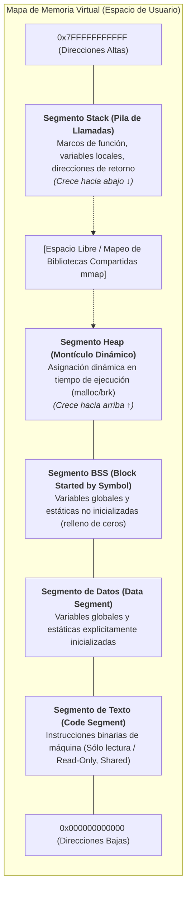
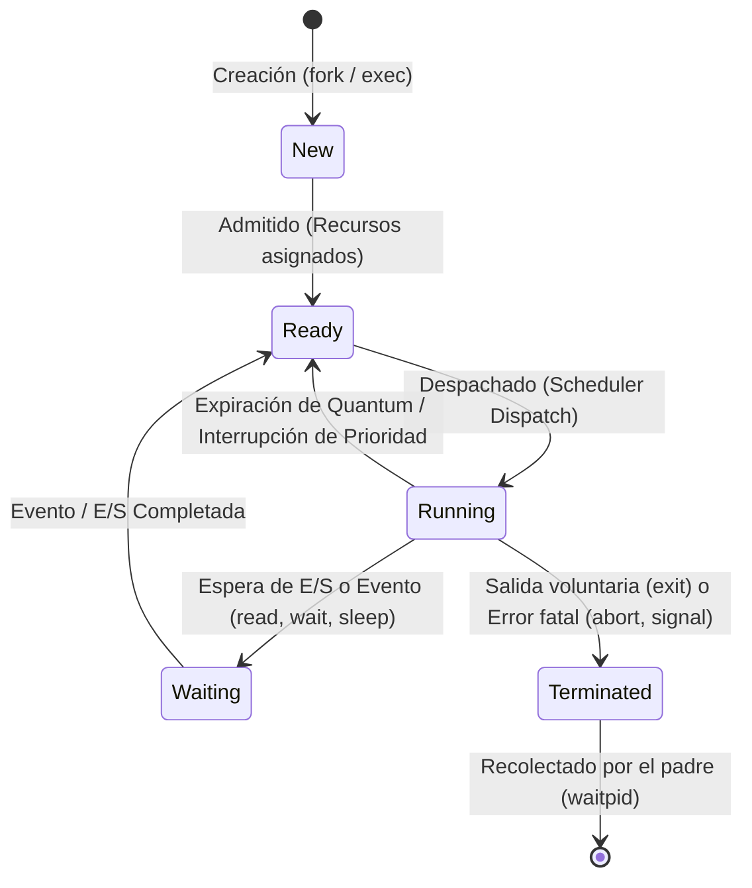
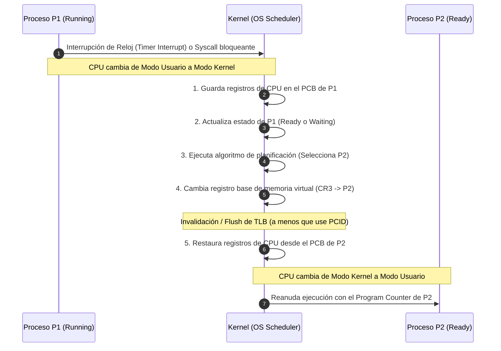
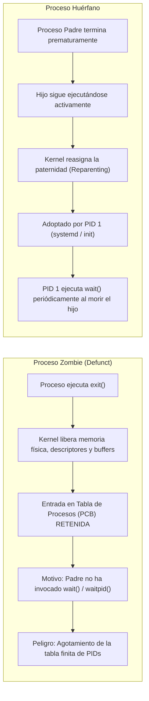
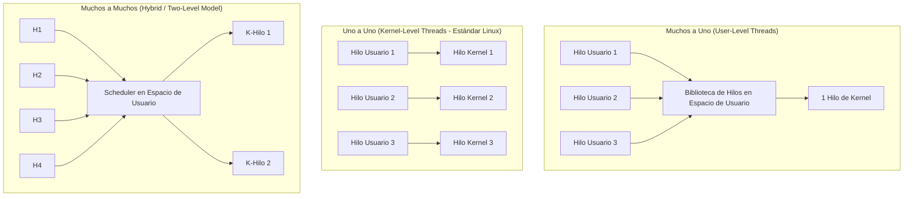
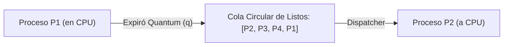
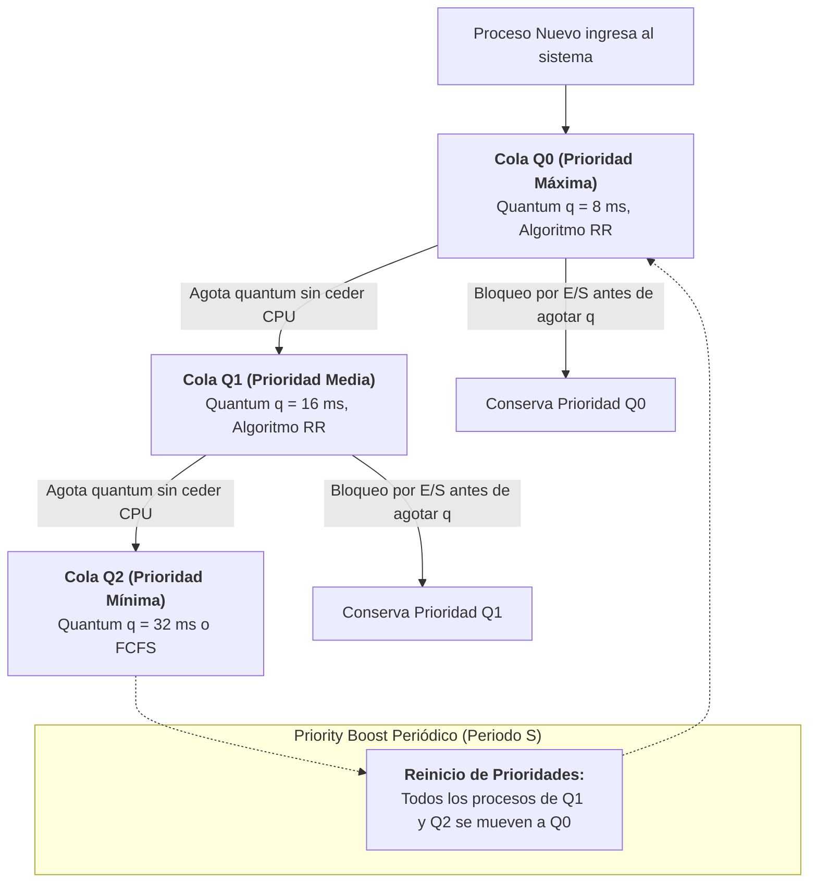

# Procesos, Hilos y Planificación de CPU

En la arquitectura de los sistemas operativos modernos, la abstracción central para la ejecución de software es el **Proceso**. El sistema operativo actúa como un árbitro y administrador de recursos (*resource allocator*), transformando el hardware estático (CPU, memoria física, buses de E/S) en un entorno multiprogramado y concurrente donde múltiples entidades parecen ejecutarse simultáneamente.

> [!info] 💡 ¿Cómo entender esto desde cero? (Guía para novatos de pregrado)
> - **¿Qué es un Proceso?** Un programa en tu disco (como Chrome.exe) es solo un archivo pasivo, como una partitura musical. Cuando le das doble clic, el Sistema Operativo lo carga en la memoria RAM y empieza a ejecutarlo: en ese momento se convierte en un **Proceso** (la orquesta tocando la partitura).
> - **La ilusión de hacer todo a la vez:** Tu procesador tiene pocos núcleos, pero puedes tener 150 programas abiertos sin problemas. ¿Cómo? El planificador de CPU cambia de un proceso a otro miles de veces por segundo (**Round Robin**). Para ti parece que todo corre en paralelo, pero en realidad es un ilusionista ultrarrápido.
> - **¿Qué es un Hilo (Thread)?** Un proceso es como una casa con su propio terreno cerrado (memoria aislada para que un programa no dañe a otro). Un hilo es como una persona viviendo en esa casa: varios hilos dentro del mismo proceso pueden compartir la cocina y la sala (la misma memoria), permitiendo que Chrome descargue un archivo mientras en otra pestaña navegas sin congelarte.

---

## 1. Concepto Formal de Proceso

Un **proceso** se define formalmente como un **programa en ejecución**. Mientras que un programa es una entidad pasiva almacenada en un medio de almacenamiento secundario (código binario compilado en formato ejecutable como ELF en Linux o PE en Windows), un proceso es una entidad activa que posee un contador de programa (*Program Counter* - PC), un conjunto de registros de CPU, un espacio de direcciones de memoria asignado y un conjunto de recursos del sistema asociados.

### Mapa de Memoria de un Proceso en Espacio de Usuario

En una arquitectura con memoria virtual protegida, el sistema operativo y la Unidad de Manejo de Memoria ([[Gestion de Memoria y Memoria Virtual|MMU]]) asignan a cada proceso un espacio de direcciones virtual contiguo. En el modelo canónico de Linux/UNIX para arquitecturas x86_64, el espacio de usuario se organiza en segmentos con propósitos estrictos:



#### Descripción Detallada de los Segmentos:
1. **Segmento de Texto (*Text Segment* o *Code Segment*):**
   - Contiene el código de máquina ejecutable del programa.
   - Se marca como **de sólo lectura (*Read-Only*)** a nivel de hardware mediante los bits de protección de la tabla de páginas para prevenir auto-modificación accidental o maliciosa.
   - Si múltiples procesos ejecutan el mismo binario (ej. varias instancias de `bash` o `gcc`), el kernel comparte físicamente las mismas páginas de memoria de texto entre ellos.
2. **Segmento de Datos Inicializados (*Data Segment*):**
   - Aloja variables globales y estáticas cuyo valor inicial ha sido definido por el programador antes de la compilación (ej. `int contador_global = 42;`).
   - Posee permisos de lectura y escritura (*Read/Write*).
3. **Segmento BSS (*Block Started by Symbol*):**
   - Aloja variables globales y estáticas declaradas pero no inicializadas explícitamente en el código fuente (ej. `static char buffer[4096];`).
   - En el archivo binario ELF en disco, este segmento no ocupa espacio real (únicamente almacena un entero con el tamaño requerido); al cargarse el proceso en RAM, el kernel inicializa todas estas direcciones a cero binario (`0x00`).
4. **Segmento Heap (*Montículo Dinámico*):**
   - Espacio reservado para memoria asignada dinámicamente en tiempo de ejecución mediante funciones de biblioteca como `malloc()`, `calloc()`, `realloc()` o el operador `new` en C++.
   - Administrado a bajo nivel mediante las llamadas al sistema `brk()` / `sbrk()` (que desplazan el *program break*) o `mmap()` para bloques de memoria de gran tamaño.
   - Crece de direcciones bajas hacia direcciones altas.
5. **Segmento Stack (*Pila de Llamadas*):**
   - Estructura LIFO (*Last In, First Out*) que gestiona la ejecución estructurada de subrutinas y funciones.
   - Cada llamada a función genera un **marco de activación (*Stack Frame*)** que contiene:
     - Argumentos pasados a la función.
     - Dirección de retorno al invocador.
     - Puntero al marco anterior (*Frame Pointer* / Base Pointer `rbp`).
     - Variables locales no estáticas.
     - Registros que deben ser preservados.
   - Crece en la arquitectura x86 desde direcciones altas hacia direcciones decrecientes.

> [!WARNING] Desbordamiento de Pila y Montículo (Stack vs Heap Collision)
> Si el Heap crece de forma desmedida por fugas de memoria (*memory leaks*) o el Stack crece indefinidamente por recursión infinita, podrían colisionar. Los sistemas operativos modernos intercalan una **página de guardia (*guard page*)** sin permisos de acceso entre ambos segmentos, disparando inmediatamente una trampa de violación de acceso de memoria (*Segmentation Fault*, señal `SIGSEGV`) antes de que ocurra una corrupción silenciosa de datos.

---

## 2. Bloque de Control de Proceso (PCB - Process Control Block)

El **PCB** (denominado `struct task_struct` en el código fuente del kernel de Linux) es la estructura de datos primordial del sistema operativo que encapsula toda la información necesaria para representar, gestionar y planificar un proceso específico.

```
                      +---------------------------------------+
                      |       Process ID (PID, TGID)          |
                      +---------------------------------------+
                      |     Estado del Proceso (State)        |
                      +---------------------------------------+
                      |   Program Counter (PC / RIP)          |
                      +---------------------------------------+
                      |  Registros de CPU (RAX, RBX, RSP...)  |
                      +---------------------------------------+
                      |    Información de Planificación       |
                      |  (Priority, Nice, Scheduling Class)   |
                      +---------------------------------------+
                      |    Punteros de Memoria (mm_struct)    |
                      |    (CR3 / PGD, Límites de Segmentos)  |
                      +---------------------------------------+
                      |  Tabla de Archivos Abiertos (files)   |
                      |  (Descriptores 0, 1, 2, sockets, ...) |
                      +---------------------------------------+
                      |  Información de E/S y Contabilidad    |
                      |  (Tiempos de CPU, consumo, I/O stats) |
                      +---------------------------------------+
                      | Contexto de Señales (signal_handlers) |
                      +---------------------------------------+
```

### Campos Esenciales del PCB:
1. **Identificador del Proceso (PID):** Entero positivo único asignado por el kernel para indexar el proceso en la tabla global de procesos.
2. **Estado del Proceso:** Indicador binario/enum que define si el proceso está activo, en espera o bloqueado.
3. **Contador de Programa (*Program Counter* - PC) y Registros:** Valores de los registros internos de la CPU (puntero de instrucción, acumuladores, registros índice, registro de estado/flags, puntero de pila `SP`).
4. **Información de Planificación de CPU:** Prioridad estática y dinámica, cola de planificación asignada, tiempo de ejecución acumulado, valor *nice* (-20 a +19 en UNIX) y clase de planificación (ej. `SCHED_NORMAL`, `SCHED_FIFO`, `SCHED_RR`).
5. **Información de Gestión de Memoria:** Puntero a la estructura `mm_struct`, que almacena la dirección física del directorio raíz de páginas (registro `CR3` en x86) y los descriptores de áreas de memoria virtual (`vm_area_struct`).
6. **Descriptores de Archivos y Recursos E/S:** Puntero a `struct files_struct`, que contiene la tabla de descriptores de archivos abiertos (índices enteros como 0 para `stdin`, 1 para `stdout`, 2 para `stderr`).
7. **Información Contable y de Auditoría:** Cantidad de tiempo de CPU consumido en modo usuario y modo kernel (`utime`, `stime`), límites de recursos (*rlimits*), y usuario propietario (UID, GID).

---

## 3. Modelo de Ciclo de Vida de 5 Estados

A lo largo de su existencia, un proceso transita por diversos estados discretos gestionados por las rutinas del despachador (*dispatcher*) y el planificador (*scheduler*).



### Definición Canónica de los Estados:
- **New (Nuevo):** El proceso está siendo creado; el kernel asigna el PCB y reserva identificadores, pero el proceso aún no ha sido cargado completamente en memoria para competir por la CPU.
- **Ready (Listo):** El proceso reside en la memoria principal y dispone de todos los recursos necesarios para ejecutarse, esperando únicamente que el planificador de la CPU le asigne tiempo de procesamiento.
- **Running (En Ejecución):** Las instrucciones del proceso están siendo ejecutadas físicamente en uno de los núcleos de procesamiento de la CPU.
- **Waiting / Blocked (Esperando / Bloqueado):** El proceso no puede ejecutarse aunque la CPU esté ociosa, debido a que espera la finalización de una operación sincrónica de E/S (disco, red), la liberación de un cerrojo ([[Sincronizacion, Seccion Critica y Deadlocks|Mutex]]), o la recepción de una señal.
- **Terminated (Terminado):** El proceso ha finalizado su ejecución; sus recursos de memoria y archivos son liberados, pero su entrada en la tabla del kernel persiste temporalmente para que su proceso padre pueda inspeccionar su código de salida.

### Mecanismo de Cambio de Contexto (Context Switch)

El **cambio de contexto** es la operación de bajo nivel mediante la cual el sistema operativo detiene la ejecución de un proceso en la CPU, guarda su estado completo en su PCB, y restaura el estado de otro proceso listo para concederle el control de los núcleos.



#### Costos e Impacto en el Rendimiento del Context Switch:
1. **Costo Directo:** 
   - Ejecución de cientos de instrucciones de ensamblador en modo supervisor para volcar y restaurar registros de propósito general, punteros de pila, registros de coma flotante/vectoriales (AVX/SSE) y estructuras de estado.
2. **Costo Indirecto (Degradación de Caché y TLB):**
   - **Invalidación de la TLB (*Translation Lookaside Buffer*):** Al modificar el registro de directorio de páginas (`CR3` en x86), las traducciones de direcciones virtuales a físicas cacheadas quedan obsoletas y deben descartarse (a menos que la arquitectura soporte identificadores de espacio de direcciones como ASID en ARM o PCID en x86_64).
   - **Enfriamiento de Cachés L1, L2 y L3 (*Cache Pollution*):** Las líneas de datos e instrucciones en las cachés rápidas del procesador corresponden al proceso anterior, provocando una ráfaga masiva de fallos de caché (*cache misses*) cuando el nuevo proceso comienza su ejecución.
   - El costo total oscila típicamente entre microsegundos y decenas de microsegundos, representando un desperdicio neto de potencia de cómputo (*pure overhead*).

---

## 4. Llamadas al Sistema POSIX Fundamentales

En los sistemas compatibles con POSIX (como Linux y macOS), la creación, mutación y sincronización de procesos se realiza a través de primitivas atómicas del sistema:

### 1. `fork()`: Clonación de Procesos
La llamada al sistema `fork()` crea un nuevo proceso (**proceso hijo**) que es una copia exacta del proceso invocador (**proceso padre**).

```c
#include <stdio.h>
#include <unistd.h>
#include <sys/types.h>

int main() {
    pid_t pid = fork();

    if (pid < 0) {
        perror("Error al invocar fork");
        return 1;
    } else if (pid == 0) {
        // Código ejecutado exclusivamente por el proceso hijo
        printf("[Hijo] PID: %d, Padre PPID: %d\n", getpid(), getppid());
    } else {
        // Código ejecutado exclusivamente por el proceso padre
        printf("[Padre] PID: %d, He creado al hijo con PID: %d\n", getpid(), pid);
    }
    return 0;
}
```

> [!NOTE] Optimización Crucial: Copy-on-Write (COW)
> Antiguamente, `fork()` realizaba una duplicación física completa de todos los marcos de página del proceso padre, lo cual era prohibitivamente lento. En los kernels contemporáneos, `fork()` utiliza **Copia en Escritura (*Copy-on-Write*)**:
> 1. El hijo recibe una copia de la tabla de páginas del padre, apuntando a los **mismos marcos físicos** de memoria.
> 2. Todas las páginas de datos y heap compartidas se marcan temporalmente como **sólo lectura (*Read-Only*)** para ambos procesos.
> 3. Cuando cualquiera de los dos procesos intenta escribir en una página, la MMU dispara un fallo de página (*Page Fault*). El kernel intercepta la excepción, asigna un nuevo marco de página físico, copia los datos, actualiza la tabla de páginas del proceso escritor con permisos de lectura/escritura y reanuda la instrucción.

### 2. `execve()`: Mutación de la Imagen de Ejecución
Sustituye completamente el espacio de direcciones virtuales del proceso actual (código, datos, BSS, heap y stack) por un nuevo programa ejecutable cargado desde disco. Mantiene el mismo PID, variables de entorno pasadas y la mayoría de descriptores de archivos que no tengan activa la bandera `FD_CLOEXEC`.

```c
char *args[] = {"/bin/ls", "-la", NULL};
char *env[] = {NULL};
execve(args[0], args, env);
// Si execve tiene éxito, nunca retorna a este punto.
perror("Error en execve");
```

### 3. `wait()` / `waitpid()`: Sincronización y Recolección
Permite a un proceso padre suspender su ejecución hasta que uno o varios de sus procesos hijos cambien de estado (generalmente hasta su terminación). Permite recuperar el código numérico de salida devuelto por `exit()`.

### Estados Anómalos: Procesos Zombie y Huérfanos



---

## 5. Hilos de Ejecución (Threads) vs Procesos

Un **hilo de ejecución (*thread*)** es la unidad básica de utilización de la CPU. Múltiples hilos que pertenecen a un mismo proceso comparten un espacio de memoria común, pero ejecutan flujos de control independientes.

| Recurso / Componente | Compartido entre Hilos del mismo Proceso | Privado por Hilo |
| :--- | :---: | :---: |
| **Espacio de Direcciones Lógicas (Código, Datos, BSS)** | **Sí** | No |
| **Segmento Heap (Memoria Dinámica)** | **Sí** | No |
| **Descriptores de Archivos y Sockets Abiertos** | **Sí** | No |
| **Identificadores de Usuario / Permisos (UID, GID)** | **Sí** | No |
| **Thread Control Block (TCB)** | No | **Sí** |
| **Program Counter (PC / RIP)** | No | **Sí** |
| **Conjunto de Registros de CPU** | No | **Sí** |
| **Segmento Stack Propio (Variables locales de función)** | No | **Sí** |
| **Almacenamiento Local de Hilo (*Thread Local Storage* - TLS)** | No | **Sí** |
| **Máscara de Señales Bloqueadas** | No | **Sí** |

### Modelos de Multihilo



1. **Muchos a Uno (M:1 - Hilos en Espacio de Usuario):**
   - Toda la gestión se hace mediante bibliotecas de usuario (*Green Threads*). El kernel desconoce la existencia de hilos.
   - *Ventajas:* Conmutación ultrarrápida sin traps al kernel.
   - *Desventajas:* Incapaz de utilizar múltiples núcleos de procesamiento en paralelo; si un hilo invoca una syscall bloqueante (como leer de disco), **todos** los hilos del proceso quedan bloqueados.
2. **Uno a Uno (1:1 - Hilos de Kernel):**
   - Cada hilo de usuario corresponde biyectivamente a una entidad planificable en el kernel (*Task* en Linux, creada con `clone()` especificando las banderas `CLONE_VM`, `CLONE_FS`, `CLONE_FILES`, `CLONE_SIGHAND`).
   - *Ventajas:* Verdadero paralelismo en arquitecturas multinúcleo; si un hilo se bloquea, los demás continúan ejecutándose.
   - *Desventajas:* Mayor consumo de memoria en el kernel y overhead de cambio de contexto en llamadas al sistema. Es el modelo universal de Linux (`NPTL - Native POSIX Thread Library`), Windows y macOS.
3. **Muchos a Muchos (M:N - Modelo Híbrido):**
   - Multiplexa $M$ hilos de usuario sobre $N$ hilos de kernel ($M \ge N$). Requiere coordinación compleja entre el planificador de usuario y el kernel mediante activaciones del planificador (*scheduler activations*).

---

## 6. Algoritmos de Planificación de CPU (CPU Scheduling)

El planificador de CPU decide cuál de los procesos en estado **Ready** debe recibir la asignación de un núcleo de procesamiento cuando este queda disponible.

### Criterios de Optimización y Rendimiento
Para evaluar y comparar algoritmos de planificación se utilizan métricas matemáticas estándar:
1. **Utilización de CPU ($\%$):** Fracción de tiempo que la CPU se mantiene ejecutando código útil (objetivo: maximizar, típicamente 40% a 90%).
2. **Rendimiento (*Throughput*):** Número de procesos completados por unidad de tiempo:
   $$\text{Throughput} = \frac{N}{\Delta t}$$
3. **Tiempo de Retorno (*Turnaround Time* - $T_{retorno}$):** Intervalo temporal transcurrido desde el momento en que un proceso es sometido al sistema ($T_{llegada}$) hasta su terminación definitiva ($T_{final}$):
   $$T_{turnaround} = T_{final} - T_{llegada}$$
4. **Tiempo de Espera (*Waiting Time* - $T_{espera}$):** Suma total de los periodos que un proceso pasa en la cola de **Ready** esperando que se le asigne la CPU:
   $$T_{espera} = T_{turnaround} - T_{ráfaga\_CPU}$$
5. **Tiempo de Respuesta (*Response Time* - $T_{respuesta}$):** Tiempo transcurrido desde que un proceso entra a la cola de listos hasta que emite su **primera** respuesta o salida en CPU (crítico en entornos interactivos).

---

### Análisis de Algoritmos Clásicos

#### 1. FCFS (First-Come, First-Served)
- **Tipo:** No apropiativo (*Non-preemptive*).
- **Mecanismo:** La CPU se asigna a los procesos en el orden estricto de su llegada a la cola de listos (cola FIFO).
- **Patología: El Efecto Convoy:** Si un proceso masivo intensivo en CPU (*CPU-bound*) llega antes que múltiples procesos cortos interactivos (*I/O-bound*), todos los procesos cortos se ven forzados a esperar detrás del proceso gigante. Esto desploma la utilización de dispositivos de E/S y dispara el tiempo de espera promedio.

#### 2. SJF (Shortest Job First) y SRTF (Shortest Remaining Time First)
- **SJF (No apropiativo):** Asigna la CPU al proceso con la ráfaga de CPU (*CPU burst*) más corta. Si hay empate, aplica FCFS.
- **SRTF (Apropiativo / Preemptive SJF):** Si un nuevo proceso llega con una ráfaga de CPU menor que el tiempo remanente del proceso actualmente en ejecución, el kernel interrumpe al proceso actual y despacha al nuevo.

> [!NOTE] Teorema de Optimalidad de SJF/SRTF
> SJF y SRTF son **matemáticamente óptimos** para minimizar el tiempo de espera medio ($T_{espera\_promedio}$). 
> *Demostración intuitiva:* Mover un trabajo corto adelante reduce el tiempo de espera de ese trabajo más de lo que incrementa el tiempo de espera del trabajo largo postergado.
> *Problema práctico:* Es imposible predecir el futuro con certeza. Se estima la duración de la siguiente ráfaga mediante **suavizado exponencial**:
> $$\tau_{n+1} = \alpha t_n + (1 - \alpha) \tau_n, \quad \text{donde } 0 \le \alpha \le 1$$
> donde $t_n$ es la duración de la ráfaga más reciente y $\tau_n$ es el histórico estimado.
> *Desventaja:* Provoca **inanición (*starvation*)** de procesos con ráfagas largas si ingresa un flujo constante de ráfagas cortas.

#### 3. Round Robin (RR)
- **Tipo:** Apropiativo (*Preemptive*). Diseñado para sistemas de tiempo compartido e interactivos.
- **Mecanismo:** Cada proceso recibe una porción de tiempo finita en la CPU denominada **quantum de tiempo (*time slice* o $q$)**, típicamente de 10 a 100 ms. Si el proceso no termina antes de que expire su quantum, el temporizador de hardware dispara una interrupción, el proceso es desalojado y enviado al final de la cola FIFO de listos.



##### El Dilema del Tamaño del Quantum ($q$):
- Si $q \to \infty$: RR degenera exactamente en el algoritmo **FCFS**.
- Si $q$ es extremadamente pequeño (ej. $1\,\mu s$): Se aproxima al modelo teórico de *Processor Sharing* (los $n$ procesos parecen correr en procesadores independientes a velocidad $1/n$), pero el **costo del cambio de contexto domina la CPU**, destruyendo la eficiencia útil del sistema.
- **Regla empírica:** El 80% de las ráfagas cortas de CPU deben ser menores que el quantum $q$, y el tiempo de cambio de contexto debe representar menos del 1% del valor de $q$.

#### 4. Planificación por Prioridades
- Cada proceso tiene asignado un rango numérico de prioridad. La CPU se asigna al proceso con la prioridad más alta (por convención POSIX, un número menor suele representar una prioridad mayor).
- **Problema de Inanición (*Starvation* / Indefinite Blocking):** Un proceso de baja prioridad puede permanecer en la cola de listos indefinidamente si siempre existen procesos de mayor prioridad listos para ejecutarse.
- **Solución: Envejecimiento (*Aging*):** Mecanismo dinámico mediante el cual el sistema operativo incrementa gradualmente la prioridad de los procesos que han esperado en la cola de listos durante periodos prolongados. Eventualmente, cualquier proceso alcanza la máxima prioridad y se ejecuta.

---

### Colas Multinivel con Retroalimentación (MLFQ - Multi-Level Feedback Queue)

El algoritmo MLFQ es uno de los planificadores más sofisticados en la historia de los sistemas operativos (introducido conceptualmente por Fernando Corbató en el sistema Compatible Time-Sharing System - CTSS). Su objetivo es optimizar simultáneamente el tiempo de retorno (favoreciendo trabajos cortos sin conocer a priori la duración de su ráfaga) y minimizar el tiempo de respuesta para usuarios interactivos, penalizando a los procesos que monopolizan la CPU.



#### Las Cinco Reglas Canónicas de MLFQ:
1. **Regla 1:** Si $\text{Prioridad}(A) > \text{Prioridad}(B)$, el proceso $A$ se ejecuta (y $B$ espera).
2. **Regla 2:** Si $\text{Prioridad}(A) == \text{Prioridad}(B)$, los procesos $A$ y $B$ se ejecutan mediante Round Robin utilizando el quantum asignado a dicha cola.
3. **Regla 3:** Cuando un proceso ingresa por primera vez al sistema, se coloca en la cola de más alta prioridad ($Q_0$).
4. **Regla 4 (Contabilidad Estricta de Tiempo):** Una vez que un proceso consume su cuota de tiempo acumulada en un nivel determinado (independientemente de cuántas veces haya cedido voluntariamente la CPU para realizar operaciones de E/S cortas), su prioridad se reduce en uno (baja al nivel inferior $Q_{k+1}$). Esto evita que un proceso malicioso haga "trampa" ejecutando el 99% de su quantum y llamando a una E/S espuria para mantenerse siempre en la cola superior.
5. **Regla 5 (Priority Boost):** Transcurrido un intervalo de tiempo global $S$, el sistema operativo promueve **todos** los procesos existentes a la cola de máxima prioridad ($Q_0$). Esto resuelve dos problemas críticos:
   - Previene la inanición (*starvation*) de procesos viejos en colas inferiores.
   - Permite que un proceso que comenzó siendo puramente de cálculo numérico (*CPU-bound*) y que luego pasa a ser interactivo recupere de inmediato su alta prioridad y reactividad.

---

## 7. Preguntas de Autoevaluación y Ejercicios Prácticos

1. **¿Por qué la invalidación de la TLB durante un cambio de contexto degrada significativamente el rendimiento de la CPU?**
2. **Si un proceso hijo ejecuta `exit(0)` y el padre está en un bucle infinito sin invocar `wait()`, ¿qué estado adopta el hijo y qué impacto tiene en la tabla de procesos?**
3. **Calcule el tiempo medio de espera ($T_{espera\_promedio}$) para tres procesos con ráfagas $P_1 = 24$, $P_2 = 3$, $P_3 = 3$ que llegan en el instante $t = 0$, comparando FCFS vs SJF.**
4. **¿Cuál es la diferencia fundamental entre un hilo de usuario y un hilo de kernel al momento de ejecutar una operación sincrónica de lectura en disco?**
5. **En un planificador MLFQ, ¿qué mecanismo evita que un proceso intensivo en cálculo compute durante el 99% del quantum y ceda la CPU antes de que expire para no ser degradado?**

---
*Documento estructurado conforme al sílabo de Sistemas Operativos - Facultad de Ingeniería de Sistemas, Escuela Politécnica Nacional.*