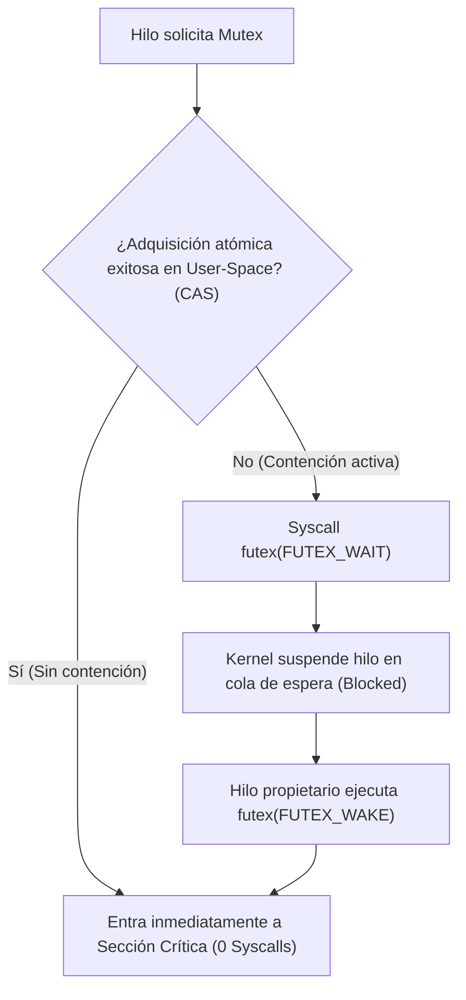
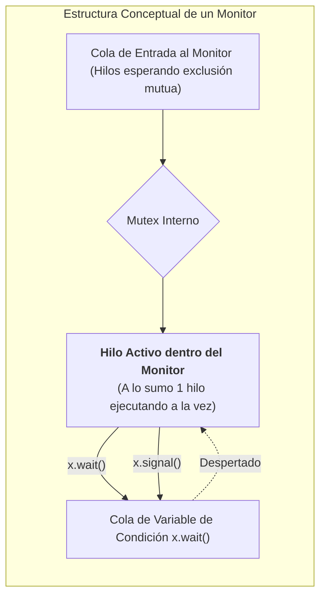
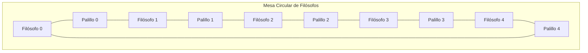
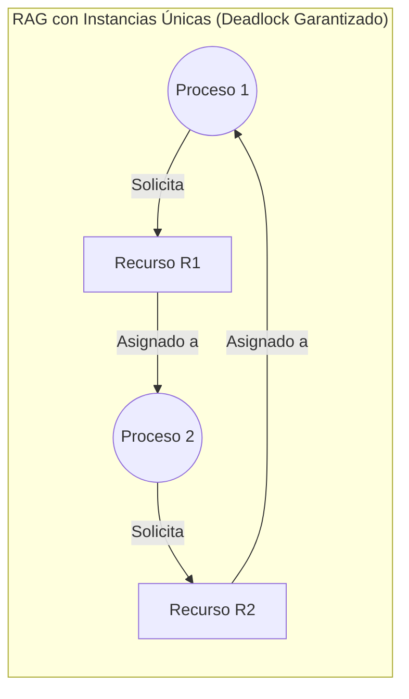

# Sincronización, Sección Crítica y Deadlocks

En un sistema operativo multiprogramado y con soporte para múltiples hilos de ejecución ([[Procesos, Hilos y Planificacion de CPU|hilos concurrentes]]), los flujos de ejecución cooperativos comparten con frecuencia estructuras de datos en memoria, archivos y periféricos. La ejecución intercalada o paralela en varios núcleos de CPU da lugar a **condiciones de carrera (*race conditions*)**, situaciones donde el resultado final de una operación depende del orden arbitrario en que la CPU intercala las instrucciones de los distintos hilos.

> [!info] 💡 ¿Cómo entender esto desde cero? (Guía para novatos de pregrado)
> - **El peligro de compartir:** Imagina que tú y tu hermano tienen tarjetas de débito vinculadas a la misma cuenta con $100. Los dos van a cajeros automáticos diferentes en la misma ciudad y presionan "Retirar $100" exactamente en el mismo milisegundo. Si el cajero lee el saldo a la vez, ¡los dos cajeros podrían entregar $100 y dejar la cuenta en -$100! Eso se llama **Condición de Carrera** (*Race Condition*).
> - **Sección Crítica y Mutex:** La parte del código donde se toca el saldo es la "sección crítica". Un **Mutex** es como el cerrojo del baño de un avión: solo una persona puede estar adentro; los demás deben esperar disciplinadamente afuera hasta que salga.
> - **¿Qué es un Deadlock (Bloqueo Mutuo)?** Imagina dos autos en una calle estrecha de un solo carril, uno frente al otro. Ninguno puede avanzar porque el otro estorba, y ninguno quiere retroceder. ¡Se quedan congelados para siempre! En computación, si el proceso A tiene el archivo 1 y espera el 2, y el proceso B tiene el archivo 2 y espera el 1, todo el sistema operativo se congela. El **Algoritmo del Banquero** es el árbitro que nunca permite que el sistema caiga en esa trampa.

---

## 1. El Problema de la Sección Crítica en Sistemas Concurrentes

Una **condición de carrera** ocurre cuando dos o más hilos o procesos leen y escriben sobre un dato compartido de manera concurrente, y el valor final depende de cuál hilo termina último.

La porción de código de un programa que accede y manipula recursos compartidos (como variables globales, colas de mensajes o tablas del kernel) recibe el nombre de **Sección Crítica (SC)**.

### Las Tres Condiciones Obligatorias de Dijkstra
Para que una solución al problema de la sección crítica se considere matemáticamente correcta, debe satisfacer indefectiblemente los siguientes tres requisitos formales formulados por Edsger W. Dijkstra:

1. **Exclusión Mutua (*Mutual Exclusion*):**
   Si el proceso $P_i$ está ejecutando instrucciones dentro de su sección crítica, ningún otro proceso puede estar ejecutándose dentro de su respectiva sección crítica simultáneamente.
2. **Progreso (*Progress*):**
   Si ningún proceso está ejecutándose en su sección crítica y existen procesos que desean ingresar a ella, únicamente aquellos procesos que no se encuentren ejecutando su sección remanente pueden participar en la decisión de quién ingresará a continuación. Dicha decisión no puede posponerse indefinidamente (ausencia de *deadlock*).
3. **Espera Acotada (*Bounded Waiting*):**
   Debe existir un límite superior finito en el número de veces que se permite a otros procesos ingresar a sus secciones críticas después de que un proceso haya formulado su solicitud de entrada y antes de que dicha solicitud sea concedida (ausencia de inanición o *starvation*).

---

### Primitivas de Sincronización de Hardware

Los enfoques basados puramente en software (como el algoritmo de Peterson o Dekker) presentan severas limitaciones prácticas en arquitecturas modernas debido a la reordenación de instrucciones en tiempo de ejecución por parte de procesadores superescalares y compiladores optimizadores. Por tanto, los sistemas operativos confían en **instrucciones atómicas de hardware**.

#### Inadecuación de Deshabilitar Interrupciones
En sistemas monoprocesador primitivos, la exclusión mutua se lograba desactivando las interrupciones de hardware antes de entrar a la SC (`cli` en x86) y rehabilitándolas al salir (`sti`). En arquitecturas multinúcleo contemporáneas, esto es completamente ineficaz e inadmisible:
- **Ineficacia en Multiprocesador:** La instrucción `cli` desactiva las interrupciones únicamente en el núcleo local de la CPU donde se ejecuta. Los otros núcleos continúan ejecutando hilos en paralelo que pueden acceder a la memoria compartida al mismo instante.
- **Riesgo Operativo:** Conceder a programas en espacio de usuario la capacidad de deshabilitar interrupciones permitiría que un proceso malicioso o con un bucle infinito congele por completo el reloj del sistema operativo y monopolice la máquina.

#### 1. Instrucción Test-and-Set (TAS)
Es una instrucción atómica ejecutada en un único ciclo de bus de memoria mediante el bloqueo del bus (`LOCK` prefix en x86):

```c
// Definición semántica conceptual atómica
bool TestAndSet(bool *target) {
    bool rv = *target;
    *target = true;
    return rv;
}
```

Implementación de exclusión mutua:
```c
bool lock = false; // Variable compartida

void entry_critical_section() {
    while (TestAndSet(&lock))
        ; // Espera activa (busy waiting / spin)
    
    // --- Sección Crítica ---
    
    lock = false; // Liberación
}
```

#### 2. Instrucción Compare-and-Swap (CAS)
La instrucción CAS opera sobre tres operandos: una dirección de memoria `v`, el valor esperado `expected` y el nuevo valor deseado `new_value`.

```c
// Semántica atómica de CAS
int CompareAndSwap(int *v, int expected, int new_value) {
    int temp = *v;
    if (*v == expected) {
        *v = new_value;
    }
    return temp;
}
```
Si el contenido de `*v` es igual a `expected`, se actualiza con `new_value` y retorna el valor original. Es el bloque fundamental de algoritmos de sincronización libres de bloqueo (*lock-free* y *wait-free data structures*).

---

## 2. Mecanismos de Sincronización de Alto Nivel

### 1. Cerrojos Mutex (*Mutual Exclusion Locks*)
Un cerrojo Mutex es un mecanismo booleano de bloqueo con propiedad estricta de posesión: únicamente el hilo que adquirió el cerrojo (`lock`) tiene la potestad de liberarlo (`unlock`).

#### Spinlocks vs Sleep-Locks (Futex en Linux)
- **Spinlock (Cerrojo con Espera Activa):** El hilo gira continuamente en un bucle consumiendo ciclos de CPU hasta que el cerrojo queda libre.
  - *Ventaja:* No incurre en el costo de cambio de contexto del kernel.
  - *Uso:* Ideal en el kernel para secciones críticas extremadamente cortas (menores al tiempo de un context switch) en procesadores multinúcleo.
- **Sleep-Lock (Cerrojo con Bloqueo):** Si el recurso está ocupado, el kernel cambia el estado del hilo a `Blocked/Waiting` y cede la CPU a otro hilo.
- **El Futex de Linux (*Fast Userspace Mutex*):**
  Implementa una optimización híbrida de alto rendimiento:
  1. Si no existe contención, la adquisición del mutex se resuelve enteramente en espacio de usuario mediante una única instrucción atómica CAS, **sin invocar llamadas al sistema**.
  2. Solo si hay contención (otro hilo retiene el cerrojo), se ejecuta la syscall `futex(FUTEX_WAIT)` para suspender el hilo en la cola de espera del kernel.



---

### 2. Semáforos de Dijkstra

Introducidos por Edsger Dijkstra en 1965, un **semáforo** $S$ es una variable entera protegida accesible únicamente a través de dos operaciones atómicas estándar e indivisibles: `wait()` (tradicionalmente $P$, del holandés *proberen*, "probar") y `signal()` (tradicionalmente $V$, de *verhogen*, "incrementar").

#### Tipos de Semáforos:
- **Semáforo Binario:** Su valor sólo puede ser 0 o 1 (funcionalmente similar a un mutex, pero sin concepto estricto de propiedad; un hilo puede realizar el `wait` y otro hilo diferente el `signal`).
- **Semáforo Contador:** Su valor entero oscila en un dominio no acotado negativamente ($S \ge 0$), representando la cantidad exacta de instancias disponibles de un recurso físico o lógico compartido.

#### Implementación Clásica sin Espera Activa:
```c
typedef struct {
    int value;
    struct task_struct *waiting_queue; // Cola de PCB bloqueados
} semaphore;

void wait(semaphore *S) {
    S->value--;
    if (S->value < 0) {
        // Añadir este proceso a S->waiting_queue
        // Invocar block() en el kernel para cambiar a estado WAITING
    }
}

void signal(semaphore *S) {
    S->value++;
    if (S->value <= 0) {
        // Remover un proceso P de S->waiting_queue
        // Invocar wakeup(P) para pasarlo a estado READY
    }
}
```

> [!NOTE] Invariante del Semáforo
> Si `S.value` es negativo, su magnitud absoluta $|S.value|$ representa con precisión el número de hilos o procesos actualmente suspendidos en la cola de bloqueo esperando por dicho recurso.

---

### 3. Monitores

Un **monitor** es una abstracción de lenguaje de programación de alto nivel que encapsula variables de estado compartidas junto con los procedimientos que operan sobre ellas, garantizando de manera implícita y automática la **exclusión mutua**: en cualquier instante de tiempo, a lo sumo un solo hilo puede estar ejecutando código dentro del monitor.

Para permitir que los hilos coordinen sus acciones cuando ciertas condiciones lógicas no se cumplen (ej. el búfer está lleno), los monitores introducen **Variables de Condición (*Condition Variables*)**.

Una variable de condición `condition x;` soporta dos operaciones:
- `x.wait()`: El hilo invocador suspende su ejecución y cede atómicamente el control de la exclusión mutua del monitor, formándose en la cola de espera de la condición `x`.
- `x.signal()`: Despierta a uno de los hilos que estaban bloqueados en `x.wait()`. Si no hay ningún hilo esperando, la señal se pierde (a diferencia de un semáforo, las variables de condición no tienen memoria ni acumulador entero).



#### Semántica de Hoare vs Semántica de Mesa
Cuando el hilo $P$ ejecuta `x.signal()`, despertando al hilo suspendido $Q$, se produce un dilema: ambos no pueden estar activos dentro del monitor simultáneamente.

1. **Semántica de Hoare (*Signal-and-Wait*):**
   - El hilo señalador $P$ cede inmediatamente el control del monitor y pasa a esperar en una cola especial.
   - El hilo despertado $Q$ toma el control de inmediato.
   - *Consecuencia:* La condición lógica por la que esperaba $Q$ está garantizada como cierta en el momento de reanudar la ejecución; se puede utilizar una sentencia `if`:
     ```c
     if (recurso_no_disponible)
         x.wait();
     ```
2. **Semántica de Mesa (*Signal-and-Continue* - Estándar POSIX Pthreads y Java):**
   - El hilo señalador $P$ continúa ejecutándose hasta salir del monitor o bloquearse.
   - El hilo despertado $Q$ pasa de la cola de condición a la cola general de entrada del monitor para competir nuevamente por la exclusión mutua.
   - *Consecuencia:* Cuando $Q$ finalmente obtiene la CPU, otro hilo pudo haber entrado y modificado la condición. Por lo tanto, **es mandatorio reevaluar la condición en un bucle `while`**:
     ```c
     while (recurso_no_disponible)
         pthread_cond_wait(&cond, &mutex);
     ```

---

## 3. Problemas Clásicos de Sincronización

### 1. El Problema del Búfer Limitado (Productor - Consumidor)
Un grupo de hilos productores genera elementos y los inserta en un búfer circular de capacidad $N$, mientras que los hilos consumidores los extraen.

```c
#define N 100
semaphore mutex = 1; // Control de exclusión mutua sobre el búfer
semaphore empty = N; // Cuenta ranuras libres disponibles
semaphore full = 0;  // Cuenta ranuras ocupadas disponibles

void *producer(void *arg) {
    while (1) {
        item data = produce_item();
        
        wait(&empty); // Espera si no hay espacio libre
        wait(&mutex); // Protege la sección crítica
        
        insert_into_buffer(data);
        
        signal(&mutex);
        signal(&full); // Informa que hay un nuevo elemento
    }
}

void *consumer(void *arg) {
    while (1) {
        wait(&full);  // Espera si el búfer está vacío
        wait(&mutex); // Protege la sección crítica
        
        item data = extract_from_buffer();
        
        signal(&mutex);
        signal(&empty); // Libera una ranura
        
        consume_item(data);
    }
}
```

> [!CAUTION] Riesgo de Interbloqueo por Orden Erróneo de Primitivas
> Si en el productor se invierte el orden: `wait(&mutex)` antes de `wait(&empty)`, y el búfer está lleno ($empty = 0$), el productor adquirirá el `mutex` y quedará bloqueado en `empty`. El consumidor nunca podrá entrar para vaciar un espacio porque el `mutex` está retenido, provocando un **Deadlock irremediable**.

---

### 2. El Problema de los Lectores y Escritores
Múltiples hilos concurrentes acceden a una base de datos compartida: varios lectores pueden leer simultáneamente sin conflicto, pero un escritor requiere acceso exclusivo (ningún otro lector ni escritor puede estar presente).

- **Variante con Preferencia a Lectores:** Ningún lector espera a menos que un escritor tenga el recurso. *Defecto:* Provoca inanición (*starvation*) del escritor si hay un flujo constante de lectores.
- **Variante con Preferencia a Escritores:** Si un escritor solicita acceso, los nuevos lectores se forman en cola detrás de él.
- **Solución Justa (Fair Read-Write Lock):** Implementación mediante cola FIFO donde lectores y escritores son despachados en orden de llegada sin inanición para ninguna de las partes.

---

### 3. La Cena de los Filósofos (Dining Philosophers)
Cinco filósofos se sientan alrededor de una mesa circular con cinco platos de arroz y cinco palillos. Cada filósofo alterna entre pensar y comer. Para comer, un filósofo necesita obligatoriamente tomar **ambos palillos adyacentes** (el izquierdo y el derecho).



#### Soluciones Rigurosas:
1. **Solución Asimétrica:** Los filósofos pares toman primero su palillo izquierdo y luego el derecho; los filósofos impares toman primero el palillo derecho y luego el izquierdo. Esto rompe la condición de espera circular.
2. **Portero o Capacidad Limitada:** Se utiliza un semáforo contador inicializado en 4 ($N-1$), permitiendo que a lo sumo 4 filósofos se sienten a la mesa simultáneamente.
3. **Monitor con Estados:** Un filósofo sólo puede tomar los palillos si ambos vecinos no están comiendo (estados: `THINKING`, `HUNGRY`, `EATING`).

---

## 4. Bloqueos Mutuos (Deadlocks)

Un **bloqueo mutuo (*Deadlock*)** es una condición anómala en la cual un conjunto de procesos se encuentra permanentemente detenido debido a que cada proceso retiene al menos un recurso y espera la liberación de otro recurso retenido por otro proceso del mismo conjunto.

### Las 4 Condiciones Necesarias de Coffman (1971)
Para que ocurra un deadlock deben cumplirse de forma simultánea las cuatro condiciones formuladas por Edward G. Coffman:

1. **Exclusión Mutua:** Los recursos involucrados no son compartibles; cada recurso está asignado a un único proceso o está libre.
2. **Retención y Espera (*Hold and Wait*):** Un proceso retiene al menos un recurso mientras solicita recursos adicionales que están asignados a otros procesos.
3. **No Apropiación (*No Preemption*):** Los recursos no pueden ser arrebatados forzosamente a un proceso; sólo pueden ser liberados voluntariamente por el proceso que los retiene.
4. **Espera Circular (*Circular Wait*):** Existe una cadena cerrada de procesos $\{P_0, P_1, \dots, P_n\}$ tal que $P_0$ espera un recurso retenido por $P_1$, $P_1$ espera uno retenido por $P_2$, y $P_n$ espera uno retenido por $P_0$.

---

### Modelado Formal con Grafos de Asignación de Recursos (RAG)

Un **Grafo de Asignación de Recursos (RAG - *Resource Allocation Graph*)** es un grafo dirigido $G = (V, E)$, donde:
- El conjunto de vértices $V$ se particiona en dos clases:
  - $P = \{P_1, P_2, \dots, P_n\}$: Conjunto de procesos activos (círculos).
  - $R = \{R_1, R_2, \dots, R_m\}$: Conjunto de tipos de recursos (rectángulos con puntos que denotan instancias).
- El conjunto de aristas dirigidas $E$:
  - **Arista de Solicitud ($P_i \to R_j$):** El proceso $P_i$ solicita una instancia de $R_j$ y está bloqueado esperando.
  - **Arista de Asignación ($R_j \to P_i$):** Una instancia de $R_j$ ha sido asignada a $P_i$.



> [!IMPORTANT] Teorema de Existencia de Deadlocks en el RAG
> - Si el grafo de asignación de recursos **no contiene ciclos**, el sistema **no está en deadlock**.
> - Si el grafo **contiene al menos un ciclo**:
>   - Si cada tipo de recurso involucrado tiene **exactamente una única instancia**, entonces la existencia de un ciclo es condición **necesaria y suficiente**: existe un Deadlock irreversible.
>   - Si los recursos tienen **múltiples instancias**, la presencia de un ciclo es condición necesaria pero **no suficiente** (el ciclo podría romperse si otro proceso externo libera una instancia).

---

### Estrategias de Tratamiento de Deadlocks

1. **Ignorar el Problema (Algoritmo del Avestruz):** Asumir que los deadlocks son tan infrecuentes que no justifican el costo de prevención. Es el enfoque predominante en sistemas de propósito general como Linux o Windows (se confía en que el usuario final cancele el proceso congelado).
2. **Prevención de Deadlocks (*Deadlock Prevention*):** Diseñar el sistema de tal modo que se elimine por construcción matemática al menos una de las 4 condiciones de Coffman:
   - *Eliminar Retención y Espera:* Exigir que un proceso solicite todos los recursos que necesitará de una sola vez antes de iniciar su ejecución.
   - *Eliminar No Apropiación:* Si un proceso solicita un recurso que no puede asignársele de inmediato, todos los recursos que ya retenía le son retirados forzosamente.
   - *Eliminar Espera Circular:* Imponer un ordenamiento lineal estricto en todos los recursos del sistema mediante una función inyectiva $F: R \to \mathbb{N}$. Un proceso sólo puede solicitar un recurso $R_j$ si $F(R_j) > F(R_i)$ para todo recurso $R_i$ que ya retenga.
3. **Detección y Recuperación:** Monitorear periódicamente el estado de asignación de recursos. Si se detecta un ciclo, se recupera el sistema mediante:
   - Terminación de procesos (abortar todos los procesos del ciclo o uno por uno hasta disolver el ciclo).
   - Apropiación con retroceso (*Checkpointing y Rollback*): Revertir un proceso a un punto de control previo guardado en disco y reintentar su ejecución más tarde.

---

### Evitación Dinámica: El Algoritmo del Banquero de Dijkstra

La **evitación dinámica de deadlocks** requiere que el sistema operativo posea información a priori sobre la **demanda máxima de recursos** que cada proceso requerirá a lo largo de su ciclo de vida.

Un **Estado Seguro (*Safe State*)** es un estado en el cual existe al menos una secuencia de ejecución $\langle P_0, P_1, \dots, P_{n-1} \rangle$ tal que para cada proceso $P_i$, los recursos que aún puede necesitar pueden ser satisfechos con los recursos disponibles actualmente más los recursos retenidos por todos los procesos predecesores $P_j$ ($j < i$).

#### Estructuras Matriciales Fundamentales:
Sean $n$ el número de procesos y $m$ el número de tipos de recursos:
1. $\text{Available}[m]$: Vector de longitud $m$. Si $\text{Available}[j] = k$, hay $k$ instancias disponibles del recurso $R_j$.
2. $\text{Max}[n \times m]$: Matriz de $n \times m$. Si $\text{Max}[i][j] = k$, el proceso $P_i$ puede solicitar a lo sumo $k$ instancias de $R_j$.
3. $\text{Allocation}[n \times m]$: Matriz de asignación actual. $\text{Allocation}[i][j] = k$ indica que $P_i$ retiene $k$ instancias de $R_j$.
4. $\text{Need}[n \times m]$: Matriz de necesidad remanente. Se calcula formalmente como:
   $$\text{Need}[i][j] = \text{Max}[i][j] - \text{Allocation}[i][j]$$

---

#### Algoritmo de Comprobación de Estado Seguro (Safety Algorithm)
1. Sean $\text{Work} = \text{Available}$ (vector de longitud $m$) y $\text{Finish}[i] = \text{false}$ para todo $i \in \{0, 1, \dots, n-1\}$.
2. Buscar un índice $i$ tal que:
   $$\text{Finish}[i] == \text{false} \quad \land \quad \text{Need}[i] \le \text{Work}$$
   Si no existe tal $i$, saltar al paso 4.
3. Actualizar:
   $$\text{Work} = \text{Work} + \text{Allocation}[i]$$
   $$\text{Finish}[i] = \text{true}$$
   Volver al paso 2.
4. Si $\text{Finish}[i] == \text{true}$ para todo $i$, el sistema se encuentra en un **Estado Seguro**; de lo contrario, está en un estado **Inseguro**.

---

#### Traza Paso a Paso del Algoritmo del Banquero (Ejemplo Canónico EPN)

Consideremos un sistema con 5 procesos ($P_0, P_1, P_2, P_3, P_4$) y 3 tipos de recursos ($A, B, C$) con instancias totales: $A = 10, B = 5, C = 7$.

**Estado Inicial en el instante $T_0$:**

| Proceso | Allocation ($A, B, C$) | Max ($A, B, C$) | Need ($Max - Alloc$) | Available ($A, B, C$) |
| :---: | :---: | :---: | :---: | :---: |
| **$P_0$** | $(0, 1, 0)$ | $(7, 5, 3)$ | $(7, 4, 3)$ | **$(3, 3, 2)$** |
| **$P_1$** | $(2, 0, 0)$ | $(3, 2, 2)$ | $(1, 2, 2)$ | |
| **$P_2$** | $(3, 0, 2)$ | $(9, 0, 2)$ | $(6, 0, 0)$ | |
| **$P_3$** | $(2, 1, 1)$ | $(2, 2, 2)$ | $(0, 1, 1)$ | |
| **$P_4$** | $(0, 0, 2)$ | $(4, 3, 3)$ | $(4, 3, 1)$ | |

*Total asignado:* $A = 0+2+3+2+0 = 7$; $B = 1+0+0+1+0 = 2$; $C = 0+0+2+1+2 = 5$.
$\text{Available} = (10-7, 5-2, 7-5) = (3, 3, 2)$.

##### Verificación de Seguridad:
1. **Inicialización:** $\text{Work} = (3, 3, 2)$, todos los $\text{Finish} = \text{false}$.
2. Evaluamos $P_0$: $\text{Need}_0 = (7, 4, 3) \le (3, 3, 2)$ $\implies$ **Falso**. $P_0$ debe esperar.
3. Evaluamos $P_1$: $\text{Need}_1 = (1, 2, 2) \le (3, 3, 2)$ $\implies$ **Verdadero**.
   - $P_1$ puede terminar: $\text{Work} = (3, 3, 2) + \text{Alloc}_1 (2, 0, 0) = (5, 3, 2)$.
   - $\text{Finish}[1] = \text{true}$.
4. Evaluamos $P_3$: $\text{Need}_3 = (0, 1, 1) \le (5, 3, 2)$ $\implies$ **Verdadero**.
   - $P_3$ puede terminar: $\text{Work} = (5, 3, 2) + \text{Alloc}_3 (2, 1, 1) = (7, 4, 3)$.
   - $\text{Finish}[3] = \text{true}$.
5. Evaluamos $P_4$: $\text{Need}_4 = (4, 3, 1) \le (7, 4, 3)$ $\implies$ **Verdadero**.
   - $P_4$ puede terminar: $\text{Work} = (7, 4, 3) + \text{Alloc}_4 (0, 0, 2) = (7, 4, 5)$.
   - $\text{Finish}[4] = \text{true}$.
6. Evaluamos $P_0$: $\text{Need}_0 = (7, 4, 3) \le (7, 4, 5)$ $\implies$ **Verdadero**.
   - $P_0$ puede terminar: $\text{Work} = (7, 4, 5) + \text{Alloc}_0 (0, 1, 0) = (7, 5, 5)$.
   - $\text{Finish}[0] = \text{true}$.
7. Evaluamos $P_2$: $\text{Need}_2 = (6, 0, 0) \le (7, 5, 5)$ $\implies$ **Verdadero**.
   - $P_2$ puede terminar: $\text{Work} = (7, 5, 5) + \text{Alloc}_2 (3, 0, 2) = (10, 5, 7)$.
   - $\text{Finish}[2] = \text{true}$.

**Conclusión:** Todos los procesos tienen $\text{Finish} = \text{true}$. La secuencia de seguridad es:
$$\langle P_1, P_3, P_4, P_0, P_2 \rangle$$
El sistema se encuentra formalmente en un **Estado Seguro**, garantizando la total ausencia de Deadlocks.

---

## 5. Preguntas de Autoevaluación y Problemas de Examen

1. **¿Por qué una variable de condición en un monitor bajo semántica de Mesa debe invocarse indefectiblemente dentro de un bucle `while` en lugar de una estructura `if`?**
2. **Explique la razón arquitectónica por la cual deshabilitar interrupciones por software no resuelve la exclusión mutua en un procesador AMD Ryzen de 16 núcleos.**
3. **¿Cuál es la diferencia entre un Spinlock y un Mutex basado en Futex, y en qué escenario exacto un Spinlock supera en rendimiento al Mutex?**
4. **Si un grafo de asignación de recursos contiene un ciclo cerrado y todos los recursos tienen múltiples instancias, ¿podemos asegurar categóricamente que existe un Deadlock? Justifique formalmente.**
5. **En el Algoritmo del Banquero, si $P_1$ solicita el vector $\text{Request}_1 = (1, 0, 2)$, demuestre si el sistema operativo debe conceder la solicitud de inmediato o poner a $P_1$ en espera.**

---
*Documento estructurado conforme al sílabo de Sistemas Operativos - Facultad de Ingeniería de Sistemas, Escuela Politécnica Nacional.*