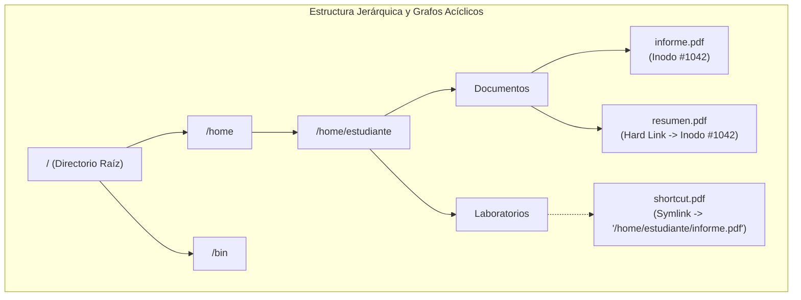
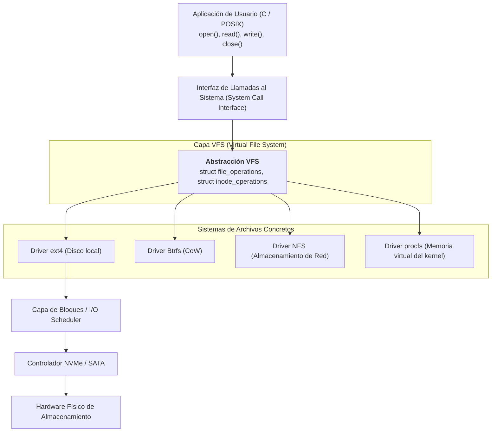
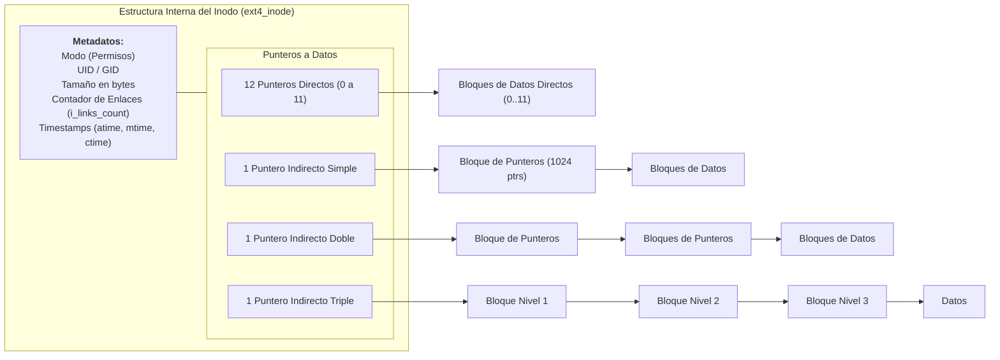
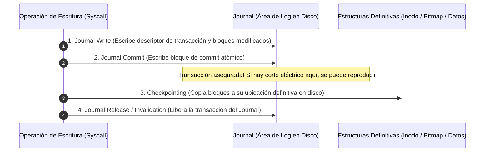

# Sistemas de Archivos y Almacenamiento

El subsistema de archivos y almacenamiento proporciona la abstracción uniforme y persistente mediante la cual los usuarios y programas guardan y organizan información en medios no volátiles (discos magnéticos HDD, unidades de estado sólido SSD NVMe, medios ópticos o almacenamiento en red). Mientras que la [[Gestion de Memoria y Memoria Virtual|memoria principal]] es volátil y transitoria, el **Sistema de Archivos (*File System*)** garantiza la durabilidad, integridad y recuperación determinista de los datos a lo largo del tiempo.

> [!info] 💡 ¿Cómo entender esto desde cero? (Guía para novatos de pregrado)
> - **¿Qué es un disco en realidad?** Un disco duro o una unidad SSD es simplemente una cuadrícula gigante y ciega de miles de millones de bloques de ceros y unos. No sabe qué es una foto, qué es una canción ni qué es una carpeta.
> - **El Sistema de Archivos como el Gran Bibliotecario:** Es el software que organiza esa masa gigantesca de bloques, inventa las carpetas, le pone nombres a tus archivos y anota en qué lugar exacto del disco quedó guardado cada pedacito.
> - **¿Qué es un Inodo (Inode)?** En Linux, un archivo no es un nombre: es una ficha técnica llamada **Inodo**. El Inodo guarda quién es el dueño, qué permisos tiene, cuánto pesa y una lista de coordenadas hacia los bloques del disco donde están los datos reales.
> - **Journaling (Salvavidas contra apagones):** ¿Qué pasa si estás guardando tu tesis de grado y se corta la luz justo en la mitad? En sistemas antiguos el disco se dañaba y perdías todo. Los sistemas con Journaling (como ext4) anotan primero en una "libreta de notas rápidas" lo que van a hacer antes de tocar los archivos principales; si se corta la luz, al reiniciar leen la libreta y recuperan la consistencia en 2 segundos.

---

## 1. Abstracciones Fundamentales

### Concepto de Archivo
Un **archivo** es un espacio de direcciones lógicas contiguas, con nombre propio, gestionado y mapeado por el sistema operativo sobre dispositivos de almacenamiento físico secundario. Es la unidad lógica de asignación más pequeña visible para el programador.

#### Atributos Principales de un Archivo:
1. **Nombre Simbólico:** Cadena de caracteres legible por humanos que identifica el archivo dentro de un directorio.
2. **Identificador Numérico:** Número entero único dentro del sistema de archivos (el número de **inodo** en UNIX/Linux).
3. **Tipo de Archivo:** Define el formato o naturaleza del contenido (archivo regular, directorio, enlace simbólico, socket, FIFO/tubería con nombre, dispositivo de bloques o caracteres).
4. **Ubicación Física:** Punteros a los sectores o bloques del dispositivo donde residen los datos.
5. **Tamaño:** Longitud actual en bytes, así como la cantidad de bloques de disco físicos asignados.
6. **Protección y Permisos:** Máscara de bits que rige los derechos de lectura, escritura y ejecución para el propietario, el grupo y el resto de usuarios (esquema `rwxrwxrwx` POSIX).
7. **Marcas de Tiempo (*Timestamps*):** Registros de fecha y hora de creación (`crtime/btime`), último acceso de lectura (`atime`), última modificación de contenido (`mtime`) y último cambio de metadatos o inodo (`ctime`).

#### Operaciones Básicas sobre Archivos:
- `create()`: Reserva espacio en la tabla de inodos y crea una entrada de directorio.
- `open()`: Convierte una ruta en un descriptor de archivo numérico (`int fd`) y crea un objeto `struct file` en el kernel.
- `read()` / `write()`: Transfiere bytes entre el búfer en espacio de usuario y el búfer de caché de páginas del kernel.
- `lseek()`: Reposiciona el puntero de lectura/escritura actual dentro del archivo sin transferir datos.
- `unlink()` / `delete()`: Decrementa el contador de enlaces del archivo; si llega a cero y ningún proceso lo tiene abierto, libera los bloques físicos en disco.

---

### Métodos de Acceso a Archivos
- **Acceso Secuencial:** Los bytes o registros se procesan estrictamente en orden, desde el principio hasta el final (modelo heredado de las cintas magnéticas; típico en reproductores de audio/video y compiladores).
- **Acceso Directo o Aleatorio (*Random Access*):** Permite leer o escribir cualquier bloque de datos arbitrario de forma inmediata mediante un desplazamiento (*seek*), sin necesidad de recorrer los bloques precedentes. Esencial para motores de bases de datos relacionales (como PostgreSQL o MySQL).

---

### Estructura de Directorios

Un **directorio** es en sí mismo un archivo especial cuya carga útil (*payload*) consiste en una tabla asociativa que mapea nombres textuales legibles con identificadores internos (números de inodo).



- **Árbol Jerárquico (*Tree-Structured*):** Organización canónica con un directorio raíz (`/`) que contiene subdirectorios y archivos hoja. Evita ciclos de forma natural.
- **Grafos Acíclicos (*Acyclic-Graph Directories*):** Permiten que un mismo archivo o subdirectorio aparezca simultáneamente en dos o más directorios distintos mediante **enlaces (*links*)**. Requiere algoritmos de prevención de ciclos para evitar que comandos recursivos (como `find` o `du`) entren en bucles infinitos.

---

## 2. La Capa de Sistema Virtual de Archivos (VFS) en Linux

UNIX y Linux implementan el célebre paradigma arquitectónico: **"En UNIX, todo es un archivo"** (*Everything is a file*). Los archivos regulares, directorios, sockets de red, tuberías inter-proceso (pipes) y dispositivos de hardware (`/dev/sda`, `/dev/tty`) se manipulan a través de la misma interfaz estándar de llamadas al sistema (`read`, `write`, `open`, `close`, `ioctl`).

Para soportar de manera transparente decenas de sistemas de archivos heterogéneos montados simultáneamente (como ext4, XFS, Btrfs, FAT32, NTFS, NFS o sistemas virtuales como `/proc` y `/sys`), el kernel introduce el **Virtual File System (VFS)**.



### Las 4 Estructuras Clave del Kernel en VFS
VFS está diseñado bajo un paradigma orientado a objetos implementado rigurosamente en lenguaje C mediante estructuras con punteros a funciones:

1. **`struct super_block` (Superbloque):**
   - Representa un sistema de archivos específico completamente montado en el árbol del sistema.
   - Contiene metadatos globales del volumen: tamaño de bloque del sistema de archivos, número total de inodos y bloques libres, estado del montaje y puntero a las operaciones del superbloque (`struct super_operations`, como `write_inode`, `sync_fs`).
2. **`struct inode` (Inodo en Memoria):**
   - Representa un archivo específico residente en el disco.
   - Contiene todos los metadatos del archivo (permisos, propietario, tamaño, marcas de tiempo) y una tabla de operaciones (`struct inode_operations`, como `create`, `lookup`, `mkdir`, `unlink`).
   - **Nota crucial:** El inodo **no contiene el nombre del archivo**.
3. **`struct dentry` (Directory Entry):**
   - Conecta un nombre textual de ruta con su correspondiente número de inodo.
   - Las dentries se organizan en una caché de alto rendimiento en memoria RAM denominada **Dcache**. Cuando un proceso abre `/home/usuario/datos.txt`, el VFS resuelve cada componente mediante la Dcache en nanosegundos sin consultar el disco.
4. **`struct file` (Objeto de Archivo Abierto):**
   - Representa la interacción dinámica de un proceso con un archivo en ejecución (instanciado tras invocar `open()`).
   - Almacena el **desplazamiento de archivo actual (*current file offset*)**, las banderas de apertura (`O_RDONLY`, `O_APPEND`), el contador de referencias y el puntero a las operaciones de archivo (`struct file_operations`: `read`, `write`, `mmap`, `fsync`).
   - Múltiples procesos pueden tener objetos `struct file` independientes apuntando exactamente al mismo `struct inode`.

---

## 3. Arquitectura Interna del Sistema de Archivos por Inodos (ext4)

El sistema de archivos **ext4** (*Fourth Extended Filesystem*) es el estándar predeterminado de almacenamiento local en distribuciones GNU/Linux para entornos de producción.

### Distribución Física de un Grupo de Bloques (Block Groups)
Para minimizar la distancia física que debe recorrer el cabezal de un disco o reducir la dispersión de bloques lógicos, ext4 particiona el espacio total de almacenamiento en unidades autónomas denominadas **Grupos de Bloques (*Block Groups*)**:

```
+-----------+---------------+--------------------+---------------+---------------+---------------+---------------+
| Boot      | Superblock    | Group Descriptors  | Block Bitmap  | Inode Bitmap  | Inode Table   | Data Blocks   |
| Record    | (Backup copy) | (GDT)              | (1 bloque)    | (1 bloque)    | (Múltiples bl)| (Miles de bl) |
+-----------+---------------+--------------------+---------------+---------------+---------------+---------------+
```

1. **Boot Record / MBR:** Reservado en el primer KiB del disco (bloque 0) para código de arranque del cargador (GRUB).
2. **Superbloque:** Metadatos globales críticos del sistema de archivos. Se replica en múltiples grupos de bloques como medida de tolerancia a fallos.
3. **Descriptores de Grupo (GDT):** Contienen las direcciones de los bitmaps y de la tabla de inodos de todos los grupos.
4. **Mapa de Bits de Bloques (*Block Bitmap*):** Un único bloque donde cada bit individual (0 o 1) representa el estado de ocupación de un bloque de datos del grupo.
5. **Mapa de Bits de Inodos (*Inode Bitmap*):** Cada bit indica si una ranura específica de la tabla de inodos está libre o asignada.
6. **Tabla de Inodos (*Inode Table*):** Arreglo lineal continuo de estructuras `ext4_inode` (típicamente de 256 bytes cada una).
7. **Bloques de Datos (*Data Blocks*):** Espacio donde reside el contenido real de los archivos de usuario y los subdirectorios.

---

### Anatomía de un Inodo Clásico vs Árbol de Extents



#### Esquema Clásico de Punteros Multinivel:
En un sistema con tamaño de bloque de **4 KiB** ($4096$ bytes) y punteros de 32 bits ($4$ bytes por dirección):
- Cada bloque de punteros almacena $\frac{4096}{4} = 1024$ direcciones de bloques.
- **12 Punteros Directos:** Mapean $12 \times 4\text{ KiB} = 48\text{ KiB}$.
- **1 Puntero Indirecto Simple:** Mapea $1024 \times 4\text{ KiB} = 4\text{ MiB}$.
- **1 Puntero Indirecto Doble:** Mapea $1024 \times 1024 \times 4\text{ KiB} = 4\text{ GiB}$.
- **1 Puntero Indirecto Triple:** Mapea $1024 \times 1024 \times 1024 \times 4\text{ KiB} = 4\text{ TiB}$.

#### El Esquema Moderno: Árbol de Extents en ext4
El direccionamiento clásico por punteros individuales introduce un overhead inaceptable para archivos gigantescos de cientos de gigabytes. ext4 sustituye los punteros indirectos por un **árbol B+ de Extents**:
- Un **Extent** es una tupla que describe un rango continuo de bloques físicos contiguos en disco:
  $$\text{struct ext4\_extent} = \{\text{bloque\_lógico\_inicial}, \ \text{longitud\_bloques}, \ \text{bloque\_físico\_inicial}\}$$
- Un solo extent puede direccionar hasta $2^{15} = 32{,}768$ bloques contiguos ($128\text{ MiB}$ en bloques de 4 KiB) con un único descriptor compacto de 12 bytes.
- Si un archivo tiene pocos extents, estos se almacenan directamente dentro del propio inodo; si está muy fragmentado, se crea un árbol jerárquico indexado.

---

### Enlaces en Sistemas UNIX: Hard Links vs Enlaces Simbólicos

| Característica | Enlace Duro (*Hard Link*) | Enlace Simbólico (*Soft / Symlink*) |
| :--- | :--- | :--- |
| **Definición** | Entrada de directorio adicional (dentry) que apunta directamente al **mismo número de inodo**. | Archivo independiente con su **propio inodo nuevo**, cuyo contenido es la ruta textual al archivo de destino. |
| **Comando POSIX** | `ln archivo.txt enlace_duro` | `ln -s archivo.txt enlace_simb` |
| **Número de Inodo** | **Idéntico** al del archivo original. | **Diferente** (se reserva un inodo nuevo). |
| **Cruce de Particiones** | **Imposible** (los inodos son únicos solo dentro de su sistema de archivos local). | **Totalmente viable** (soporta rutas absolutas a cualquier dispositivo o red). |
| **Enlaces a Directorios** | Prohibido para usuarios (para prevenir ciclos infinitos en el grafo de directorios). | Permitido sin restricciones. |
| **Borrado del Original** | El contenido de datos **no se pierde**. El contador `i_links_count` se decrementa. | El enlace queda roto o colgante (**Dangling Symlink**). |
| **Almacenamiento** | Cero consumo de bloques de datos adicionales. | Inodo propio; si la ruta es $\le 60$ bytes, se almacena en el inodo (*Fast Symlink*). |

---

## 4. Métodos de Asignación de Bloques de Disco

El sistema operativo debe determinar la estrategia geométrica para ubicar los bloques de datos de un archivo en el medio de almacenamiento:

### 1. Asignación Contigua
- Cada archivo ocupa un conjunto de bloques contiguos en disco (ej. archivo de tamaño $n$ bloques que inicia en el bloque $b$).
- *Ventajas:* Rendimiento insuperable para lecturas secuenciales y soporte nativo de acceso aleatorio ($O(1)$ para calcular la dirección física del bloque $k$: $b + k$).
- *Desventajas:* Sufre severamente de **fragmentación externa**; requiere conocer el tamaño final del archivo al momento de su creación.

### 2. Asignación Enlazada (Linked Allocation)
- Cada archivo es una lista enlazada de bloques de disco dispersos. Cada bloque almacena los datos y un puntero de 4 u 8 bytes al siguiente bloque de la cadena.
- *Ventajas:* Cero fragmentación externa; el archivo puede crecer dinámicamente sin límite.
- *Desventajas:* Rendimiento pésimo en acceso aleatorio (para leer el bloque $k$ se requieren $k$ operaciones secuenciales de E/S en disco); vulnerabilidad ante fallos (la corrupción de un solo puntero destruye el resto del archivo).
- **FAT (File Allocation Table):** Variante optimizada de DOS/Windows donde todos los punteros se extraen de los bloques de datos y se consolidan en una tabla en memoria al inicio de la partición.

### 3. Asignación Indexada (Indexed Allocation)
- Consolida todos los punteros a los bloques de datos en una estructura de control centralizada denominada **bloque índice** (o en el **inodo** en sistemas UNIX).
- *Ventajas:* Soporta acceso directo rápido y eficiente sin sufrir fragmentación externa.
- *Desventajas:* Desperdicio de espacio en bloques índices para archivos pequeños (resuelto en ext4 mediante extents y compresión de inodos).

---

## 5. Confiabilidad y Recuperación de Fallos

### El Problema de la Inconsistencia por Caída (*Crash Consistency Problem*)
Considere la operación de agregar un bloque de datos al final de un archivo. Esta operación requiere escribir en disco tres estructuras independientes:
1. Actualizar el bloque de datos con la nueva información.
2. Modificar el **mapa de bits de bloques** para marcar el bloque asignado como ocupado.
3. Actualizar el **inodo** (incrementar tamaño en bytes, tiempo de modificación y agregar el puntero al bloque).

Si ocurre un corte abrupto de energía eléctrica o una falla de hardware en medio de estas operaciones:
- Si se escribe el inodo pero no el bitmap: dos archivos distintos podrían recibir el mismo bloque en la siguiente asignación.
- Si se escribe el bitmap pero no el inodo: el bloque queda marcado como ocupado para siempre pero nadie lo referencia (**bloque huérfano / fuga de espacio**).

---

### Journaling (Sistemas de Archivos Transaccionales)

El **Journaling** resuelve el problema de consistencia aplicando el principio de registro anticipado de transacciones (**Write-Ahead Logging - WAL**): antes de modificar las estructuras definitivas del sistema de archivos, la intención de la operación completa se escribe de forma secuencial y atómica en una zona circular protegida del disco denominada **Journal** o Diario.



#### Los Tres Modos de Journaling en ext4:
1. **`data=journal` (Journaling Completo):**
   - Tanto los metadatos como los bloques de datos del usuario se escriben en el Journal antes de aplicarse a las estructuras definitivas.
   - *Ventaja:* Máxima integridad y consistencia garantizada ante fallos.
   - *Desventaja:* Penalización severa de rendimiento: cada dato se escribe dos veces físicamente en disco.
2. **`data=ordered` (Modo Predeterminado en Linux):**
   - Los datos de usuario se escriben en sus bloques definitivos antes de que los metadatos asociados hagan commit en el Journal.
   - *Ventaja:* Garantiza que los archivos nunca apunten a datos corruptos o información confidencial residual de bloques reciclados tras una caída, manteniendo un rendimiento muy alto.
3. **`data=writeback` (Solo Metadatos):**
   - Solo los cambios de metadatos se registran en el Journal. Los datos de usuario pueden escribirse antes, durante o después del commit de metadatos.
   - *Ventaja:* Máxima velocidad de E/S.
   - *Desventaja:* Tras una caída abrupta, los metadatos estarán consistentes pero los archivos podrían contener basura o datos antiguos desactualizados.

---

### Comprobación Offline (fsck) vs Snapshots Modernos CoW

- **`fsck` (File System Consistency Check):** Herramienta que escanea offline todas las estructuras del sistema de archivos (inodos, bitmaps, árboles de directorios) para detectar y reparar inconsistencias. En volúmenes modernos de decenas de terabytes, una pasada completa de `fsck` puede demorar horas o días.
- **Sistemas de Archivos Copy-on-Write (Btrfs, ZFS):**
  - No sobreescriben bloques de datos existentes ni dependen de un Journaling tradicional.
  - Al modificar un archivo, los nuevos datos y metadatos se escriben en bloques libres completamente nuevos; una vez finalizada la escritura, el puntero raíz del árbol del sistema de archivos se redirige atómicamente al nuevo árbol.
  - **Snapshots Instantáneos:** Permite crear instantáneas del sistema en tiempo cero ($O(1)$) simplemente duplicando el puntero raíz del árbol sin copiar físicamente los datos subyacentes.
  - **Checksumming de Datos y Metadatos:** ZFS y Btrfs almacenan sumas de verificación criptográficas (ej. SHA-256) en cada bloque, detectando y corrigiendo automáticamente la corrupción silenciosa de bits (*bit rot*) mediante duplicación RAID.

---

## 6. Preguntas de Autoevaluación y Ejercicios Teóricos

1. **¿Por qué la capa VFS separa conceptualmente la estructura `struct inode` de la estructura `struct dentry`?**
2. **Calcule el tamaño máximo teórico de un archivo en un sistema de archivos UNIX clásico con bloques de 4 KiB, direcciones de 32 bits y el esquema de 12 punteros directos, 1 simple, 1 doble y 1 triple indirecto.**
3. **Si un usuario ejecuta `rm archivo.txt`, pero otro proceso mantiene dicho archivo abierto en modo lectura, ¿en qué momento exacto el kernel libera los bloques físicos en el disco?**
4. **Explique la diferencia fundamental entre el modo `data=ordered` y `data=journal` en ext4, y cite un escenario de misión crítica donde el modo completo sea indispensable.**
5. **¿Qué es un Dangling Symlink y por qué no puede generarse una condición equivalente con un Hard Link?**

---
*Documento estructurado conforme al sílabo de Sistemas Operativos - Facultad de Ingeniería de Sistemas, Escuela Politécnica Nacional.*