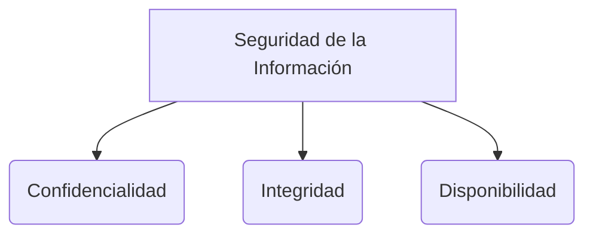

# Code Review y Pair Programming

Ambas son prácticas de desarrollo colaborativo utilizadas para asegurar la calidad del código fuente y compartir el conocimiento dentro de un equipo de desarrollo.

## Pair Programming (Programación en Parejas)
Es una de las prácticas principales prescritas por la metodología [[XP (eXtremme programming)]].
* **El Conductor (Driver):** La persona con las manos en el teclado, enfocada en escribir el código y la táctica inmediata.
* **El Navegante (Navigator):** La persona que revisa cada línea a medida que se escribe, pensando de manera estratégica en el diseño, la lógica general y los posibles errores futuros.

### Beneficios del Pair Programming
* Mayor calidad de código y reducción significativa de defectos.
* Compartir conocimientos constantemente (evita silos de conocimiento).
* Mejora la cohesión del equipo y mantiene a ambos programadores enfocados (es difícil distraerse con redes sociales si alguien está a tu lado).

## Code Review (Revisión de Código)
Es el proceso donde el código fuente es examinado por uno o varios programadores ajenos al autor del código antes de ser integrado a la rama principal a través de un [[Control de versiones]].

### Mejores Prácticas
* **Revisiones pequeñas:** Realizar revisiones sobre *Pull Requests* de pocas líneas de código. Revisiones masivas suelen acabar con comentarios superficiales ("Looks good to me").
* **Automatización previa:** El código debe pasar primero por el pipeline de [[Integración continua y despliegue continuo (CI-CD)]] (linter, formateador, [[Testing automatizado]]) antes de ocupar el tiempo de una persona.
* **Crítica constructiva:** Evaluar el código, no a la persona. Proporcionar alternativas y explicar el *porqué* de un cambio.

> [!info] Explicación: Shift-Left Testing
> Estas prácticas son ejemplos de "Shift-Left", es decir, mover la detección de defectos lo más a la izquierda (temprano) posible en el ciclo de vida del software. Corregir un error de lógica detectado por un compañero de equipo durante un Code Review o Pair Programming es inmensamente más barato y rápido que corregirlo cuando el cliente lo reporta en producción.

## Notas relacionadas
- [[XP (eXtremme programming)]]
- [[Control de versiones]]
- [[Testing automatizado]]

## Diagrama de Referencia

