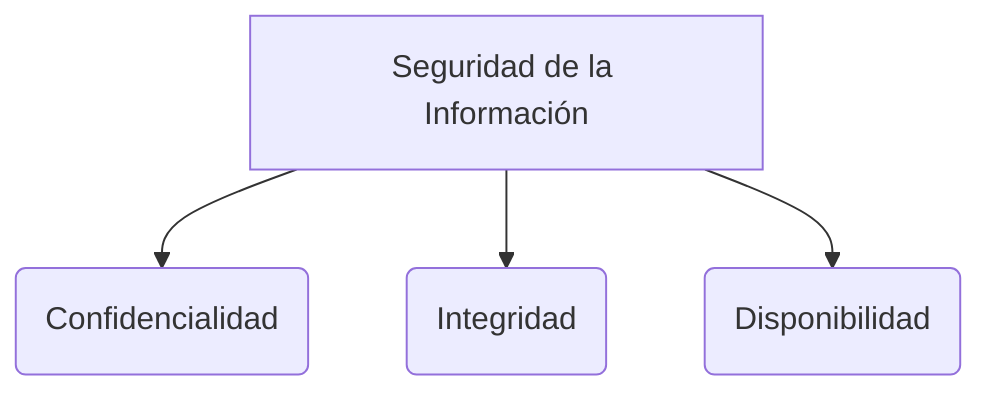

# Control de Versiones

Un sistema de control de versiones (VCS) es un software que registra los cambios realizados en un archivo o conjunto de archivos a lo largo del tiempo, de modo que puedas recuperar versiones específicas más adelante y colaborar de manera segura con otros programadores.

## Git y GitHub
Es crucial diferenciar la herramienta subyacente de las plataformas de alojamiento:
* **Git:** Es el motor de control de versiones distribuido instalado en la computadora local del desarrollador. Gestiona el historial, las ramas y las fusiones (*merges*).
* **GitHub (o GitLab, Bitbucket):** Son plataformas en la nube que alojan repositorios Git, facilitando la colaboración en línea, la revisión de código y la automatización (como CI/CD).

## Branching Strategies (Estrategias de Ramificación)
Para evitar que múltiples desarrolladores se pisen el trabajo mutuamente, se usan ramas (*branches*). Una rama es un entorno de trabajo independiente.

### GitFlow
Es una de las estrategias más formales y estructuradas. Utiliza múltiples ramas permanentes:
* `main` / `master`: Contiene únicamente el código en producción estable.
* `develop`: Es la rama principal de integración durante el desarrollo.
* `feature/nombre-tarea`: Ramas temporales para desarrollar nuevas características (salen de `develop` y vuelven a `develop`).
* `release/v1.0`: Ramas temporales para pulir la versión antes de enviarla a `main`.
* `hotfix`: Ramas creadas desde `main` exclusivamente para arreglar errores críticos en producción rápidamente.

### Trunk-Based Development
Es una estrategia moderna favorecida por equipos altamente ágiles y DevOps. Los desarrolladores integran sus cambios directamente a la rama principal (`trunk` o `main`) varias veces al día. Requiere un robusto [[Testing automatizado]] y [[Integración continua y despliegue continuo (CI-CD)]] para asegurar que el `main` nunca se rompa.

> [!info] Explicación: Colaboración Ágil
> Las metodologías ágiles como [[scrum]] o [[XP (eXtremme programming)]] promueven el trabajo en equipo. El control de versiones permite implementar prácticas vitales como el [[Code review y pair programming]], ya que todo código nuevo propuesto (vía *Pull Requests*) puede ser analizado por un compañero antes de fusionarse a la rama principal.

## Notas relacionadas
- [[software 2]]
- [[scrum]]
- [[Integración continua y despliegue continuo (CI-CD)]]
- [[Code review y pair programming]]

## Diagrama de Referencia

