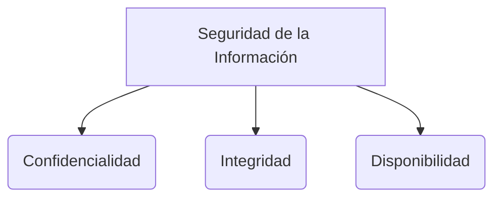

# Deuda Técnica

La deuda técnica es un concepto en el desarrollo de software que refleja el costo implícito del trabajo adicional (retrabajo) causado por elegir una solución fácil y rápida ahora, en lugar de utilizar un enfoque mejor o más estructurado que tomaría más tiempo (ver [[historias de usuario]]).

El término fue acuñado por Ward Cunningham (coautor del Manifiesto Ágil).

## Causas Comunes
* **Presión de negocio:** Lanzar rápidamente al mercado para ganar ventajas competitivas a expensas de la calidad interna del código.
* **Falta de comprensión técnica:** Desarrolladores junior que no conocen sobre [[Patrones de diseño]] o [[Arquitectura de software]].
* **Falta de pruebas:** Escribir código sin [[Testing automatizado]], lo que convierte al código en un sistema Legacy del que nadie quiere hacerse cargo.
* **Falta de refactorización:** A medida que cambian los requisitos ágiles, el código original se "parcha" constantemente en lugar de rediseñarse adecuadamente.

## ¿Cómo Medir la Deuda Técnica?
La deuda no es directamente visible para el usuario final (a menos que se traduzca en lentitud o caídas, afectando las [[CARACTERÍSTICAS DE CALIDAD DE UN PRODUCTO DE SOFTWARE]]). Se mide a través de:
* Herramientas de Análisis Estático de Código (como SonarQube) que detectan olores de código (*code smells*), complejidad ciclomática excesiva o duplicación.
* Cobertura de pruebas (porcentaje de código que no tiene test automáticos).
* Frecuencia de *bugs* que reaparecen en módulos específicos.

## Estrategias para Reducirla
1. **Concientización:** Visibilizar la deuda en el Product Backlog.
2. **Regla del Boy Scout:** "Deja el código mejor de lo que lo encontraste". Aplicar refactorizaciones pequeñas continuamente.
3. **Dedicar Capacidad:** Asignar un porcentaje del esfuerzo de cada *Sprint* de [[scrum]] (ej. 20%) explícitamente para refactorizar y saldar deuda.

> [!info] Explicación: Interés de la Deuda
> Como cualquier deuda financiera, la deuda técnica acumula "intereses". Si un módulo tiene código enredado, cada vez que haya que agregarle una nueva función tomará más tiempo y será más propenso a errores. El interés es la pérdida de productividad progresiva del equipo.

## Notas relacionadas
- [[historias de usuario]]
- [[XP (eXtremme programming)]]
- [[Testing automatizado]]

## Diagrama de Referencia

