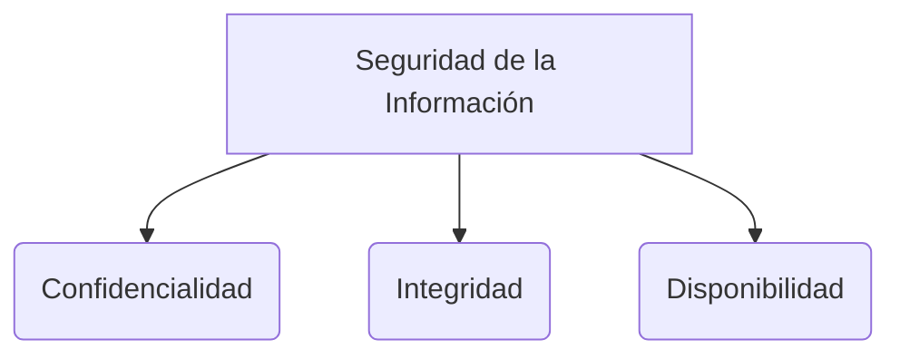

# Estimación de Software

La estimación de software es el proceso de predecir el esfuerzo (normalmente medido en tiempo, dinero o puntos) necesario para desarrollar, mantener o finalizar una tarea o proyecto de software. En metodologías tradicionales se estimaba en horas o días, pero en entornos ágiles se ha demostrado que esto es sumamente inexacto.

## Story Points (Puntos de Historia)
En metodologías ágiles (ver [[scrum]] e [[historias de usuario]]), en lugar de estimar tiempo absoluto, se utiliza la **estimación relativa** mediante Puntos de Historia.

Un punto de historia agrupa tres variables:
1. **Volumen:** La cantidad de trabajo a realizar.
2. **Complejidad:** La dificultad técnica del problema.
3. **Incertidumbre / Riesgo:** Lo que no se conoce o los factores externos.

En lugar de decir "me tomará 4 horas", el equipo compara una tarea con tareas previas: "Esta nueva historia es tan compleja y laboriosa como la que estimamos en 5 puntos el sprint pasado". Las escalas más usadas son series modificadas de Fibonacci (1, 2, 3, 5, 8, 13...).

## Planning Poker
Es una técnica de estimación consensuada para evitar el sesgo de autoridad:
1. El Product Owner lee la Historia de Usuario.
2. Se resuelven las dudas.
3. Cada desarrollador elige en secreto una carta (con un número de Story Points).
4. Todos revelan sus cartas al mismo tiempo.
5. Si hay gran discrepancia (ej. alguien dio 2 y otro 13), discuten sus razones técnicas.
6. Vuelven a votar hasta llegar a un consenso.

## Velocity (Velocidad)
La velocidad es una métrica de gestión en Scrum que indica cuántos puntos de historia en promedio el equipo es capaz de completar y llevar a la columna de "Terminado" durante un Sprint.
* **Uso:** Si la velocidad promedio de un equipo es de 40 puntos por sprint, y el Backlog completo suma 200 puntos, el Product Owner puede estimar de forma estadística que el proyecto tomará aproximadamente 5 sprints.

> [!info] Explicación: La Falacia de la Productividad
> La velocidad **NO es una métrica de productividad** para comparar equipos. Es una métrica de capacidad para hacer proyecciones. El equipo A podría tener una velocidad de 20 y el equipo B de 100, simplemente porque escalan sus puntos de forma diferente. Intentar forzar a un equipo a aumentar su velocidad artificialmente solo generará acumulación de [[Deuda técnica]] y código de baja calidad.

## Notas relacionadas
- [[historias de usuario]]
- [[scrum]]
- [[Deuda técnica]]

## Diagrama de Referencia

