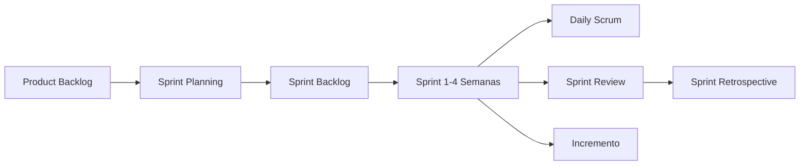

# Integración Continua y Despliegue Continuo (CI/CD)

CI/CD es un conjunto de prácticas de DevOps que automatizan las fases de prueba y despliegue de software, permitiendo a los equipos de desarrollo entregar cambios de código más frecuentes y confiables.

## Integración Continua (CI - Continuous Integration)
La Integración Continua es una práctica donde los desarrolladores fusionan los cambios de código en un repositorio central (*main* o *master*) de forma frecuente (varias veces al día).
* **Objetivo:** Detectar y resolver conflictos de integración lo más rápido posible.
* **Proceso:** Cada vez que se hace un *commit* o *Push*, un servidor automatizado (pipeline) descarga el código, lo compila y ejecuta automáticamente las pruebas (ver [[Testing automatizado]]). Si alguna prueba falla, el código es rechazado y el equipo es notificado.

## Entrega y Despliegue Continuo (CD - Continuous Delivery/Deployment)
* **Entrega Continua (Continuous Delivery):** Asegura que el código validado por CI esté empaquetado y listo para ser desplegado en un entorno de producción en cualquier momento. El despliegue a producción requiere un "clic" manual de aprobación.
* **Despliegue Continuo (Continuous Deployment):** Lleva esto un paso más allá: cada cambio que pasa todas las etapas de pruebas automatizadas es desplegado en producción de manera 100% automática, sin intervención humana.

## Herramientas Comunes
* **Servidores de automatización:** Jenkins, GitLab CI/CD, GitHub Actions, Travis CI, CircleCI.
* **Contenedores:** Docker (para asegurar que el entorno de pruebas sea idéntico al de producción).

> [!info] Explicación: CI/CD en Metodologías Ágiles
> Como se menciona en el Manifiesto Ágil (ver [[software 2]]), "nuestra mayor prioridad es la entrega temprana y continua de software con valor". Sin un pipeline sólido de CI/CD, es logísticamente imposible para un equipo hacer entregas al final de cada *Sprint* de [[scrum]] de forma segura, ya que el empaquetado y despliegue manual tomaría demasiado tiempo y sería propenso a errores humanos.

## Notas relacionadas
- [[software 2]]
- [[Control de versiones]]
- [[Testing automatizado]]

## Diagrama de Referencia

