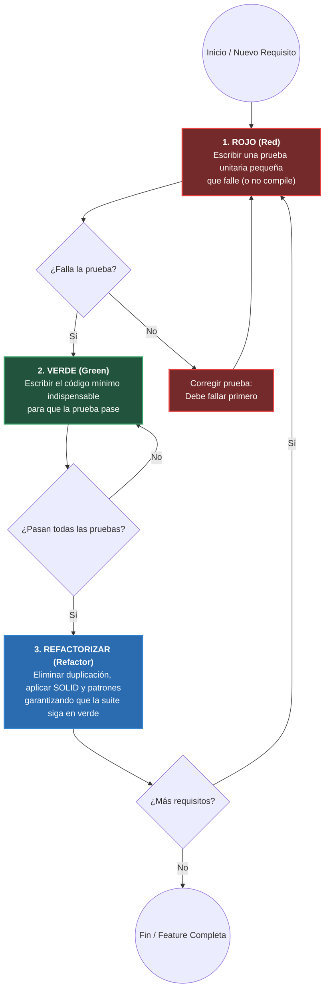
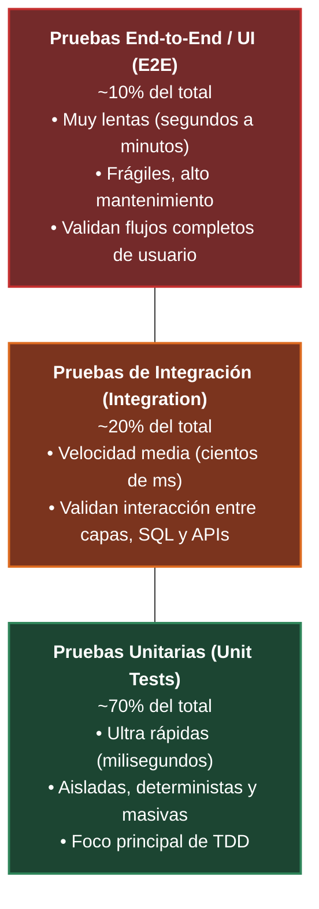
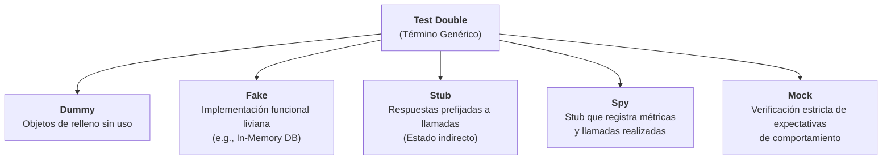

# Metodología TDD (Test-Driven Development)

El **Desarrollo Guiado por Pruebas (Test-Driven Development - TDD)** es una disciplina de diseño y desarrollo de software popularizada por **Kent Beck en 2002** como una de las prácticas centrales de la metodología ágil [[XP (eXtremme programming)]]. Contrario a la intuición tradicional, **TDD no es un proceso de aseguramiento de calidad (QA) posterior, sino una técnica de diseño arquitectónico**, donde los requerimientos y la estructura del código son guiados y descubiertos a través de la especificación anticipada de pruebas automatizadas (complementando los fundamentos de [[Testing automatizado]] y [[tecnicas pruebas]]).

> [!info] 💡 ¿Cómo entender esto desde cero? (Guía para novatos de pregrado)
> - **El dilema de la casa sin planos ni pruebas:** El programador novato escribe 500 líneas de código de corrido, le da a "Run", sale una pantalla roja con 14 errores y pasa 6 horas tratando de adivinar cuál de las 500 líneas causó el fallo.
> - **La filosofía Red - Green - Refactor:**
>   - **1. Rojo (Red):** Escribe una prueba minúscula para una función que NI SIQUIERA EXISTE todavía. Dale a ejecutar. La prueba fallará en rojo (obvio, la función no existe). Esto te garantiza que la prueba realmente está evaluando algo.
>   - **2. Verde (Green):** Escribe el código más tonto, mínimo y descarado posible (¡incluso retornando un número hardcodeado!) solo para que la prueba se ponga verde.
>   - **3. Refactorizar (Refactor):** Ahora que tienes una red de seguridad que te avisa si rompes algo, limpia el código, crea clases elegantes y elimina duplicación. Si la prueba sigue en verde, ¡tu código es perfecto!

---

## 1. El Ciclo Canónico Red - Green - Refactor

El corazón operativo de TDD es un ciclo iterativo y de cadencia rápida (de minutos o segundos) compuesto por tres fases inseparables:



### 1. Rojo (Red)
* Se redacta una prueba unitaria enfocada exclusivamente en un único incremento minúsculo de funcionalidad.
* La prueba se ejecuta y **debe fallar** indefectiblemente. 
* Si la clase o método bajo prueba (*System Under Test - SUT*) aún no existe, el fallo provendrá de un error de compilación. En TDD, **no compilar se considera formalmente un fallo exitoso de la fase roja**.
* *Propósito:* Garantizar que la prueba es sensible a los cambios del sistema y que no está pasando de manera trivial o engañosa (*false positive*).

### 2. Verde (Green)
* El programador escribe la cantidad **mínima y estrictamente necesaria** de código de producción para que la prueba unitaria pase exitosamente.
* En esta fase está permitido cometer transgresiones deliberadas contra las buenas prácticas (como *hardcodear* resultados o escribir estructuras ingenuas), con el único objetivo de validar la hipótesis de la prueba a la mayor velocidad posible.
* Tres técnicas clásicas para alcanzar el verde:
  1. **Fake It ('Til You Make It):** Devolver directamente la constante esperada por la prueba y luego generalizar en pruebas subsiguientes.
  2. **Triangulation (Triangulación):** Escribir dos o más pruebas con valores distintos para forzar matemáticamente la abstracción y el algoritmo general.
  3. **Obvious Implementation:** Implementar el algoritmo real de inmediato si la solución es trivial y evidente.

### 3. Refactorizar (Refactor)
* Con una red de seguridad completa de pruebas en verde, se limpia el código de producción y el de prueba.
* Se elimina código duplicado (*Principio DRY - Don't Repeat Yourself*), se mejoran nombres de variables y métodos conforme a [[Principios SOLID y Clean Code#2. Filosofía y Reglas Fundamentales de Clean Code|Clean Code]], y se extraen clases o patrones de diseño (ver [[Patrones de diseño]]).
* **Regla estricta:** Durante el refactor no se agrega ningún comportamiento nuevo; la suite completa de pruebas debe mantenerse permanentemente en verde.

---

## 2. Las Tres Leyes de TDD de Robert C. Martin

Para evitar la tentación de escribir código de producción por adelantado, Robert C. Martin ("*Uncle Bob*") formuló tres reglas de interacción milimétrica:

> [!important] Las 3 Leyes de TDD
> 1. **Primera Ley:** No escribirás código de producción a menos que sea para hacer pasar una prueba unitaria que está fallando.
> 2. **Segunda Ley:** No escribirás más de una prueba unitaria que lo estrictamente suficiente para fallar; y la falta de compilación cuenta como un fallo.
> 3. **Tercera Ley:** No escribirás más código de producción que el estrictamente necesario para hacer pasar la prueba unitaria que está fallando actualmente.

Seguir estas leyes confina el ciclo de retroalimentación a periodos de entre **30 segundos y 2 minutos**, asegurando que todo código en el repositorio cuente con un 100% de cobertura de ejecución real y una justificación empírica.

---

## 3. La Pirámide de Pruebas Automatizadas

Conceptualizada por **Mike Cohn** y formalizada por **Martin Fowler**, la Pirámide de Pruebas ilustra la distribución porcentual idónea de los distintos niveles de pruebas en un proyecto saludable para balancear velocidad, costo de mantenimiento y confianza.



### Características de cada nivel:
* **Pruebas Unitarias (Base ~70%):** Evalúan funciones o clases aisladas del resto del mundo (usando *Test Doubles* para evitar I/O de red o disco). Su ejecución es casi instantánea (miles de pruebas por segundo). Permiten refactorizar con total confianza y atacan la [[Deuda técnica]].
* **Pruebas de Integración (Cuerpo ~20%):** Verifican que módulos independientes colaboren correctamente entre sí (por ejemplo, validar que una consulta SQL se ejecute adecuadamente contra una base de datos real en un contenedor Docker, o la serialización con un broker Kafka).
* **Pruebas E2E / UI (Cúspide ~10%):** Verifican el sistema completo desde el punto de vista del usuario final (e.g., automatización con Selenium, Cypress o Playwright). Son propensas a fallos intermitentes (*flaky tests*) por latencias de red y su mantenimiento es costoso.

> [!warning] El Antipatrón del Cono de Helado (Ice Cream Cone)
> Ocurre cuando un equipo casi no escribe pruebas unitarias y depende desproporcionadamente de pruebas manuales o pruebas E2E lentas en la interfaz. El resultado son pipelines de CI/CD que tardan horas, regresiones constantes detectadas tarde y frustración del equipo.

---

## 4. Taxonomía Formal de Dobles de Prueba (*Test Doubles*)

Al realizar pruebas unitarias, el código bajo prueba (*System Under Test - SUT*) frecuentemente depende de componentes externos complejos (bases de datos, servicios web, relojes del sistema). Para mantener la prueba rápida y aislada, se sustituyen estas dependencias por **Dobles de Prueba** (*Test Doubles*), término formalizado por **Gerard Meszaros** en *xUnit Test Patterns*:



### 1. Dummy
* Objetos que se pasan como argumentos requeridos por la firma de un método, pero que jamás son leídos, invocados ni utilizados internamente por la lógica bajo prueba.
* *Ejemplo:* Pasar un objeto `new User("test@mail.com")` a un constructor que solo necesita un ID que no interviene en el cálculo evaluado.

### 2. Fake
* Posee una implementación funcional de negocio que opera de manera real, pero mediante un atajo que la hace inapropiada para producción (generalmente por no ser persistente o no soportar concurrencia).
* *Ejemplo clásico:* Un `InMemoryUserRepository` basado en un `Dictionary<string, User>` en RAM en lugar de acceder a una base de datos PostgreSQL real.

### 3. Stub
* Proporciona respuestas prefijadas (*hardcodeadas*) a las llamadas que recibe durante la prueba.
* Se utiliza para proporcionar **entradas indirectas** al SUT para simular escenarios específicos (éxito, error 500, moneda extranjera, etc.).
* *Ejemplo:* Configurar un stub de cotización bursátil para que siempre retorne `$150.00` ante cualquier consulta.

### 4. Spy
* Esencialmente es un Stub que, adicionalmente, lleva un registro interno (*auditoría*) de la forma en que fue invocado: cuántas veces se llamó un método, qué parámetros exactos recibió, o en qué secuencia ocurrió.
* Permite verificar estado posterior a la acción.

### 5. Mock
* Objeto pre-programado con **expectativas explícitas sobre las llamadas que DEBE recibir** durante la ejecución. Si el método esperado no se invoca, o si se invoca con parámetros incorrectos, el Mock hace fallar la prueba automáticamente.
* **Diferencia Crítica:** Los Stubs utilizan *State Verification* (verifican el resultado retornado), mientras que los Mocks realizan *Behavior Verification* (verifican la interacción y comunicación entre objetos).

---

## 5. Demostración Práctica del Flujo TDD: Procesador de Carrito

A continuación se muestra un caso canónico paso a paso en **TypeScript** modelando un calculador de promociones de carrito de compra.

### Paso 1: ROJO (Red) — Especificación del Requerimiento
Queremos que un carrito calcule el total con un 10% de descuento si el subtotal supera los $100. Escribimos la prueba antes de que la clase o método existan:

```typescript
// CartDiscount.spec.ts
import { ShoppingCart } from "./ShoppingCart";

describe("ShoppingCart Discount Calculation", () => {
    it("debe aplicar 10% de descuento cuando el subtotal supera los 100", () => {
        // Arrange
        const cart = new ShoppingCart();
        cart.addItem("Libro Clean Code", 60, 2); // Subtotal: 120

        // Act
        const total = cart.calculateFinalTotal();

        // Assert: 120 - 10% = 108
        expect(total).toBe(108);
    });
});
```
*Resultado al ejecutar:* ❌ `Cannot find module './ShoppingCart' or its corresponding type declarations.` (**Fallo exitoso en Rojo**).

---

### Paso 2: VERDE (Green) — Implementación Mínima (Fake It)
Creamos la clase y colocamos la lógica más directa para que la prueba pase inmediatamente:

```typescript
// ShoppingCart.ts
interface CartItem {
    name: string;
    unitPrice: number;
    quantity: number;
}

export class ShoppingCart {
    private items: CartItem[] = [];

    public addItem(name: string, unitPrice: number, quantity: number): void {
        this.items.push({ name, unitPrice, quantity });
    }

    public calculateFinalTotal(): number {
        const subtotal = this.items.reduce((acc, item) => acc + (item.unitPrice * item.quantity), 0);
        if (subtotal > 100) {
            return subtotal * 0.90; // Aplica 10% de descuento
        }
        return subtotal;
    }
}
```
*Resultado al ejecutar:* ✅ `1 passed, 1 total` (**Verde**).

---

### Paso 3: REFACTORIZAR (Refactor) — Aplicando Clean Code y SOLID
Ahora que el test está verde, añadimos más pruebas (por ejemplo, para carritos menores a 100 o con cupones). Notamos que la lógica de cálculo de descuento viola el principio Open/Closed ([[Principios SOLID y Clean Code#O — Open/Closed Principle (OCP)|OCP]]) si se agregan más promociones. Refactorizamos extrayendo una abstracción e inyectando un colaborador:

```typescript
// ShoppingCart.ts (Refactorizado con Inyección de Dependencias)

export interface IDiscountPolicy {
    apply(subtotal: number): number;
}

export class ThresholdPercentageDiscount implements IDiscountPolicy {
    constructor(
        private readonly threshold: number,
        private readonly discountRate: number
    ) {}

    public apply(subtotal: number): number {
        return subtotal > this.threshold ? subtotal * (1 - this.discountRate) : subtotal;
    }
}

export class ShoppingCart {
    private items: { unitPrice: number; quantity: number }[] = [];

    constructor(private readonly discountPolicy: IDiscountPolicy = new ThresholdPercentageDiscount(100, 0.10)) {}

    public addItem(name: string, unitPrice: number, quantity: number): void {
        this.items.push({ unitPrice, quantity });
    }

    public calculateSubtotal(): number {
        return this.items.reduce((acc, item) => acc + (item.unitPrice * item.quantity), 0);
    }

    public calculateFinalTotal(): number {
        const subtotal = this.calculateSubtotal();
        return this.discountPolicy.apply(subtotal);
    }
}
```

Volvemos a ejecutar la suite completa de pruebas: ✅ `1 passed, 1 total`. El diseño se refinó sin romper el comportamiento pactado.

---

## 6. Uso Práctico de Test Doubles (Mock y Spy)

Para probar la finalización de una compra donde interviene una pasarela de pago externa y un emisor de eventos, desacoplamos mediante un **Mock** y un **Spy**:

```typescript
// CheckoutService.spec.ts
interface IPaymentGateway {
    charge(amount: number): Promise<boolean>;
}

interface IEventBus {
    publish(eventName: string, payload: any): void;
}

class CheckoutService {
    constructor(
        private readonly payment: IPaymentGateway,
        private readonly bus: IEventBus
    ) {}

    public async executeOrder(orderId: string, amount: number): Promise<boolean> {
        const success = await this.payment.charge(amount);
        if (success) {
            this.bus.publish("ORDER_PAID", { orderId, amount });
            return true;
        }
        return false;
    }
}

// PRUEBA AISLADA
describe("CheckoutService with Test Doubles", () => {
    it("debe cobrar a la pasarela y publicar evento al pagar con éxito", async () => {
        // Stub / Mock de la Pasarela de Pago
        const paymentStub: IPaymentGateway = {
            charge: jest.fn().mockResolvedValue(true) // Simula cobro exitoso
        };

        // Spy del Bus de Eventos para verificar comportamiento
        const eventBusSpy: IEventBus = {
            publish: jest.fn()
        };

        const service = new CheckoutService(paymentStub, eventBusSpy);
        const result = await service.executeOrder("ORD-101", 150);

        expect(result).toBe(true);
        // Verificación de comportamiento (Behavior Verification)
        expect(paymentStub.charge).toHaveBeenCalledWith(150);
        expect(eventBusSpy.publish).toHaveBeenCalledWith("ORDER_PAID", {
            orderId: "ORD-101",
            amount: 150
        });
    });
});
```

---

## Notas relacionadas
- [[Testing automatizado]]
- [[tecnicas pruebas]]
- [[XP (eXtremme programming)]]
- [[Code review y pair programming]]
- [[Deuda técnica]]
- [[Principios SOLID y Clean Code]]
- [[Arquitecturas de Software (Limpia, Hexagonal, Event-Driven)]]
