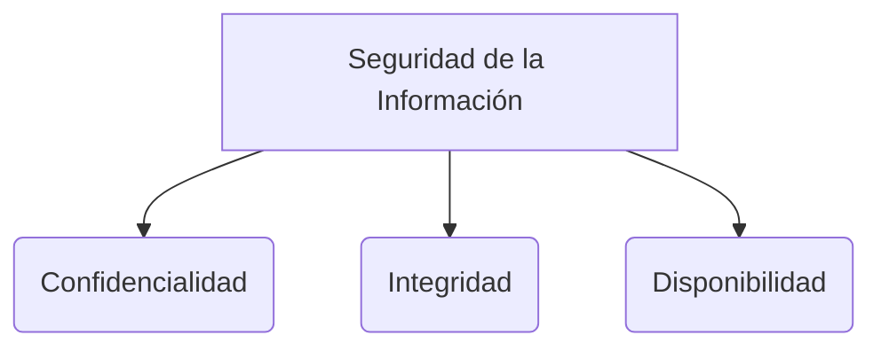

# Testing Automatizado

El testing automatizado es el uso de software especializado para controlar la ejecución de pruebas de software y comparar los resultados esperados con los obtenidos, sin necesidad de intervención manual. Es uno de los pilares fundamentales para garantizar la calidad del software ([[CARACTERÍSTICAS DE CALIDAD DE UN PRODUCTO DE SOFTWARE]]).

## Pirámide de Pruebas
La estrategia óptima de automatización se visualiza como una pirámide:

1. **Pruebas Unitarias (Base de la pirámide):** Prueban componentes aislados (clases, funciones) a nivel de código de forma independiente. Son muy rápidas y económicas de ejecutar. Deben representar la gran mayoría de las pruebas del sistema.
2. **Pruebas de Integración (Medio de la pirámide):** Verifican que diferentes módulos o bases de datos funcionen correctamente cuando se unen.
3. **Pruebas End-to-End o E2E (Punta de la pirámide):** Simulan el comportamiento real del usuario desde la interfaz gráfica (UI) hasta la base de datos. Son lentas y frágiles, por lo que deben ser pocas y centrarse en los flujos críticos.

## TDD y BDD
* **TDD (Test-Driven Development):** Como se describe en [[XP (eXtremme programming)]] y [[técnicas pruebas]], el desarrollo se guía escribiendo la prueba unitaria que falla *antes* de escribir el código de producción. Esto asegura que todo el código esté probado y diseñado para ser modular.
* **BDD (Behavior-Driven Development):** Se centra en pruebas de aceptación escritas en un lenguaje natural estructurado (como Gherkin: *Given, When, Then*) para que tanto el cliente como el técnico entiendan exactamente qué se está probando.

## Frameworks Comunes
* **Unit Testing:** JUnit (Java), PyTest (Python), Jest (JavaScript), NUnit (.NET).
* **E2E Testing:** Selenium, Cypress, Playwright.

> [!info] Explicación: Red de seguridad
> El testing automatizado actúa como una red de seguridad. Si el equipo necesita hacer una refactorización para reducir la [[Deuda técnica]], las pruebas automatizadas le avisarán inmediatamente si han roto alguna funcionalidad existente (regresión). Sin pruebas automatizadas, el código heredado o legacy se vuelve un campo minado.

## Notas relacionadas
- [[técnicas pruebas]]
- [[XP (eXtremme programming)]]
- [[Integración continua y despliegue continuo (CI-CD)]]
- [[Deuda técnica]]

## Diagrama de Referencia

