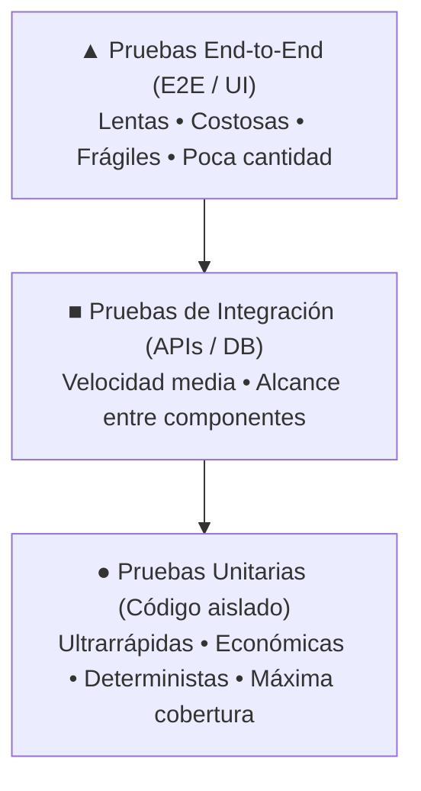

# Testing Automatizado y Pirámide de Pruebas

El **testing automatizado** es el uso de software y herramientas especializadas para controlar la ejecución sistemática de pruebas de software, comparar los resultados esperados con los obtenidos y generar reportes de regresión sin necesidad de intervención manual repetitiva. Es uno de los pilares fundamentales para garantizar la calidad del software ([[CARACTERÍSTICAS DE CALIDAD DE UN PRODUCTO DE SOFTWARE]]).

---

## 1. La Pirámide de Pruebas (Mike Cohn)

La estrategia óptima de distribución del esfuerzo de automatización se modela como una pirámide de capas:

```mermaid
flowchart TD
    E2E["▲ Pruebas End-to-End (E2E / UI)<br>Lentas • Costosas • Frágiles • Poca cantidad"]
    INT["■ Pruebas de Integración (APIs / DB)<br>Velocidad media • Alcance entre componentes"]
    UNIT["● Pruebas Unitarias (Código aislado)<br>Ultrarrápidas • Económicas • Deterministas • Máxima cobertura"]

    E2E --> INT
    INT --> UNIT
```

1. **Pruebas Unitarias (Base de la pirámide):** Verifican unidades aisladas de código (funciones, clases, métodos) sin dependencias externas (usando Mocks/Stubs). Son rápidas, ejecutables en milisegundos y deben conformar el 70-80% del conjunto de pruebas.
2. **Pruebas de Integración (Nivel intermedio):** Verifican la interacción y comunicación entre dos o más módulos acoplados (ej. interacción entre la capa de acceso a datos y la base de datos PostgreSQL, llamadas a microservicios).
3. **Pruebas End-to-End o E2E (Cúspide de la pirámide):** Simulan el comportamiento completo del usuario desde la interfaz gráfica (UI) hasta los servidores y bases de datos. Son lentas y frágiles ante cambios de diseño, por lo que deben reservarse para los flujos críticos de negocio (*happy paths*).

---

## 2. Paradigmas de Desarrollo Guiado por Pruebas

* **TDD (Test-Driven Development):** Como se describe en [[XP (eXtremme programming)]] y [[tecnicas pruebas]], el desarrollo se guía mediante el ciclo estricto **Rojo - Verde - Refactorizar** (*Red-Green-Refactor*): se escribe una prueba unitaria que falla antes de implementar el código de producción.
* **BDD (Behavior-Driven Development):** Evolución de TDD centrada en el comportamiento del sistema desde el punto de vista del negocio. Emplea especificaciones legibles en lenguaje natural estructurado (sintaxis Gherkin: *Given, When, Then*) mediante frameworks como Cucumber o Behave.

---

## 3. Ecosistema de Frameworks y Herramientas

| Nivel de Prueba | Lenguaje / Entorno | Herramientas Populares |
| :--- | :--- | :--- |
| **Pruebas Unitarias** | Java / Kotlin Python JavaScript/TypeScript C# / .NET | JUnit 5, Mockito PyTest, Unittest Jest, Vitest, Mocha xUnit, NUnit, Moq |
| **Pruebas de Integración** | Microservicios / HTTP / DB | Postman, Newman, REST-assured, Testcontainers |
| **Pruebas E2E / UI** | Web / Browsers Móvil | Playwright, Cypress, Selenium Appium, Espresso, XCUITest |
| **Pruebas de Rendimiento** | Carga y Estrés | Apache JMeter, k6, Gatling |

---

> [!info] Explicación: Red de Seguridad y Deuda Técnica
> El testing automatizado actúa como un arnés de seguridad indestructible. Cuando un equipo aborda refactorizaciones estructurales para reducir la [[Deuda técnica]], la suite de pruebas automatizadas en el pipeline de [[Integración continua y despliegue continuo (CI-CD)]] notifica de inmediato si se introdujo alguna regresión en funcionalidades previamente operativas.

---

## Notas relacionadas
- [[tecnicas pruebas]]
- [[XP (eXtremme programming)]]
- [[Integración continua y despliegue continuo (CI-CD)]]
- [[Deuda técnica]]
- [[CARACTERÍSTICAS DE CALIDAD DE UN PRODUCTO DE SOFTWARE]]
