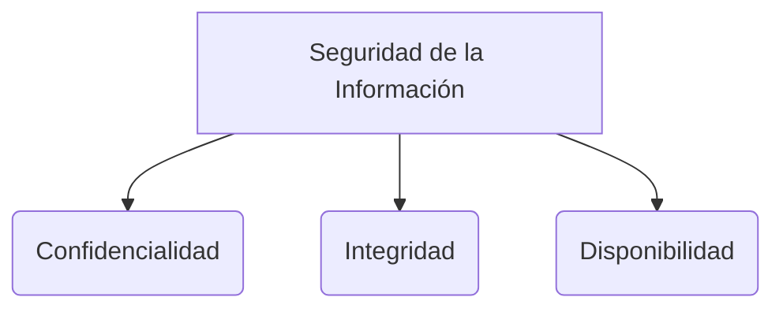

# eXtreme Programming (XP)

XP es una metodología ágil que se remonta a los años 90. Fue creada por Kent Beck (quien más tarde se convertiría en uno de los autores del Manifiesto Ágil) junto a Ron Jeffries (amigo y colaborador de Beck).
Nació con la intención de establecer reglas de ingeniería de software para mantener el código claro, manejar los comentarios de forma automática y facilitar el cambio.

En XP son fundamentales conceptos como:
* **Refactorizar:** Mejorar el código para que quede claro, limpio y mantenible, asegurando que los métodos y clases cumplan el principio de responsabilidad única.
* **Spike:** Una investigación rápida y con tiempo limitado (timebox) para aprender sobre un problema y poder realizar una estimación de tiempo más precisa.

![[Pasted image 20240519155514.png]]
![[xp.png]]

## Prácticas de XP
Las prácticas de XP están divididas en 4 grandes grupos:

### 1) Feedback (Retroalimentación)
* **Test-Driven Development (TDD):** Desarrollo guiado por pruebas y pruebas automatizadas. Provee retroalimentación inmediata sobre la salud del código y produce software confiable.
* **The Planning Game (Juego de Planificación):** Reunión de planificación al principio de cada iteración para alinear expectativas entre negocio y desarrollo.
* **On-site Customer (Cliente in situ):** El cliente (o un representante) trabaja físicamente (o muy de cerca) con el equipo de desarrollo para responder preguntas en tiempo real y establecer prioridades.
* **Pair Programming (Programación en Parejas):** Dos programadores trabajan juntos en la misma computadora. Uno escribe el código (el conductor) y el otro revisa el diseño, sugiere mejoras y corrige errores (el navegante). Aunque parezca consumir más tiempo, reduce drásticamente la cantidad de defectos.

### 2) Continual Process (Proceso Continuo)
* **Code Refactoring:** Consiste en eliminar la redundancia y las funciones innecesarias, aumentar la coherencia del código y desacoplar elementos para mantener el sistema simple y limpio.
* **Continuous Integration (Integración Continua):** Los desarrolladores mantienen el sistema integrado en todo momento, haciendo "commits" varias veces al día. Todo el equipo sabe qué código puede reutilizarse y se ejecutan pruebas automáticas con cada cambio.
* **Small Releases (Entregas Pequeñas):** Sugiere lanzar la primera versión del software rápidamente e ir entregando actualizaciones pequeñas de forma frecuente. Esto permite recibir comentarios de los usuarios rápidamente, detectar fallos tempranos y supervisar el funcionamiento en producción.

### 3) Code Understanding (Comprensión del Código)
* **Simple Design (Diseño Simple):** El mejor diseño de software es el más simple que funciona. Si se encuentra alguna complejidad excesiva, debe eliminarse. Evita el código duplicado y aboga por tener el menor número posible de clases y métodos.
* **Coding Standards (Estándares de Codificación):** El equipo debe compartir un conjunto común de prácticas y estilos para la redacción de código. La aplicación de estándares permite a cualquier miembro del equipo leer, compartir y refactorizar el código con facilidad.
* **Collective Code Ownership (Propiedad Colectiva del Código):** Todo el equipo es responsable por el diseño del sistema. Cualquier miembro tiene el derecho y el deber de revisar, actualizar o refactorizar cualquier parte del código en cualquier momento.
* **System Metaphor (Metáfora del Sistema):** Consiste en establecer un concepto global y nombres coherentes para clases y métodos basados en el mundo real. Esto facilita que las personas nuevas comprendan rápidamente de qué trata el sistema sin tener que leer documentos técnicos extensos.

### 4) Programmers Work Condition (Condiciones de Trabajo)
* **40-Hour-Week (Semana de 40 horas):** Para que los desarrolladores trabajen rápido, sean eficientes y sostengan una alta calidad, deben estar descansados. Las horas de trabajo no deben exceder las 40-45 horas semanales. El trabajo en horas extras solo es aceptable de forma muy puntual, y no debe convertirse en la norma.

![[Pasted image 20240519155317.png]]

## Cuándo usar XP
* **Desarrollo altamente adaptativo:** XP fue diseñado para ayudar a los equipos a adaptarse a requerimientos que cambian rápidamente.
* **Proyectos arriesgados:** Los equipos que aplican las prácticas de XP (especialmente pruebas continuas e integración) logran reducir la incertidumbre y el riesgo al afrontar plazos estrictos.
* **Equipos pequeños:** Las prácticas de XP son muy eficientes para equipos coubicados que no superan las 12 personas.
* **Cultura de pruebas automáticas:** La adopción de XP depende en gran medida de la capacidad técnica de los desarrolladores para crear y ejecutar metodologías como TDD.
* **Participación del cliente disponible:** XP requiere que el cliente y el equipo colaboren de cerca diariamente.

## Valores de XP
![[Pasted image 20240519155420.png]]

## Principios de XP
1. Cambios incrementales (Incremental changes).
2. Asumir simplicidad (Assumed simplicity).
3. Aceptar el cambio (Embracing change).
4. Trabajo de alta calidad (Quality work).
5. Retroalimentación rápida (Rapid feedback).

> [!info] Explicación: XP como base del Software Craftsmanship
> Mientras Scrum se centra en la "gestión" del proyecto, Extreme Programming se centra en la **ingeniería** del software. Prácticas como TDD, Refactorización Constante e Integración Continua son fundamentales hoy en día. Sin buenas prácticas de ingeniería como las que promueve XP, el desarrollo ágil es solo una forma de producir código de mala calidad más rápidamente.

## Notas relacionadas
- [[software 2]]
- [[historias de usuario]]
- [[scrum]]
- [[kanban]]
- [[técnicas pruebas]]

## Diagrama de Referencia

